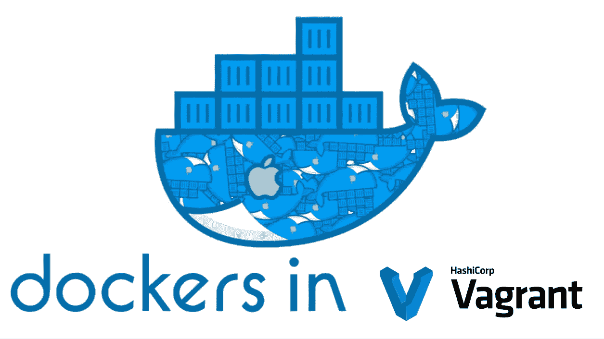

# 一种在 Mac 上运行 Docker 的解决方案

> 原文：<https://medium.com/geekculture/a-solution-to-run-docker-in-mac-using-vagrant-68002988dcf9?source=collection_archive---------10----------------------->

20 世纪所有使用 Mac 的开发人员都面临着一个大问题。**【DOCKER OVER MAC】**

## 问题

Photo by [Sebastian Herrmann](https://unsplash.com/@officestock?utm_source=medium&utm_medium=referral) on [Unsplash](https://unsplash.com?utm_source=medium&utm_medium=referral)