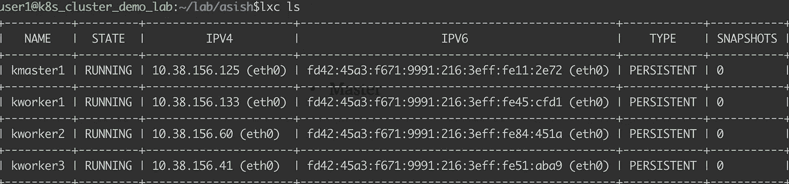

# Kubernetes 集群创建的逐步演示

> 原文：<https://medium.com/geekculture/a-step-by-step-demo-on-kubernetes-cluster-creation-f183823c0411?source=collection_archive---------6----------------------->

> “不要担心我们无法控制的事情，让我们把注意力转移到我们能够创造的事情上。”


Photo Credit: [Annie Spratt](https://unsplash.com/@anniespratt) | [https://unsplash.com/photos/QckxruozjRg](https://unsplash.com/photos/QckxruozjRg)

# 介绍

在这个演示中，我将分享我使用 kubeadm 工具创建 kubernetes 集群的经验。将使用 lxc 机器容器来设置集群。将启动一个主节点和 3 个工作节点，形成一个 kubernetes 集群。让我们一步一步来，然后自动化整个过程。

## 我的实验室设置

```
user1@k8s_cluster_demo_lab:~/lab/asish$uname -a
Linux lab 5.4.0-77-generic #86~18.04.1-Ubuntu SMP Fri Jun 18 01:23:22 UTC 2021 x86_64 x86_64 x86_64 GNU/Linuxuser1@k8s_cluster_demo_lab:~/lab/asish$lsb_release -dr
Description:    Ubuntu 18.04.5 LTS
Release:        18.04
```

## 关于 LXC

LinuX 容器(LXC)通常被认为是介于 chroot 和完全成熟的虚拟机之间的东西。它还可以在虚拟机和容器运行时托管的应用程序容器之间进行比较。要深入了解与常规应用程序容器的比较，请参考本文—[https://asishmm . medium . com/lxc-vs-docker-container-5699 db 209391](https://asishmm.medium.com/lxc-vs-docker-container-5699db209391)

实验室中使用的主机是采用 x86_64 架构的 Ubuntu 服务器(18.04)。

确认您的机器上安装了 lxc。

```
user1@k8s_cluster_demo_lab:~/lab/asish$dpkg -l | grep lxd
ii  lxd                                        3.0.3-0ubuntu1~18.04.1                           amd64        Container hypervisor based on LXC - daemon
ii  lxd-client                                 3.0.3-0ubuntu1~18.04.1                           amd64        Container hypervisor based on LXC - client
```

如果没有安装 lxc，按照 [LXC 入门](https://linuxcontainers.org/lxc/getting-started/)

# 高层次的步骤

下面是使用 lxc 设置 K8s 集群的步骤。

1.  准备好主节点和工作节点的 lxc 设置。
2.  使用 docker 安装容器运行时。
3.  安装 kubeadm 并初始化主服务器。
4.  应安装 Pod 网络解决方案。
5.  运行 join 命令，让工作节点加入主节点。

# 第一步

启动 lxd 容器并初始化它。将用户添加到 lxd 组，以便在没有 sudo 的情况下执行 lxc 操作。

```
user1@k8s_cluster_demo_lab:~$**sudo systemctl start lxd**
[sudo] password for user1:
user1@k8s_cluster_demo_lab:~$**sudo usermod -a -G lxd user1**
user1@k8s_cluster_demo_lab:~$**getent group lxd**
lxd:x:130:user1
user1@k8s_cluster_demo_lab:~$**lxc version**
Client version: 3.0.3
Server version: 3.0.3
```

初始化 LXD。选择默认选项。对于存储后端，我选择“dir ”,而不是默认的“bitrfs”

```
user1@k8s_cluster_demo_lab:~$**lxd init**
Would you like to use LXD clustering? (yes/no) [default=no]:
Do you want to configure a new storage pool? (yes/no) [default=yes]:
Name of the new storage pool [default=default]:
Name of the storage backend to use (btrfs, dir, lvm) [default=btrfs]: dir
Would you like to connect to a MAAS server? (yes/no) [default=no]:
Would you like to create a new local network bridge? (yes/no) [default=yes]:
What should the new bridge be called? [default=lxdbr0]:
What IPv4 address should be used? (CIDR subnet notation, “auto” or “none”) [default=auto]:
What IPv6 address should be used? (CIDR subnet notation, “auto” or “none”) [default=auto]:
Would you like LXD to be available over the network? (yes/no) [default=no]:
Would you like stale cached images to be updated automatically? (yes/no) [default=yes]
Would you like a YAML "lxd init" preseed to be printed? (yes/no) [default=no]:
```

Lxd 带有默认配置文件。概要文件是创建实例时使用的特定于实例的配置。让我们为我们为 K8s 集群创建的机器容器创建一个定制概要文件。

```
user1@k8s_cluster_demo_lab:~$**lxc profile copy default k8s**
user1@k8s_cluster_demo_lab:~$**lxc profile ls**
+---------+---------+
|  NAME   | USED BY |
+---------+---------+
| default | 0       |
+---------+---------+
| k8s     | 0       |
+---------+---------+
```

我将使用下面的自定义配置文件，并将其应用到 k8s 配置文件。

```
user1@k8s_cluster_demo_lab:~/lab/asish$**cat k8s-profile-config**
config:
  limits.cpu: "2"
  limits.memory: 2GB
  limits.memory.swap: "false"
  linux.kernel_modules: ip_tables,ip6_tables,nf_nat,overlay,br_netfilter
  raw.lxc: "lxc.apparmor.profile=unconfined\nlxc.cap.drop= \nlxc.cgroup.devices.allow=a\nlxc.mount.auto=proc:rw
    sys:rw"
 **security.nesting: "true"
  security.privileged: "true"**
description: Kubernetes LXD profile
devices:
  eth0:
    name: eth0
    nictype: bridged
    parent: lxdbr0
    type: nic
  root:
    path: /
    pool: default
    type: disk
name: k8s
used_by: []
```

要考虑的最重要的部分是“安全.嵌套”和“安全.提供”。应该为机器容器启用这两个选项，以便在其中运行容器。

我觉得用 vim 作为默认编辑器是合适的，编辑 k8s 配置文件如下。

```
user1@k8s_cluster_demo_lab:~/lab/asish$**export EDITOR=vim**
user1@k8s_cluster_demo_lab:~/lab/asish$**lxc profile edit k8s**
```

将概要文件的内容粘贴到编辑视图中。

让我们在这个演示中使用 Ubuntu 作为主节点和工作节点的 lxc 机器映像。

```
user1@k8s_cluster_demo_lab:~/lab/asish$**lxc launch** images:ubuntu/18.04 kmaster1 --profile k8s
Creating kmaster1
Starting kmaster1
```

我们可以类似地创建 3 个工作节点。

```
user1@k8s_cluster_demo_lab:~/lab/asish$**for i in {1..3} ; do lxc launch images:ubuntu/18.04 kworker${i} --profile k8s ; done**
Creating kworker1
Starting kworker1
Creating kworker2
Starting kworker2
Creating kworker3
Starting kworker3
```

确保 lxc 容器已打开。



现在我们实验室准备安装 k8s 集群，有一个 master—“kmaster 1”和 3 个 workers。

# 第二步

在主服务器上安装 caontainer 运行时。让我们使用 docker 作为容器运行时。

https://docs.docker.com/engine/install/ubuntu/

让我们在主容器中登录。

```
user1@k8s_cluster_demo_lab:~/lab/asish$**lxc exec kmaster1 bash**
root@kmaster1:~#
```

[注意:我们将在 kmaster1 容器中执行以下步骤。]

如果安装了旧版本的 docker，请将其删除。

```
**sudo apt-get remove docker docker-engine docker.io containerd runc**
```

安装基本软件包

```
**apt-get update
sudo apt-get install \
     apt-transport-https \
     ca-certificates \
     curl \
     gnupg \
     lsb-release -y**
```

下载 docker gpg 密钥并添加 docker repo

```
root@kmaster1:~# **curl -fsSL** [**https://download.docker.com/linux/ubuntu/gpg**](https://download.docker.com/linux/ubuntu/gpg) **| sudo gpg --dearmor -o /usr/share/keyrings/docker-archive-keyring.gpg  >/dev/null**
root@kmaster1:~#
root@kmaster1:~# **echo "deb [arch=amd64 signed-by=/usr/share/keyrings/docker-archive-keyring.gpg]** [**https://download.docker.com/linux/ubuntu**](https://download.docker.com/linux/ubuntu) **\
   $(lsb_release -cs) stable" | sudo tee /etc/apt/sources.list.d/docker.list > /dev/null**
```

现在安装 docker-ce

```
**sudo apt-get update
sudo apt-get install docker-ce docker-ce-cli -y**
```

配置 Docker 守护进程使用 systemd 来管理容器的 cgroups。

```
root@kmaster1:~# **sudo mkdir /etc/docker**root@kmaster1:~# **cat <<EOF | sudo tee /etc/docker/daemon.json
{
  "exec-opts": ["native.cgroupdriver=systemd"],
  "log-driver": "json-file",
  "log-opts": {
    "max-size": "100m"
  },
  "storage-driver": "overlay2"
}
EOF**
```

重启 docker 并在重启时启用；

```
root@kmaster1:~# **systemctl enable docker**root@kmaster1:~# **systemctl daemon-reload**root@kmaster1:~# **systemctl restart docker**
```

# 第三步

让我们安装 kubeadm、kubectl 和 kubelet。检查 br_netfilter 模块是否已加载。如果没有加载该模块，请使用 modeprobe 显式加载。

```
root@kmaster1:~# **cat <<EOF | sudo tee /etc/modules-load.d/k8s.conf
br_netfilter
EOF**
```

要使 iptables 正确地看到桥接的流量，请确保在 sysctl 配置中将 net.bridge-nf-call-iptables 设置为 1

```
root@kmaster1:~# **cat <<EOF | sudo tee /etc/sysctl.d/k8s.conf
net.bridge.bridge-nf-call-ip6tables = 1
net.bridge.bridge-nf-call-iptables = 1
EOF**
```

验证一下；

```
root@kmaster1:~# **sysctl --system**
* Applying /etc/sysctl.d/10-console-messages.conf ...
kernel.printk = 4 4 1 7
* Applying /etc/sysctl.d/10-ipv6-privacy.conf ...
net.ipv6.conf.all.use_tempaddr = 2
net.ipv6.conf.default.use_tempaddr = 2
* Applying /etc/sysctl.d/10-kernel-hardening.conf ...
kernel.kptr_restrict = 1
* Applying /etc/sysctl.d/10-link-restrictions.conf ...
fs.protected_hardlinks = 1
fs.protected_symlinks = 1
* Applying /etc/sysctl.d/10-magic-sysrq.conf ...
kernel.sysrq = 176
* Applying /etc/sysctl.d/10-network-security.conf ...
net.ipv4.conf.default.rp_filter = 1
net.ipv4.conf.all.rp_filter = 1
net.ipv4.tcp_syncookies = 1
* Applying /etc/sysctl.d/10-ptrace.conf ...
kernel.yama.ptrace_scope = 1
* Applying /etc/sysctl.d/10-zeropage.conf ...
vm.mmap_min_addr = 65536
* Applying /usr/lib/sysctl.d/50-default.conf ...
net.ipv4.conf.all.promote_secondaries = 1
* Applying /etc/sysctl.d/99-sysctl.conf ...
* Applying /etc/sysctl.d/k8s.conf ...
**net.bridge.bridge-nf-call-ip6tables = 1
net.bridge.bridge-nf-call-iptables = 1**
* Applying /etc/sysctl.conf ...
```

现在是时候安装 kubeadm、kubelet 和 kubectl 了。

```
**sudo apt-get update****sudo apt-get install -y apt-transport-https ca-certificates curl****sudo curl -fsSLo /usr/share/keyrings/kubernetes-archive-keyring.gpg** [**https://packages.cloud.google.com/apt/doc/apt-key.gpg**](https://packages.cloud.google.com/apt/doc/apt-key.gpg) **> /dev/null****echo "deb [signed-by=/usr/share/keyrings/kubernetes-archive-keyring.gpg]** [**https://apt.kubernetes.io/**](https://apt.kubernetes.io/) **kubernetes-xenial main" | sudo tee /etc/apt/sources.list.d/kubernetes.list****sudo apt-get update****sudo apt-get install -y kubelet kubeadm kubectl**
```

完成上述步骤后，添加一个 kubelet extra 标志来禁用交换失败，然后重新启动 kubelet

```
**echo 'KUBELET_EXTRA_ARGS="--fail-swap-on=false"' > /etc/default/kubelet****systemctl restart kubelet**
```

现在，有一个我们必须做的小黑客在 LXC 启用 K8s v1.15+。

```
**apt install -qq -y net-tools
mknod /dev/kmsg c 1 11
echo 'mknod /dev/kmsg c 1 11' >> /etc/rc.local
chmod +x /etc/rc.local**
```

允许 kubeadm 提取所需的图像

```
**kubeadm config images pull >/dev/null 2>&1**
```

使用 kubeadm 初始化集群

```
**kubeadm init --pod-network-cidr=10.244.0.0/16 --ignore-preflight-errors=all**
```

完成输出。

```
root@kmaster1:~# **kubeadm init --pod-network-cidr=10.244.0.0/16 --ignore-preflight-errors=all**
[init] Using Kubernetes version: v1.21.3
[preflight] Running pre-flight checks
        [WARNING Swap]: running with swap on is not supported. Please disable swap
[preflight] The system verification failed. Printing the output from the verification:
KERNEL_VERSION: 5.4.0-80-generic
DOCKER_VERSION: 20.10.7
DOCKER_GRAPH_DRIVER: overlay2
OS: Linux
CGROUPS_CPU: enabled
CGROUPS_CPUACCT: enabled
CGROUPS_CPUSET: enabled
CGROUPS_DEVICES: enabled
CGROUPS_FREEZER: enabled
CGROUPS_MEMORY: enabled
CGROUPS_PIDS: enabled
CGROUPS_HUGETLB: enabled
        [WARNING SystemVerification]: failed to parse kernel config: unable to load kernel module: "configs", output: "modprobe: FATAL: Module configs not found in directory /lib/modules/5.4.0-80-generic\n", err: exit status 1
[preflight] Pulling images required for setting up a Kubernetes cluster
[preflight] This might take a minute or two, depending on the speed of your internet connection
[preflight] You can also perform this action in beforehand using 'kubeadm config images pull'
[certs] Using certificateDir folder "/etc/kubernetes/pki"
[certs] Generating "ca" certificate and key
[certs] Generating "apiserver" certificate and key
[certs] apiserver serving cert is signed for DNS names [kmaster1 kubernetes kubernetes.default kubernetes.default.svc kubernetes.default.svc.cluster.local] and IPs [10.96.0.1 10.38.156.125]
[certs] Generating "apiserver-kubelet-client" certificate and key
[certs] Generating "front-proxy-ca" certificate and key
[certs] Generating "front-proxy-client" certificate and key
[certs] Generating "etcd/ca" certificate and key
[certs] Generating "etcd/server" certificate and key
[certs] etcd/server serving cert is signed for DNS names [kmaster1 localhost] and IPs [10.38.156.125 127.0.0.1 ::1]
[certs] Generating "etcd/peer" certificate and key
[certs] etcd/peer serving cert is signed for DNS names [kmaster1 localhost] and IPs [10.38.156.125 127.0.0.1 ::1]
[certs] Generating "etcd/healthcheck-client" certificate and key
[certs] Generating "apiserver-etcd-client" certificate and key
[certs] Generating "sa" key and public key
[kubeconfig] Using kubeconfig folder "/etc/kubernetes"
[kubeconfig] Writing "admin.conf" kubeconfig file
[kubeconfig] Writing "kubelet.conf" kubeconfig file
[kubeconfig] Writing "controller-manager.conf" kubeconfig file
[kubeconfig] Writing "scheduler.conf" kubeconfig file
[kubelet-start] Writing kubelet environment file with flags to file "/var/lib/kubelet/kubeadm-flags.env"
[kubelet-start] Writing kubelet configuration to file "/var/lib/kubelet/config.yaml"
[kubelet-start] Starting the kubelet
[control-plane] Using manifest folder "/etc/kubernetes/manifests"
[control-plane] Creating static Pod manifest for "kube-apiserver"
[control-plane] Creating static Pod manifest for "kube-controller-manager"
[control-plane] Creating static Pod manifest for "kube-scheduler"
[etcd] Creating static Pod manifest for local etcd in "/etc/kubernetes/manifests"
[wait-control-plane] Waiting for the kubelet to boot up the control plane as static Pods from directory "/etc/kubernetes/manifests". This can take up to 4m0s
[apiclient] All control plane components are healthy after 28.003274 seconds
[upload-config] Storing the configuration used in ConfigMap "kubeadm-config" in the "kube-system" Namespace
[kubelet] Creating a ConfigMap "kubelet-config-1.21" in namespace kube-system with the configuration for the kubelets in the cluster
[upload-certs] Skipping phase. Please see --upload-certs
[mark-control-plane] Marking the node kmaster1 as control-plane by adding the labels: [node-role.kubernetes.io/master(deprecated) node-role.kubernetes.io/control-plane node.kubernetes.io/exclude-from-external-load-balancers]
[mark-control-plane] Marking the node kmaster1 as control-plane by adding the taints [node-role.kubernetes.io/master:NoSchedule]
[bootstrap-token] Using token: yg4xfz.heffiwkqvfyyxr5t
[bootstrap-token] Configuring bootstrap tokens, cluster-info ConfigMap, RBAC Roles
[bootstrap-token] configured RBAC rules to allow Node Bootstrap tokens to get nodes
[bootstrap-token] configured RBAC rules to allow Node Bootstrap tokens to post CSRs in order for nodes to get long term certificate credentials
[bootstrap-token] configured RBAC rules to allow the csrapprover controller automatically approve CSRs from a Node Bootstrap Token
[bootstrap-token] configured RBAC rules to allow certificate rotation for all node client certificates in the cluster
[bootstrap-token] Creating the "cluster-info" ConfigMap in the "kube-public" namespace
[kubelet-finalize] Updating "/etc/kubernetes/kubelet.conf" to point to a rotatable kubelet client certificate and key
[addons] Applied essential addon: CoreDNS
[addons] Applied essential addon: kube-proxyYour Kubernetes control-plane has initialized successfully!To start using your cluster, you need to run the following as a regular user:mkdir -p $HOME/.kube
  sudo cp -i /etc/kubernetes/admin.conf $HOME/.kube/config
  sudo chown $(id -u):$(id -g) $HOME/.kube/configAlternatively, if you are the root user, you can run:export KUBECONFIG=/etc/kubernetes/admin.confYou should now deploy a pod network to the cluster.
Run "kubectl apply -f [podnetwork].yaml" with one of the options listed at:
  [https://kubernetes.io/docs/concepts/cluster-administration/addons/](https://kubernetes.io/docs/concepts/cluster-administration/addons/)Then you can join any number of worker nodes by running the following on each as root:**kubeadm join 10.38.156.125:6443 --token yg4xfz.heffiwkqvfyyxr5t \
        --discovery-token-ca-cert-hash sha256:1db2277f65f33cbf72a61f1ebfe9d506605f07f6cf7690b0089d9d3debcee812**
```

记下 join 命令，该命令包含工作者节点要加入的令牌散列。将 kube 配置复制到主目录中，并检查 kubectl 命令是否正常工作。

```
root@kmaster1:~# **mkdir ~/.kube**
root@kmaster1:~# **cp /etc/kubernetes/admin.conf ~/.kube/config**
root@kmaster1:~# **kubectl get nodes**
NAME       STATUS     ROLES                  AGE   VERSION
kmaster1   Ready   control-plane,master   10m   v1.21.3
root@kmaster1:~# **kubectl cluster-info**
Kubernetes control plane is running at [https://10.38.156.125:6443](https://10.38.156.125:6443)
CoreDNS is running at [https://10.38.156.125:6443/api/v1/namespaces/kube-system/services/kube-dns:dns/proxy](https://10.38.156.125:6443/api/v1/namespaces/kube-system/services/kube-dns:dns/proxy)To further debug and diagnose cluster problems, use 'kubectl cluster-info dump'.
```

# 第四步

现在是时候为 k8s 安装法兰绒网络提供程序了

```
kubectl apply -f [https://raw.githubusercontent.com/coreos/flannel/master/Documentation/kube-flannel.yml](https://raw.githubusercontent.com/coreos/flannel/master/Documentation/kube-flannel.yml) > /dev/null 2>&1
```

上述命令的输出

```
root@kmaster1:~# kubectl apply -f [https://raw.githubusercontent.com/coreos/flannel/master/Documentation/kube-flannel.yml](https://raw.githubusercontent.com/coreos/flannel/master/Documentation/kube-flannel.yml)
Warning: policy/v1beta1 PodSecurityPolicy is deprecated in v1.21+, unavailable in v1.25+
podsecuritypolicy.policy/psp.flannel.unprivileged created
clusterrole.rbac.authorization.k8s.io/flannel created
clusterrolebinding.rbac.authorization.k8s.io/flannel created
serviceaccount/flannel created
configmap/kube-flannel-cfg created
daemonset.apps/kube-flannel-ds created
```

# 第五步

让引导工作节点并将其加入主节点。在上一步中，我们已经为要连接的工作节点复制了 join 命令。

```
**kubeadm join 10.38.156.125:6443 --token yg4xfz.heffiwkqvfyyxr5t \
        --discovery-token-ca-cert-hash sha256:1db2277f65f33cbf72a61f1ebfe9d506605f07f6cf7690b0089d9d3debcee812**
```

按照与 master 相同的步骤设置 docker 和 kubeadm、kubelet 和 kubectl 安装。下面是步骤，你可以复制并运行它作为一个 bash 脚本。

```
sudo apt-get remove docker docker-engine docker.io containerd runcsudo apt-get updatesudo apt-get install \
     apt-transport-https \
     ca-certificates \
     curl \
     gnupg \
     lsb-release -ycurl -fsSL [https://download.docker.com/linux/ubuntu/gpg](https://download.docker.com/linux/ubuntu/gpg) | sudo gpg --dearmor -o /usr/share/keyrings/docker-archive-keyring.gpg  >/dev/nullecho "deb [arch=amd64 signed-by=/usr/share/keyrings/docker-archive-keyring.gpg] [https://download.docker.com/linux/ubuntu](https://download.docker.com/linux/ubuntu) \
  $(lsb_release -cs) stable" | sudo tee /etc/apt/sources.list.d/docker.list > /dev/nullsudo apt-get updatesudo apt-get install docker-ce docker-ce-cli containerd.io -ysudo mkdir /etc/dockercat <<EOF | sudo tee /etc/docker/daemon.json
{
  "exec-opts": ["native.cgroupdriver=systemd"],
  "log-driver": "json-file",
  "log-opts": {
    "max-size": "100m"
  },
  "storage-driver": "overlay2"
}
EOFsystemctl enable dockersystemctl daemon-reloadsystemctl restart dockercat <<EOF | sudo tee /etc/modules-load.d/k8s.conf
br_netfilter
EOFcat <<EOF | sudo tee /etc/sysctl.d/k8s.conf
net.bridge.bridge-nf-call-ip6tables = 1
net.bridge.bridge-nf-call-iptables = 1
EOFsudo sysctl --systemsudo apt-get updatesudo apt-get install -y apt-transport-https ca-certificates curlsudo curl -fsSLo /usr/share/keyrings/kubernetes-archive-keyring.gpg [https://packages.cloud.google.com/apt/doc/apt-key.gpg](https://packages.cloud.google.com/apt/doc/apt-key.gpg) > /dev/nullecho "deb [signed-by=/usr/share/keyrings/kubernetes-archive-keyring.gpg] [https://apt.kubernetes.io/](https://apt.kubernetes.io/) kubernetes-xenial main" | sudo tee /etc/apt/sources.list.d/kubernetes.listsudo apt-get updatesudo apt-get install -y kubelet kubeadm kubectlecho 'KUBELET_EXTRA_ARGS="--fail-swap-on=false"' > /etc/default/kubeletsystemctl restart kubeletapt install -qq -y net-toolsmknod /dev/kmsg c 1 11echo 'mknod /dev/kmsg c 1 11' >> /etc/rc.localchmod +x /etc/rc.local**kubeadm join 10.38.156.125:6443 --token yg4xfz.heffiwkqvfyyxr5t \
        --discovery-token-ca-cert-hash sha256:1db2277f65f33cbf72a61f1ebfe9d506605f07f6cf7690b0089d9d3debcee812**
```

[注意:从主容器中适当地更改 kubeadm join 命令。]

我将使用这些步骤作为 bash 脚本(bootstrap.sh ),并直接在 worker 节点上执行它们，如下所示。这是从主机上运行的。

```
***cat bootstrap.sh | lxc exec kworker1 bash******cat bootstrap.sh | lxc exec kworker2 bash******cat bootstrap.sh | lxc exec kworker3 bash***
```

注意:

我在提出 kubelet 时遇到了下面的警告。(未找到时忽略)

*【警告系统验证】:无法解析内核配置:无法加载内核模块:“配置”，输出:“modprobe: FATAL:在目录/lib/modules/5 . 4 . 0–77-generic \ n 中找不到模块配置”，错误:退出状态 1*

安装 linux-image 后，这种情况消失了

```
*apt-get install linux-image-$(uname -r)*
```

让我们验证集群，并在其中运行一个简单的 nginx 应用程序。

```
root@kmaster1:~# **kubectl get nodes**
NAME       STATUS   ROLES                  AGE     VERSION
kmaster1   Ready    control-plane,master   133m    v1.21.3
kworker1   Ready    <none>                 27m     v1.21.3
kworker2   Ready    <none>                 13m     v1.21.3
kworker3   Ready    <none>                 6m17s   v1.21.3
```

在这个集群中创建一个示例 nginx 应用和服务。

```
root@kmaster1:~# **kubectl create deploy --image=nginx nginx**
deployment.apps/nginx created root@kmaster1:~# **kubectl expose deploy nginx --type=NodePort --name nginx --port 80**
service/nginx exposed
root@kmaster1:~# **kubectl get svc**
NAME         TYPE        CLUSTER-IP      EXTERNAL-IP   PORT(S)        AGE
kubernetes   ClusterIP   10.96.0.1       <none>        443/TCP        139m
nginx        NodePort    10.111.136.18   <none>        80:31273/TCP   4sroot@kmaster1:~# **ip a show dev eth0**
15: eth0@if16: <BROADCAST,MULTICAST,UP,LOWER_UP> mtu 1500 qdisc noqueue state UP group default qlen 1000
    link/ether 00:16:3e:11:2e:72 brd ff:ff:ff:ff:ff:ff link-netnsid 0
    inet **10.38.156.125**/24 brd 10.38.156.255 scope global dynamic eth0
       valid_lft 2583sec preferred_lft 2583sec
    inet6 fd42:45a3:f671:9991:216:3eff:fe11:2e72/64 scope global dynamic mngtmpaddr noprefixroute
       valid_lft 3190sec preferred_lft 3190sec
    inet6 fe80::216:3eff:fe11:2e72/64 scope link
       valid_lft forever preferred_lft forever root@kmaster1:~# **curl** [**http://10.38.156.125:31273**](http://10.38.156.125:31273)
<!DOCTYPE html>
<html>
<head>
<title>Welcome to nginx!</title>
<style>
    body {
        width: 35em;
        margin: 0 auto;
        font-family: Tahoma, Verdana, Arial, sans-serif;
    }
</style>
</head>
<body>
<h1>Welcome to nginx!</h1>
<p>If you see this page, the nginx web server is successfully installed and
working. Further configuration is required.</p><p>For online documentation and support please refer to
<a href="[http://nginx.org/](http://nginx.org/)">nginx.org</a>.<br/>
Commercial support is available at
<a href="[http://nginx.com/](http://nginx.com/)">nginx.com</a>.</p><p><em>Thank you for using nginx.</em></p>
</body>
</html>
root@kmaster1:~#
```

通过验证主机名，我们可以调整 bash 脚本，使其具有执行 master 中包含的额外步骤的条件，如下所示。在这种情况下，在适当地创建时命名容器。

```
**if [[ $(hostname) =~ .*master.* ]]**
thenkubeadm config images pull >/dev/null 2>&1kubeadm init --pod-network-cidr=10.244.0.0/16 --ignore-preflight-errors=allmkdir /root/.kube
  cp /etc/kubernetes/admin.conf /root/.kube/configkubectl apply -f [https://raw.githubusercontent.com/coreos/flannel/master/Documentation/kube-flannel.yml](https://raw.githubusercontent.com/coreos/flannel/master/Documentation/kube-flannel.yml) > /dev/null 2>&1joinCommand=$(kubeadm token create --print-join-command 2>/dev/null)
  echo "$joinCommand --ignore-preflight-errors=all"fi**if [[ $(hostname) =~ .*worker.* ]]**
then
  kubeadm join 10.38.156.125:6443 --token yg4xfz.heffiwkqvfyyxr5t \
        --discovery-token-ca-cert-hash sha256:1db2277f65f33cbf72a61f1ebfe9d506605f07f6cf7690b0089d9d3debcee812 --ignore-preflight-errors=all
```

# 未来范围

我们可以在创建主节点和工作节点基础设施之后添加集群创建自动化。在演示中，我们使用 kubeadm 部署在 LXC 支持的基础设施上。但在真实的生产环境中，Terraform 和 Ansible 等工具可以用来在物理机、虚拟机或云资源上构建基础设施。一旦基础设施建立起来，我们就可以通过 ansible 或其他一些自动化来触发集群创建自动化。目前在 terraform 中有 Kubernetes 提供者，他们可以为您完成集群创建任务，甚至在集群创建后部署应用程序 pod。

# 结论

我们逐步介绍了使用 kubeadm 工具构建 kubernetes 集群的过程。我们使用 lxc 来快速设置集群。最后，我们将这些步骤放在一个 bash 脚本中，该脚本可用于自动化该过程，并部署了一个样例 nginx 服务。感谢您的阅读，并希望本文能为您在设置 kubernetes 集群时增加一些价值。