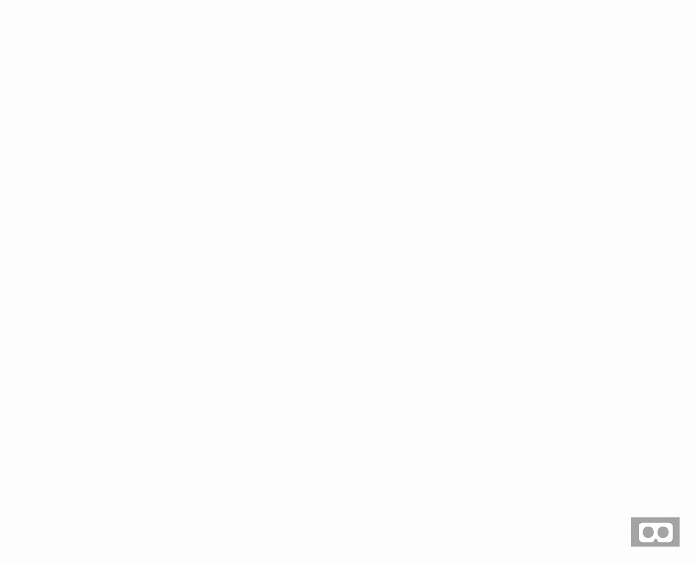
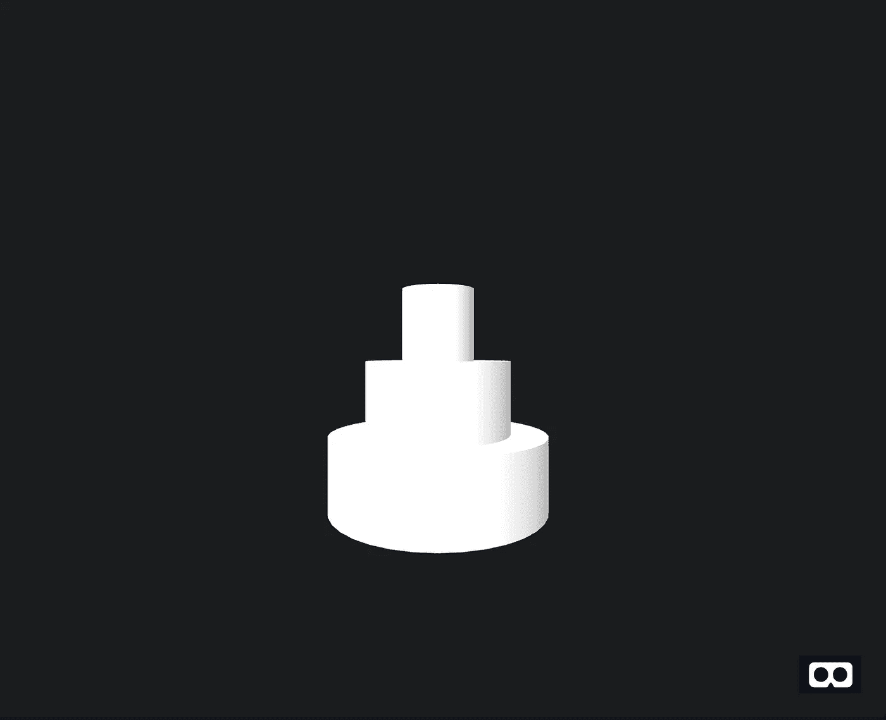

# 一步一步的指南，在 10 分钟内和 20 行代码内构建网络增强现实卡

> 原文：<https://medium.com/geekculture/a-step-by-step-guide-to-building-web-ar-cards-in-under-10-minutes-and-under-20-lines-of-code-482c82a50d5b?source=collection_archive---------6----------------------->

## 用 A-Frame 构建简单的增强现实(AR)生日贺卡


Image from [Pixabay](https://pixabay.com/photos/brownie-cakes-greeting-card-4020342/)

# 概观

## 介绍

作为一个传统，我喜欢为同龄人的生日制作小型增强现实(AR)卡片。事实上，我的同龄人的生日贺卡随着我的编程知识而发展，两年前，我认为制作 AR 贺卡是一件非常伟大的事情。

## 为什么是 a 字架？

A-Frame 是开发虚拟现实(VR)和 AR 的高级框架。我被它吸引的两个原因是因为 VR/AR 是在网络上提供的，这使得它很容易共享，并且 a-frame 是非常高级的，允许程序员不用担心像照明这样的概念。虽然还有更复杂和可调整的库，我希望在未来探索更多，但我通常使用 a-frame 来快速轻松地创建卡片。

## 工具

*   [Repl.it](https://replit.com/) →代码将主要放在 Repl.it 上，以托管 HTML 代码，方便与朋友分享。
*   [A-Frame](https://aframe.io/) → A-frame 是一个高级 web (HTML)框架，用来编程 AR 和 VR。
*   [AR.js](https://github.com/AR-js-org/AR.js) →要把 VR 融入 AR，我们就用 AR.js。

# 步骤 1:创建一个 HTML Repl Starter

首先，创建一个 [Repl](https://replit.com/) 账户，然后点击蓝色的“创建”按钮，从模板选项中选择 HTML。将 Repl 命名为任何东西，但是注意它将是链接的名称。

> 注意:链接将基于 Repl 名称和您的用户名创建。格式为`https://REPL_NAME.REPL_USERNAME.repl.co`。

创建 Repl 后，启动代码应该如下所示:

```
<!DOCTYPE html>
<html><head>
  <meta charset="utf-8">
  <meta name="viewport" content="width=device-width">
  <title>replit</title>
  <link href="style.css" rel="stylesheet" type="text/css" />
</head><body>
  Hello world
  <script src="script.js"></script>
</body></html>
```

首先，更改标题，这将是当接收者得到卡片时选项卡的标题。此外，删除 body 选项卡中的代码。最后用`<script src=”[https://aframe.io/releases/0.6.0/aframe.min.js](https://aframe.io/releases/0.6.0/aframe.min.js)"></script>`导入 a 帧。

```
<!DOCTYPE html>
<html><head>
  <meta charset="utf-8">
  <meta name="viewport" content="width=device-width">
  <title>Birthday Card</title>
  <link href="style.css" rel="stylesheet" type="text/css" />
</head><script src="[https://aframe.io/releases/0.6.0/aframe.min.js](https://aframe.io/releases/0.6.0/aframe.min.js)"></script><body></body></html>
```

太好了！现在，创建卡片的虚拟现实部分的一切都准备好了。

# 第二步:构建虚拟现实方面

在正文中，添加`a-scene`标记。这将为创建虚拟现实创造一个虚拟现实环境。

```
<a-scene>
</a-scene>
```

运行代码以确保所有内容都已导入。在链接或预览中，你应该会看到一个空白的屏幕，角落里有一个小型 VR 耳机。



完成后，通过导入一个现有的模型或者创建一个新的模型来构建卡片的模型。要了解一点关于制作虚拟现实卡片的知识，你可以关注我以前的一篇关于制作圣诞卡的博客。

[](/nerd-for-tech/creating-a-virtual-reality-holidays-card-an-introduction-to-a-frame-cf5a70dd1c34) [## 创建虚拟现实节日贺卡:a-frame 简介

### 假日特辑，介绍 a 型框架中的原始类型和材料

medium.com](/nerd-for-tech/creating-a-virtual-reality-holidays-card-an-introduction-to-a-frame-cf5a70dd1c34) 

现在，我将简单地创建一个有三个圆柱体的多层蛋糕。

```
<a-scene>
    <a-cylinder rotation = "180 0 0" position ="0 0 0" radius="1.5" color="white"></a-cylinder>
    <a-cylinder position ="0 1 0" color="white" radius="1"></a-cylinder>
    <a-cylinder position ="0 2 0" color="white" radius="0.5"></a-cylinder>
  </a-scene>
```



Simple Cake (Perspective Changed and Black Background)

一旦你创建了一个你满意的虚拟现实模型，你就可以把它转换成现实了。

# 第三步:创建一个标记

下一步是创建一个 AR 出现的地方。对于生日卡，我通常会在标记上画一幅我过去一年中最喜欢的回忆。

要创建标记，请将图像上传到[此链接](https://jeromeetienne.github.io/AR.js/three.js/examples/marker-training/examples/generator.html)。根据需要调整图案比例和图像尺寸。

接下来，下载标记和图像。标记将下载一个`.patt`文件(我们假设博客的其余部分是`pattern-marker.patt`)。将此文件上传到 Repl.it，与 HTML 文件位于同一目录。

最后，当你下载图像时，它会保存一个`.png`文件。这是真正的标记，用来扫描代码以使其生效。保存它以集成到卡上。

# 第四步:将虚拟现实转化为增强现实

要将 AR 更改为 VR，我们接下来需要导入几个包。首先，在`body`标签之外，为 a 帧导入适当的 AR.js 文件。

```
<script src="[https://jeromeetienne.github.io/AR.js/aframe/build/aframe-ar.js](https://jeromeetienne.github.io/AR.js/aframe/build/aframe-ar.js)"></script>
```

接下来，更改开始的`<a-frame>`标签以适应 AR。

```
<a-scene embedded arjs>
```

最后，使用您在上一步导入的`.patt`文件在`<\a-scene>`的正上方添加标记。

```
<a-marker-camera type='pattern' url='pattern-marker.patt'></a-marker-camera>
```

然后，运行文件，打开链接，扫描图像。你会在图像上找到 VR 物体。

# 步骤五:完整的代码、反思和后续步骤

总之，这张 AR 卡用了不到 20 行代码。

```
<!DOCTYPE html>
<html>
  <head>
    <meta charset="utf-8">
    <meta name="viewport" content="width=device-width">
    <title>Birthday Card</title>
    <link href="style.css" rel="stylesheet" type="text/css" />
  </head>
<script src="[https://aframe.io/releases/0.6.0/aframe.min.js](https://aframe.io/releases/0.6.0/aframe.min.js)"></script>
<script src="[https://jeromeetienne.github.io/AR.js/aframe/build/aframe-ar.js](https://jeromeetienne.github.io/AR.js/aframe/build/aframe-ar.js)"></script>
<body>
  <a-scene embedded arjs>
    <a-cylinder rotation = "180 0 0" position ="0 0 0" radius="1.5" color="white"></a-cylinder>
    <a-cylinder position ="0 1 0" color="white" radius="1"></a-cylinder>
    <a-cylinder position ="0 2 0" color="white" radius="0.5"></a-cylinder>
    <a-marker-camera type='pattern' url='pattern-marker.patt'></a-marker-camera>
  </a-scene>
</body>
</html>
```

我认为，这就是高级框架的强大之处:编码相对快速简单。

通常，在创建卡片时，我会添加两张图片，一张是带有链接的二维码，另一张是图片的 PNG。再加上一条信息或一封信，这就构成了一张史诗般的生日贺卡和惊喜。