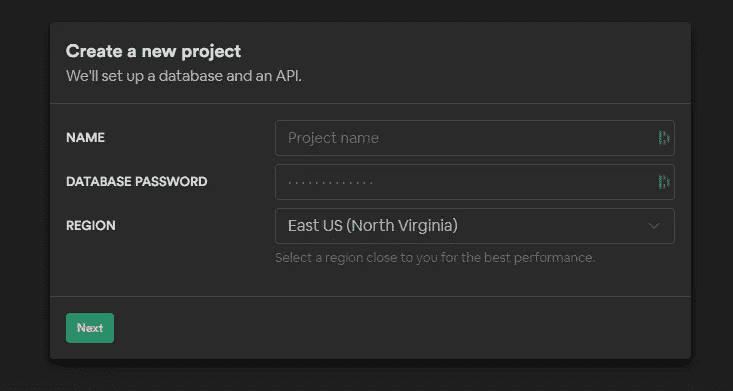
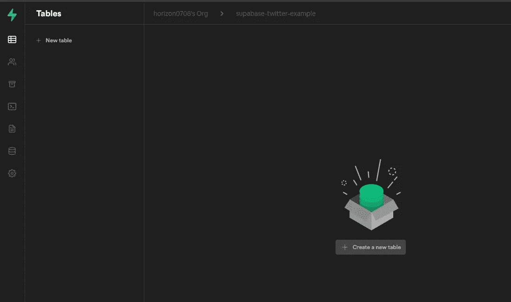
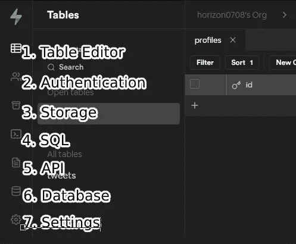
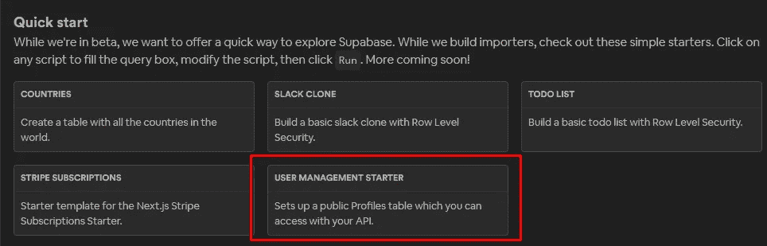
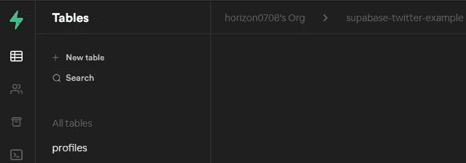

# 使用 React 和 Supabase 创建 Twitter 克隆的分步指南——第 1 部分

> 原文：<https://medium.com/geekculture/a-step-by-step-guide-to-creating-a-twitter-clone-with-react-and-supabase-part-1-d6865ade095a?source=collection_archive---------7----------------------->

最近，我发现了 [Supabase](https://supabase.io/) ，一个开源的 [Firebase](https://firebase.google.com/) 替代品，它可以在 2 分钟内建立你的后端，最近没有任何产品像这个产品一样让我兴奋。所以我决定写一些指南，向人们展示这个产品有多棒！📢

在这个系列中，我将用 React 和 [Supabase](https://supabase.io/) 创建一个 Twitter 克隆。如果您继续学习，到本系列结束时，您将已经部署了一个全功能的应用程序，它允许用户:

1.  在推特上发布他们的想法，
2.  上传头像并更改其个人资料，
3.  当有新的推文时被通知，并且；
4.  当有人喜欢他们的推文时得到通知。

在制作此应用程序时，您将了解如何:

*   为您的用户建立一个完整的认证流程:注册、登录、确认电子邮件和忘记密码。
*   设置可扩展存储，以便您的用户可以上传文件
*   在您的数据库中设置[行级安全性](https://gist.github.com/horizon0708/2e31152c0e0ce18e1b50215b9dee7330)，以便锁定用户的私人数据。
*   使用 [react-router-dom](https://reactrouter.com/web/guides/quick-start) 设置客户端路由
*   使用 [react-hook-form](https://react-hook-form.com/) 设置表单的客户端验证
*   使用[素材 UI](https://material-ui.com/) 快速制作一个好看的 app

当我解释我的代码时，我假设你对[反应](https://reactjs.org)有基本的了解。如果您已经精通 React，我还会在后面的部分提供一个 git hash，所以您可以跳过 React 部分。

# 等一下，什么是 Supabase？


Supabase’s landing page

Supabase 是 Google Firebase 的替代产品，让你在几分钟内拥有一个全功能的后端。我很喜欢使用 Firebase 来快速启动我的辅助项目，但是下面的事情总是让我很恼火:

1.  我必须使用 NoSQL 数据库，而不是 PostgresDB，
2.  它不是开源的，而且
3.  最重要的是，当你的增长超过 Firebase 时，没有简单的方法可以将它迁移出去(特别是所有的用户

Supabase 解决了这些问题，因为它们:

1.  使用引擎盖下的[PostgresDB](https://supabase.io/database)，
2.  [使用并贡献开源库](https://supabase.io/blog/2020/08/05/supabase-auth#open-source)，以及
3.  如果你想的话，你可以很容易地从 Supabase 中迁移出来，然后[开始自托管](https://supabase.io/docs/guides/self-hosting)。

他们还有一个相当慷慨的免费等级。顺便说一句，Supabase 没有付钱给我写这篇文章，我只是对这个产品感到兴奋。现在我们知道了什么是 Supabase，是时候开始构建了！让我们先做好准备。

# 建立超级数据库

登录 [Supabase](https://supabase.io/docs/guides/self-hosting) (如果你还没有注册！)，然后新建一个项目。你将面临以下模式。



*   **名称** —放入任何你想要的东西。我给我的取名为`supabase-twitter-example`。
*   **数据库密码** -创建一个强密码并保存在您的密码管理器中。
*   **地区** -你想要的任何地区，我都设置成悉尼了。

点击“下一步”后，您需要等待 2 分钟，以便 Supabase 设置后端。⌚️:这时候，我们去设置前端。

# 使用 create-react-app 设置前端代码库

让我们使用`create-react-app`引导一个 react 应用程序。在 CLI 中运行以下命令，用 typescript 创建一个项目。

```
npx create-react-app --template typescript react-twitter-clone
```

# 安装材料用户界面

我们希望我们的应用程序看起来不错，但我们也不想花太多时间来修补样式。所以我们将使用一个叫做[材质 UI](https://material-ui.com/) 的 UI 库。在应用程序的目录中运行以下命令来安装框架和图标。

```
yarn add [@material](http://twitter.com/material)-ui/core [@material](http://twitter.com/material)-ui/icons
```

让我们回到 Supabase，看看我们的后端是否已经设置好了。

# 回到 Supabase

如果都完成了，你会看到这个屏幕。



So many possibilities!

当你在这个屏幕上时，我会给你一个东西在哪里的快速纲要。



1.  **表格编辑器** —您可以在这里创建、编辑和查看 PostgresDB 中的表格
2.  **认证** —您可以在这里查看您的用户及其状态，并编辑作为用户认证流程结果发送的电子邮件模板(如确认注册电子邮件！)
3.  **存储** —您可以在这里添加、编辑和查看 S3 存储中的文件
4.  **SQL** —这是您可以运行特定 SQL 查询和创建存储过程的地方。
5.  **API** —这是您可以看到为您的后端实时生成的 API 文档的地方
6.  **数据库** —在这里您可以进行一些数据库管理，如角色、备份和复制。
7.  **设定** —其他设定住这里。在本系列的后面，您将在这里获得要使用的 API 键。

现在，让我们创建一些表格！还记得我们希望用户能够上传头像和改变他们的个人资料吗？要做到这一点，我们需要一个 profiles 表，我们现在就要制作这个表。

转到 SQL 菜单。当您看到欢迎屏幕时，选择底部屏幕上的选项。这是 Supabase 提供的一个方便的模板，可以帮助我们快速入门。



当您这样做时，将会看到一些 SQL 语句(尚未运行)。让我们仔细看看，看看会发生什么。在顶部，我们有:

我们正在创建一个名为`profiles`的表，包含以下字段:

*   `id`，从`auth.users`开始使用`id`。该表由 Supabase 自动设置，包含注册后的用户。它不能为空，因为要拥有配置文件，您需要一个用户。
*   `updated_at`，最后一次更新时间为时间戳
*   `username`、`avatar_url`和`website`不言自明。

让我们看看下一个片段——这是真正令人兴奋的部分。

上面的代码片段创建了[行级安全性](https://www.postgresql.org/docs/current/ddl-rowsecurity.html)，它可以根据用户锁定行。例如，您不希望用户能够更新不属于他们的个人资料！

要做到这一点，当您收到更新概要文件的请求时，您需要检查请求是否来自概要文件的用户(身份验证)，如果是，就让他们去做(授权)。

Supabase 可以为您处理这些，只需这一小段代码。

这就是说:如果`auth.uid()`与 id 匹配，只允许对行进行更新。`auth.uid()`来自 JWT 令牌，如果用户登录，该令牌将与请求一起发送。

[官方文件对这种工作方式的解释](https://supabase.io/docs/guides/auth)，包括在下面，相当不错:

1.  一个用户注册。Supabase 在`auth.users`表中创建新用户。
2.  Supabase 返回一个新的 JWT，其中包含用户的`UUID`。
3.  对数据库的每个请求也会发送 JWT。
4.  Postgres 检查 JWT 以确定发出请求的用户。
5.  可以在策略中使用用户的 UID 来限制对行的访问。

下一个代码片段添加了实时通知支持，我们现在将跳过它。

片段的最后一点也令人兴奋。让我们来看看:

Supabase 还内置了存储(使用 S3)，我们可以通过使用 SQL 来设置访问存储的策略！多方便啊？

现在，我们知道了 SQL 查询正在做什么，点击`RUN`按钮。在 Results 选项卡中，应该有一条消息显示`Success. No rows returned`。

当您返回到`Table Editor`视图时，您应该会看到一个名为`profiles`的表格。



哇哦🎊，只需点击几下，我们就可以制作一个表格:

*   行级安全性，确保用户数据的安全
*   实时通知支持，以及。
*   我们用一些安全策略创建了一个对象桶。

在下一个系列中，我们将构建一些 react 前端来使用我们新开发的后端！在[推特](https://twitter.com/James_HJ_Kim)(*@詹姆士 _ HJ _ 金*)上关注我，这样你就不会错过第二部分。到时候见！