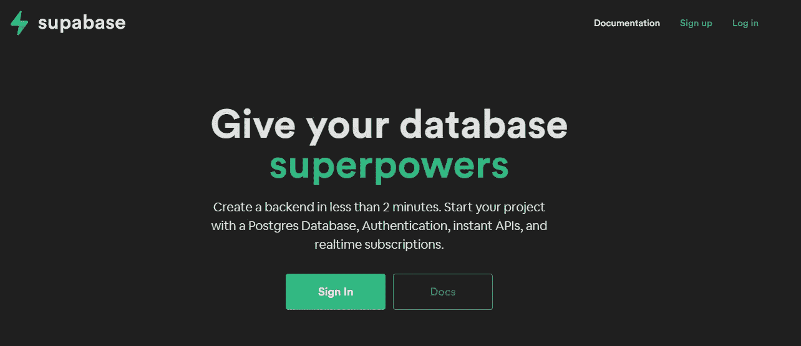
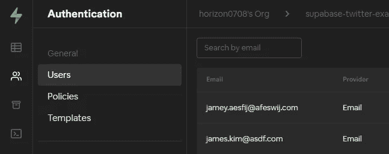
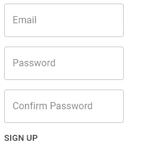
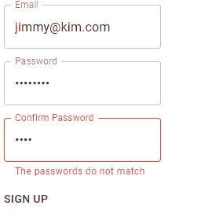
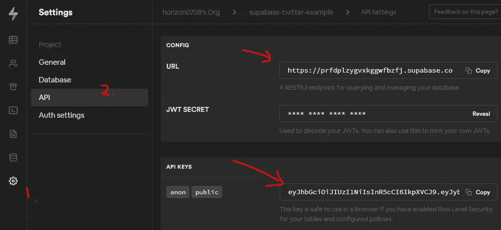
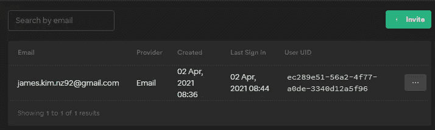
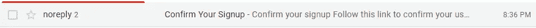
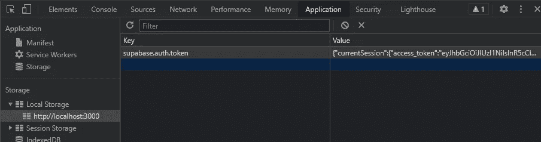
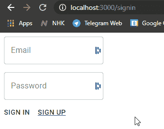

# 使用 React 和 Supabase 创建 Twitter 克隆的分步指南——第 2 部分

> 原文：<https://medium.com/geekculture/a-step-by-step-guide-to-creating-a-twitter-clone-with-react-and-supabase-part-2-43fd11558fc1?source=collection_archive---------4----------------------->



在这个系列中，我用 React 和 [Supabase](https://supabase.io/) 创建了一个 Twitter 克隆。到本系列结束时，我们将部署一个全功能的应用程序，让用户:

1.  在推特上发布他们的想法，
2.  上传头像并更改其个人资料，
3.  当有新的推文时被通知，并且；
4.  当有人喜欢他们的推文时得到通知。

在[第 1 部分](/geekculture/a-step-by-step-guide-to-creating-a-twitter-clone-with-react-and-supabase-part-1-d6865ade095a)中，我们有:

*   创建了一个新的 Supabase 项目，查看了仪表盘上的东西，
*   使用 Supabase 的`User Management Starter`模板快速制作`profiles`表格，在表格中启用[行级安全](https://www.postgresql.org/docs/current/ddl-rowsecurity.html)并设置用户上传头像的存储访问策略；
*   使用`create-react-app`启动了一个新的 typescript React 项目，并安装了`material-ui`作为 UI 库。

我们还不会使用`profiles`表。这是因为你首先需要用户已经注册，为他们建立一个配置文件！对我们来说幸运的是，Supabase 带有身份验证。在您的控制面板中，您可以通过转到“Authentication”选项卡来查看您当前的用户。



I have my test users, but you shouldn’t see any users 😅

你可能记得我们在[第 1 部分](/geekculture/a-step-by-step-guide-to-creating-a-twitter-clone-with-react-and-supabase-part-1-d6865ade095a)中创建`profiles`表时引用过这个表。当我们创建了`profiles`表后，我们将主键`id`设置为外键，引用`auth.users`表。我已经包含了下面的片段:

Remember this SQL?

因此，在第 2 部分中，我们将设置一个基本的用户认证流程，以便应用程序可以让用户注册、登录和注销。为实现这一目标，我们将建立:

*   客户端路由有`[react-router-dom](reactrouter.com)` [](reactrouter.com)、
*   用`[react-hook-form](https://react-hook-form.com/)`进行客户端验证，最后；
*   用[方便的官方客户端](https://github.com/supabase/supabase-js) `[@supabase/supabase-js](https://github.com/supabase/supabase-js)`调用 Supabase 的认证 API。

我们开始吧！奔跑

# 用 react-router 设置客户端路由

[react-router-dom](https://reactrouter.com/) 是在 react 中设置客户端路由的首选库。使用以下命令将其添加到项目中:

```
yarn add react-router-dom 
```

并在打字时加上

```
yarn add --dev @types/react-router-dom
```

转到 react 项目中的`App.tsx`,用下面的代码替换它。

上述代码列出了 4 条路线:

*   `/signup`用户可以在那里注册、
*   `/signin`用户可以在哪里签到、
*   `/signout`哪里——你猜对了！-用户可以注销，以及；
*   最后`/`这是网站的根。

如您所见，这些路线除了显示它们的名称之外什么也不做。我们现在就实施它们。

# 实现基本注册页面

一个基本的注册表单只需要三个字段:

1.  电子邮件，
2.  密码，以及；
3.  确认密码(确保密码匹配！)

在`src`文件夹中创建一个名为`pages`的文件夹。创建一个名为`signupPage.tsx`的新文件，然后粘贴下面的代码片段。

转到`App.tsx`并将该组件添加到`/signup`路线

现在当你`yarn start`转到`/signup`时，你应该会看到这个。如果你点击“登录”按钮，你只会得到一个提示说“已注册”！



美丽的😍。但形式还有很长的路要走。

1.  它不做任何客户端验证，所以我们的用户可以提交他们想要的任何东西；
2.  显然，它实际上并没有调用我们的 Supabase 后端。

让我们使用`react-hook-form`库来实现一些客户端验证。

# 使用`react-hook-form`进行客户端验证

在我们让用户将表单发送到我们的 Supabase 后端之前，我们希望检查:

1.  用户给我们的电子邮件是有效的电子邮件，
2.  密码至少有 8 个字符，并且；
3.  `password`字段和`confirm password`字段中的密码应该匹配。

我们将在`react-hook-form`的帮助下实现这个逻辑，所以让我们安装 react-hook-form。

```
yarn add react-hook-form
```

将下面的代码片段复制到`signupPage.tsx`中，替换现有代码。

再次运行该项目。尝试在没有匹配密码的情况下提交。“确认密码”应变成红色，并显示一条错误消息，并且不会调用`alert()`。



你可能已经注意到了，我已经用数字标注了代码，让我们一个接一个地检查编号的部分。

## (1)添加 useForm()并取我们需要的

我们使用来自`react-hook-form`的`useForm()`钩子来获取函数，我们将使用这些函数将表单连接到库。

*   `register`用于注册`input`元素来跟踪它们，使用`input`元素的`name`道具。我将在第(3)点更详细地解释这一点。
*   `handleSubmit`用于包装我们的`onSubmit`回调——如果有任何验证错误，它将停止调用包装的函数(在我们的例子中是`onSubmit`回调)。
*   `watch`用于跟踪一个注册元素。在上面的代码片段中，我们给密码字段命名为`"password"`，并使用`watch("password")`来观察字段的值。更多解释见下文第(2)点。
*   `errors`是一个对象，当验证的结果有- *你猜对了* -错误时，它将被填充。如果一个名为`"password"`的字段无效，那么 error 对象将会有一个名为`error.password`的属性，带有`message`和其他有用的属性。更多详情，请点击此处阅读 API 文档。

## (2)使用`watch()`跟踪密码字段中的值

正如我上面解释的，我们使用`watch("[inputName]")`来访问被监视输入的当前值。我们稍后将使用它来确保在用户提交表单之前密码是匹配的。

## (3)我们注册输入元素，将`register()`传递给输入的 ref 属性。

您必须给输入一个名称，并通过将`register()`传递给`ref`属性来注册组件。通常，如果你有一个简单的输入，你可以将`register()`传递给`ref` prop，如下所示:

然而，`<TextField />`组件没有`ref`属性。幸运的是，Material UI 公开了`inputRef`，它将道具传递给了`<input />`元素的 ref。如果你选择的 UI 库没有像 Material UI 那样公开`input`的`ref`，[在官方文档](https://react-hook-form.com/get-started#IntegratingwithUIlibraries)中也有其他方法。

## (4)声明该字段需要什么验证。

您可以将带有验证规则的对象传递给`register()`函数。在上面的片段中:

*   `required: "You must provide an email"`表示该字段为必填项，不填时的错误信息(后文给出为`errors.email.message`)
*   `pattern: emailRegex`表示该字段的值必须匹配电子邮件正则表达式(在文件顶部定义)。

当然，还有其他验证规则，你可以在官方文档中找到它们。

除了预设的验证规则，我们还可以传入一个回调函数来使用定制的验证逻辑。在代码中，当我注册“确认密码”输入字段时，我使用了一个回调来检查密码是否匹配。

## (5)通过`errors`对象向用户显示验证错误

我们已经设置了验证，并将组件连接到`react-hook-form`，但是当用户给了我们无效的输入时，我们不会告诉用户他们做错了什么。我们可以通过利用从`useForm()`获得的`errors`对象来实现这一点。

`errors`当没有任何错误时，对象将是一个空对象，但是当`react-hook-form`检测到无效输入时，它将向`errors`添加一个带有违规输入的对象`name`。例如，如果给了`<input name="email" ref={register({ required: true })}/>`一个无效的输入，那么`errors`对象将拥有一个带有`FieldError`对象的 email 属性。

usually, we just care about the ‘message’ field

在代码中，我们用它来通过材质 UI 显示错误。当你传递一个真值给 Material-UI 的`TextField`组件的`error`属性时，它会变成红色并显示我们的错误信息，这个错误信息被传递给`helperText`属性。

当没有错误时，错误对象将是`null`，所以我使用[可选链接](https://www.typescriptlang.org/docs/handbook/release-notes/typescript-3-7.html)来检查`undefined`。

现在我们已经有了一些客户端验证，让我们将注册页面连接到 Supabase！

# 将注册页面连接到 Supabase

要将我们的应用程序连接到 Supabase，我们需要:

1.  安装 Supabase JavaScript 客户端。
2.  通过提供我们的 Supabase 应用程序的 URL 和 API 密钥来初始化客户端。

让我们首先安装客户端。

```
yarn add @supabase/supabase-js
```

在`src`文件夹中添加一个名为`/api`的文件夹，然后添加一个名为`supabaseClient.ts`的文件。在文件中，复制以下代码片段。

```
import { createClient } from '@supabase/supabase-js'const supabaseUrl = 'https://URL_TO_YOUR_APP.supabase.co'
const supabaseKey = 'Your supabase key'export const supabaseClient = createClient(supabaseUrl, supabaseKey)
```

如您所见，我们需要获得您的应用程序的 URL 和 API 密钥。你可以在 Supabase 中打开你的项目，然后点击设置(cog 图标)，进入 API。



复制 URL 并用它替换`supabaseUrl`的值。对 API 键做同样的操作。这是一个公钥，所以硬编码也可以(只要确保您已经打开了行级安全性！).

转到您的`signUpPage.tsx`文件，导入`supabaseClient`并将`onSubmit`函数更改如下:

现在，重启你的 app，进入`/signup`路线，尝试报名。你应该得到一个提示，说你已经注册成功了！转到 Supabase 中的认证部分。您应该会在用户列表中看到您的电子邮件。



进入你的邮箱，你应该也能看到确认邮件！



我们已经有了基本的注册流程。让我们来设置登录和注销流程。在`pages`文件夹中创建两个文件`signInPage.tsx`和`signOutPage.tsx`。将下面的代码粘贴到`signInPage.tsx`中。

并将下面的代码粘贴到`signOutPage.tsx`。

然后将新页面添加到`App.tsx`中的路线。

此时点击登录按钮没有任何作用！嗯，你可能会*登录，但之后我们不会做任何事情。*


我们知道登录成功了，让我们在用户成功登录后将他们重定向到主页`/`。在主页上，如果用户登录，我们会在主页上显示他们的电子邮件。

首先，对`SignInPage.tsx`进行如下修改

然后把这几行加到`App.tsx`里。

`supabaseClient.auth.session()`获取当前会话(从本地存储器中),如果有的话。您可以通过检查控制台中的本地存储选项来查看这一点。



*注:我并不认为* [*在本地存储中保护令牌(尤其是刷新令牌)是最安全的做法*](https://auth0.com/docs/tokens/token-storage#browser-local-storage-scenarios) *，但在这篇博文中我们就不赘述了。我可能会做更多的研究，以后再写🔬*

现在，当您登录时，您将被重定向到主页，并会看到我们刚刚添加的消息。



我们有一个非常基本的认证流程，但它仍然缺少许多功能和修饰。别担心，我们将在下一部分讨论它们。在第 3 部分中，我们将:

*   prettier✨把事情稍微弄了一下，
*   添加一个带链接的导航栏，当用户登录或退出时刷新。
*   创建一些用户必须登录才能访问的安全路由(或重定向到`/signup`路由)。

通过实施上述内容，我们将会学到:

*   如何在组件中使用和注入 React 上下文，以及
*   当我们确保路线安全时，如何使用高阶组件来保持干燥。

感谢您通读这篇长长的教程🙏在推特上关注我，这样你就不会错过第三部分了。如果你有任何问题，请通过评论这篇文章或通过 Twitter 告诉我。第 3 部分再见！