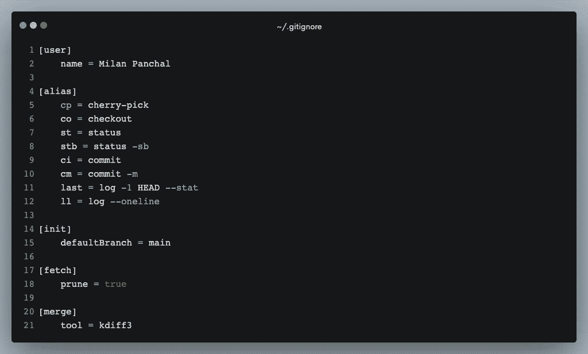
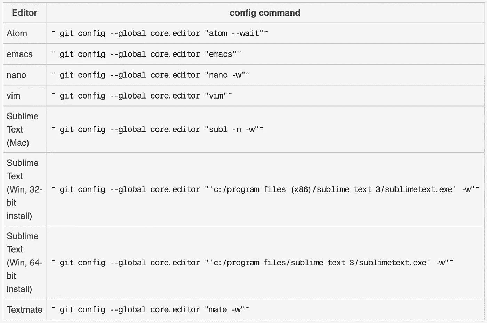

# 设置全局 Git 配置属性的分步指南

> 原文：<https://medium.com/geekculture/a-step-by-step-guide-to-setting-up-git-config-global-properties-db6dbce30fa8?source=collection_archive---------0----------------------->



Global [.gitconfig](https://gist.github.com/milanpanchal/01c874b5395377700da95a1b55579954) properties

毫无疑问，Git 是世界上最流行的版本控制系统。

在本文中，我们将讨论如何使用`git config`命令来配置 Git，以增强您的开发工作流。

通过使用`git config`命令，我们可以更改 Git 安装的配置。通常，它用于设置您的 git 电子邮件、名称、编辑器和别名。所以事不宜迟，我们开始吧！

# 1)配置您的身份

安装 Git 的第一件事就是设置你的`name`和`email`。这很重要，因为每个 Git 提交都使用这些信息，并且不可改变地融入到您开始创建的提交中:

以下命令可用于设置全局 Git 配置的`email`和`name`属性:

```
$ git config --global user.email "your_email@example.com"
$ git config --global user.name "your_name"
```

为了更有表现力，我们可以在设置全局 git 配置属性时包含`--add`选项:

```
$ git config --global --add user.email "your_email@example.com"
$ git config --global --add user.name "your_name"
```

# 2)配置 Git global 的代码编辑器

每次我们执行像`commit`和`tag`这样的命令时，您都可以通过启动它们的默认编辑器来编辑消息。

以下命令可用于将全局 Git 配置的默认文本编辑器更改为`vim`。

```
$ git config --global core.editor "vim"
```

对于其他类型的编辑器，请参考下表:



Global Git Config Core Editor Settings. (Ref: [Atlassian](https://www.atlassian.com/git/tutorials/setting-up-a-repository/git-config))

# 3)配置默认分支

默认情况下，当您使用`git init`创建一个新的存储库时，Git 会创建一个名为`master`的分支。从 Git 版本 2.28(2020 年 7 月 27 日发布)开始，[你可以为初始分支](https://github.blog/2020-07-27-highlights-from-git-2-28/#introducing-init-defaultbranch)设置一个不同的名称。

```
$ git config --global init.defaultBranch main
```

设置这个变量之后，运行`git init`将会产生一个存储库，它的初始分支是`main.`

# 4)在获取期间 Git 修剪

`git prune`命令是一个内部管理实用程序，用于清理不可及的或孤立的 Git 对象。

任何不能通过分支或标记访问的提交都被认为是不可访问的。

清理被视为垃圾收集命令，不会直接执行。要在提取期间执行修剪，请运行以下命令:

```
$ git fetch --prune
```

或者，如果希望在运行 fetch 时执行修剪，可以通过运行以下命令在全局 git 配置中配置 fetch 方法:

```
$ git config --global fetch.prune true
```

# 5) Git 合并工具

当合并冲突发生时，Git 将启动一个**合并工具。**

默认情况下，Git 使用通用 Unix `diff`程序的内部实现，这是一个最小的合并冲突查看器

如果您想要使用任何外部合并冲突，可以按如下方式进行配置:

例如，如果你想使用`kdiff3`或`p4merge`作为你的合并工具。

```
$ git config --global merge.tool **kdiff3**$ git config --global merge.tool **p4merge**
```

同样，您也可以将它设置为您的`diff.tool`，如下所示:

```
$ git config --global diff.tool **kdiff3**$ git config --global diff.tool **p4merge**
```

# 6) Git 别名

当您必须重复输入相同的命令时，Git 别名可以帮您解决问题。它们允许您为常用命令创建自定义快捷方式。

在 Git 配置文件中，您可以不时地为那些长命令添加别名。例如，提交、存储等等。

假设您想为`git status`添加一个别名。在这种情况下，您可以在终端中运行以下命令:

```
$ git config --global alias.st status
```

因此，当您运行`git st`命令时，在 hud 下它将运行`git status`命令并显示输出。

以下是最常见的 git 别名:

```
$ git config --global alias.st 'status -sb'$ git config --global alias.co checkout$ git config --global alias.cm 'commit -m'$ git config --global alias.ll 'log --oneline'
```

# 7)显示全局 Git 配置

Git 配置有一个`--list`标志，使您能够查看全局配置的所有属性。

```
$ git config --global --list***# In short-hand:***
$ git config --global -l
```

使用`--show-origin`标志知道`.gitconfig`文件的位置。

```
$ git config --global --list --show-origin
```

# 8)删除全局 git 配置属性

删除 git 配置设置就像使用`--unset`标志一样简单:

```
$ git config --global --unset user.name
$ git config --global --unset user.email
$ git config --global --unset core.excludesfile
```

有时，一个属性被多次设置，`--unset`标志将不起作用。在这种情况下，您可以简单地使用`--unset-all`标志。

```
$ git config --global --unset-all user.name
$ git config --global --unset-all user.email
$ git config --global --unset-all core.excludesfile
```

如果您只想删除整个对象，如`user`或`core`，使用以下命令:

```
$ git config --global --remove-section user
$ git config --global --remove-section core
```

要更新 git 配置详细信息，请运行以下命令:

```
$ git config --global --replace-all user.name "Your New Name"
$ git config --global --replace-all user.email "Your New Email"
```

# 9) Git 配置全局编辑

总而言之，Git 的全局配置只不过是一个可以用任何文本编辑器编辑的文本文件。该文件驻留在用户主目录中名为`.gitconfig`的文件中。

因此，您只需打开、编辑全局 git 配置并保存和关闭。只要您下次发出 git 命令，这些更改就会生效。

***就是这么简单。***

通过从终端使用以下命令，您可以打开默认的 git 编辑器:

```
git config --global --edit
```

**以下是我的** `**.gitconfig**` **文件的内容:**

A common global [.gitconfig](https://gist.github.com/milanpanchal/01c874b5395377700da95a1b55579954) properties

# 结论

在本文中，我们还没有看到定制 Git 默认工作方式的所有方法，但是我们已经看到了一些最常见的方法。如果你渴望了解更多关于 Git 配置选项的信息，那么我推荐你访问 [git-config 文档](https://git-scm.com/docs/git-config)。

[](/@milanpanchal24/membership) [## 通过我的推荐链接加入媒体-米兰·潘查尔

### 作为一个媒体会员，你的会员费的一部分会给你阅读的作家，你可以完全接触到每一个故事…

medium.com](/@milanpanchal24/membership) 

# 有问题吗？

**如有疑问，欢迎在下方发表评论。**

如果你喜欢这篇文章，请分享给你的朋友，并给我留下评论。此外，点击鼓掌按钮(👏)下面来表示你有多喜欢这篇文章。

感谢阅读！👨🏼‍💻

# 您可以在以下网址找到我:

[Twitter](https://twitter.com/milan_panchal24)|[LinkedIn](https://www.linkedin.com/in/milanpanchal/)|[GitHub](https://github.com/milanpanchal)|[Medium](/@milanpanchal24)|[hacker rank](https://www.hackerrank.com/milanpanchal)|[leet code](https://leetcode.com/milanpanchal/)|[堆栈溢出](https://stackoverflow.com/users/1748956/milanpanchal)