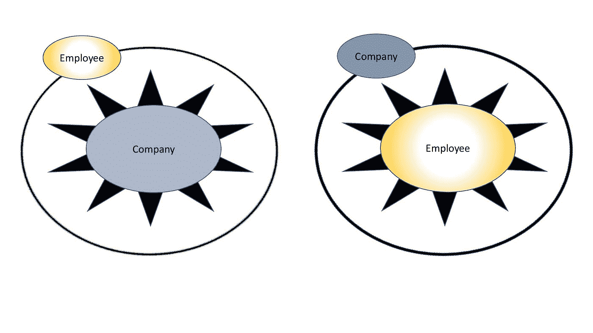
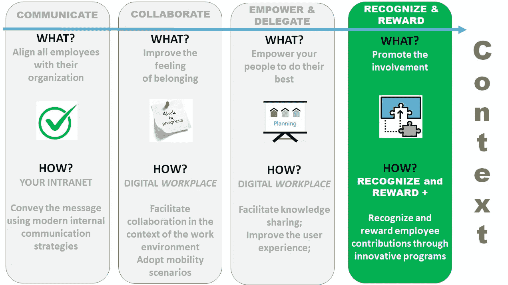

# 现代工作场所的战略性创新“认可和奖励计划”

> 原文：<https://medium.com/geekculture/a-strategic-recognition-reward-program-for-the-modern-workplace-series-part-i-d8e1a4d33b81?source=collection_archive---------18----------------------->

这是一本完整的指南，帮助企业领导者有效地设计和采用创新的“激励/认可/奖励”之旅，并最终摆脱(旧思维和遗产)框框思维，专注于在后新冠肺炎时代真正激励、认可和重视员工和团队。

R&R+: Close the GAP in your DIGITAL Workplace Roadmap — Image adapted from [engage2excel](https://blog.engage2excel.com/seven-employee-engagement-resolutions-in-2019) on their blog

# “现代工作场所的战略性创新‘认可和奖励计划’系列”的一部分

🔘 *Part 1:* ***找到*******缺少的几块*******数字职场谜题*** *(你现在正在读)***

**🔘 [*第二部分*](https://jhadnr68.medium.com/a-strategic-recognition-reward-program-for-the-modern-workplace-series-part-ii-349d7b2685a8) *:* ***形状*** *路径* ***路径*** *搭配* ***文化*******尊重******

**🔘 [*第三部分*](https://jhadnr68.medium.com/a-strategic-recognition-reward-program-for-the-modern-workplace-series-part-iii-6339372a7fc) *:* ***准备*******路*** *为新* ***胜志******

**🔘 [*第四部分*](https://jhadnr68.medium.com/a-strategic-recognition-reward-program-for-the-modern-workplace-series-part-iv-831644ba6606) *:* ***造*******心*******表彰和奖励*** *计划*****

**🔘 [*第五部分*](https://jhadnr68.medium.com/a-strategic-recognition-reward-program-for-the-modern-workplace-series-part-v-18f905123637)*:****创新*** *贵* ***改变议程*** *换一个* ***战略转型*****

**🔘 [*第六部分*](https://jhadnr68.medium.com/a-strategic-recognition-reward-program-for-the-modern-workplace-series-part-vi-96f6094e7dc0?source=friends_link&sk=6727243399337d217a83232ce1a27961) *:* ***扰乱*** *你的* ***员工旅程*** *拥有* ***令人印象深刻的能力*******战略举措******

# **开始之前**

## **放弃**

**本帖为个人中帖。这里表达的任何观点仅属于作者，并不反映作者曾经或现在隶属的任何公司或组织的任何观点或意见。点击查看完整免责声明[。](https://jhadnr68.medium.com/disclaimer-70803d581009)**

# ***第一部分:数字职场拼图*中的 ***缺失部分*****

# ***📝1 |简介***

***近年来，公司一直在努力跟上将新的数字能力和创新技能、资源和思维方式融入组织结构的步伐。***

***他们还必须重新思考如何设计和采用新的沟通技术，操作新的协作模型，更好地理解如何在整个企业中扩展敏捷方法。并不断调整他们的数字工作场所，以适应全新的世界、新的标准和新的工作方式。***

***他们仍然必须应对在新旧之间保持平衡的挑战。并沿着这个高速和颠覆性的旅程去改变！***

***正如 [**麦肯锡**](https://www.mckinsey.com/featured-insights/leadership/the-next-normal-arrives-trends-that-will-define-2021-and-beyond?hdpid=3635d597-9708-45ed-b1eb-2ae54b3883f2&hctky=11298045&hlkid=f3c4f675e2e84913aad77868ac8faf40) 最近所说:***

> *****工作的未来提前到来*****
> 
> ***在新冠肺炎危机之前，远程工作的想法就在空气中，但没有进行得很远或很快。但疫情改变了这一状况，数千万人几乎一夜之间就在各行各业转向了在家办公。***

***突然间，在这个新的新冠肺炎时代，其中一些公司也需要**适应和发展**，**重新设计**他们的**商业模式**，彻底改变他们的**运营**模式。***

***未来可能会迫使一些公司**消失、重生或重塑。*****

***但是毫无疑问，对于大多数公司来说***

> ***🌪❝:他们需要彻底改变，让远程工作对我们大多数人来说成为现实。❞***

***并且用[吉姆·赫默林](https://www.linkedin.com/pulse/leading-era-constant-change-jim-hemerling/)自己的话说***

> ***现在我们真的生活在一个不断变革的时代***
> 
> ***——[吉姆·赫默林](https://www.linkedin.com/pulse/leading-era-constant-change-jim-hemerling/)***

***我们现在生活在一个新常态的新未来。***

*****“下一个常态”终于到来……*****

***在这些(**数字化转型**)变革(**疲劳**)的最后几年里，一个组织的使命、宗旨、目标和宗旨的精神不断推动员工**前进**和**进一步**。***

***同样真实的是，公司开始为他们的员工和团队提供独特的挑战和机会，以克服越来越多的困难。而且很多时候，公司还要求并期望他们的团队和员工，他们的**行为**将允许**组织文化以某种方式发展**以反映那些**原则**和**价值观**。***

***然而，这种**新需求**现在是在一个全新的**重新设计的工作环境**和**重塑的劳动力**中产生的。***

***突然，在这个新的**新冠肺炎时代**，员工和团队现在面临**许多新的和独特的个人和职业挑战**。现在的问题是**公司**自己也开始迎接**新的，巨大的**。***

***从**高层管理者**来看，事情还是要做的。如今一切似乎都是**紧急而重要**！我们需要做任何事情。**把所有事情都做完**就成了最终**目标**！就现在。下一个常态就是现在的新常态，因为**未来的不确定时期**。***

> ***🤦❝，还有人记得艾森豪威尔矩阵背后的原理吗？❞***

***员工和团队，他们有时会奔向未知的地方和遥远的目的地。随着**协作工作流**和**对等团队**的**号**号同时运行，使**一致甚至让每个人都在同一页面**上变得具有挑战性。***

***首先**要明白为什么** …***

> *****“重要的事情很少是紧急的，紧急的事情很少是重要的。”*****
> 
> ***―德怀特·戴维·艾森豪威尔***

***从 9 点开始每周都有会议。早上 7 点。下午 3 点，甚至在吃饭和休息的时候:***

> ***🚴❝:真的有人关心那些被迫在家工作，同时还要做父母、老师、厨师、清洁工以及其他各种工作的人吗？❞***

***而最后，对于那些在**风暴**中被抓住的**中层管理者和领导者**、来说，他们现在已经被**彻底砸碎挤压**。***

> ***✍ ❝:谁在将战略转化为执行？即使相信现在执行等于战略，谁负责所需的协调？❞***

***作为一个**高层管理者**、一个**高层管理者**、一个**中层管理者**、一个**领导者**、一个**员工**，或者仅仅是一个**团队成员**，最终，每个人都是一个更广泛的组织的**员工**，作为一个整体一起工作。为了同一个**目的**！***

> ***🔧❝每个人都已经认识到，在新冠肺炎疫情期间，劳动力发生了彻底的变化！❞***

***尽管如此***

> ***👌 *❝* 现在看来**毫无疑问的**是，员工和团队仍然真正被独特的使命精神、目的、目标和目的所感动和投入。现在比以往任何时候都多！ *❞****

*****所以*****

> ***🔎❝企业需要开始把他们的员工和团队放在商业成功的中心。现在比以往任何时候都多！❞***

*****也就是说*****

> ***📝❝企业需要开始思考如何让在家工作的员工获得更有效的认可和奖励！❞***

*****如果组织能马上开始认真考虑这样做就更好了！*****

*****为了未来和新常态，组织需要授权和委托员工！*****

# ***💡2 |这是一个愿景，还是仅仅是人力资源方面的一次重大转变？***

***在这个新的数字化工作空间中，大多数公司已经采用了一些**数字化转型和工作场所计划**作为其**战略旅程**的一部分，以应对其中一些重大挑战。***

***目前的设置和设计包括新的**协作和沟通平台**，新的**范例和技术**(如设计思维)，新的**运营模式**(如云或外包)，新的**领导和管理能力和技能**(自主、授权、信任、授权、对等领导、holacracy 组织设计等)。)、针对移动使用案例和场景的新**功能**、用于更好的**知识共享的新工具**、**改进的执行**，以及**更好的用户体验**。***

***在这个新的数字时代，共同创造、共同工作和共同思考是合作的关键要素。看来我们现在进入了 [***哥白尼式的革命***](https://www.linkedin.com/pulse/copernican-revolution-hr-rebeca-fern%C3%A1ndez-mba/) ”***

******

***Image from the “[***Copernican Revolution in HR***](https://www.linkedin.com/pulse/copernican-revolution-hr-rebeca-fern%C3%A1ndez-mba/).”***

> ***要想成功，组织必须接纳新的部落。***
> 
> ***[西莉亚·德安卡教授和萨尔瓦多·阿拉贡教授](https://www.bbvaopenmind.com/en/articles/diversity-and-tribal-thinking-in-the-collaborative-organization/)***

***然而，相信数字工作场所可能会继续发展，甚至在未来几年加速发展，也许这些公司中的大多数仍然缺少拼图的最后一块。***

*****也就是:*****

> ***🤔❝ **在这个充满新思维、**参与、协作、**工作和执行的新世界里，如何真正有效地认可和奖励每一个独特的员工和团队？** ❞***

***通过扩展数字化之旅的当前愿景，也许**领导者可以做出决定性的最终贡献**来完成他们正在进行的数字化工作场所转型计划。***

> ***💡❝为了提拔 t **他在**沟通**、**协作**、**参与**、**培训**、**知识分享**、**授权**、**问责**、**信任度**、**认可**，以及**奖励自己的**员工和*****

*****如果这在几年前还是一个遥远的梦想，也许现在，在这个后新冠肺炎时代，**真正的领导者是时候考虑如何有效和独特地奖励他们的员工和团队了**。*****

*******类似于*******

> *****🤲❝An“激励/认可/奖励”计划旨在重塑数字化工作场所之旅…并通过来自员工、团队和 Employers❞的频繁和持续的反馈来实现闭环*****

**********

*****R&R+: A vision to Modernize your HR Management Capabilities*****

*******这样，认可和奖励最终会成为企业中每个人的头等大事！*******

# *****🌁3 |背景*****

*****已经强调了**愿景**背后的东西，现在重要的是把它放在它该放的地方。通常，公司使用几种方式**关注他们的数字工作场所能力，以提高员工和团队的参与度**，这就是我们将使用的上下文。*****

*******1。通信*******

*   *****沟通让员工和团队**感到与他们自己的公司和企业文化一致**。现代内部沟通策略将使您能够更好地通知您的员工和团队，如预建的内容管理功能，以管理和显示通过现代化渠道(如您的内部网)交付的丰富内容；*****
*   *****其他社交渠道、媒体和管理工具也将使您的**信息**、来自您团队的信息以及其他公司信息**得到更好的交流、传递和传播**。这样，你就能更好地**瞄准**你的**沟通**和网络**提高实时反馈**和**授权**你的员工和团队**推动你的企业文化的转变**；*****
*   *****为了参与社区和同行网络，公司已经在利用一些**游戏化**能力和**设计思维**方法；*****

*****沟通确保员工和团队感觉与公司一致。*****

*******2。协作*******

*   *****利用整个组织的协作将允许公司**在工作流内或以**对等**模式连接员工**，并为他们提供有效协作所需的协作和参与工具。这通常是大多数公司在定位他们的数字工作场所计划和功能时关注和花费精力的地方— **促进员工和团队在工作场所的协作**；*****
*   *****现代工具允许为项目创造空间，使用私人和安全的环境或沙箱来实现临时协作，**全新的工作方式**全新设计的**共同创造思维**；*****
*   *****为了更好的集成能力，公司还寻找协作工具来更好地**计划和监控个人和联合工作**，组织任务，共享事件和会议，并实时共同编辑文档；*****

*******协作保证了员工归属感的显著提高。*******

*******3。授权*******

*   *****知识现在是改变工作和协作体验的强大武器。所有员工和团队都应该能够使用和分享他们的知识。通过促进对相关数据和信息的访问、知识共享，甚至自我培训练习，公司现在更好地配备了工具来**释放他们的企业知识**；*****
*   *****为了提高生产力，现代工具允许每个员工**自由地联系他们可能感兴趣的任何项目或活动**、应用程序、文档或相关业务流程的任何其他公司信息；*****
*   *****虽然在完全启用的移动和互联远程工作环境中扩展了所有这些功能，但员工和团队现在更适合使用工具来**打破那些古老的通信孤岛**，因为现在可以在任何团队或活动流中安全地共享信息，而不管今天以某种方式持续存在的**传统组织结构、部门或层级**；*****

*******Empower 向员工和团队保证，他们会一直努力做到最好。大多数企业现在都变得以数据为中心、数据驱动或数据通知。*******

*******4。认可和奖励*******

*   *****虽然大多数计划和项目只关注更传统的数字工作场所和员工体验能力，但我们**很少看到认可和奖励员工和团队参与的举措**；*****
*   *******奇怪的**，因为这是**旅程中最精彩的部分**。**有效公平地认可和奖励**您独特的员工和团队贡献使用**创新的**奖励计划来**培养员工参与度**既是**挑战**又是**颠覆**；*****
*   *****游戏化功能现在是游戏的一个重要部分，如果你希望调整和跟踪想要的行为，它可以调整公司、团队和员工的目标。如果你考虑用**对等识别模式**来扩展这些能力，将会有所帮助，这将**挑战并改变你的企业文化**。而**表彰**和**奖励每个积极贡献**的**会改变游戏规则**；*****
*   *****利用**自上而下**和**对等**认可和奖励**创新**工具，我们向前迈出了巨大的**一步，以实现企业人力资源管理职能和能力的现代化**。认可和奖励可以确保你真正**有效、透明、公平地认可和提升员工和团队对公司有价值的一切积极贡献**；*****
*   *****如果你设法**缩小差距**，形成更加**流畅和持续的反馈循环**，那么你最终将能够**极大地挑战、改变和改善员工的整体旅程和体验**；*****

*****如今，公平透明地认可和奖励是有效领导最重要的职责之一！*****

**********

*****R&R+: Ways to use the Digital workplace to improve Employee and Team engagement*****

*****认可和奖励现在应该成为游戏的一部分！他们需要站在这个新的远程工作世界的最前沿！*****

# *****在你走之前*****

*****如果你想收到我未来的文章，请务必在[媒体](https://jhadnr68.medium.com/)上关注我。如果你喜欢现代职场**系列**的“**战略&创新‘认可&奖励计划”中的这个，我想你也会喜欢它的其余部分。*******

*****你可以在这里给我买杯咖啡来支持它。或者只是分享你的反馈。*****

*******敬请期待！*******

********在第一部分*** *中，我强调了我认为是大多数数字工作场所计划中缺少的环节***。定义一个* ***愿景*** *和* ***情境*** *以正确放置所有* ***认知*** *和* ***奖励*** *能力在员工旅程地图中是* ***拼图*** *。*******

*****[***在第二部分***](https://jhadnr68.medium.com/a-strategic-recognition-reward-program-for-the-modern-workplace-series-part-ii-349d7b2685a8) *中，我将涵盖我如何看待* ***领导力*** *和* ***战略*** *能够塑造你的企业环境的路径* *并最终提升一个******

******[***在第三部***](https://jhadnr68.medium.com/a-strategic-recognition-reward-program-for-the-modern-workplace-series-part-iii-6339372a7fc) *中，我将涵盖我的信念，为那段旅程设计一个* ***【胜利的渴望】*** *。了解为什么和什么* ***有影响力的领导者应该思考和做的*** *现在是向前迈进了一步，去定义* ***可衡量的、有时限的、合理的目标*** *。*******

*****[***在第四部分***](https://jhadnr68.medium.com/a-strategic-recognition-reward-program-for-the-modern-workplace-series-part-iv-831644ba6606) *中，我将带着怎样一个* ***的价值主张*** *到* ***的人力资源管理能力的现代化*******的数字化职场*** *为* ***的员工征途可能。*** *随着事情的发展通常会伴随着一些额外的变化和代价，我们要时刻考虑* ***事实*******相信*** *，以及* ***挑战*** *一路上* ***和*****而 ***总是用动机作为驱动*** *。**********

*****[***在第五部***](https://jhadnr68.medium.com/a-strategic-recognition-reward-program-for-the-modern-workplace-series-part-v-18f905123637) *中，我将看看一个什么样的* ***变革议程*** *看起来可能像是你的* ***战略转型*** *。在一系列* ***指导原则*** *的支持下，我们将揭示* *背后的* ***理念我们的员工用一种全新的心态***(“想象一下…”)。*********

********最后，*** [***第六部***](https://jhadnr68.medium.com/a-strategic-recognition-reward-program-for-the-modern-workplace-series-part-vi-96f6094e7dc0?source=friends_link&sk=6727243399337d217a83232ce1a27961) *，一套******的战略举措*** *终于将会活起来。以及为什么您需要让* ***您的企业运营模式正常运行，并与您的战略*** *保持一致。********