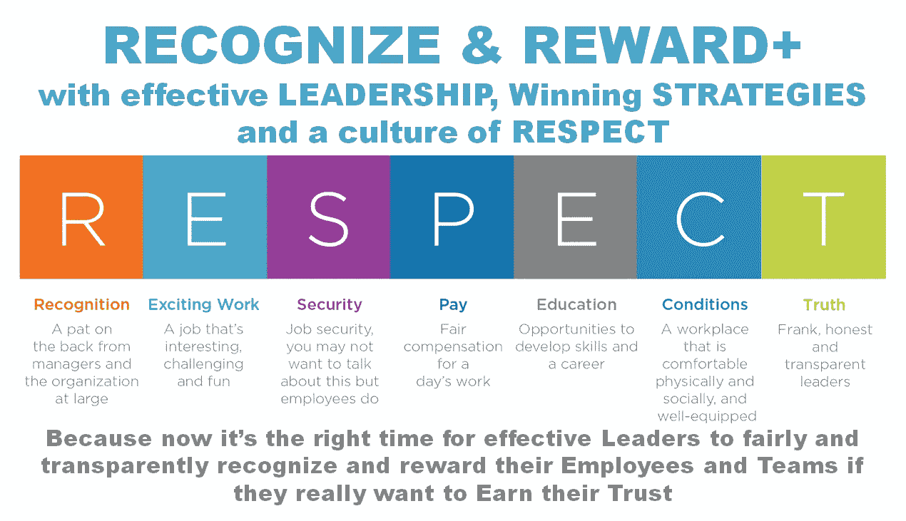
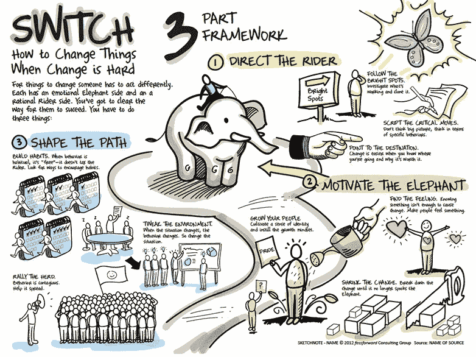

# 现代工作场所的战略性创新“认可和奖励计划”

> 原文：<https://medium.com/geekculture/a-strategic-recognition-reward-program-for-the-modern-workplace-series-part-ii-349d7b2685a8?source=collection_archive---------43----------------------->

这是一本完整的指南，帮助企业领导者在后新冠肺炎时代真正激励、认可和重视员工和团队时，有效地采取创新的“激励/认可/奖励”之旅，并最终摆脱(旧思维和遗产)框框思维。

R&R+: Close the GAP in your DIGITAL Workplace Roadmap — Image adapted from [engage2excel](https://blog.engage2excel.com/seven-employee-engagement-resolutions-in-2019) on their blog

# “现代工作场所的战略性创新‘认可和奖励计划’系列”的一部分

🔘[*Part 1*](https://jhadnr68.medium.com/a-strategic-recognition-reward-program-for-the-modern-workplace-series-part-i-d8e1a4d33b81)*:****找*** *找* ***缺件*******数字职场谜题****

*🔘*第二部分:* ***形状*******路径*******文化*******尊敬*** *(你现在正在读)*****

**🔘 [*第三部分*](https://jhadnr68.medium.com/a-strategic-recognition-reward-program-for-the-modern-workplace-series-part-iii-6339372a7fc) *:* ***准备*******路*** *为新* ***胜志******

**🔘 [*第四部分*](https://jhadnr68.medium.com/a-strategic-recognition-reward-program-for-the-modern-workplace-series-part-iv-831644ba6606) *:* ***造*******心*******表彰和奖励*** *计划*****

**🔘 [*第五部分*](https://jhadnr68.medium.com/a-strategic-recognition-reward-program-for-the-modern-workplace-series-part-v-18f905123637)*:****创新*** *贵* ***改变议程*** *换一个* ***战略转型*****

**🔘 [*第六部分*](https://jhadnr68.medium.com/a-strategic-recognition-reward-program-for-the-modern-workplace-series-part-vi-96f6094e7dc0?source=friends_link&sk=6727243399337d217a83232ce1a27961) *:* ***扰乱*** *你的* ***员工旅程*** *拥有* ***令人印象深刻的能力*******战略举措******

# **开始之前**

# **放弃**

**本帖为个人中帖。这里表达的任何观点仅属于作者，并不反映作者曾经或现在隶属的任何公司或组织的任何观点或意见。点击查看完整免责声明[。](https://jhadnr68.medium.com/disclaimer-70803d581009)**

# **第二部分:用尊重的文化塑造道路**

# **🙋4 |领导力、战略和尊重文化**

**现在，我们已经将**认可**和**奖励**放在了我们的员工旅程图中，很明显，如果您能够**将认可和奖励的重要性和价值提升到应有的位置**，这**只会进一步发挥作用**。**

**正如我们之前看到的，像**沟通**、**协作**、**授权**、**委托**和**问责**都与我们旅程的前三个支柱有关。那么还有什么是**认可**和**奖励**的焦点呢？**

**由于这是一个**要探索的新领域**，也许最好与一些最终游戏规则**保持一致**。当然，我们现在谈论的游戏叫做**文化。****

> **🤲❝高效的领导者和领导层需要促进尊重的文化，最终使企业战略与他们的认可和奖励战略相一致！❞**

****领导者和领导****

**虽然承认现在仍然是一些领导人的唯一责任，但情况不应该是这样。尽管如此，值得信赖且**有效的领导**——而不是管理者或其他所谓的领导者— **应该为整个组织树立榜样**。**

**因此，区分领导(**领导者**)和领导行为(**领导**)是至关重要的，因为**一些领导者只是伪装的逻辑学家**，与他们的员工和团队既没有完全的也没有个人联系。那些需要**学习如何成为有效和透明的领导者、远见者和激励他人的人**。**

> **⌚❝:你见过多少次，当一名员工想要认可和奖励另一名员工，而这仍然需要进一步的协商和批准时，一些领导没有立即批准奖励或奖励提名，甚至更糟？❞**

**但是当然，要让真正的**领导者**成为**认可**的代言人，还有更多**要说**和**要做**。像**透明**的谈话、充分**的信任度**、 **360 度**的愿景、**目标**的设定、**的目标、关键结果**、**的衡量标准**和**的可交付成果**、**的实践、**和**的行动**到勤**的计划**和**的监控****

**当然，**对自己的**行为**负责**。**

****那么，领导者们准备好迎接认可和奖励方面的新挑战了吗？****

****策略****

**如果你认为**中层管理者**和**决策者**的主要职责之一是" ***将战略转化为执行*** "并且除了事实之外，现在对于这些领导者中的大多数来说，" ***执行就是战略*** "，那么也许是时候问一问了:**

1.  **有多少企业**有效地管理和监控**他们的**战略**？**
2.  **他们中有多少人能够**将**他们的**商业战略**转化为**一套清晰的员工和团队目标**？**
3.  **他们中有多少人能够**计划**，**执行**，**监督**他们的工作？**
4.  **最后，有多少人能够将**商业战略**与**认可和奖励战略**结合起来？❞**

> **🙏❝将企业战略与你的(领域)战略以及你的认可和奖励战略结合起来是真正的关键，也是企业中每个人都应该努力最终实现的目标！❞**

**在规划你的工作和团队合作时，你需要争取一种"**认可和奖励标准声明**"**

**将所有人结合在一起的东西:**

*   ****做什么**到**做什么**；**
*   ****为什么**你在**做**这件事；**
*   ****你想**达到什么目标**；****
*   ****你打算**如何**衡量**他们；**
*   ****您希望**交付哪些产品**；****
*   ****你预测交付**会有什么结果**；****
*   ****每个人如何就如何与整体战略保持一致达成一致；****
*   ****为了更加**透明**和**公平奖励**，当认可需要以某种方式限定和量化**(具有清晰的价值界限)时，每个人如何就使用的标准达成一致；**

**当我们以一种不**透明而有效的方式**实现这一努力时，你会立即看到一个清晰的**显现**的**认可**与**奖励**和**脱离**、**绩效、激励**和**保留**之间的**。****

**当我们实现这一努力时是一种不**透明而有效的方式:****

> **🚧❝没有办法让认可和奖励最终成为企业中每个人的头等大事！❞**

****文化****

**我们知道，最终总是**组织文化**将**驱动一切**。很可能你的**企业文化**也会影响你新的**认知**和**奖励**策略和实践。但是反过来也是正确的——你的**认可**和**奖励**策略和实践将**强化你的文化、价值观和信仰**。**

**虽然我们可能会认为**协作不佳**可能是因为一些人**可能不喜欢一起工作**，但归根结底，这是一个**文化问题**。领导者**期望**他们的团队**合作**。通常，他们**认为**团队和**企业的愿景和战略**完全一致。都是理所当然的！更常见的是，他们相信每个人都会在一个完全没有冲突的工作环境中与 T21 合作。**

**所以，成为一名**有效的领导者**意味着你的**员工**和**团队**应该是你的主要**焦点——**你需要**影响**他们的**心**和**心**。由于我们不能强加一个真正的协作和协作空间，领导者应该促进协作，因为协作依赖于信任和开放的关系，而不仅仅是人。**

> **🙏❝的合作必须是 Purpose-Driven❞**

**但是**也意味着**:**

> **⛐ ❝:要改变行为，你必须指导骑手，激励大象并塑造路径。如果你能同时做到这三点，戏剧性的变化就会发生，即使你身后没有很多权力或资源。❞**
> 
> **— [奇普·希斯和丹·希斯](https://heathbrothers.com/books/switch/)**

**你是怎么做到的？**

****如建议** [**这里的**](https://heathbrothers.com/books/switch/) **由奇普希斯和丹希斯组成，需要“切换”！****

****

**R&R+: Direct the Rider, Motivate the Elephant and change the Path — Photo by Aaron Porter on his [Infographics](http://www.aeporter.com/info-graphics.html)**

**正如道路是你的环境一样，塑造道路意味着塑造你的环境来塑造你的文化。**

****因为路径就是你的环境:****

*   **你将如何运用你的**领导风格**来**塑造**你的企业**战略**？**
*   **您将如何**使**您的企业**战略**与新的**认可**和**奖励战略**保持一致？**
*   **在你的**环境**中，你**会如何表现**？**
*   ****你**会对**做什么塑造**它？**
*   ****你**认为你能够**做**到**重塑**和**传播**你的**文化**？**

****最后:****

> **⛐ ❝，你将如何塑造这条道路？❞**

**如前所述，这是一个**有待探索的新领域**，也许最好使用一个**参考框架**来更好地应对挑战。**

****如果我们利用像**这样的东西**

> ****尊重框架** ( **R** ecognition，**E**exciting Work，**S**security， **P** ay，**E**education，and career growth，good Work**C**conditions，and **T** ruth) **，**由 Jack Wiley 博士根据三十年的研究发展而成**
> 
> **—[2019 年七项员工敬业度决议](https://www.aliconferences.com/seven-employee-engagement-resolutions-for-2019/)**

**使用这里定义的七个关键维度可以更好地理解积极的员工体验背后的真正原因。**

****因为如果你既能规划道路，又能尊重他人:****

> **这是一条双行道:当员工感到受到尊重和重视时，他们会表现得更好。您将获得想要的结果，并且您的员工可以保持健康的工作/生活平衡。**
> 
> **—[2019 年七项员工敬业度决议](https://www.aliconferences.com/seven-employee-engagement-resolutions-for-2019/)**

> **🤔❝:我担心商界领袖对物质利益比对耐心建立一个强大的组织更感兴趣，而一个强大的组织是从关心员工开始的！❞**
> 
> **—约翰·伍登**

**记住这些，然后让我们使用**尊重**框架，理解**文化**背后的东西，这样你就可以最终**在你的**企业环境**中塑造**一条新的**道路**！**

**作为引导式助手，您还可以使用类似以下的内容:**

****一呆对话****

> **离职面谈的重点是某人为什么离开你的组织，而留下来的谈话或面谈的重点是为个人创造良好的职业经历，并推动更深层次的组织承诺。**
> 
> **— [停留对话](http://www.engage2excel.com/wp-content/uploads/2019/03/E2E_RESPECT_Stay_Conversation_Tips.pdf):使用尊重框架帮助停留对话的问题**

1.  ****认可****

****对管理者和整个组织的鼓励。****

*   ****员工**喜欢如何被**认可**(例如，私下还是公开)？**
*   **哪些类型的**行为**、**表现**或**成就**值得**认可**？**
*   **员工喜欢被认可的频率如何？**

****2。激动人心的工作****

**有趣、有挑战性、好玩的工作。**

*   **员工的**工作**中哪些部分是最**刺激**的？**
*   **员工工作的哪些部分最符合他们目前的技能和能力？**
*   **有哪些**改变**是必要的，以使员工的工作更有**意义**和**挑战**？**

****3。安全性****

****工作保障。你可能不想谈这个。但是员工有。****

*   **什么最能决定或影响员工对**组织**的**未来**的**信心？****
*   **高级**领导**、**经理**、**高管**如何更好地**理解**、**展示**、**承认**他们的**员工和团队**对**组织未来的成功**至关重要**？****
*   **企业应该做些什么来**加强**工作**绩效**和工作**安全**之间的感知关系？**

****4。支付****

**一天工作的合理报酬。**

*   **企业**应该怎么做**才能确保**员工**觉得自己的**薪酬**和自己对组织的**具体贡献**之间**很匹配？****
*   ****企业如何加强**其**员工的目标和业绩**与相应的**奖金**或**奖励支出**之间的联系？**
*   **如果增加哪些**福利**，会使员工的总**薪酬**待遇**更有吸引力**？**

****5。教育和职业发展****

****发展技能和职业的机会。****

*   **哪些与工作相关的机会对你的员工最有意义？**
*   **员工需要参加哪些**培训**和其他**教育**项目**接触**以进一步**发展**和**提高**他们的**技能**以获得必要的和预期的**晋升**或**晋升**？**
*   ****企业**和**领导者**应该做些什么来帮助他们的**员工实现**他们的职业**目标**？**

****6。条件****

**舒适、舒适、设施齐全的工作场所。**

*   **员工的**工作**会有什么样的变化**会导致**更健康的**工作-生活平衡或者**更公平的工作量分配**？****
*   ****企业应该怎么做**到**改善**团队的**人际**化学以及还跨团队**关系**？**
*   **什么**工具**、**程序、**和其他**材料**做**员工需要**来完成工作**更**有效？**

****7。真相****

****坦率、诚实、透明的领导者。说实话表示尊重就好！****

*   **为了**让大家更好地了解**组织**、其**方向**或其当前**绩效**，需要**哪些变化**？****
*   ****组织如何提供和改善空间**让**每个人**拥有**的声音**，获得**的机会**到**畅所欲言** **知道****他们的独特意见才算数**？**
*   ****领导**和**经理**如何更好地传递更多**有价值的**和**改进的反馈**关于他们员工的工作**表现**？**

**当你把类似于**尊重**框架的东西放在你的**企业环境中，来指导你**如何塑造****路径**…****

> **⛐ ❝，你正在推广一种尊重的文化！在这种尊重的文化中，你的员工中的每个人现在都是骑手和大象！❞**

****当你到达那个点:****

> **⛐ ❝指导骑手、激励大象和塑造道路成为企业中每个人的习惯。❞**

**如果你设法到达那里**

> **⛐ ❝，你终于在你的公司环境中塑造了一条新的道路。您组织的文化 DNA。尊重的文化！❞**

**但是要小心，因为**

> **⛐ ❝文化早餐什么都吃！❞**
> 
> **罗伯特·默里**

**认可和奖励现在应该成为最终游戏的一部分！完全符合您的公司战略。完全符合尊重的文化！**

# **在你走之前**

**如果你想收到我未来的文章，一定要在[媒体](https://jhadnr68.medium.com/)上关注我。如果你喜欢《现代职场战略**创新&认可&奖励计划》****系列**中的这个，我想你也会喜欢它的其余部分。**

**你可以在这里给我买杯咖啡来支持它。或者只是分享你的反馈。**

****敬请期待！****

**[***在第一部分***](https://jhadnr68.medium.com/a-strategic-recognition-reward-program-for-the-modern-workplace-series-part-i-d8e1a4d33b81) *中，我强调了我认为是大多数数字工作场所项目中缺少的***。定义一个* ***愿景*******情境*** *正确放置所有* ***认知*** *和* ***奖励*** *能力在员工旅程地图中是* ***拼图*** *。*****

*****在本部分的两个*** *中，我已经讲述了我是如何认为* ***领导*** *和* ***战略*** *能够塑造你的企业环境的路径* *并最终推广一种* ***文化*****

**[***在第三部***](https://jhadnr68.medium.com/a-strategic-recognition-reward-program-for-the-modern-workplace-series-part-iii-6339372a7fc) *中，我将涵盖我的信念，为那段旅程设计一个* ***【胜利的渴望】*** *。了解为什么和什么* ***有影响力的领导者应该思考和做的*** *现在是向前迈进了一步，去定义* ***可衡量的、有时限的、合理的目标*** *。***

**[***在第四部分***](https://jhadnr68.medium.com/a-strategic-recognition-reward-program-for-the-modern-workplace-series-part-iv-831644ba6606) *中，我将带着怎样一个* ***的价值主张*** *到* ***的人力资源管理能力的现代化*******的数字化职场*** *为* ***的员工征途可能。*** *随着事情的发展通常会伴随着一些额外的变化和代价，我们要时刻考虑* ***事实*******相信*** *，以及* ***挑战*** *一路上* ***和*****而 ***总是用动机作为驱动*** *。*******

**[***在第五部***](https://jhadnr68.medium.com/a-strategic-recognition-reward-program-for-the-modern-workplace-series-part-v-18f905123637) *中，我将看看一个什么样的* ***变革议程*** *看起来可能像是你的* ***战略转型*** *。在一系列* ***指导原则*** *的支持下，我们将揭示* *背后的* ***理念我们的员工用一种全新的心态***(“想象一下…”)。******

*****最后，*** [***第六部***](https://jhadnr68.medium.com/a-strategic-recognition-reward-program-for-the-modern-workplace-series-part-vi-96f6094e7dc0?source=friends_link&sk=6727243399337d217a83232ce1a27961) *，一套******的战略举措*** *终于将会活起来。以及为什么您需要启动并运行* ***您的企业运营模式，以实现您的战略。*******