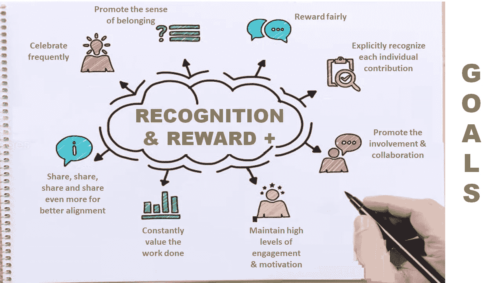

# 现代工作场所的战略性创新“认可和奖励计划”

> 原文：<https://medium.com/geekculture/a-strategic-recognition-reward-program-for-the-modern-workplace-series-part-iii-6339372a7fc?source=collection_archive---------41----------------------->

这是一本完整的指南，帮助企业领导者在后新冠肺炎时代真正激励、认可和重视员工和团队时，有效地采取创新的“激励/认可/奖励”之旅，并最终摆脱(旧思维和遗产)框框思维。

R&R+: Close the GAP in your DIGITAL Workplace Roadmap — Image adapted from [engage2excel](https://blog.engage2excel.com/seven-employee-engagement-resolutions-in-2019) on their blog

## “现代工作场所的战略性创新‘认可和奖励计划’系列”的一部分

🔘[*Part 1*](https://jhadnr68.medium.com/a-strategic-recognition-reward-program-for-the-modern-workplace-series-part-i-d8e1a4d33b81)*:****找*** *找* ***缺件*******数字职场谜题****

*🔘 [*第二部分*](https://jhadnr68.medium.com/a-strategic-recognition-reward-program-for-the-modern-workplace-series-part-ii-349d7b2685a8) *:* ***形状*******路径*** *同* ***文化*******尊重******

**🔘*第三部分:* ***准备*******道路*** *为新的* ***获胜的愿望*** *(你现在正在读)****

**🔘 [*第四部分*](https://jhadnr68.medium.com/a-strategic-recognition-reward-program-for-the-modern-workplace-series-part-iv-831644ba6606) *:* ***造*******心*******表彰和奖励*** *计划*****

**🔘 [*第五部分*](https://jhadnr68.medium.com/a-strategic-recognition-reward-program-for-the-modern-workplace-series-part-v-18f905123637)*:****创新*** *贵* ***改变议程*** *换一个* ***战略转型*****

**🔘 [*第六部分*](https://jhadnr68.medium.com/a-strategic-recognition-reward-program-for-the-modern-workplace-series-part-vi-96f6094e7dc0?source=friends_link&sk=6727243399337d217a83232ce1a27961) *:* ***扰乱*** *你的* ***员工旅程*** *拥有* ***令人印象深刻的能力*******战略举措******

# **开始之前**

# **放弃**

**本帖为个人中帖。这里表达的任何观点仅属于作者，并不反映作者曾经或现在隶属的任何公司或组织的任何观点或意见。点击查看完整免责声明[。](https://jhadnr68.medium.com/disclaimer-70803d581009)**

# **第三部分:为新的胜利愿望铺平道路**

# **🤔5 |为什么**

**在以某种方式理清了目的、愿景、使命和抱负背后的东西之后(希望这是一个真正有效的领导的胜利)，现在是时候**回忆一下罗杰·马丁关于激励在战略中的作用**。**

## **胜利的渴望**

> **我用渴望是因为我喜欢这个词:根据韦氏词典，我有强烈的欲望去获得更高或更伟大的东西，或者根据牛津英语词典，我有坚定的欲望或渴望得到更高的东西。那就是我想要的意义:强烈的欲望加上崇高的目标。**
> 
> *****——*罗杰·马丁****

**但是，对于你的**数字化职场之旅**和**认可**和**奖励策略**，你如何定义一个“ ***成功抱负*** ”可能是什么？**

**也许再一次回忆西蒙·西内克的真正智慧更好。**

## **总是从“为什么”开始。**

> **“不管我们在生活中做了什么，我们的目标、事业或信念永远不会改变。”**
> 
> **所有的组织都以**为什么**开始，但是只有那些伟大的组织年复一年地保持**为什么**清晰。**
> 
> ****—西蒙·西内克****

**因此，首先要解决两个关键问题:**

****1。为什么领导者应该思考这个问题？****

**这有几个很好的理由。**

*   **在这个新冠肺炎时代，解决**员工离职**的问题正成为一件必须做的事情，几乎成了领导力的**日常挑战**；**
*   **随着新的沟通技术和协作模式的出现，越来越明显的是，组织没有认识到**广泛的个人行为**。直接领导和经理甚至不会注意到**。然而，对所有小事的结果都有切实的影响。员工和团队每天都在做。并且它们都**把值**加到最终结果上；****
*   **通常，公司每年都会评估他们的员工、团队贡献和**最终表现**，通常总是由**的直接经理**来完成。因此，当前的管理和评估工具**不能反映提供更加透明、客观和公平的完整信任体系的需求**，因为它不能**说明和奖励日常参与**。如果你想更好地协调员工、团队和雇主的利益，这应该是一种**新的领导思维；****
*   **直接的影响是，雇主不能利用他们独特的参与度。他们不能明确地为被认为是道德的或战略性的行为和举措设立任何认可、激励甚至奖励。因为大多数时候他们只是离得太远或者只是在管理一个他们再也不了解的核心业务；**

****2。领导者应该考虑做什么？****

****有几个很好的想法。****

*   **如何**使公司的战略目标与员工和团队的发展相协调**；**
*   **如何频繁激励员工和团队发挥最佳水平；**
*   **如何**降低离职率**；**
*   **如何不断**提升**员工和团队**士气**；**
*   **如何**认可和奖励多种多样的行为**而几乎没有或没有额外的管理费用(并最终宣布一些评估年会的死亡，这些会议对一些员工来说只是一种形式)；**
*   **如何**有效、公平地认可和奖励具有真正企业价值的个人和团队成就**，认为这是管理和实现员工激励的更有效方式；**
*   **如何允许每个员工**自由地与其他员工或团队**一起使用他们认可的事实，相信这是管理和实现员工敬业度的更有效的方式；**
*   **如何允许每个员工自由使用他们的奖励购买他们需要或想要的东西，相信他们最终会更有动力去获得这些奖励；**
*   **如何**无缝自动奖励个人成就和团队里程碑**；**
*   **如何允许**每个员工和团队同事单独互相感谢，公开祝贺其他员工和团队；****
*   **如何**鼓励自上而下的认可**，允许高管、领导、中层经理和其他团队领导认可每一项员工活动，但也使用**自下而上和对等认可的方法**；**
*   **如何通过创新的激励机制提供一种透明而有效的方法来激励员工的绩效；**

# **📊6 |目标**

**现在已经很清楚**为什么**和**什么**领导应该**思考**和**做**为新**表彰**和**奖励**的策略。**

**然后，我们如何定义一套**目标**来更好地塑造我们最终的**成功愿望**以实现新的**愿景**和**价值主张**以**实现**数字化工作场所**的人力资源管理能力**现代化，从而实现**员工旅程**？**

****

**R&R+: GOALS for a Winning Aspiration**

****1。促进归属感****

**这个**没有讨论**。如果你是经理或领导者，你会直接注意到承诺、动机、行为和归属感之间的关系。**

****那么有影响力的领导人现在应该会问:****

*   **为什么员工认可的职责**只给了几个经理**？**
*   **如果认识到时机是至关重要的，为什么那些经理仍然(并且仅仅)每年评估员工和团队的贡献？**
*   **那些经理可能只**将他们的观点应用于一些不太知名的主题领域**的可能性有多大？**
*   **其他**员工和团队成员是否会处于更有利的位置以做出更好的判断**？**
*   **其他员工和团队成员是否有**完整多样的标准来公平地认可和奖励**？**
*   **游戏结束时，高管和经理**首先会看重什么？****
*   **一些约束会不会**限制员工获得更好认可和奖励的机会**？**
*   **对于经理、团队和员工来说，有没有其他更好的参与体验的方法？**

**有影响力的领导者需要培养归属感。**

****2。公平奖励****

**不那么明显，尤其是如果领导和员工仍然**认为奖励总是意味着加薪或加薪(这和被提升是不一样的)**。**

> **“比起加薪不升职，员工更喜欢升职不加薪”**
> 
> ****—** 来自[人力资源管理协会的研究](https://www.shrm.org/resourcesandtools/hr-topics/compensation/pages/promotions-preferred-to-pay-raises.aspx)**

****为** [**帕特丽夏·奥德尔**](https://www.academia.edu/7860405/Employee_Reward_and_Recognition_Systems) **解释道:****

> **“现金不再是最终的动力”**

****那么有影响力的领导人现在应该会问:****

*   **年轻一代更喜欢金钱还是升职？**
*   **对他们来说，哪一个**等于真正的增长**？**
*   **你的**环境**是否促进了**充分的信仰和信任**？**
*   **经理们透明公正地处理晋升吗？**
*   **经理们了解他们的员工思考和选择留下或离开的原因吗？**
*   **经理们了解他们的行为对员工忠诚度和归属感的**影响吗**？**

****有影响力的领导者需要通过激励机制、透明目标来认可和奖励，并最终承担认可责任。****

****3。明确认可每个贡献****

**不那么明显，尤其是对于那些只看重结果的**高管和领导**。如今，有一种**广泛的个人行为是组织没有明确认可的**。**

**通常，最终获胜的是:**

*   **谈吐优雅；**
*   **将计划和资源作为杰作进行管理；**
*   **让其他团队的人为他们自己的目标而工作，仅仅是因为等级制度的支持；**
*   **让其他团队觉得自己的工作只有支持价值；**
*   **知道销售什么和如何销售，以及谁做得更好；**

****那么有影响力的领导人现在应该会问:****

*   **在一个**对等领导**和**协作工作流**、**的世界里，谁在做什么**？**
*   ****每次贡献**到最终**目标**和**结果**的**证据**在哪里？**
*   **领导**了解他们认可的员工**吗？**
*   **作为**价值流**的一部分，是否有**更好的方式来识别和衡量**每个**的贡献**？**
*   **假设员工和团队就像一个**管弦乐队的成员**，在每一步中，谁是**作曲**，**演奏哪首曲子和乐器，指挥并调整最后的陈述**？**

****有影响力的领导者需要明确认可和奖励旅途中的每一份贡献。所有领导人都需要明白，旅程永远不会相同！。****

****4。促进参与&协作****

**领导者最重要的职责之一。如果有影响力的领导者希望员工和团队达到这样的成熟度水平，领导者需要有效地以身作则，因此他们现在应该问:**

*   **如何真正**传递**和**培育**一种**公开透明的文化**？**
*   **如何真正允许并鼓励每个人在**分享想法**上**开明**？**
*   **如何**自上而下以身作则**，让员工和团队**复制想要的行为**？**
*   **如何采用和执行**门户开放政策**，允许**有效**和**信任沟通**在组织的不同层级之间？**
*   **如何让**通讯**频繁**和**流体**？****
*   **如何在整个**过程**中交付**完全可视性**和**透明度**？**
*   **如何有效区分**个人**和**团队努力**、**平衡个人抱负、团队合作和其他激励因素以共同工作**？**

**有影响力的领导者需要培养深厚的协作文化。并激励大家做大事！**

****5。保持高水平的参与度&激励****

**在反馈循环中，参与和合作之后是参与和激励，因此有影响力的领导者现在应该问:**

*   **如何给员工需要的**自主权**、**授权**、**成长**机会**感受自我实现和目标驱动**？**
*   **如何**提高员工参与度**并让员工**在快速完成工作的环境中保持高度积极性**？**
*   **如何积极建立**信任关系**？**
*   **如何实现**决策更加平衡和合意**？**
*   **如何运用正确的公式在奖励和认可之间找到**正确的平衡**，因为员工可能会**以非常**不同的方式**应对直接来自**高度激励**和**敬业的员工队伍**的**挑战**？****
*   **假设并非所有的激励都是相同的(例如，**内在激励**与**外在激励**)，如何保持该公式的有效性，使其成为**经常认可**每个员工和团队仍然以多种不同的方式做出**有价值的贡献**？**

**有影响力的领导者需要培养深厚的协作文化。创造一种以人为本的去中心化和个人认可的文化！**

****6。不断评估已完成的工作****

**如果领导者想让员工和团队觉得工作**更有回报**，有影响力的领导者现在应该问:**

*   **如何更好地探索工作活动和工作满意度之间的**缺失环节**以培养不同的策略？**
*   **如何**更好地理解**每个员工和团队的欣赏对于在工作中取得真正成功的重要性？**
*   **如何**认可**和**承认**自己的独特贡献和努力？**
*   **如何运用这些原则**定期**和**鼓励他人**也这样做**培养**真正的**协作**和**订婚**？**

**有影响力的领导者需要明白工作中的工作满意度意味着什么。并让所有员工感受到被重视！**

****7。分享、分享、分享、分享更多，以实现更好的一致性****

**如果说**知识被视为当今任何企业最有价值的资产**，那么知识管理和共享就是这个数字世界中最关键的两项能力。因此，如果领导者认为分享是更好的团队合作的驱动力，有影响力的领导者现在应该问:**

*   **如何**鼓励**一种真正**开放的团队协作方式**？**
*   **如何**创造空间**和**机会**培育**的**文化**开放沟通和创新**关于**赢**、**输**、以及**经验教训**每个员工都**集体经历**？**
*   **如何让员工和团队在运行他们的项目时完全感受到**所有权**和**责任**，让他们觉得**被授权**和**被信任**分享他们的学习和知识？**
*   **如何**模拟**有效开展知识共享企业实践的必要**行为**？**

**有影响力的领导者需要以身作则，推行开放共享的文化，这是你想看到的行为！**

****事实上****

> **"这个世界不再需要依靠传统的等级制度来传递信息."**
> 
> **――Mila Baker 在“对等领导:为什么网络是领导者”**

****8。经常庆祝****

**如果把事情做好现在是大多数企业的新常态，那么大多数员工经常在项目之间跑来跑去。通常，没有时间去欣赏、庆祝，甚至分享成功。因此，如果领导者认为除了培养员工对工作的奉献精神之外，还有更多更重要的事情需要**来真正深化参与度**(比如重视所有完成的任务)**，有影响力的领导者现在应该问:****

*   **如何发展一种**庆典**的**文化**？**
*   **如何养成一种**识别**的**感**？**
*   **如何定期庆祝员工和团队的**成就**和**里程碑**？**
*   **如何利用员工和团队庆祝活动**促进更高质量的工作**，更**有效的协作**，以及**牢固的关系建立**？**
*   **如何理解**急着要强制暂停庆祝和**让**大家再充充电回来**？**

**有影响力的领导者需要经常庆祝，以重视成就和里程碑。**

**在为新的**成功愿望**定义了一套**目标**之后，**领导人**需要最终达成**共识**，如何将这些**目标**与他们的**员工**和**团队的目标**、**统一**和**与**企业**战略**和**文化**相统一**

****如果有效的领导者相信员工和团队:****

*   ****是否受到这个新的**获胜愿望**的激励；****
*   **能够被这个新的**获胜愿望**真正激励；**
*   **新的“获胜愿望”映射到团队、员工和组织本身的“**强烈愿望，即实现更高或更伟大的目标**；**
*   **新的“获胜愿望”将进一步允许定义一些“**战略意图**”；**
*   **不管看起来有多难，将“获胜的渴望”转化为一些可衡量的、有时间限制的、合理的目标是可能的。**
*   **提出一套"**战略计划**"完全成为你的"**变革议程**"的一部分是可行的；**
*   **那你可以建立一些**管理系统**来**执行**和**监控**你一路上的策略；**
*   **有了这些管理系统，你将获得必要的帮助来**跟踪实现**你的“获胜愿望”；**

****那么现在是时候了****

> **🤔❝去思考事实，信仰和挑战，你可能会在…❞的道路上不得不面对**

****你的“获胜愿望”现在，您应该有自己的原因和目标，以及来自您的员工和团队的原因和目标，并与您的企业目标、企业战略保持一致。和尊重的文化！****

# **在你走之前**

**如果你想收到我未来的文章，一定要在[媒体](https://jhadnr68.medium.com/)上关注我。如果你喜欢《现代工作场所的战略性创新‘认可奖励计划’》》**系列**中的这篇文章，我想你也会喜欢它的其余部分。**

**你可以在这里给我买杯咖啡[来支持它。或者只是分享你的反馈。](https://www.buymeacoffee.com/jhadnr68)**

****敬请期待！****

**[***在第一部分***](https://jhadnr68.medium.com/a-strategic-recognition-reward-program-for-the-modern-workplace-series-part-i-d8e1a4d33b81) *中，我强调了我认为是大多数数字工作场所程序中缺少的***。定义一个* ***愿景*** *和* ***情境*** *以正确放置所有* ***认知*** *和* ***奖励*** *能力在员工旅程地图中是* ***拼图*** *。****

**[***在第二部分***](https://jhadnr68.medium.com/a-strategic-recognition-reward-program-for-the-modern-workplace-series-part-ii-349d7b2685a8) *中，我已经讲述了我认为* ***领导力*** *和* ***战略*** *能够塑造你的企业环境的路径* *并最终提升一个***

*****在第三部分*** *中，我讲述了我的信念:为那段旅程设计一个***。了解为什么和做什么* ***有影响力的领导者应该思考和做*** *此时是向前迈进了一步，去定义* ***可衡量的、有时限的、合理的目标*** *。****

**[***在第四部分***](https://jhadnr68.medium.com/a-strategic-recognition-reward-program-for-the-modern-workplace-series-part-iv-831644ba6606) *中，我将带着怎样一个* ***的价值主张*** *到* ***的人力资源管理能力的现代化*******的数字化职场*** *为* ***的员工征途可能。*** *随着事情的发展通常会伴随着一些额外的变化和代价，我们要时刻考虑* ***事实*******相信*** *，以及* ***挑战*** *一路上* ***和*****而 ***总是用动机作为驱动*** *。*******

**[***在第五部***](https://jhadnr68.medium.com/a-strategic-recognition-reward-program-for-the-modern-workplace-series-part-v-18f905123637) *中，我将看看一个什么样的* ***变革议程*** *看起来可能像是你的* ***战略转型*** *。在一系列* ***指导原则*** *的支持下，我们将揭示* *背后的* ***理念我们的员工用一种全新的心态***(“想象一下…”)。******

*****最后，*** [***第六部***](https://jhadnr68.medium.com/a-strategic-recognition-reward-program-for-the-modern-workplace-series-part-vi-96f6094e7dc0?source=friends_link&sk=6727243399337d217a83232ce1a27961) *，一套******的战略举措*** *终于将会活起来。以及为什么您需要启动并运行* ***您的企业运营模式，以实现您的战略。*******