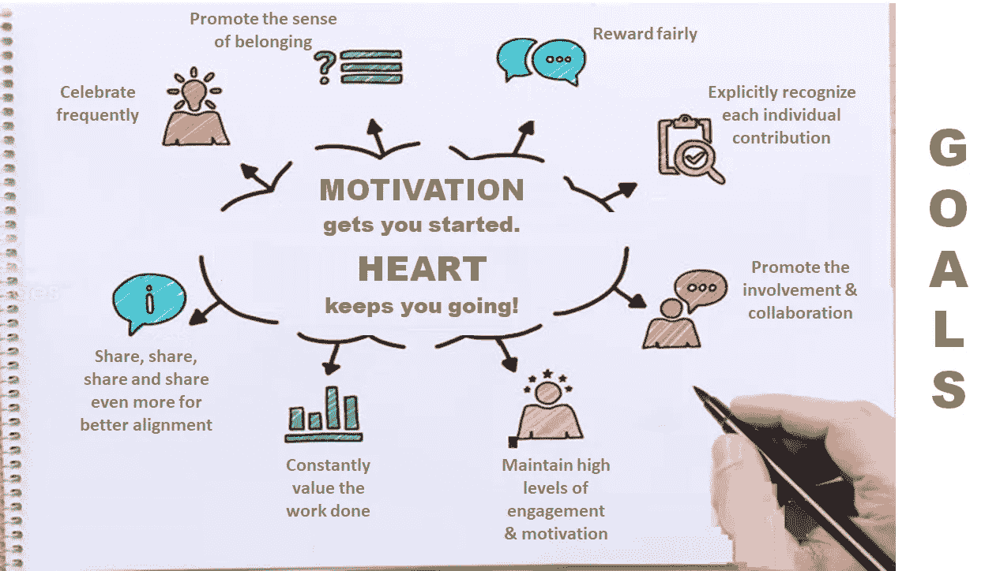
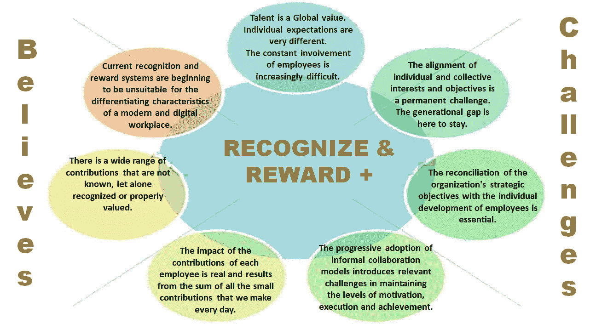

# 现代工作场所的战略性创新“认可和奖励计划”

> 原文：<https://medium.com/geekculture/a-strategic-recognition-reward-program-for-the-modern-workplace-series-part-iv-831644ba6606?source=collection_archive---------50----------------------->

这是一本完整的指南，帮助企业领导者在后新冠肺炎时代真正激励、认可和重视员工和团队时，有效地采取创新的“激励/认可/奖励”之旅，并最终摆脱(旧思维和遗产)框框思维。

R&R+: Close the GAP in your DIGITAL Workplace Roadmap — Image adapted from [engage2excel](https://blog.engage2excel.com/seven-employee-engagement-resolutions-in-2019) on their blog

## “现代工作场所的战略性创新‘认可和奖励计划’系列”的一部分

🔘[*Part 1*](https://jhadnr68.medium.com/a-strategic-recognition-reward-program-for-the-modern-workplace-series-part-i-d8e1a4d33b81)*:****找*** *找* ***缺件*******数字职场谜题****

*🔘 [*第二部分*](https://jhadnr68.medium.com/a-strategic-recognition-reward-program-for-the-modern-workplace-series-part-ii-349d7b2685a8) *:* ***形状*******路径*** *同* ***文化*******尊重******

**🔘 [*第三部分*](https://jhadnr68.medium.com/a-strategic-recognition-reward-program-for-the-modern-workplace-series-part-iii-6339372a7fc) *:* ***准备*******路*** *为新* ***胜志******

**🔘*第四部分:* ***打造*******心*** *你的* ***表彰和奖励*** *计划(你现在正在阅读)****

**🔘 [*第五部分:*](https://jhadnr68.medium.com/a-strategic-recognition-reward-program-for-the-modern-workplace-series-part-v-18f905123637) ***创新*** *贵* ***改变议程*** *换一个* ***战略转型*****

**🔘 [*第六部分*](https://jhadnr68.medium.com/a-strategic-recognition-reward-program-for-the-modern-workplace-series-part-vi-96f6094e7dc0?source=friends_link&sk=6727243399337d217a83232ce1a27961) *:* ***扰乱*** *你的* ***员工旅程*** *拥有* ***令人印象深刻的能力*******战略举措******

# **开始之前**

# **放弃**

**本帖为个人中帖。这里表达的任何观点仅属于作者，并不反映作者曾经或现在隶属的任何公司或组织的任何观点或意见。点击查看完整免责声明[。](https://jhadnr68.medium.com/disclaimer-70803d581009)**

# **第四部分:建立认可和奖励计划的核心**

# **😍7 |动力和心，第一！**

**我们已经澄清了一些**为什么**和**目标**在你的**获胜愿望**后面**

**有一组我们想要实现的目标。**

**我们需要时刻记住领导**为什么**和**要做什么。****

**我们需要在你的程序的**核心放置的**一样东西**是什么？****

****简单。****

****动机。****

> **动力是志向的关键。为了有效，一个愿望需要激励员工和客户。它应该让员工对实现既定目标的前景感到兴奋，并有助于说服客户公司关注他们的福利。**
> 
> *****——*罗杰·马丁****

**这样做的时候，你只是在说你相信:**

> **😄️ ❝动机让你得到 started❞**
> 
> **❤️ ❝:但真正让你前进的是内心！❞**

****

**R&R+: Put Motivation at the Heart of your Recognition and Reward Program**

**现在，激励应该成为你认可和奖励计划的核心！完全符合为什么和最终目标！和尊重的文化！**

# **🙌8|事实、信念和挑战**

**我们已经澄清了一些**为什么**和**目标**在你的“**获胜愿望**后面。”**

**我们已经将**激励**置于您**认可**和**奖励计划的**核心**。****

**在**充满动力地前进之前，我们需要开始你的**战略蓝图**。****

**你的**事实**、**信念**和**挑战**是什么，我们还需要让它们更贴近你节目的**核心**？**

****

**R&R+: Facts, Beliefs, and Challenges for a more feasible and realistic “Winning Aspiration.”**

1.  ****天赋****

****现在是全局值。****

*   **这是事实。**天赋现在是全局值**。但是，尽管大多数领导者都在大声宣传吸引、培养和留住人才的紧迫性和必要性，要求将重点转移到在这个新时代取得成功所需的人员、组织和创新能力上，**但大多数时候，他们不知道这在该领域意味着什么**；**

> **“首席财务官问首席执行官，‘如果我们投资发展员工，而他们却离开了我们，会发生什么？’这位首席执行官回答说，如果我们不这样做，而他们留下来会怎么样？"**
> 
> *****—* Trish Bertuzzi，销售发展剧本:建立可重复的渠道，通过内部销售加速增长****

****领导者必须****

> **“对员工进行足够好的培训，让他们离开；对员工足够好，让他们不想离开。”**
> 
> **― **理查德·布兰森****

*   ****领导者**也是**高层管理者**仍然需要**把人才**提升为**资产**的**战略**的重要性；**

**因为现在人才是世界上最有价值的资源，顶尖人才已经准备好了！**

****2。代沟****

**它会留在这里。**

*   **婴儿潮一代现在是退休的 T42。由于他们比下一代 X 一代和千禧一代大，在未来的几年里，这种差距将会存在。**
*   **在当前的十年里，千禧一代将会在已就业人口中占据相当大的比例。他们已经是职场中人数最多的一代；**

****最近的研究表明，新冠肺炎也在改变数字工作的性质:****

> **“x 世代在数字工作中‘茁壮成长’,而千禧一代在数字工作中苦苦挣扎。”**
> 
> **― [**R .达隆·亚当斯**](https://www.techrepublic.com/meet-the-team/us/r.-dallon-adams/) 中的 [**CXO**](https://www.techrepublic.com/topic/cxo/)**

**弥合代沟意味着你需要在人生阶段的每一步都加强参与。**

****3。个人期望****

****Dammed，他们太不一样了。****

*   **千禧一代给传统职场带来了非常**不同的期望**:更多**灵活性**和**敏捷**，不断**寻找意义**，**个人发展**起初**即时认可和满足总是**，**信息**指纹，**最佳员工体验**，**没有财产**，没有**牺牲****

****4。个人和集体利益和目标的一致性****

**这是一个永久的挑战。**

*   **随着员工在工作场所的敬业度越来越受到关注，企业也在不断努力**寻找更多证据，以更好地支持员工**敬业度**和**执行力**，团队支持和**成就**，以及最终公司整体**绩效**之间可能存在的因果关系**；**

****5。员工的持续参与****

****越来越棘手。****

*   **员工总是**多个团队**的一部分，由各种各样非常不同的人领导**(无论是结构上的，功能上的，还是对等模式的)；****
*   **团队和领导者不断地**争取更好和更有效的员工参与**，因为很明显，每次**脱离**都可能导致**生产力损失**、**缺勤**和**中断**以极快的速度发生；**
*   **要求领导者解决 l **缺乏清晰透明的信息**、**清晰的领导愿景**、**缺乏对管理层的信任、缺乏团队精神、缺乏协作。他们现在有解决这种脱离的最终责任。****

****6。组织战略目标与员工个人发展的协调****

****必不可少。****

*   **除了工作场所本身可能存在的挫折之外，让现在的**企业目标与新的、独特的员工期望**保持一致的需要，现在是大多数领导者的首要任务；**
*   ****缺乏培训**和持续**的自我发展机会**被认为是新常态下**自我提升**的新**基线**——首先是个人发展，最佳员工体验，没有财产，暂时没有牺牲；**

****7。非正式协作模式的逐步采用。****

****介绍保持激励、执行和成就水平的相关挑战。****

*   ****非正式协作模式完全颠覆了我们现代工作的方式**。即使工作是物理连接的，点对点的协作和贡献也可能是指数级的；**
*   ****由于企业再也承受不起因孤立的协作结构而失去机会的后果，**非正式的协作伙伴网络现在已经成为新的规范，并且变得**比其相应的传统和古老的层级模型**更加强大；**

****事实上****

> **“领导每天进门。跟随者每天进门。双双进门伺候。领导者为组织服务。追随者为领导者服务。每天都失去一次机会”**
> 
> **――Mila Baker 在“对等领导:为什么网络是领导者”**

*   **在这个新的**偏远世界**中，当全球分布的团队成为一种规范时，**首先认可，然后以鼓励的方式奖励**就成了一个真正的挑战；**
*   **当每个人都跑得越来越快时，庆祝对于对抗可能的孤立感和距离感变得越来越重要。那些小动作，比如一个简短的电话，一条聊天信息，或者一封美好的早晨电子邮件，缺乏对员工和团队表现的有效认可和庆祝的真正精神。**

**8。每个员工贡献的影响**

**它是真实的，是每个人每天做出的小小贡献的总和。**

*   **从今天所要求的**不太透明和持续的监控和评估过程来看，员工最终得到**不清楚的认可**、**承认**、**补偿**、**奖励**政策，即**低估了**他们**所相信的**(以及他们的同事)在执行和交付**时是自己**独特的个人贡献****；****
*   ****当然，没有员工希望得到不公平的报酬**。但是他们**期望**来自他们**的环境透明**和真实**的认知。因此，你的工作场所文化需要为他们提供这一点**，以促进归属感。在他们的指纹，无论何时需要！；**

****9。贡献范围很广****

**那是未知的，更不用说得到承认或充分重视了。**

*   **公司现在向他们的员工和团队提供独特的挑战，并要求和期望他们的团队和员工**反映他们在工作场所的行为，允许他们发展企业文化**；**
*   **新的挑战带来新的机遇，团队和员工**完全承担起额外的责任**。他们必须改变工作场所，以某种方式改变企业文化，他们还期待其他回报。这从透明的认可和公平的奖励开始；**

**10。当前的认可和奖励系统**

**开始不适合工作场所的特色。**

*   ****指挥和控制**领导和管理风格，尤其是**有毒**的领导和管理者，完全是**在新常态**下的错位。然而，对于我们大多数人来说，**他们还在**左右。而他们中的一些人拥有**实权，**且其毒害行为强大；**
*   **从因采用**非正式协作**模式而产生的影响来看，不断虚拟运行的员工往往会觉得**传统的认可模式已经过时**；**
*   **如果没有一个完整而透明的评估流程来更好地认识到哪些需要被认为是有价值的，允许迭代周期来监控过程中的进展，并与之前定义的目标保持一致，那么留给员工和团队的就只是**那些过时的对等评审，如今大多数时候这些评审似乎只是一项必要和强制性的工作**；**

****如果你认为现在一切都符合你的尊重文化，那么现在是时候了:****

> **🤔❝将制定新的变革议程，让所有人都站在同一个 page❞上**

****事实、挑战和信念，你的，来自你的员工和你的团队的，现在已经形成了你的认可和奖励策略的核心。与动力肩并肩。****

# **在你走之前**

**如果你想收到我未来的文章，请务必在[媒体](https://jhadnr68.medium.com/)上关注我。如果你喜欢现代职场**系列**的“**战略&创新‘认可奖励计划’”中的这个，我想你也会喜欢它的其余部分。****

**你可以在这里给我买杯咖啡[来支持它。或者只是分享你的反馈。](https://www.buymeacoffee.com/jhadnr68)**

****敬请期待！****

**[***在第一部分***](https://jhadnr68.medium.com/a-strategic-recognition-reward-program-for-the-modern-workplace-series-part-i-d8e1a4d33b81) *中，我强调了我认为是大多数数字工作场所程序中的* ***缺失环节*** *。定义一个* ***愿景*******情境*** *来正确地放置所有* ***认知*******奖励*** *能力在员工旅程地图中是* ***拼图中缺失的一块*** *。*****

**[***在第二部分***](https://jhadnr68.medium.com/a-strategic-recognition-reward-program-for-the-modern-workplace-series-part-ii-349d7b2685a8) *中，我已经讲述了我认为* ***领导*** *和* ***战略*** *如何能够塑造你的企业环境的路径* *并最终提升***

**[***在第三部***](https://jhadnr68.medium.com/a-strategic-recognition-reward-program-for-the-modern-workplace-series-part-iii-6339372a7fc) *中，我已经涵盖了我的信念:为那段旅程设计一个“* ***成功的愿望*** *”。了解为什么和做什么* ***有影响力的领导者应该马上思考和做*** *就是向前迈进了一步去定义* ***可衡量的、有时限的、合理的目标*** *。***

**[***在第四部分***](https://jhadnr68.medium.com/a-strategic-recognition-reward-program-for-the-modern-workplace-series-part-iv-831644ba6606) *中，我已经涵盖了* ***的价值主张*** *到* ***的人力资源管理能力*******的数字化职场*** *为* ***的员工之旅可能。*** *随着事情的发展通常会伴随着一些额外的变化和代价，我们要时刻考虑* ***事实*******相信*** *，以及* ***挑战*** *一路上* ***和*****而 ***总是用动机作为驱动*** *。*******

**[***在第五部***](https://jhadnr68.medium.com/a-strategic-recognition-reward-program-for-the-modern-workplace-series-part-v-18f905123637) *中，我将看看一个什么样的* ***变革议程*** *看起来可能像是你的* ***战略转型*** *。在一系列* ***指导原则*** *的支持下，我们将揭示* *背后的* ***理念我们的员工用一种全新的心态***(“想象一下…”)。******

*****最后，*** [***第六部***](https://jhadnr68.medium.com/a-strategic-recognition-reward-program-for-the-modern-workplace-series-part-vi-96f6094e7dc0?source=friends_link&sk=6727243399337d217a83232ce1a27961) *，一套******的战略举措*** *终于将会活起来。以及为什么您需要启动并运行* ***您的企业运营模式，以实现您的战略。*******