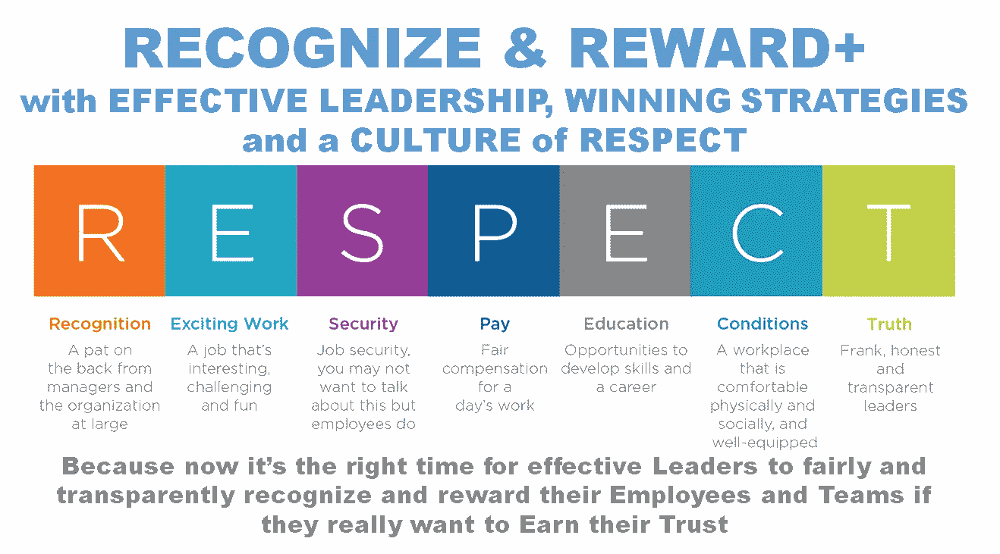
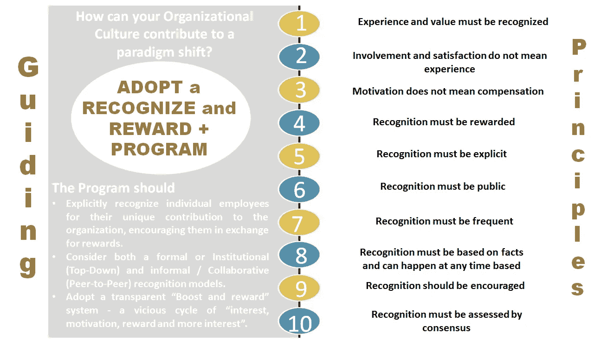
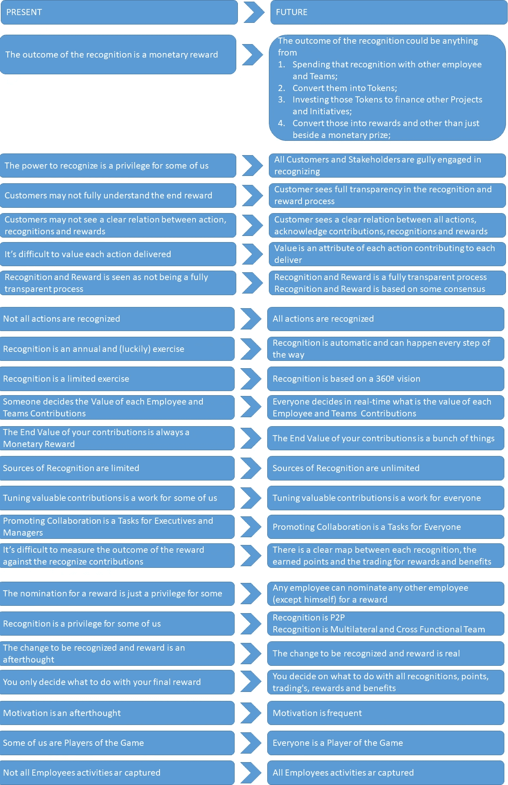

# 现代工作场所的战略性创新“认可和奖励计划”

> 原文：<https://medium.com/geekculture/a-strategic-recognition-reward-program-for-the-modern-workplace-series-part-v-18f905123637?source=collection_archive---------43----------------------->

这是一本完整的指南，帮助企业领导者在后新冠肺炎时代真正激励、认可和重视员工和团队时，有效地采取创新的“激励/认可/奖励”之旅，并最终摆脱(旧思维和遗产)框框思维。

R&R+: Close the GAP in your DIGITAL Workplace Roadmap — Image adapted from [engage2excel](https://blog.engage2excel.com/seven-employee-engagement-resolutions-in-2019) on their blog

## “现代工作场所的战略性创新‘认可和奖励计划’系列”的一部分

🔘[*Part 1*](https://jhadnr68.medium.com/a-strategic-recognition-reward-program-for-the-modern-workplace-series-part-i-d8e1a4d33b81)*:****找*** *找* ***缺件*******数字职场谜题****

*🔘 [*第二部分*](https://jhadnr68.medium.com/a-strategic-recognition-reward-program-for-the-modern-workplace-series-part-ii-349d7b2685a8) *:* ***形状*******路径*** *同* ***文化*******尊重******

**🔘 [*第三部分*](https://jhadnr68.medium.com/a-strategic-recognition-reward-program-for-the-modern-workplace-series-part-iii-6339372a7fc) *:* ***准备*******路*** *为新* ***胜志******

**🔘 [*第四部分*](https://jhadnr68.medium.com/a-strategic-recognition-reward-program-for-the-modern-workplace-series-part-iv-831644ba6606) *:* ***造*******心******表彰和奖励* *计划******

🔘*第五部分:* ***创新*** *你的* ***改变议程*** *换一个* ***战略转型*** *(你现在正在看)*

🔘 [*第六部分*](https://jhadnr68.medium.com/a-strategic-recognition-reward-program-for-the-modern-workplace-series-part-vi-96f6094e7dc0?source=friends_link&sk=6727243399337d217a83232ce1a27961) *:* ***扰乱*** *你的* ***员工旅程*** *拥有* ***令人印象深刻的能力*******战略举措****

# *开始之前*

# *放弃*

*本帖为个人中帖。这里表达的任何观点仅属于作者，并不反映作者曾经或现在隶属的任何公司或组织的任何观点或意见。点击查看完整免责声明[。](https://jhadnr68.medium.com/disclaimer-70803d581009)*

# *第五部分:为战略转型创新您的变革议程*

# *✅ 9|指导原则*

*揭开了**表彰**和**奖励**计划**数字工作场所**的**挑战**、**事实**、**相信**获奖愿望**背后的**，现在是时候继续设计一些**指导原则**了。*

*你为什么需要它们？*

***因为你需要开始考虑你的战略蓝图的“改变议程”，对吗**？*

**

*R&R+: Draft a small set of Guiding Principles to put everyone “On-The-Same-Page.”*

*但是首先(再次感谢西蒙)，你应该总是从“为什么”开始！*

> *🤔❝:为什么(以及如何)你的组织文化应该有助于范式转变？❞*

*通过问**为什么**首先，你声明你的指导原则应该以某种方式**促成你的企业文化的转变**。为了能够**转变，**你需要首先**挑战**你所知道的。*

***挑战的意思是:***

> *🤔❝反而问为什么不呢？❞*

*表面上的原因很简单，因为你的企业文化如今被视为求职者申请工作时最重要的标准之一。但这也代表了你现有员工的一个重要方面**，因为这些人确实可以与新员工一起培养必要的“强烈归属感**”*

***假设你认为这是允许每个人朝着同一个方向前进的企业文化，追求同一个目标**并认为这个方向将**带领**每个人走向终点**目标**和**成功**，那么今天有哪些关键因素促成了:*

*   ***发展**和**保持**一个**健康**和**强大的企业文化**；*
*   *让每个员工和团队**觉得**是**组织拼图**中完全整合的一块；*
*   *让每个员工和团队都成为最终成功的一部分；*
*   *透明地公平地**奖励每个员工和团队**；*****

*遵循这些因素会导致**暗示**，你可以用它来起草一套**与你自己的**信念**相一致的指导原则**。*

*那么，你可以用哪些指导原则来改变你的企业文化呢？*

1.  *我们必须认识到经验和价值。*

*   *你的**企业文化**应该**认可**和**认可**员工的**经验**和**价值**。记住，员工和团队一起**在旅程中改变文化**；*

***2。员工满意度和敬业度不等于员工体验，你的企业文化应该区分两者。***

*   ***满意度**是一种单独考察你的**员工在工作中的需求**以及**他们对自己的工作经验和工作环境有多满意或者感觉有多满意**的方式；*
*   ***接合**表示**方向和目的**。当员工真正**投入时，**你会立即注意到——他们感到**充满激情**，**精力充沛**，并且**致力于**工作和最终目标。他们在工作中的投入是巨大的。*
*   ***经验**——和“有经验的员工”不一样—关注每位员工如何评价他们对组织内**互动**的**各种**和**独特感受**。这真的很重要，因为**你的组织的文化和环境**驱动着那些**个人感知**，这反过来**将驱动你的员工的参与度和满意度**，无论他们是好是坏；*

***3。员工激励不等于员工薪酬***

*   *我们都知道**奖金对敬业度有重大影响。更高的薪酬给员工带来更高的满足感。但这有时会被视为一种误解，因为人们可能会认为结果只是一种真空中的练习，因为他们认为激励和薪酬之间应该有一种独特的关系；***
*   *当既有**好计划**又有**执行策略**让薪酬真正发挥最大潜力的时候，**差距就被弥合，**梦想就实现了；*
*   *当**薪酬**与员工的**总体贡献****认可**直接相关**时，这种情况**透明****公平**地发生，我们最终设法为每一个参与其中的人带来**实实在在的**和**巨大的利益**；***

***4。认可必有回报***

*   *员工期望**所有的贡献**都得到**的认可**和**公平的回报**；*
*   *因此，你的**企业文化应该激励**所有有回报的贡献。员工投入到每一项有价值的任务中的任何努力和精力，他们都感到需要和迫切需要以某种方式得到回报。*
*   *因为他们**相信**如今有**多种方式来传递这种认可和感谢**，他们**期望**为他们的**企业**；*

***5。识别必须明确***

*   *员工的直接或间接主管应遵循**自上而下的认可**，作为承认和认可其员工和团队独特贡献的一种方式；*
*   ***同事间的认可**也是所有经理和员工的期望，因为授权和认可最终**融入了企业文化的 DNA**；*
*   *特别是，员工期望**明确的**和**具体的**对每一项特殊贡献的认可，而不是**笼统的**和**模糊的**业绩陈述；*
*   *员工想知道哪些**贡献提供了最大的交付价值**，并了解它**如何与预期结果和目标**保持一致；*

***6。认可必须是公开的***

*   *员工也希望所有的认可都是公开的，而不是私下的。因为他们期望系统是**透明的**和**公平的**，他们需要整个过程的完全**可见性**；*

***7。识别必须频繁***

*   *员工也希望认可成为例行公事。他们认为这是一种**即时认可和奖励**的恶性循环，因为**越频繁地得到认可**，获得**奖励**的**机会**就越多，他们就会投入更多的精力到接下来的**任务**和**挑战**；*
*   *特别是在这些敏捷的日子里，我们迭代地计划活动以交付 MVP(最小可行产品)并实现更好的聚焦，**更短的周期有利于采用兴趣-动机-奖励-兴趣的反馈循环，因为这个循环可能非常容易上瘾**；*
*   *当认可和奖励系统遵循这种(预期的)行为模式时，**将一个大目标转化并分解成小步骤的功能和用户故事会增加旅程中每一步的奖励机会**。**长期维持**和**增强**员工**的动力**。员工们认为这是一种更加**高效**和**一致**的认可和频繁奖励的方式，而不仅仅是一笔(大)**年终奖金**；*

***8。认可必须基于事实，并且可以在任何时候发生***

*   *我们应该建立基于**事实**的认可，这在今天的意思是“**及时性**”:无论是自上而下还是自下而上/对等的贡献认可，**他们都期望在几乎临近的时间**发生，原因很简单——那是认可最具**影响力的时候**，尤其是当**有价值的贡献已经被明确地和公开地认可**；*

***9。应鼓励认可***

*   *按照兴趣-激励-奖励-兴趣反馈循环中描述的模式，**应该允许并充分鼓励每个员工和团队成员有同样的上瘾感**；*
*   *当**识别**和**确认**受到**的鼓励，**的**恶性循环变成指数级，**和**企业引擎**变成**全速运转****；***

***10。承认必须基于某种商定的共识***

*   ***为了最终确定**认为什么对整个企业(而不仅仅是对**直接经理**)至关重要且有价值，在**认可**和**奖励**最终发放的方式中，**我们需要在所有相关方** —员工、团队和企业本身之间达成共识，以确保整个流程始终透明、公平地符合每个人的需求和期望**；***

***最后，你的**指导原则**现在完全符合**尊重**的**文化**！***

# ***🚶10|变革议程***

***希望我们已经设法使**所有人都在同一页**上，现在是时候**思考**在新的**数字工作场所中**员工旅程**的新**认可**和**奖励策略**，使**完全**符合**的**文化**尊重***

*****因为我们希望策略是:*****

> ***《❝》是一本全面的指南，指导企业领导者有效地采取创新的“激励/认可/奖励”之旅，并最终摆脱(旧思维和遗产)框框思维，专注于如何在后新冠肺炎时代真正激励、认可和重视员工和团队。❞***

***新的**变革议程**需要**塑造**新的**变革路径**。***

> ***❝永远记住你为什么需要改变议程。你有一个惊人的目标，你相信你需要改变…你相信改变是不可避免的。❞***

***现在我们对**为什么和什么**有了完整的认识，让我们起草**变革议程**。***

> ***❝:改变议程是一个简单的清单，列出了为了实现你的目标需要改变的事情。你还认为什么都不需要改变吗？❞***

***那么，从**现在**走向**未来，我们需要考虑什么？*****

******

***R&R+: Building a Change Agenda for a Strategic Transformation***

*****起草好我们的变革议程后，在考虑**到**如何变革之前，有一个问题需要问一下:*****

> ***❝，你必须做什么改变？❞***

***如果你想出一些好主意来应对**每一个变化**会有所帮助。为了想出那些**好主意，**我们需要**强调**需要**改变**和**为什么需要从我们的改变议程中改变**！。***

***为了确保每一个**变化**都是**区别**，我们需要开始问“为什么不”。***

***同时，你需要最终完全接受一种新的心态。***

*****也就是:*****

******

***R&R+: Always ask “Why not Instead” and answer with “Imagine That and Dream Bigger” — Logo from [Imagine That, Inc.](https://imaginethatcreative.net/)***

*****那么，“想象一下，梦想更大”的内涵是什么呢？*****

*   ***有办法定义**自动识别**和**确认**哪些**相关动作**做了**组织**认为**有价值的贡献**；***
*   ***有一种方法是**认可**和**承认**那些**的行动**在**的每一步**中，从组织**文化**的角度来看——**的**文化**尊重**；***
*   ***每个**员工**都有一种方式来认可**其他**员工**在**对等**或**多边**关系中的贡献**；***
*   ***每个**雇员**都有一种方法来转换**点数**，这些点数是作为某个**数字公用令牌**中的各种**认可贡献**的结果而收到的；***
*   ***每个**员工**都有一种方式来**安全透明地管理**他们的**数字公用令牌**，能够**管理**所有已执行的**交易、**以及**可视化**一些**仪表板**(转换、余额等)。);***
*   ***每个**员工**都有一种方式来**交换**他们的**数字公用令牌**与许多**类型**的**奖励**和**利益**；***

***我们需要永远相信有(另一个)办法！***

***有了明确的**改变议程**和**新的思维方式——改为问“为什么不”，并回答“想象一下，梦想更大”——**我们现在离**和**更近了**重点介绍**通往**成功**的路径**。记住，如果你**想用你的**改变议程将**从**现在的**状态改变为**未来的**状态，**是时候开始思考了*****

> ***🤔❝:你打算做些什么改变，以便变革日程中的每一项变革都能发生？❞***

***这样我们才能最终达成我们必须以不同方式去做的事情！***

***一套指导原则使每个人都能达成共识。在隔离了您的战略转型所面临的一些关键问题后，我们的变革议程现在已经完成。***

# ***在你走之前***

***如果你想收到我未来的文章，一定要在[媒体](https://jhadnr68.medium.com/)上关注我。如果你喜欢《现代工作场所的战略性创新‘认可奖励计划’》****系列**中的这篇文章，我想你也会喜欢它的其余部分。*****

*****你可以在这里给我买杯咖啡来支持它。或者只是分享你的反馈。*****

*******敬请期待！*******

*****[***在第一部分***](https://jhadnr68.medium.com/a-strategic-recognition-reward-program-for-the-modern-workplace-series-part-i-d8e1a4d33b81) *中，我强调了我认为是大多数数字工作场所项目中缺少的***。定义一个* ***愿景*******情境*** *正确放置所有* ***认知*** *和* ***奖励*** *能力在员工旅程地图中是* ***拼图*** *。********

******[***在第二部分***](https://jhadnr68.medium.com/a-strategic-recognition-reward-program-for-the-modern-workplace-series-part-ii-349d7b2685a8) *中，我已经讲述了我认为* ***领导力*** *和* ***战略*** *能够塑造你的企业环境的路径* *并最终提升一个*******

********[***在第三部分***](https://jhadnr68.medium.com/a-strategic-recognition-reward-program-for-the-modern-workplace-series-part-iii-6339372a7fc) *中，我已经涵盖了我的信念，为那段旅程设计了一个“***”。了解为什么和做什么* ***有影响力的领导者应该思考和做*** *此时是向前迈进了一步，去定义* ***可衡量的、有时限的、合理的目标*** *。**********

******[***在第四部分***](https://jhadnr68.medium.com/a-strategic-recognition-reward-program-for-the-modern-workplace-series-part-iv-831644ba6606) *中，我已经涵盖了* ***的价值主张*** *到* ***的人力资源管理能力*******的数字化职场*** *为* ***的员工之旅可能。*** *随着事情的发展通常会伴随着一些额外的变化和代价，我们要时刻考虑* ***事实*******相信*** *，以及* ***挑战*** *一路上* ***和*****而 ***总是用动机作为驱动*** *。***********

*******在本部分的五个*** *中，我已经涵盖了什么一个* ***变革议程*******战略转型*** *。在一系列* ***指导原则*** *的支持下，我们将揭示* ***背后的理念*** *我们的员工旅程***【想象一下…】。*******

*******最后，*** [***在第六部***](https://jhadnr68.medium.com/a-strategic-recognition-reward-program-for-the-modern-workplace-series-part-vi-96f6094e7dc0?source=friends_link&sk=6727243399337d217a83232ce1a27961) *中，一套* ***的差异化能力*** *和* ***的战略举措*** *终于要活起来了。为什么您需要让* ***您的企业运营模式正常运行，并与您的战略*** 保持一致****