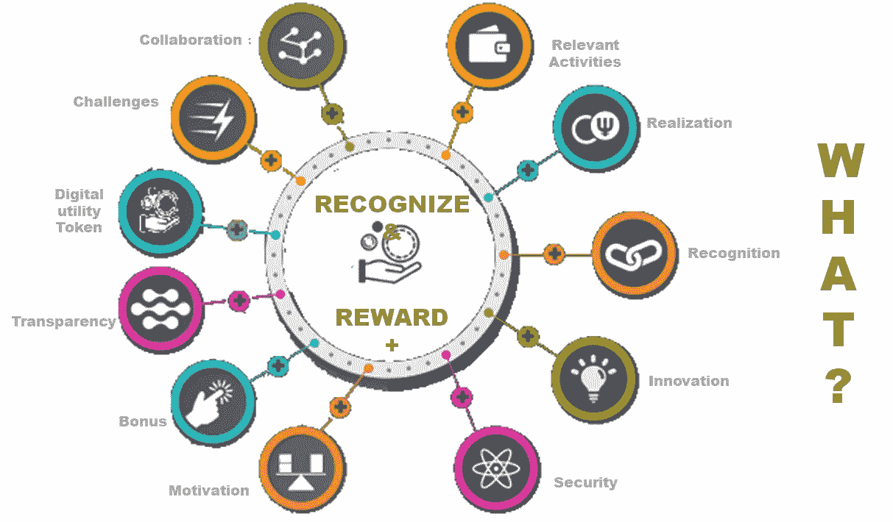
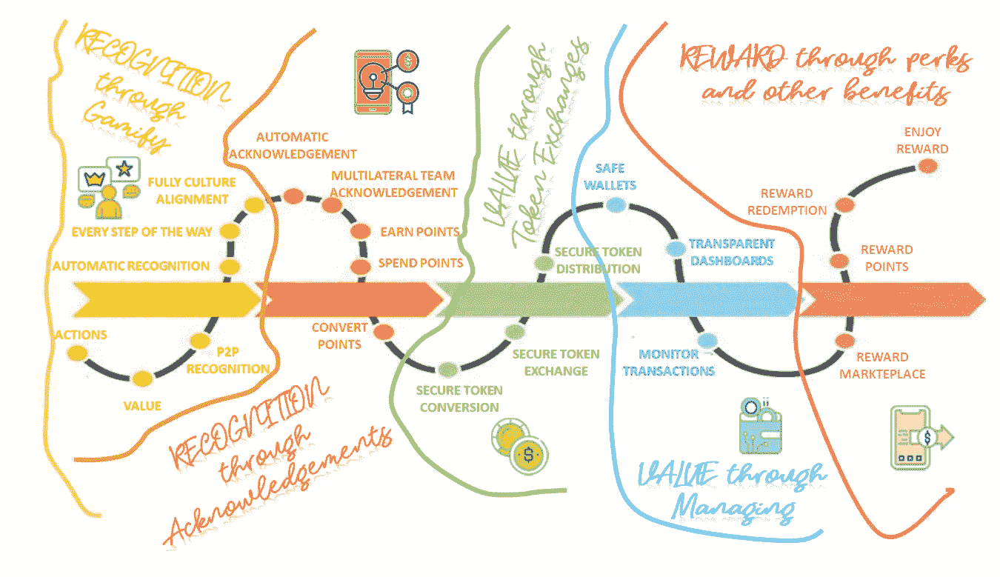
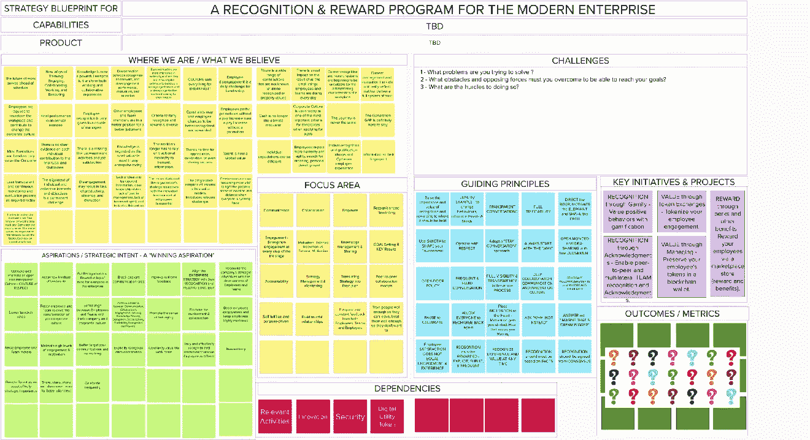

# 现代工作场所的战略性创新“认可和奖励计划”

> 原文：<https://medium.com/geekculture/a-strategic-recognition-reward-program-for-the-modern-workplace-series-part-vi-96f6094e7dc0?source=collection_archive---------11----------------------->

这是一本完整的指南，帮助企业领导者在后新冠肺炎时代真正激励、认可和重视员工和团队时，有效地采取创新的“激励/认可/奖励”之旅，并最终摆脱(旧思维和遗产)框框思维。

R&R+: Close the GAP in your DIGITAL Workplace Roadmap — Image adapted from [engage2excel](https://blog.engage2excel.com/seven-employee-engagement-resolutions-in-2019) on their blog

## “现代工作场所的战略性创新‘认可和奖励计划’系列”的一部分

🔘[*Part 1*](https://jhadnr68.medium.com/a-strategic-recognition-reward-program-for-the-modern-workplace-series-part-i-d8e1a4d33b81)*:****找*** *找* ***缺件*******数字职场谜题****

*🔘 [*第二部分*](https://jhadnr68.medium.com/a-strategic-recognition-reward-program-for-the-modern-workplace-series-part-ii-349d7b2685a8) *:* ***形状*******路径*** *同* ***文化*******尊重******

**🔘 [*第三部分*](https://jhadnr68.medium.com/a-strategic-recognition-reward-program-for-the-modern-workplace-series-part-iii-6339372a7fc) *:* ***准备*******路*** *为新* ***胜志******

**🔘 [*第四部分*](https://jhadnr68.medium.com/a-strategic-recognition-reward-program-for-the-modern-workplace-series-part-iv-831644ba6606) *:* ***造*******心*****表彰和奖励* *计划*****

*🔘 [*第五部分*](https://jhadnr68.medium.com/a-strategic-recognition-reward-program-for-the-modern-workplace-series-part-v-18f905123637)*:****创新*** *贵* ***改变议程*** *进行战略转型**

**🔘 *Part 6:* ***扰乱*** *你的* ***员工旅程*** *拥有* ***令人印象深刻的能力*******战略举措*** *(你现在正在阅读)****

# **开始之前**

# **放弃**

**本帖为个人中帖。这里表达的任何观点仅属于作者，并不反映作者曾经或现在隶属的任何公司或组织的任何观点或意见。点击查看完整免责声明[。](https://jhadnr68.medium.com/disclaimer-70803d581009)**

# **第六部分:员工旅程中令人印象深刻的能力和战略计划**

# **🔧11 |新的差异化功能**

**现在我们有了一个**改变议程**到**做什么**到**做什么**到**将**从**现在的**状态转移到**未来的**状态，我们需要为旅程起草一份**战略地图。****

**为了给**设计**战略和**规划**执行**计划**铺平道路，我们需要**强调**主要的**能力和我们需要解决的问题**到**实现**我们之前的**战略意图**。**

**如果你怀疑，就不要怀疑！**

> **“不要误以为有了计划就可以避免没有战略的命运”**
> 
> **—罗杰·马丁，[战略与规划:互补而非替代](https://rogermartin.medium.com/strategy-vs-planning-complements-not-substitutes-ea08e56809d6)**

****

**R&R+: Building Blocks behind the Employee journey to highlight the needed Capabilities**

1.  ****相关活动****

**我们需要在系统中找到、识别并捕获所有候选的**活动**、**任务**或**行动**，以支持我们的**愿景**；**

**2.**实现****

**我们需要就如何**连接系统中的所有点**达成一致，并使其成为现实；**

**3.**识别****

**我们需要就哪些**能力**将支持您的**认可**和**奖励**目标达成一致；**

**4.**创新****

**我们需要收获并发现**如何创新**以及哪些**创新能力**将带来**附加值**；**

**5.**安全****

**我们需要确保我们的系统是安全的。；**

**6.**动机****

**我们需要确保平衡**团队**和**员工的成就**。最终，是他们的**动力**让我们的系统**存活**和**运行**！；**

**7.**奖金****

**我们需要确保作为奖励提供的一切完全符合我们的**组织文化**以及我们的**团队**和**员工**’**抱负**和**期望**！**

**8.**透明度****

**我们需要在认可和奖励的同时实现**完全透明**！我们提供的服务需要与此保持一致！在一条**球道上**！**

**9.**数字证书****

**我们可以使用类似数字证书的东西来授权员工、团队和组织认可和奖励。每个人**都应该得到公平的认可和奖励**！**

**10.**挑战****

**我们需要预测我们将面临哪些挑战——我们的**组织文化**、变革管理和其他技术事物总是**阻碍我们。****

**11.**协作****

**我们的系统需要**完全透明**。当然，还有建立在**信任**上的。**互信共识**！并且**信任**由**设计**！为此，协作是必须的！系统的**边界**内外。**

# **🔎12 |“战略计划”的旅程**

****这样，我们就接近了认可&奖励旅程的终点。只剩下一件事:****

> **🤔❝:你打算做些什么改变，以便变革日程中的每一项变革都能发生？❞**

****并持续应用新的思维模式****

> **❓ ❝总是问‘为什么不取而代之’，并回答‘想象一下，做个 Bigger'❞梦吧’**

**那么在新的**员工旅程**背后的**想法**和**愿景**是什么呢**强调了**我们将**做什么**来使**改变发生？****

****

**R&R+: The new Changing Path for the Employee Journey — Image adapted from [freshdesk Blog](https://freshdesk.com/general/customer-journey-maps-blog/)**

**在塑造了****理念**和**愿景**为**员工的旅程**之后，是时候**深入**和**突出**什么是**挑战****改变议程**但仍然**与**文化**保持一致**尊重**。******

****但在此之前，我们会再次回忆起**罗杰·马丁**的那段突出说明:****

> ******“战略是做出一系列综合选择的行为，这些选择使组织处于制胜位置”******
> 
> ****“商业战略的定义有四个重要部分。首先是 ***选择*** *。*策略指定了选择做某些事情而不做其他事情。而那个选择遵守的规则是[如果对面的面](/the-innovation/is-the-opposite-of-your-choice-stupid-on-its-face-5b247ffd7f94)很蠢，那就不算策略选择。其次是 ***综合设置*** 。这些选择必须相互配合，相辅相成；它们不仅仅是一个列表。第三个是 ***位置*** 。这些选择明确指定了组织将参与和不参与的领域。第四是 ***赢*** 。战略详细说明了一个令人信服的理论，说明组织如何在选定的领域优于竞争对手。”****
> 
> ****—罗杰·马丁，[战略与规划:互补而非替代](https://rogermartin.medium.com/strategy-vs-planning-complements-not-substitutes-ea08e56809d6)****

****因此，我们需要确保我们最终的战略计划将是“一系列综合的选择，这些选择将使企业获得成功。”****

> ****😱❝ **否则，他们永远不会有战略眼光！** ❞****

****那么，**战略计划**，它们是什么？我们将如何**用一种新的心态**消除**变革议程中我们已经**强调的**中的**差距？****

******1。通过游戏化进行识别******

******重视游戏化的积极行为。有了这个，你就可以:******

*   ****扩展和增强**捕捉**您的员工和团队**活动**的方式；****
*   ****根据具体的**用户操作**(确认)，管理和归属**积分**；****
*   ******微调**那些点取决于你和你的企业**最看重什么**；****
*   ******从企业社交网络或其他企业社交活动中赚取**积分；****
*   ******用排行榜和奖杯等东西激励每个人**；****
*   ******允许**每位**员工**以**奖励他人**的方式**承认**和**认可**他们的出色工作；****
*   ******认可创新想法**、团队倡议、流程改进、变革建议或任何其他**有利于**企业整体**的事情**；****
*   ****允许**每个员工**以**回报**他人作为一种简单的善举；****

****每个人现在都被认为是这个游戏的玩家。所有人！****

******2。通过确认进行确认******

******实现点对点和多边团队认可和确认。******

*   ******让员工感谢同事的帮助、贡献和工作；******
*   ******发布信息，促进更具协作性的文化，增强互助**；****
*   ******将**感谢和认可转化为**积分**以进一步**奖励**参与；****
*   ******允许**任何**员工**至**自由提名**任何其他员工(除了他们自己)获得报酬；****

****如今，每个人都是形成尊重文化的参与者。所有人！****

******3。通过代币兑换获得价值******

****标记你的员工参与度。****

*   ******将**您的员工敬业度**积分**转换为由您的组织提供和分发的**数字公用令牌**；****
*   ****确保每个**令牌归属**中的**透明**和**安全**(例如使用区块链技术)；****
*   ****通过定义从**积分到代币**、**积分到代币**、**预算**和可能的**投资计划**的**转换率**来实施您的**认可**计划；****
*   ******当有人送他们一些**奖励提名**时，允许每个人**到**领取代币**；****
*   ******跟踪**所有**表彰**和**奖励**投票和**自动生成** **数字代币**，可以**换取**奖励**和其他**福利**；******

****每个人现在都负责管理自己的认可。所有人！****

******4。通过管理实现价值******

****将员工的代币放在区块链钱包里。****

*   ******向**每位**员工**提供一个**安全电子钱包**，以便他们**管理**他们的**数字公用令牌**；****
*   ****使用**代币资助项目**，兑换**利益**，兑换成进一步的**奖励，或者存进钱包**；****
*   ****允许**团队**使用**钱包**到**众筹资金**用于他们的**计划**或**项目**，作为一种**鼓励创新的手段**；****
*   ******允许**每个**员工**监控和**管理**他们所有的交易——发送和接收；****

****每个人现在都负责决定如何利用他们认可的价值。所有人！****

******5。通过津贴和其他福利给予奖励******

******通过市场商店奖励您的员工(奖励和福利)。******

*   ****创建一个**企业市场商店**，为每个人提供**好处**；****
*   ******福利**可以是企业决定向员工提供的一切(例如，基础课程、书籍、假期等。);****
*   ******允许**每个**员工**用他们想要的**利益**交易**他们的**代币**；******
*   ******延长**您的**企业市场店铺**为**每个人提供额外奖励**；****
*   ******允许**每个**员工**到**选择**和**兑换**他们的**奖励**；****
*   ****使用**企业市场** **商店**到**交易**；****

****现在，每个人都负责决定如何用奖励和利益来交换他们认可的价值。所有人！****

> ****🙌❝ **每个人现在都是认可和奖励策略的玩家！完全符合尊重文化和新心态的透明、公平的战略—** 总是问‘为什么不取而代之’,并回答‘想象一下，梦想 Bigger'❞吧****

# ****13 |调整您的企业运营模式****

****在结束这段旅程时，似乎缺少了一个环节——与**战略目标、成果** & **指标**保持一致。****

****与任何其他**战略**一样，稍后将需要定义一些商定的**战略目标、结果和措施。******

******战略目标**告诉我们**我们要做什么**我们要**去**去**做**去**实现**我们的**战略。******

******措施**告诉我们**是否在正轨上。******

******战略计划**告诉我们将如何**完成**我们的**战略目标和战略意图**。****

****我们需要这两者，以便在计划和执行时，我们可以监控**战略**。****

> ****👍❝:因为正如任何战略一样，关键举措、关键激励措施和关键衡量标准应该始终与我们是否真的让事情变得更好或更坏有关。❞****

****如果您想进一步改进练习，您需要为已经确定的**每个战略计划**找到**具体且合适的项目**。因为这些项目将是那些允许我们最终**将**认可和**奖励策略**和**规划**与**战略目标**、**措施、**和**预期结果结合起来并使最终计划**成熟的项目。****

****我们知道**精心设计的激励措施**会对最终项目产生巨大而积极的影响。想象一下**跟踪不同的指标**会如何转移**员工的注意力**甚至**形成行为**。想象一下跟踪、记录分数和经常提供基于认可的奖励是多么强大。****

****但是，为了成功地使用我们的**精心构思的战略，并应用我们的激励**来帮助**范式转变，**我们需要深入思考我们想要衡量什么。****

****而**缺口**就是**真实**。如果你仔细看一下我们最终的战略蓝图，就会发现这是**可见的**，我们最终从这份蓝图中整合了我们在这次行动中收获的所有东西。****

********

****R&R+: The final Strategy Blueprint****

> ****📖❝:但是，这里故意留白是有原因的。❞****

****在我们现有的基础上，**应该可以为**起草一套**战略目标**、**措施**和**预期成果**。****

******我们可以利用我们的事实**和**信念**、**战略意图**、**挑战**、**指导原则**、**重点领域**、**依赖关系、**和**能力、**，当然还有我们的**改变议程。******

******然而:******

> ****🏩❝:这个练习**现在必须根据一个真实的用例来完成。** ❞****

****一个实际的**使用**的案例，在这个**的背景下**，当然就是你的**企业**和**文化**看待**挑战**认可和**奖励**和**决定**如何**设计**改变**议程**以及**企业**选择的方式**塑造的路径**。****

****在**现代职场**中，企业在**战略执行**中使用**运营模式**来支持其**企业经营战略之旅。运营模式随着其**战略的执行而逐渐演变和成熟**。而表彰**和奖励**是**内在关联**和**依赖**于各企业决定**采用的**运营模式**。********

**像新的**工作方式**，新的**组织结构**，**人才**，新的**工作环境**，混合**采购和融资模式**，**金融工具**，**决策流程**，以及最后但同样重要的**绩效评估**将需要**共同努力**来更好地支持我们的最终路线图。**

> **🚂❝You 需要启动并运行您的企业运营模式，以实现您的战略。❞**

**同样显而易见的是，今天大多数企业的当前**运营模式**仍然需要**进化**以实现**更高的成熟度水平**来应对当前的**数字挑战**。我们看到**显示**企业正在:**

1.  **移动到更加**敏捷**敏捷**的工作方式；****
2.  **从**以项目为中心的**转移到**以产品为中心的**以**提供服务**；**
3.  **采用**共同和分担责任**模式进行**绩效管理，**直接与 b **经营成果**挂钩；**
4.  **采用**集中的、更小的、自我管理的团队**来交付**更高质量的产品和服务**，并得到**更扁平的组织结构**的支持；**
5.  ****建立学习**和**发展计划**以**留住员工**并培养**新技能**；**
6.  ****授权**和**授权决策**；**
7.  ****弘扬**安**创新**和**创业** *文化；***
8.  ****引入创新计划的融资模式**；**

**这些趋势**将塑造**企业**到**实现更高成熟度**的路径**，同时**在企业运营模式**过渡期间采用数字化能力**。****

> **🚦❝:但众所周知，所有这些都受到两个重要外部因素的强烈影响——企业治理和企业文化。❞**

**虽然这看起来完全可以接受，合理，但是当**沿着那条路**前进的时候，将会有一个渐进的转变**

> **👯❝更加关注团队，而不是 performance❞个人**

**同样**明显的是**，在游戏的**结尾，**:**

> **🥉❝:这完全取决于企业是否足够感谢或赞扬每个团队和每个员工，并相应地认可和奖励他们每个人。❞**

**无论是**个人**还是**团队**表彰都有各自的**优点**和**缺点。**期待**企业**总能找到**挑战**到**平衡**双方**和**更好地找到更多**合适的妥协**，甚至可能导致采用混合识别程序。**

**来塑造他们的文化。一个**的**文化**尊重**！**

**然而，永远记住:我们必须奖励所有的认可——明确的、公开的、频繁的。**

****所以:****

> **🌍❝:现在是最终走上你在公司环境中塑造的道路的最佳时机。因为现在你有责任尊重这种文化！沿着 Journey❞的小路散步**

# **14 |为旅行做好准备**

**如果我们不评估与企业运营模型一致的真实企业用例，我们就无法到达那里，因此**之旅** **将以一些智慧之言**结束。**

> **在你的旅程中，永远要努力寻找并接纳某种高管赞助人。光靠自己努力改进游戏是不够的——你最终需要别人的帮助来改变游戏。**
> 
> **最有可能的是，那些你认为是潜在赞助商或顾客的人对你来说并不是很有帮助或有用。**
> 
> ****他们中的大多数人已经想好了如何在企业的业务方面取得成功。****
> 
> **他们中的大多数已经适应了在现状中茁壮成长。**
> 
> **他们中的大多数人已经将一种做事的方式内化了。**
> 
> ****他们中的大多数已经知道如何管理自己的日程。****
> 
> ****因此，你需要一些直觉来决定谁会改变游戏。直到你找到了那些，你会一直觉得，会一直沮丧。****

> **🤔❝:新的领导者能提供员工真正想要和期望的东西吗？❞**

# **15 |最后的想法**

**我们需要把**动机**放在**旅程的**心脏**上。为了更好地应对(已知的)**未来的重大挑战，**我们将**保留**一些**引言**。****

> **成功的秘诀:做你说过要做的事
> —丹妮尔·拉波特**

> ****“当一个人的薪水取决于他对某事的不理解时，很难让他理解这件事。”****
> 
> ****—厄普顿·辛克莱****

> ****“你看到就知道了。”****
> 
> ****—斯图尔特法官****

> **要想真正成功，你需要走得更远，并认识到这不是一个需要克服的障碍。这是一个行动的机会，可以从内部和外部增强您的组织"**
> 
> ****—伊莎贝尔·拉维妮****

> **“即使我们面临今天和明天的困难，我仍然有一个梦想！”**
> 
> ****——马丁·路德·金博士****

> **“让我对在座的潜在赞助商说几句话。**
> 
> **如果你被邀请进入房间，如果你在桌旁就座，你就有责任发言。如果有人配得上你的货币，那就花掉它。增强你能力的方法是把它给出去，而你的声音就在心里。你的声音是你力量的核心。**
> 
> ****用吧！****
> 
> ****—卡拉·哈里斯，TEDWomen 20218，** [**如何找到能帮助你在工作中取得成功的人:要在工作中取得成功，找一个担保人**](https://www.ted.com/talks/carla_harris_how_to_find_the_person_who_can_help_you_get_ahead_at_work)**

> **每天都是激励他人的机会。**
> 
> ****—西蒙·西内克****

> ****但是男人一旦被说服，最后就变成了自我实现的预言！****
> 
> ****—** [**若昂罗德里格斯**](https://jhadnr68.medium.com/)**

# **在你走之前**

**如果你想收到我未来的文章，请务必在[媒体](https://jhadnr68.medium.com/)上关注我。如果你喜欢现代职场**系列**的“**战略&创新‘认可奖励计划’”中的这个，我想你也会喜欢它的其余部分。****

**你可以在这里给我买杯咖啡[来支持它。或者只是分享你的反馈。](https://www.buymeacoffee.com/jhadnr68)**

****敬请期待！****

**[***在第一部分***](https://jhadnr68.medium.com/a-strategic-recognition-reward-program-for-the-modern-workplace-series-part-i-d8e1a4d33b81) *中，我已经强调了我认为是大多数数字职场程序中的* ***缺失环节*** *。定义一个* ***愿景*******情境*** *来正确地放置所有* ***认知*******奖励*** *能力在员工旅程地图中是* ***拼图中缺失的一块*** *。*****

**[***在第二部分***](https://jhadnr68.medium.com/a-strategic-recognition-reward-program-for-the-modern-workplace-series-part-ii-349d7b2685a8) *中，我已经讲述了我认为* ***领导*** *和* ***战略*** *如何能够塑造你的企业环境的路径* *并最终提升***

**[***在第三部***](https://jhadnr68.medium.com/a-strategic-recognition-reward-program-for-the-modern-workplace-series-part-iii-6339372a7fc) *中，我已经涵盖了我的信念:为那段旅程设计一个“* ***成功的愿望*** *”。了解为什么和做什么* ***有影响力的领导者应该马上思考和做*** *就是向前迈进了一步去定义* ***可衡量的、有时限的、合理的目标*** *。***

**[***在第四部分***](https://jhadnr68.medium.com/a-strategic-recognition-reward-program-for-the-modern-workplace-series-part-iv-831644ba6606) *中，我已经涵盖了* ***的价值主张*** *到* ***的人力资源管理能力*******的数字化职场*** *为* ***的员工之旅可能。*** *随着事情的发展通常会伴随着一些额外的变化和代价，我们要时刻考虑* ***事实*******相信*** *，以及* ***挑战*** *一路上* ***和*****而 ***总是用动机作为驱动*** *。*******

**[***在第五部分***](https://jhadnr68.medium.com/a-strategic-recognition-reward-program-for-the-modern-workplace-series-part-v-18f905123637) *中，我已经讲过了一个什么* ***变革议程*** *看起来像是你的* ***战略转型*** *。在一系列* ***指导原则*** *的支持下，我们将揭示* *背后的* ***理念我们的员工用一种全新的心态***(“想象一下…”)。******

*****最后，在这六部*** *中，一套* ***的差异化作战能力*******的战略举措*** *冒了出来。以及为什么您需要启动并运行* ***您的企业运营模式，以实现您的战略。******