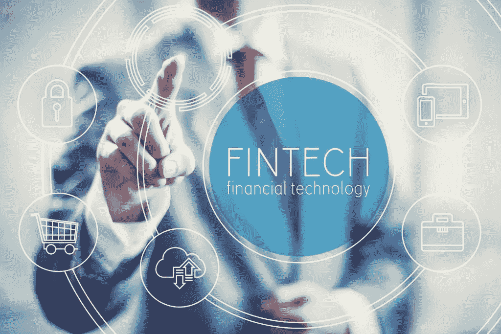
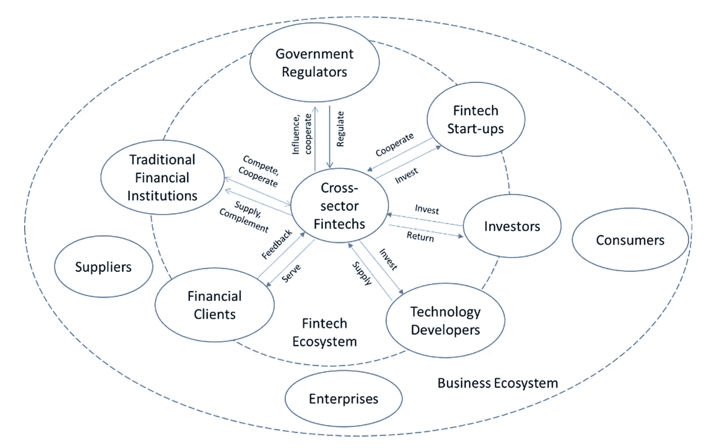
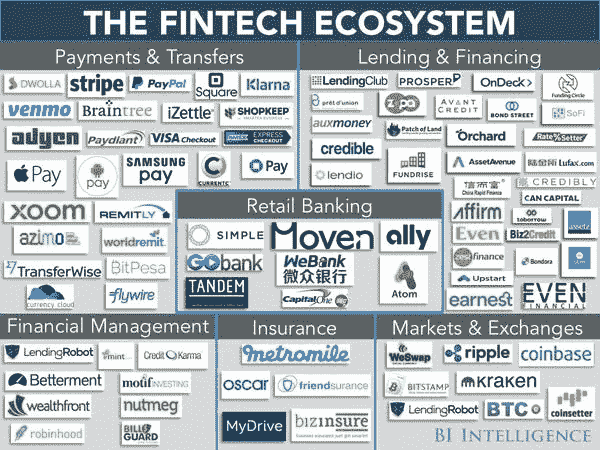
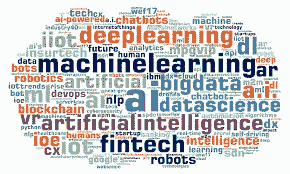
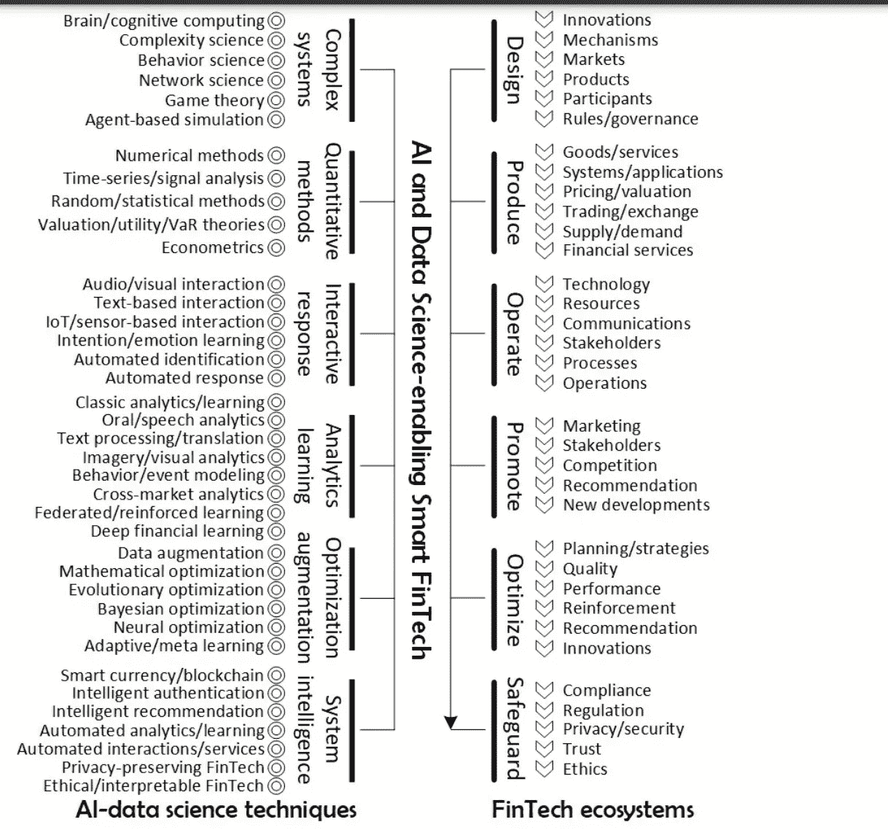

# FinTech 中的数据科学和人工智能概述，并举例说明如何使用。

> 原文：<https://medium.com/geekculture/a-summary-of-data-science-and-ai-in-fintech-and-how-it-is-used-53159bf64438?source=collection_archive---------7----------------------->

Financial Technology-FinTech

在过去的几年里，金融界越来越多地采用智能解决方案来应对行业不断变化的格局。金融与新一代数据科学和人工智能的互动越来越多。此外，金融科技(也称为 Fintech)仍然是金融行业中最常见的。它在推动现代经济、社会、技术和许多其他领域方面发挥着越来越重要的作用，这就是我们今天的主题。

**什么是金融科技——fin tech？**

Fintech 是“ [**金融科技**](https://en.wikipedia.org/wiki/Financial_technology) ”的手提箱，是新技术进步在金融行业产品和服务中的应用。它是指任何使用技术来增强或自动化金融服务和流程的企业。金融科技以多种方式服务于消费者和企业的利益，从移动银行和保险到加密货币和投资应用。它似乎有无穷无尽的应用。

> 根据 CB insights 的数据，有“41 家风险投资支持的金融科技独角兽，总价值为 1541 亿美元，”一个驱动因素是，许多传统银行是该技术的支持者和采纳者，积极投资、收购金融科技初创公司或与之合作，因为这样更容易给有数字思维的客户提供他们想要的东西，同时也推动行业向前发展并保持相关性。

**金融科技的演变**

金融科技(FinTech)一词可以追溯到 20 世纪 90 年代初，现在指的是整个金融服务领域快速发展的演变过程。当金融科技(fintech)在 21 世纪出现时，这个术语最初是指成熟金融机构的后端系统所采用的技术。自那以后，服务转向了更加面向客户，因此定义也更加面向客户。例如，当你使用 Paypal、Amazon Pay 或信用卡进行在线支付时，你作为消费者，电子商务公司以及银行都在使用 Fintech 进行交易。

Fintech Ecosystem-<<image from google>>

金融科技公司严重依赖 [**机器学习**](https://en.wikipedia.org/wiki/Machine_learning)[**人工** **智能 c**](https://en.wikipedia.org/wiki/Artificial_intelligence)**e**[**预测分析和数据科学**](https://en.wikipedia.org/wiki/Data_Science_and_Predictive_Analytics) 来简化财务决策，并提供卓越的解决方案。

Machine Learning in FinTech — <image from google>

**让我们看看数据科学和 AI (DSAI)在 Fintech 中是如何使用的。**

DSAI 是新一代 EcoFin(经济-金融)和 Fintech 的关键推动者。它正在重塑和重新定义 EcoFin 和 Fintech 的概念、目标、内容和任务。从根本上说，它改变了现代经济和金融企业与其参与者(包括消费者、市场和监管者)的运营、交易、互动和协作方式。数据科学和人工智能不仅加强了现有经济金融系统的效率、成本效益、客户体验、风险缓解、监管和安全，还创新了非凡、更加智能、安全和主动的产品和服务，形成了智能金融科技的新领域。

<image example of Data Science and AI being used in the financial and Business world>

**我们将看一些金融科技的例子，以及数据科学、人工智能和人工智能在每个例子中是如何使用的。**

1.  **保险产品**

保险业是数据科学的大用户。保险公司使用数据科学来管理风险并保持业务盈利。例如，一家保险公司的索赔部门使用数据科学算法来区分欺诈性交易和非欺诈性交易。他们还将数据科学和大数据用于其他目的，如信用评分、客户获取、营销、客户维系和设计新的保险产品。

**2。欺诈检测**

数据科学技术可用于识别金融交易中的欺诈行为。在金融科技时代之前，欺诈识别传统上是基于规则的，即手动标记交易。现在，我们可以利用大数据和数据分析技术，对大量在线欺诈交易进行利用和建模，帮助我们标记或预测未来交易中的欺诈行为。这可以通过使用数据科学和机器学习技术来实现。

**3。客户获取和保留算法**

银行和金融机构可以使用内部和外部客户数据来创建全面的客户资料，这些资料可用于定制客户体验和提供高度个性化的服务。例如，可以构建一个算法，根据客户的历史购买行为来预测客户想要购买哪些额外的产品或服务。这可以通过使用数据科学和机器学习技术 [**协同过滤**](https://en.wikipedia.org/wiki/Collaborative_filtering) **来完成。**

**4。风险分析**

像 FICO 这样的信用评级机构和信用评分公司依靠数据科学和机器学习来提供借款人的即时数据。例如，他们使用 [**逻辑回归**](https://en.wikipedia.org/wiki/Logistic_regression) 来预测客户的风险，并区分好的借款人和坏的借款人，同时考虑到个人，而不是刻板印象。

**5。机器人顾问**

机器人顾问是数字平台，为投资者提供算法驱动的自动化财务规划和投资服务。通常，该流程从通过在线调查收集有关客户的信息开始，在在线调查中，客户的资料包括其财务状况、风险能力、未来财务目标，这些数据用于处理适合客户需求和目标的财务建议。

**6。交易、加密货币和区块链**

能够预测市场走向是金融科技中数据科学、ML 和 AI 的一个想法。这一切都在于它能够通过旨在发现趋势和风险的算法运行大量数据，让客户、公司、银行和其他组织更早地对投资和购买风险有更明智的理解。

虽然这些是数据科学如何用于金融科技的一些例子，但它的应用有无限的可能性。

**总之，**

金融是最活跃、数据丰富、技术娴熟和智能的领域之一，数据科学和人工智能在金融领域的进步将进一步推动金融科技的智能未来。网上有几篇论文，涵盖了数据科学和人工智能技术的广泛领域和应用。如果你想更深入地了解这个话题，我还在下面放了一些链接。

**参考文献**

曹，杨强，俞:金融科技中的数据科学与人工智能:综述

[https://arxiv.org/abs/2007.12681v2](https://arxiv.org/abs/2007.12681v2)

金融科技-金融科技

[https://www.investopedia.com/terms/f/fintech.asp](https://www.investopedia.com/terms/f/fintech.asp)

道格拉斯·W·阿恩尔，雅诺斯·巴伯里斯，编辑。罗斯·p·巴克利(Ross P. Buckley):简而言之，FinTech 和 RegTech，以及沙盒中的未来

[https://www . cfaininstitute . org/research/foundation/2017/fin tech-and-reg tech-in-a-shell-and-the-future-in-a-sandbox](https://www.cfainstitute.org/research/foundation/2017/fintech-and-regtech-in-a-nutshell-and-the-future-in-a-sandbox)