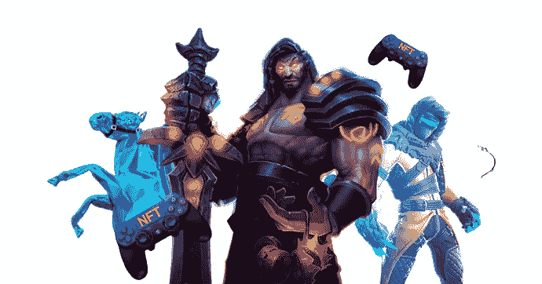
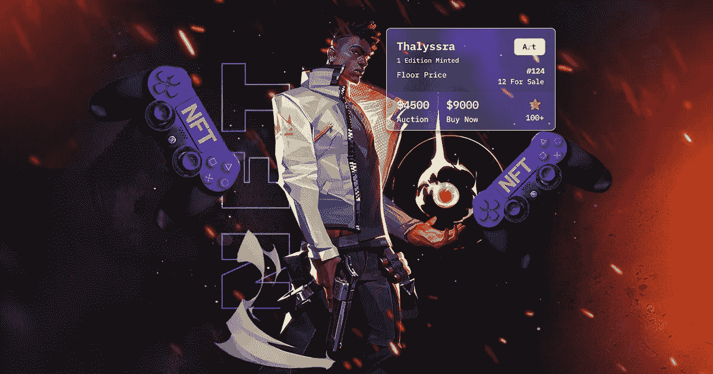
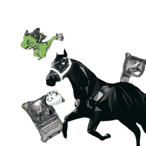

# NFT 游戏发展最高指南

> 原文：<https://medium.com/geekculture/a-supreme-guide-to-nft-gaming-development-28ce8b8de725?source=collection_archive---------12----------------------->

NfT gaming

近年来，不可替代令牌(NFT)一直是一个热门话题，并且仍然是一个值得八卦的话题。NFT 是令牌化的数字资产，可以交易或交换为数字货币或其他具有实时价值的资产。从蹒跚学步的孩子到老年人，游戏是一件吸引所有人的事情。当它是一个玩赚游戏或在游戏中赚取实时价值奖励时，它使玩家和游戏平台都受益。当 NFT 进入游戏行业时，它们成为了主流，在这篇博客中，让我们来看看 NFT 游戏及其发展。

# **NFT 博彩业发展**

游戏行业中的 NFTs 代表了被转化为不可替代代币的数字游戏。这种令牌化的资产包括游戏内资产、游戏内奖励等。游戏行业的主要目标受众是年轻一代，他们完成目标并在游戏中获得更高水平。玩赚游戏已经有一段时间了，但是在区块链的**游戏中加入 NFTs 对游戏平台和玩家都有很大的好处。**

**每一个 [**NFT 游戏平台**](https://www.appdupe.com/nft-gaming-development) 都会是独一无二的，并且一般都具备 NFT 的特质。另一方面，人们可以发展 NFT 游戏市场，使其具备市场应该具备的所有必要特征。同时创建游戏平台和 nft 市场使得平台更加成功，并且吸引游戏玩家在市场中从游戏中交易他们的游戏内资产。**

## **🔥**游戏中 NFTs 的主要特性****

*   ****已验证的交易:**游戏平台中 NFTs 的存在允许游戏玩家和开发者实时验证所进行的交易。**
*   ****保持透明:**用户在对数字游戏资产进行令牌化时受益匪浅。用户可以访问交易，因为该游戏平台是基于区块链技术开发的。**
*   ****稀有性:**NFT 因其独特性和稀有性而闻名，因为每个 NFT 都有其识别码和元数据。**
*   ****智能合约:**智能合约保证了一个去中心化的平台，不需要任何银行、公司这样的中介。这使得平台更加安全可靠，无需担心网络攻击或任何黑客活动。**
*   ****流动性:**快速的 NFT 可交易性导致了增强的流动性方法，因此通过这种方式，数字资产可以被快速交换。**

****

**NFT gaming platform**

## **🔥**NFT 游戏平台的额外津贴****

**NFT 进入游戏行业将永远惠及游戏玩家和平台所有者。这些游戏平台的一些主要优势包括**

*   **游戏玩家的利润:从游戏玩家的角度来看，NFT 沉迷游戏允许他们创建游戏内资产，并有多样化的赚钱机会，提供了更多的隐私和保护。**
*   **NFT 游戏平台为玩家提供了一个安全的环境，并允许他们查看自己的交易，他们可以获得巨大的投资回报。**
*   **游戏平台为每个用户提供量身定制的游戏资产和游戏角色。**
*   ****透明:**区块链科技 上的 [**游戏平台的透明性是其可用性高的主要原因。**](https://en.wikipedia.org/wiki/Blockchain_game)**
*   ****企业家的利润:**从企业家的角度来看，推出 NFT 游戏平台是他们进入区块链空间的绝佳机会。**
*   **这些游戏平台主要专注于创建稀缺的数字化代币，以便当对这些代币的需求较高时，代币的价值增加。**
*   ****赢取奖励:**平台所有者可以向有机会赢取奖励的玩家提供可能的机会。**
*   **这些游戏平台主要专注于创建稀缺的数字化代币，以便当对这些代币的需求较高时，代币的价值增加。**

****

**NFT games design**

## **🔥 **NFT 游戏平台开发****

**当创建一个 NFT 游戏平台，有几个要求涉及到这个过程。主要要求是**

*   **选择合适的平台保存收藏品。**
*   **选择一个区块链网络，检查您的所有开发要求**
*   **构建前端和后端程序。**
*   **与最好的开发人员一起寻找技术难题的解决方案。**
*   ****选择你的定位:**开发过程的第一步是策划你的想法，并决定平台的类型。游戏领域有不同的类型，如动作游戏、冒险游戏、街机游戏、赌场游戏、纸牌游戏、赛车游戏、在线棋盘游戏等。优先选择类型让你知道你希望你的平台设计是什么样的，你希望你的平台增加什么功能来吸引更多的观众。**
*   ****功能开发:**第二步，开发游戏平台的前端和后端。首先，应该确定平台将建立的区块链网络。以太坊区块链是最常用的 NFT 游戏领域。还有几个区块链像币安智能链，索拉纳，蔚蓝等。在选择游戏开发服务之前，选择区块链网络是很重要的。前端可以用 Javascript 或者 Typescript 来做，React，Vue，Angular 框架都可以考虑。后端语言可以是 Node.js。集成加密钱包很重要，使用著名的加密钱包有助于方便用户。**
*   ****测试和部署:**下一步是对开发的平台进行多次测试，以发现任何缺陷或错误。一旦平台通过测试，就可以在上发布。**

**Source: youtube/appdupe**

## **🔥**追思****

**我们都知道，NFT 正在金融科技领域掀起一场波澜。如今，它们也蔓延到了游戏行业。它在这一领域的存在让游戏玩家和企业家都受益匪浅。 [**NFT 游戏开发**](https://www.appdupe.com/nft-gaming-development) 对一个人来说是一个最赚钱的生意。如果他们觉得游戏不是他们的茶，他们也可以选择发展 NFT 游戏市场。**