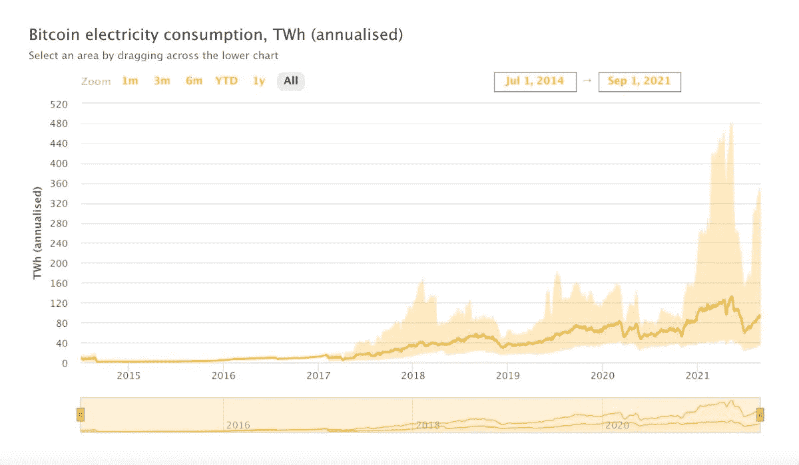
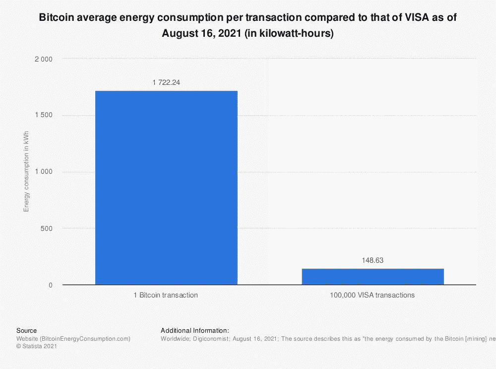

# 比特币采矿和可再生能源的共生关系？

> 原文：<https://medium.com/geekculture/a-symbiotic-bitcoin-mining-and-renewables-relationship-529f3d35e711?source=collection_archive---------19----------------------->

Can Bitcoin Mining & Renewables Forge a Symbiotic Relationship? Image Source: Shutterstock

近年来，围绕温室气体的贡献者进行了大量的讨论。许多人认为比特币采矿对环境有害。为什么这个讨论是必要的？在与可再生能源建立互利关系的同时，有可能使采矿变得绿色吗？

> “气候变化是广泛的、迅速的和加剧的，一些趋势现在是不可逆转的，至少在目前的时间框架内。”——[政府间气候变化专门委员会(IPCC)报告，2021 年 8 月](https://news.un.org/en/story/2021/08/1097362)。

该报告给出了无可辩驳的证据，证明人类引发的气候变化已经在制造不可逆转的、前所未见的极端天气。联合国秘书长安东尼奥·古特雷斯(António Guterres)对该报告的发现做出回应，警告说，我们“非常接近”达到比工业化前全球变暖水平高出 1.5 度的关口。他强调，立即和持续减少二氧化碳(CO2)和其他温室气体(GHG)的排放对于在 20 至 30 年内稳定全球气温至关重要。

在研究二氧化碳高排放的原因时，一个来源经常被提及——比特币采矿。中国的采矿业在[激增，廉价的煤炭主要用于为资源密集型采矿设备提供动力，这是秘密采矿臭名昭著的原因。](https://cbeci.org/mining_map)

# 为什么采矿要消耗这么多电？

“挖掘”是比特币网络用来确定哪些记录进入“区块”的机制。几台配有强大的 [ASIC 处理器](https://www.investopedia.com/terms/a/asic.asp)的机器竞相生成一个独特的加密散列，该散列具有预定数量的前导零。然而，这些“哈希生成机器”需要大量的电力来运行。

准确确定用于采矿的能源并不容易，因为很难确定网络中有多少台机器在积极采矿。通常，网络的总计算能力或矿工的奖励被用来估计能量消耗。根据一些估计，比特币开采目前每年消耗超过 92 万亿瓦时的电力。比特币消耗了全球生产的总电量的 [0.41%。](https://cbeci.org/cbeci/comparisons)

Image Source:​​ [Cambridge Bitcoin Electricity Consumption Index](https://cbeci.org/)

另一个问题是每笔交易的平均用电量。尽管总能耗约占全球能耗的 20%，但每笔交易所需的[比](https://www.researchgate.net/publication/331742749_Renewable_Energy_Will_Not_Solve_Bitcoin's_Sustainability_Problem)多 1000 倍。

Image Source: [Statista](https://www.statista.com/statistics/881541/bitcoin-energy-consumption-transaction-comparison-visa/)

竞争的矿工越多，杂凑率难度越高，虽然足以让一些矿工退出游戏。矿工越少，杂凑率越低，从而降低能耗。

然而，[能源消耗本身并不能为比特币的碳排放提供可靠的证据。来自可再生能源的能源供应占多大比例？哪种能源对采矿的贡献最大？很难找到这些问题的准确答案，因为今天的大多数消费报告都是自愿的。根据估计，比特币开采中可再生能源的使用量从 39%到 73%不等。](https://hbr.org/2021/05/how-much-energy-does-bitcoin-actually-consume)

# 使用可再生能源为比特币采矿提供动力

然而，今天，环境保护主义者和比特币赞助者比以往任何时候都更强烈地呼吁转向低碳排放的能源选择，而不是排放有害气体的煤炭。最近中国对[的打击以及埃隆·马斯克(Elon Musk)收回为特斯拉支付比特币的行为](https://www.cnbc.com/2021/06/30/china-musk-raise-alarm-on-bitcoin-energy-use-how-to-make-it-greener.html)，是化石燃料电力被证明是加密技术的一个致命弱点的几个例子。

那么，采矿社区有什么选择呢？转换到更绿色的能源供应会花费多少？

## 水

比特币采矿最常用的可再生电力来源是水。水力发电是所有可再生能源中最可靠的，不会产生任何 GHG 排放。因为我们可以预测它的可用性，所以有可能在需要时生产更多的电力，而在需求较少时保持低产量。

## 地球

其次，地球内部的热量是另一个可靠的能源，因为它将持续到地球存在。地热热泵是高效的，因为它们通常比用于加热和冷却目的的传统能源少使用 20%至 30%的电力。

水力发电厂、地热发电厂的维护和运营成本较低，从长远来看，它们是经济有效的选择。[萨尔瓦多正在探索比特币挖矿的这一选择](https://www.npr.org/2021/06/11/1005231250/el-salvador-plans-to-use-electricity-generated-from-volcanoes-to-mine-bitcoin)。

## 生物量

其次，生物质是碳中性能源。这里释放的碳量与动植物一生中吸收的碳量相当。此外，垃圾、木材和粪肥，这些最常用的生物质能源，一直在生产。

## 阳光和风

最后，我们来看看太阳能和风能发电。这些零碳能源是真正的可再生能源，运营成本低。它们随时可用，取之不尽。

## 但是，代价是什么呢？

但是，使用可再生能源有其自身的困难。首先，由于太阳能和风能的间歇性质，利用太阳能和风能运行采矿设备是不可能的。降雨也是季节性的，因此一年到头都不能用水发电。此外，多变的气候变化使得预测水的可利用性变得困难。

其次，建立一个水力发电厂或地热发电厂是昂贵的。费用可能高达数百万美元。就生物质工厂而言，收集、运输和储存所需的木材、肥料和垃圾需要额外的成本。

这些工厂所需的空间也很大，这使得很难将这些能源建立在最需要它们的地方，例如拥挤的城市。因此，有必要投资于运输所产生的电力并覆盖长距离的手段。这大大增加了成本。

对于昼夜不停地运行 ASIC 机器以获取最大利润的矿工来说，寻找最便宜、最稳定的电力形式至关重要。

# 比特币开采刺激可持续能源利用

解决间歇性问题是广泛采用可再生能源的关键，尤其是太阳能和风能。它需要增加能量存储和提高传输容量以达到更长的距离，所有这些都需要投入更多的资金。但是，持续需求的缺乏阻碍了人们进行大规模投资。他们担心回报会更少且不可预测。

一些研究发现比特币挖掘可能是持续需求的来源。如果比特币矿工创造了可靠和持续的能源需求，它将鼓励能源生产商生产和储存更多的可再生能源。

比特币采矿的另一个值得注意的壮举是使用石油钻井平台的副产品天然气为其采矿单位提供动力，减少了排入大气的气体。据估计，总共可以从全球天然气燃烧中回收 [688 万亿瓦时的能量](https://cbeci.org/cbeci/comparisons)，足以为比特币网络供电 8.4 倍。此外，将采矿场建在离石油钻塔更近的地方可以降低运输成本。因此，供应的电力更便宜。

# 建立共生关系就足够了吗？

尽管如此，一些人认为比特币采矿对环境的影响超出了向可再生能源的过渡。他们认为[采矿设备产生的电子垃圾最终被填埋后会严重影响环境](https://www.researchgate.net/publication/331742749_Renewable_Energy_Will_Not_Solve_Bitcoin's_Sustainability_Problem)。尽管如此，开始解决气候变化的每一个原因是至关重要的。如果改用可再生能源开采比特币能有助于更绿色的未来，那就有必要继续前进。类似地，如果比特币挖矿有助于可再生能源的扩散，那就值得一试。互利的共生关系值得一试。