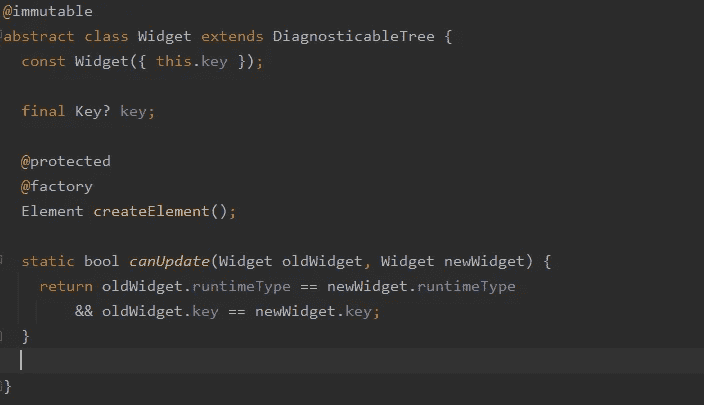
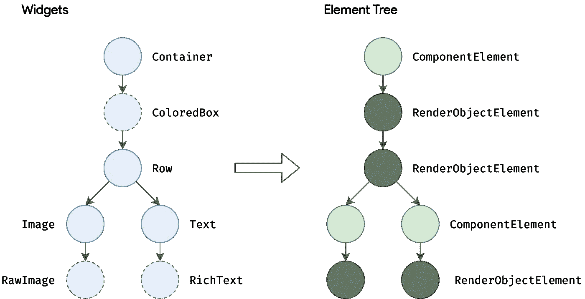
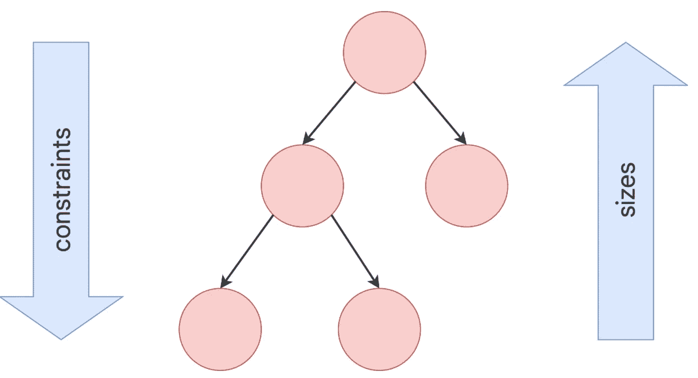

# 三棵树的故事

> 原文：<https://medium.com/geekculture/a-tale-of-three-flutter-trees-886419bc4b7b?source=collection_archive---------11----------------------->

Photo by [Zoltan Tasi](https://unsplash.com/@zoltantasi?utm_source=medium&utm_medium=referral) on [Unsplash](https://unsplash.com?utm_source=medium&utm_medium=referral)

今年早些时候，确切地说是 3 月 3 日，Flutter 终于发布了版本 2。他们不仅宣布 Web 终于稳定并增加了对可折叠手机的支持，而且 Flutter 现在是多平台的(Android、iOS、Linux、macOS、Web 和 Windows)。四个月后，Android 宣布他们新的“构建原生 UI 的现代工具包”Jetpack Compose 现已稳定。React 仍然很强大，SwiftUI 可能是背景中有趣的东西。随着移动开发领域的所有这些变化和进步，很明显我们不可避免地将会或者已经存在于声明式 UI 的时代。

因此，我认为只有了解这些框架/工具包如何在幕后运作才是合适的。所以我将尝试给出一个关于 Flutter 架构如何工作的简要的高层次解释，至少在渲染层是这样的。Flutter 使用三棵树协同工作，而不是一棵树来分离关注点。让我们来看看这三棵树。

# **微件树**

如果你看过 Flutter 或者和 Flutter 爱好者交谈过，你可能会听到“一切都是小部件”这句话出现一两次。他们通常指的是这棵树。实际上，小部件树并不是最重要的。它实际上只负责提供小部件配置。

Widget class

如果我们看一下这个小部件类(去掉了所有的诊断代码),我们可以看到这个类实际上只做了两件事。Widget 类创建了一个新元素(这是我们要看的下一棵树)。在更改后遍历小部件树时，它使用 canUpdate 来查看是否需要替换当前的小部件，或者是否可以简单地更新元素。另一件需要注意的事情是@immutable 注释，这意味着如果窗口小部件树是唯一的树，那么 Flutter 将不得不在每次发生更改时重新创建窗口小部件，这可能会有效，但远不如 Flutter 当前的工作效率。感谢元素树，事实并非如此

# 元素树

元素树是完成大部分繁重工作的树。元素负责小部件的生命周期。这就是 Flutter 效率的来源，这棵树确保了尽可能多的部件树是可重用的。小部件本身不知道树中的任何其他小部件。所以元素树负责管理父子关系和移动小部件(reparent)。元素树在很高的层次上与小部件树有一对一的关系。所以就像你得到无状态和有状态的部件一样，你得到无状态元素和有状态元素。无状态元素不需要像有状态元素那样做很多工作，因为它们不需要监听变化。

# 渲染树

渲染树包含所有渲染对象。Render 对象拥有将小部件绘制到屏幕上所需的所有必要信息。所以与元素树不同，没有 1 对 1 的窗口小部件树副本，因为不是所有的窗口小部件都有渲染对象，例如 Text 窗口小部件和 RichText 窗口小部件都使用 RenderParagraph 渲染对象。渲染树是从元素树构建的，因此它也受益于仅在完全必要时更新部分。

# 翻译

在 Flutter 中，除了关于如何访问孩子的指令之外，父窗口部件没有太多关于孩子的信息。那么，小部件是如何知道如何给自己上色的呢？

Flutter 以深度优先遍历的方式遍历渲染树。然后，父窗口小部件将大小约束传递给其子窗口小部件，子窗口用它们的大小来响应。一旦所有东西都有了尺寸，就可以开始绘画了。

作为其发动机颤振的一部分，提供了 Skia 的副本，负责做所有的繁重工作。提供自己的 Skia 副本消除了对 Android 或 iOS 渲染引擎的依赖，这意味着他们可以随心所欲地发布更新。