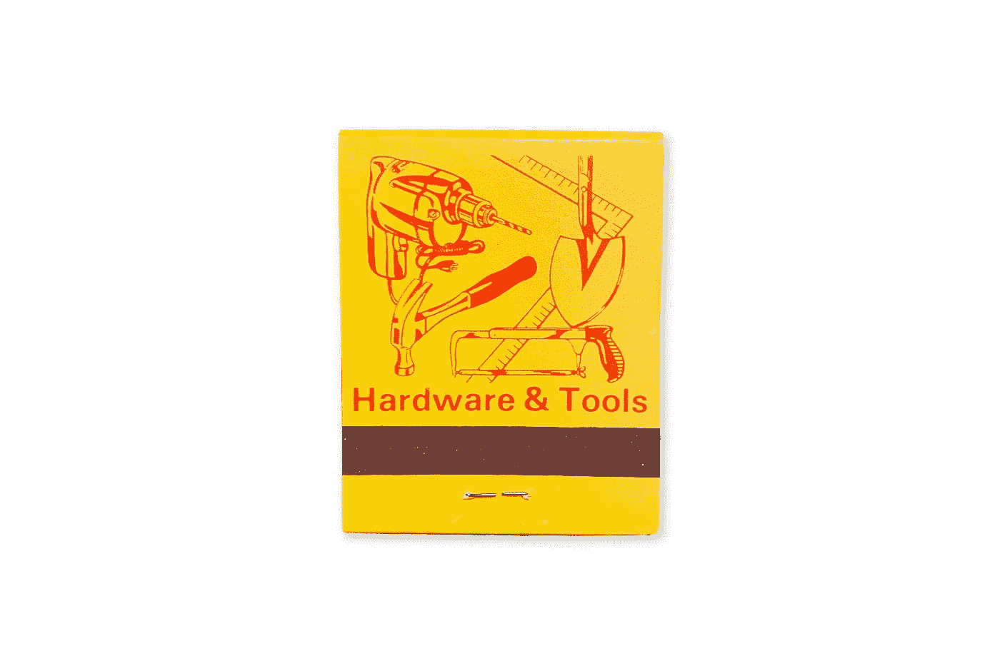
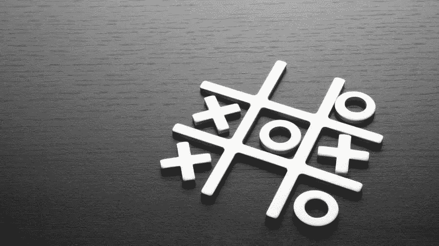

# 一个井字游戏你不可能赢两次

> 原文：<https://medium.com/geekculture/a-tic-tac-toe-ai-you-cant-beat-twice-427df852d197?source=collection_archive---------17----------------------->

当你想到机器学习时，你可能会想到强大的处理器和复杂的算法。但是机器学习概念可以采取比这简单得多的形式。

**火柴盒可教育零交叉引擎**

Photo by [Cris DiNoto](https://unsplash.com/@crisdinoto?utm_source=medium&utm_medium=referral) on [Unsplash](https://unsplash.com?utm_source=medium&utm_medium=referral)

1961 年，英国[人工智能](https://en.wikipedia.org/wiki/Artificial_intelligence)研究员唐纳德·米歇尔开发了一种可教育的引擎。只有弹珠和火柴盒！这是威胁，有史以来最好的井字游戏玩家。

Michie 使用的火柴盒每一个都代表了井字游戏中一种可能的布局。当计算机第一次玩游戏时，它会根据当前布局随机选择移动。随着它玩的游戏越来越多，通过强化循环，它取消了导致游戏失败的策略，并补充了导致游戏获胜的策略。

# TicTacToe AI

TicTacToe AI 是一款受米基的威胁启发的网络应用。通过强化学习方法，当 AI 输掉一局时，它会取消最后一步棋。

当 AI 在一种情况下找不到可能的走法时，就意味着它能下的每一步棋都是输棋。在这种情况下，人工智能将取消它以前的移动，防止移动的死胡同。

在开始的时候有大约 7500 种可能的走法，在足够的时间和输给人类很多游戏之后，AI 最终会成为一个更好的玩家，不会输。

所以…如果你想玩，想教 AI 怎么输；为了教它如何获胜，请访问[https://tictactoe-ai-coskntkk . vercel . app](https://tictactoe-ai-coskntkk.vercel.app/)并尝试一下！