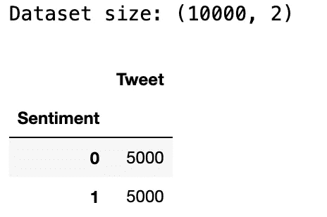
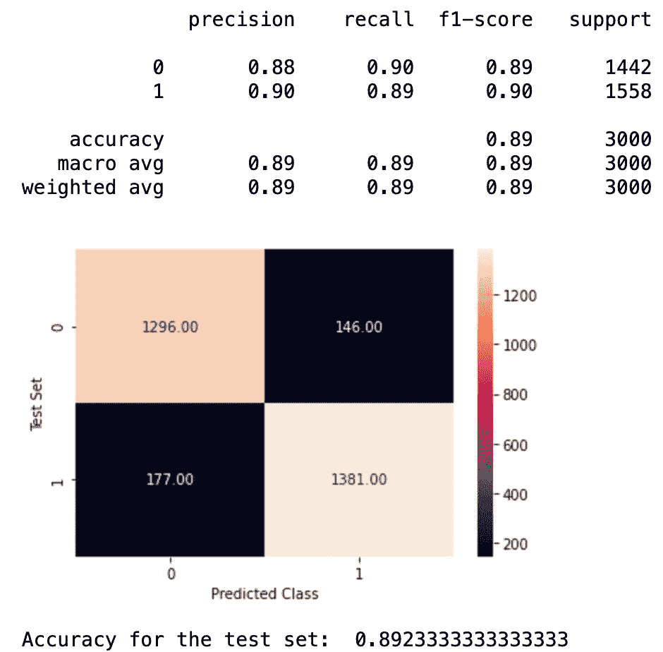

# 使用自然语言工具包(NLTK)在 Python 3 中执行情感分析的教程

> 原文：<https://medium.com/geekculture/a-tutorial-on-performing-sentiment-analysis-in-python-3-using-the-natural-language-toolkit-nltk-40e5b35ab440?source=collection_archive---------3----------------------->

## 本教程将演示如何使用 Python3 的 NLTK 库检测 twitter 数据中的积极或消极情绪。


Twitter Sentiment Analysis

**情感分析简介:**

**情感分析**是一种**自然语言处理(NLP)** 技术，它分析一篇文章以确定它携带的情感基调——可能是积极的、消极的或中性的。它本质上是一种工具，可以从非结构化数据中获得意义，并产生一些见解。这样，它在社交媒体监控中变得非常有用，因为它允许我们获得特定主题背后更广泛的公众意见的概览。同样，它让品牌了解什么让客户高兴或沮丧，以便他们可以定制产品和服务来满足客户的需求。

**如何在 Python 3 中进行情感分析:**

本教程将演示如何对推文进行情感分析，以确定它们是正面情感还是负面情感。我们将利用 **Python 的 NLTK(自然语言工具包)库**，这是一个在文本数据分析中非常常用的库。

> 请注意，以下代码是在 Jupyter 笔记本上写的。

首先，首先在终端安装必要的软件包。

```
% pip3 install emoji
% pip3 install nltk==3.3 
% pip3 install pandas 
% pip3 install seaborn
% pip3 install sklearn
```

整个过程可以分为四个部分:

1.  准备用于分析的数据
2.  清理数据
3.  数据的标准化
4.  构建和评估模型

# **准备数据-**

打开一个新的笔记本，作为第一步，导入 nltk 库。

```
import nltk
```

从 nltk 下载“twitter_samples”包，我们将在这里构建样本 tweets 数据集。

```
nltk.download(‘twitter_samples’)# Datasets to train and test the model
from nltk.corpus import twitter_samplespositive_tweets = twitter_samples.strings('positive_tweets.json')
negative_tweets = twitter_samples.strings('negative_tweets.json')
```

我们现在将这些正面和负面的推文合并成一个熊猫数据帧，以使数据预处理更容易。

```
import pandas as pd# Create a dataframe from positive tweets
df = pd.DataFrame(positive_tweets, columns=[‘Tweet’])# Add a column to dataframe for positive sentiment value 1
df[‘Sentiment’] = 1# Create a temporary dataframe for negative tweets
temp_df = pd.DataFrame(negative_tweets, columns=[‘Tweet’])# Add a column to temporary dataframe for negative sentiment value 0
temp_df[‘Sentiment’] = 0# Combe positive and negative tweets in one single dataframe
df = df.append(temp_df, ignore_index=True)
df = df.sample(frac = 1) 
df.reset_index(drop=True, inplace=True)
```

我们得到的结果是一个有 10，000 行的数据帧(5，000 行是正面推文，5，000 行是负面推文)。正面和负面的推文将被随机化。

dataframe 将有两列——Tweet 和 perspective。这里，情绪将是一个二进制值——0 表示负面情绪，1 表示正面情绪。

```
# Displaying shape of dataset
print(‘Dataset size:’,df.shape)
df.groupby(“Sentiment”).count()
```



Shape of dataset

# 清理数据-

现在我们已经准备好了数据，我们可以开始清理这些数据，为训练模型做好准备。我们说数据不干净是因为它可能使用俚语或缩写，它可能有表情符号和微笑，它可能有许多对文本没有太大意义的“停用词”。我们将详细阐述每种情况，并演示如何从数据中消除它们。

让我们从把所有的单词转换成小写的**开始。**

你可能会问为什么我们需要将数据转换成小写。假设我们有下面的文本-

这是个度假的好地方。我推荐这个地方。”

如果我们要对上面的文本进行“矢量化”，而不先转换成小写字母，“T0”这个“T1”和“T2”这个“T3”会被认为是两个不同的单词。此外，由于停用词列表中的所有单词都是小写的，如果原始文本中的单词不是小写的，那么您可能会在文本中看到混合大小写或大写的停用词。然而，有些人可能会选择保留大写的文本，以便不丢失所传达的情感。

使用下面的代码将 dataframe 中的所有 tweets 转换为小写。

```
# Converting all tweets to lowercase
def convert_to_lowercase(tweet):
 return tweet.lower()df[‘Tweet’] = df[‘Tweet’].apply(lambda x: convert_to_lowercase(x))
```

下一步我们将做的是**从推文中删除所有的****URL**，因为它们没有增加任何意义，也无助于发现情绪。为此，编写一个函数，用 URL 的正则表达式匹配文本。

```
# Removing any urls from tweetsimport redef remove_urls(tweet):
 tweet = re.sub(‘http[s]?://(?:[a-zA-Z]|[0–9]|[$-_@.&+#]|[!*\(\),]|’\
 ‘(?:%[0–9a-fA-F][0–9a-fA-F]))+’,’’, tweet)

 return tweetdf[‘tweet_no_urls’] = df[‘Tweet’].apply(lambda x: remove_urls(x))
```

俚语和缩略语在社交媒体上非常常见。您可以选择将这些缩写转换成它们的完整形式，以从中提取更多的含义。为此，您需要一个包含常用缩写及其完整形式(用制表符分隔)的 CSV 文件。将下面代码中的<CSV 文件路径>替换为您的 CSV 文件路径。

```
# Removing all abbreviationsimport csvdef remove_abbreviations(tweet):
 tokens = tweet.split(“ “)
 j = 0
 for token in tokens:
 file_name = “<path to CSV file>”
 with open(file_name, “r”) as fh:
 reader = csv.reader(fh)
 for row in reader:
 if row[0] == token:
 tokens[j] = row[1]
 fh.close()
 j = j + 1

 return “ “.join(tokens)df[‘corrected_tweet’] = df[‘tweet_no_urls’].apply(lambda x: remove_abbreviations(x))
```

接下来，我们将处理**微笑和表情符号。这些在表达情感方面很重要，因此将它们从文本中完全删除是不明智的。最好是用他们所传达的真实情感来代替它们。**

为了处理微笑，我们将加载一个常见微笑的 Python 字典。对于表情符号，我们将使用 Python 包“表情符号”及其方法“demojize”。在这样做的时候，我们将把所有出现的微笑和表情符号替换为它们的实际含义。

```
import emoji# Loading dictionary of smiliesdef load_dict_smileys():

 return {
 “:-)”: “smiley”,
 “:)”: “smiley”,
 “:D”: “smiley”,
 “xD”: “smiley”,
 “:’)”: “smiley”,
 “:’D”: “smiley”,
 “:3”: “smiley”,
 “:]”: “smiley”,
 “:^)”: “smiley”,
 “:-]”: “smiley”,
 “:-3”: “smiley”,
 “:->”: “smiley”,
 “:))”: “smiley”,
 “8-)”: “cool”,
 “8)”: “cool”,
 “8-D”: “cool”,
 “B)”: “cool”,
 “BD”: “cool”,
 “:-}”: “smiley”,
 “:>”: “smiley”,
 “:}”: “smiley”,
 “:o)”: “smiley”,
 “:c)”: “smiley”,
 “=)”: “smiley”,
 “=D”: “smiley”,
 “=]”: “smiley”,
 “:-D”: “smiley”,
 “XD”: “smiley”,
 “:o”: “surprised”,
 “:O”: “surprised”,
 “=o”: “surprised”,
 “=O”: “surprised”,
 “:0”: “surprised”,
 “:(“: “sad”,
 “:C”: “sad”,
 “:c”: “sad”,
 “=(“: “sad”,
 “=c”: “sad”,
 “=C”: “sad”,
 “:-(“: “sad”,
 “:-c”: “sad”,
 “:-C”: “sad”,
 “:-<”: “sad”,
 “:<”: “sad”,
 “:[“: “sad”,
 “:{“: “sad”,
 “:’(“: “crying”,
 “:P”: “playful”,
 “:p”: “playful”,
 “xP”: “playful”,
 “XP”: “playful”,
 “=P”: “playful”,
 “=p”: “playful”,
 “xp”: “playful”,
 “xb”: “playful”,
 “❤”: “love”,
 “</3”: “sad”,
 “:/”: “worried”,
 “:-/”: “worried”
 }# Removing smilies and emojis
def remove_emoticons(tweet):
 smilies = load_dict_smileys()
 split_tweet = tweet.split(“ “)
 for key,val in smilies.items():
 if key in tweet:
 new_tweet = tweet.replace(key, val)
 tweet = new_tweet
 tweet = emoji.demojize(tweet)
 tweet = ‘ ‘.join(tweet.split())return tweetdf[‘tweet_no_emoji’] = df[‘corrected_tweet’].apply(lambda x: remove_emoticons(x))
```

接下来，我们需要**去除 twitter 句柄、标点符号、数字和特殊字符形式的任何额外干扰**。它们没有增加探测情绪的价值。

```
import string# Removing twitter handles, punctuation, extra spaces, numbers and special characters
def remove_noise(tweet):
 tweet = re.sub(“(@[A-Za-z0–9_]+)”,””, tweet)
 tweet = “”.join([char if char not in string.punctuation else “ “ for char in tweet])
 tweet = re.sub(‘ +’, ‘ ‘, tweet) 
 tweet = re.sub(“[0–9]+”, “”, tweet)
 tweet = re.sub(“[^A-Za-z0–9_. ]+”,””,tweet)

 return tweetdf[‘cleaned_tweet’] = df[‘tweet_no_emoji’].apply(lambda x: remove_noise(x))
```

作为清理文本的最后一步，我们需要**从文本中移除所有停用词**。停用词是任何自然语言中最常见的词。出于分析文本数据和构建 NLP 模型的目的，这些停用词不会给文档的含义增加太多价值。然而，在我们的用例中，负面停用词在检测负面情绪时非常重要。因此，我们可以在将停用词应用到文本之前编辑它。

```
nltk.download('punkt')
nltk.download(‘stopwords’)from nltk.corpus import stopwords# Loading stop words and removing negative stop words from the list
stop_words = stopwords.words(‘english’)words_to_keep = [‘don’, “don’t”, ‘ain’, ‘aren’, “aren’t”, ‘couldn’, “couldn’t”, ‘didn’, “didn’t”, ‘doesn’, “doesn’t”, ‘hadn’, “hadn’t”, ‘hasn’, “hasn’t”, ‘haven’, “haven’t”, ‘isn’, “isn’t”, ‘ma’, ‘mightn’, “mightn’t”, ‘mustn’, “mustn’t”, ‘needn’, “needn’t”, ‘shan’, “shan’t”, ‘no’, ‘nor’, ‘not’, ‘shouldn’, “shouldn’t”, ‘wasn’, “wasn’t”, ‘weren’, “weren’t”, ‘won’, “won’t”, ‘wouldn’, “wouldn’t”]
my_stop_words = stop_wordsfor word in words_to_keep:
 my_stop_words.remove(word)
```

在删除停用词之前，需要对文本进行**标记化**或分割成称为标记的更小部分。**标记**是文本中作为一个单元的一系列字符。

```
from nltk.tokenize import word_tokenize# Removing stop words from the tweet
def remove_stop_words(tweet):
 tokens = word_tokenize(tweet)
 tweet_with_no_stop_words = [token for token in tokens if not token in my_stop_words]
 reformed_tweet = ‘ ‘.join(tweet_with_no_stop_words)

 return reformed_tweetdf[‘tweet_no_stop’] = df[‘cleaned_tweet’].apply(lambda x: remove_stop_words(x))
```

至此，我们完成了数据清理阶段！

# 数据的标准化-

下一节将涵盖文本的**规范化**。NLP 中的规范化是将单词转换成其**规范形式**的过程。它有助于将意思相同但形式不同的单词组合在一起。如果没有规范化，“clean”、“cleans”和“cleaning”将被视为不同的单词，即使您可能希望它们被视为同一个单词。

两种流行的规范化技术是*词干*和*词汇化。*词干化和词尾化都会生成词根形式的词形变化。区别在于词干可能不是一个真实的单词，而 lemma 是一个真实的语言单词。

例如，考虑“哭”这个词。词干化会将单词简化为“cri ”,这在英语中并不是一个真正的单词，而词汇化会将单词简化为“cry”。

在这个项目中，我们将利用**术语化**。

现在，单词形式可能是相同的，但在上下文或语义上是不同的。为了使词汇化更好并依赖于上下文，我们需要找出 **POS(词性)标签**并将其传递给词汇化器。我们将首先找出每个标记的 POS 标签，然后使用 lemmatizer 根据标签对标记进行 lemmatize。

```
nltk.download(‘wordnet’)
nltk.download(‘averaged_perceptron_tagger’)# Lemmatize with POS Tag
from nltk.corpus import wordnet
from nltk.stem import WordNetLemmatizerdef get_wordnet_pos(word):
 “””Map POS tag to first character lemmatize() accepts”””
 tag = nltk.pos_tag([word])[0][1][0].upper()
 tag_dict = {“J”: wordnet.ADJ,
 “N”: wordnet.NOUN,
 “V”: wordnet.VERB,
 “R”: wordnet.ADV}return tag_dict.get(tag, wordnet.NOUN)# Lemmatization
lemmatizer = WordNetLemmatizer()def lemmatize_sentence(tweet):
 token_words = word_tokenize(tweet)
 lemmatized_tweet = []
 for word in token_words:
 lemmatized_tweet.append(lemmatizer.lemmatize(word, get_wordnet_pos(word)))
 lemmatized_tweet.append(“ “)

 return “”.join(lemmatized_tweet)df[‘lemmatized_text’] = df[‘tweet_no_stop’].apply(lambda x: lemmatize_sentence(x))
```

# 建立模型-

当我们在数据科学中遇到任何模型(即线性回归、逻辑回归、决策树或神经网络)时，它们只能接受**数字输入**。那么，我们如何将现有的文本转换成计算机能够理解的数字数据呢？**计数矢量器**是 Python 中的 scikit-learn 库提供的一个很棒的工具。它用于根据每个单词在整个文本中出现的频率(计数)将给定文本转换为向量。

我们传递给 CountVectorizer 的一些参数如下:

**min_df:** 在构建词汇表时，忽略文档频率严格低于给定阈值的术语。

**max_features:** 如果不是没有，则构建一个词汇表，该词汇表只考虑按术语频率在语料库中排序的顶级 max_features。

```
from sklearn.feature_extraction.text import CountVectorizercount_vectorizer = CountVectorizer(max_features=1000, min_df=8)
feature_vector = count_vectorizer.fit(df[‘lemmatized_text’])# To get a list of all unique words
features = feature_vector.get_feature_names()# To get a sparse matrix of the words in the text
df_features = count_vectorizer.transform(df[“lemmatized_text”]) 
```

如果你真的想看到每个单词的计数，我们可以用所有单词的计数创建另一个数据帧。

```
df_sparse = pd.DataFrame(df_features.todense(), columns=features)# Find number of times each word is seen
feature_counts = np.sum(df_sparse.values, axis=0)
feature_counts_df = pd.DataFrame(dict(features=features,
 counts=feature_counts))
feature_counts_df.sort_values(‘counts’, ascending=False)[0:15]
```

现在终于到了建立模型的时候了！我们将使用高斯朴素贝叶斯，这是一种流行的文本分类算法。尽管它相当简单，但它的表现往往和复杂得多的解决方案一样好。

该模型应用贝叶斯定理，并天真地假设不同特征之间没有关系。根据贝叶斯定理:

> 后验=可能性*命题/证据
> 
> 或者
> 
> P(A|B) = P(B|A) * P(A)/P(B)

在拟合之前，将数据集分成**训练和测试子集**。

```
from sklearn.model_selection import train_test_split
from sklearn.naive_bayes import GaussianNBX_train, X_test, y_train, y_test = train_test_split(df_features.toarray(),
 df[“Sentiment”],
 test_size=0.3,
 random_state=42)nb_clf = GaussianNB()nb_clf.fit(X_train, y_train)y_pred = nb_clf.predict(X_test)
```

我们使用来自 **sklearn** 库的**度量**模块来评估预测。

```
import matplotlib.pyplot as plt
import seaborn as sns
from sklearn.metrics import accuracy_score, classification_report, confusion_matrixprint(classification_report(y_test, y_pred))cm = confusion_matrix(y_test, y_pred)sns.heatmap(cm, annot=True, fmt=’.2f’)
plt.xlabel(“Predicted Class”)
plt.ylabel(“Test Set”)
plt.show()print("Accuracy for the test set: ", accuracy_score(y_test, y_pred))
```



Metrics for evaluating the model

**结论:**

本教程向您介绍了使用 Python 3 中的 nltk 库的基本情感分析模型。首先，您从 nltk 的样本 tweets 构建了一个数据集。然后，您对 tweets 进行预处理，然后对单词进行归一化。最后，您建立了一个模型，将推文与特定的情绪联系起来。

监督学习模型的好坏取决于它的训练数据。为了进一步加强模型，您可以收集更大更好的数据集。你也可以考虑增加更多的类别，比如兴奋和愤怒。在本教程中，通过构建一个基本的模型，您仅仅触及了皮毛。