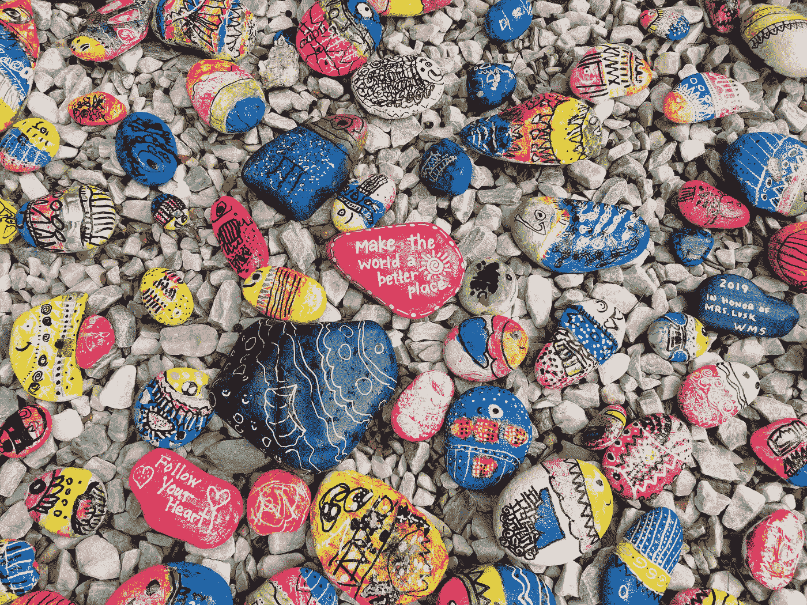
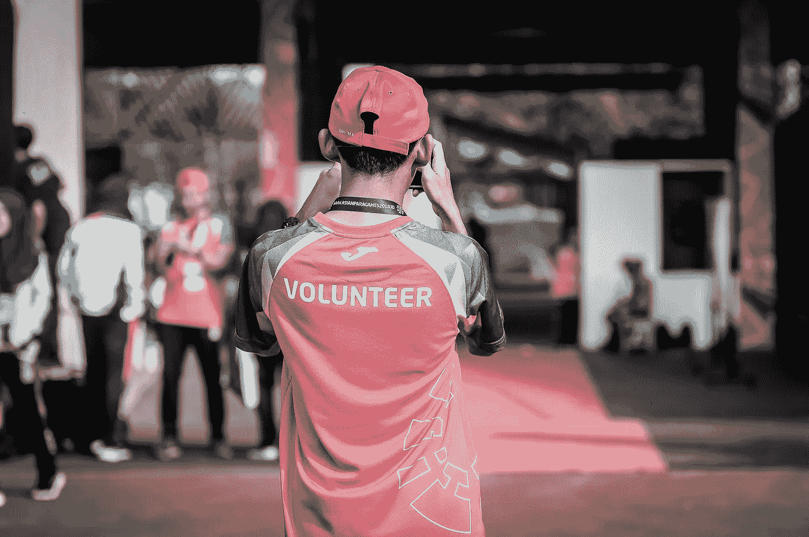
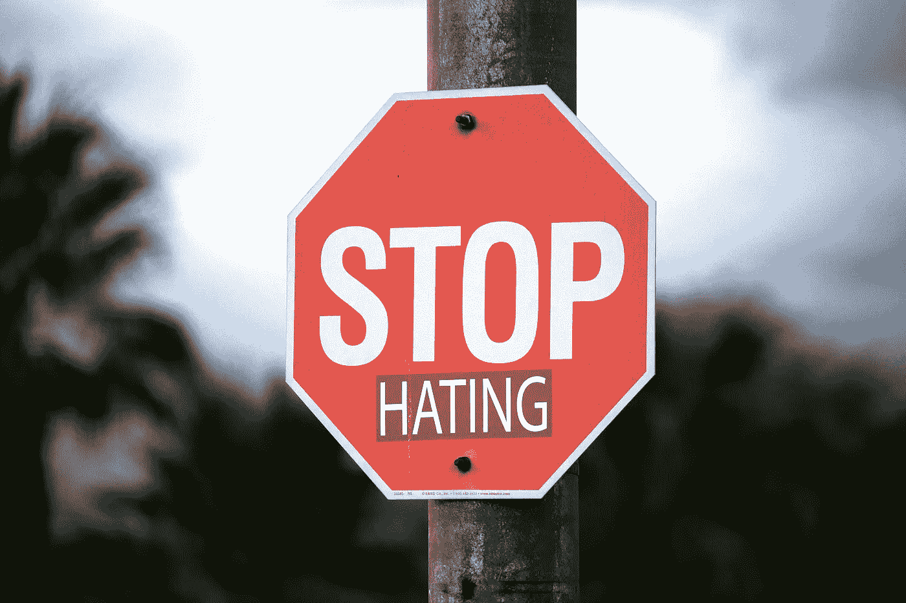
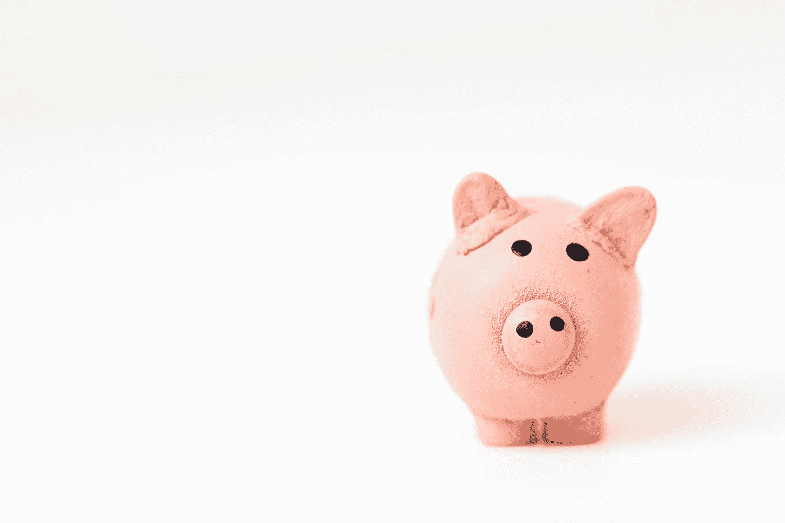

# 价值观系统对你和你的职业都有好处:原因如下

> 原文：<https://medium.com/geekculture/a-values-system-is-good-for-you-and-your-career-heres-why-56d298154842?source=collection_archive---------23----------------------->

## 实现个人满意的建议

Photo by [Third Serving](https://unsplash.com/@thirdserving?utm_source=unsplash&utm_medium=referral&utm_content=creditCopyText) on [Unsplash](https://unsplash.com/s/photos/kindness?utm_source=unsplash&utm_medium=referral&utm_content=creditCopyText)

# 为什么是个人价值观系统？

个人价值观体系是一套你珍视的基本价值观。当你有了这些价值观，你会开始感到更加自信和强大——你周围的每个人都会看到这一点。这种自信会吸引人和职业机会，因为雇主希望身边有像你这样的人。

# 建议

想出四五种个人价值观，并把它们写在你能看到的地方。下面是一些建议，可以帮助你开始。

## 定期向慈善机构捐款

Photo by [Katt Yukawa](https://unsplash.com/@kattyukawa?utm_source=unsplash&utm_medium=referral&utm_content=creditCopyText) on [Unsplash](https://unsplash.com/s/photos/charity?utm_source=unsplash&utm_medium=referral&utm_content=creditCopyText)

不要时不时地捐钱给慈善机构；选择一个慈善机构，承诺每月给他们捐款。利用雇主提供的任何捐赠匹配计划来增加你的贡献。

此外，花时间去了解你的慈善机构所要解决的问题。这些问题通常很复杂，做一些背景阅读可能会有所帮助。向慈善机构伸出援手，拿出你的时间为他们的时事通讯写文章或筹款——没有人会读心术，你需要去问。

## 志愿者

Photo by [ray sangga kusuma](https://unsplash.com/@rekamdanmainkan?utm_source=unsplash&utm_medium=referral&utm_content=creditCopyText) on [Unsplash](https://unsplash.com/s/photos/volunteer?utm_source=unsplash&utm_medium=referral&utm_content=creditCopyText)

志愿服务很难被我们接受。

当然，志愿服务改善了人们的生活，帮助你获得了在你的主要工作中可能用不到的技能——这两者都是志愿服务的好理由。

但是这些都不是你应该去做志愿者的主要原因。志愿活动的首要目标是让你对自己感觉良好。把志愿工作带来的好处看作是你主要目标的有益和有价值的副产品。

## 停止仇恨

Photo by [Ben Mater](https://unsplash.com/@benjmater?utm_source=unsplash&utm_medium=referral&utm_content=creditCopyText) on [Unsplash](https://unsplash.com/s/photos/stop-sign?utm_source=unsplash&utm_medium=referral&utm_content=creditCopyText)

下面这段话据说是埃德蒙·伯克(Edmund Burke)在 1766 年至 1794 年间说的:

> “邪恶获胜的唯一必要条件是善良的人们什么也不做”

所以对自己许下誓言，一看到仇恨犯罪就去举报，不要只想着人家会管。

2020 年夏天，我注意到有人在我当地的乐购商店外的街道上喷涂了一些攻击性的言论,“骑自行车的人下马”。两个月来，我在去商店的路上，每周都会经过那个标志几次，但我什么也没做。

如果我估计每天走在那条繁忙街道上的人的数量，然后用 60 乘以天数，那么在两个月的时间里会出现大量的目击事件。所以即使是一个带有攻击性言论的小招牌，造成的负面影响也比我们想象的要大。

然后，有一天我去了当地议会的网站，就像你看到这篇文章一样快，就像你向警方报案一样快。两天后解决了。

我们并不是生活在一个木兰世界里，但是我们应该尽最大努力让我们的社区成为一个更安全的地方，并解决针对特定人群的可恶的事情。

## 金融安全

Photo by [Fabian Blank](https://unsplash.com/@blankerwahnsinn?utm_source=unsplash&utm_medium=referral&utm_content=creditCopyText) on [Unsplash](https://unsplash.com/s/photos/budget?utm_source=unsplash&utm_medium=referral&utm_content=creditCopyText)

写一份预算会让你感觉更强大，即使你现在的财务状况不太好。了解进出的确切数量和日期非常重要。如果你有债务，知道每年年底的债务余额，并找出债务将被还清的月份和年份。

有一笔 **6 个月的应急基金**，这将减少工作中完全不必要的过度思考，例如:

> “如果我不加班完成这个项目，我会被降职，被排除在其他项目之外，或者可能丢掉工作。然后呢？我要怎么活下去？”

你会变得更加自信和无畏地提出自己的观点，心里明白如果有一天你发现自己失业了，你会有一个应急基金。

我花了 18 个月才达到我的目标应急基金。是的，把钱拿出来花是很诱人的，但从长远来看，我知道有存款会让我感到自信。它也给了我资源，让我在 2021 年开始在 T2 卖我的抽象画。

我也**预计在职业生涯中至少会被裁员一两次**，我需要一笔应急基金来应对失业。

我理解储蓄对许多人来说很难，特别是那些受到 2020/21 年新冠肺炎局势影响的人，而且现在不可能马上省钱。

点击[这里](https://bettermoneyhabits.bankofamerica.com/en/saving-budgeting/ways-to-save-money)查看一些省钱的小技巧。

感谢阅读！在下面的评论区让我知道你的想法，别忘了订阅。👍