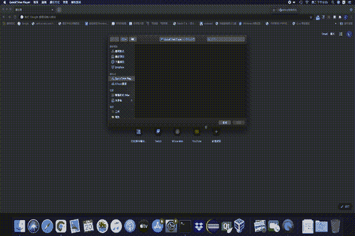

# 一个没有深度学习的虚拟 YouTuber 系统

> 原文：<https://medium.com/geekculture/a-virtual-youtuber-system-without-deep-learning-820d9cd0f98a?source=collection_archive---------17----------------------->

## 只需 CPU 和网络摄像头即可创建您的 VTuber 系统！

在这篇文章中，我将展示一个用 C++编写的虚拟 YouTube(VTuber)系统，它只使用一个普通的 CPU 和网络摄像头。我还会讲一下 VTuber 的现象和视线追踪的一些基础知识。最后，在完成这个系统之后，我会留下一些个人的想法。

# VTuber 简介

VTuber 指的是一个人通过流媒体或上传到 YouTube，并实时跟随他的运动的动漫头像。[ ]虽然 VTuber 起源于 2010 年年中的日本，但在新冠肺炎的帮助下，在 hololive [ ]和 nijisanji 等一些商业公司的推动下，它从 2020 年初开始蓬勃发展。[ ]

# 动机

有一天，我的朋友给我发了一个项目，他用 Python 写了一个 VTuber 系统。在浏览了他的代码后，我有了一个想法:为什么不用 C++实现这个 VTuber 系统来提高性能，并展示我的 C++能力呢？此外，我想通过实施这个 VTuber 项目来加强我的图像处理知识。

此外，许多 VTuber 系统使用深度学习技术或专门的硬件来进行非常精确的运动捕捉[⁴]，但不是每个人都负担得起专门的硬件或 GPU 等设备。此外，它需要更多的设置过程或环境，这在某些场景中可能是不可行的。相比之下，这种 VTuber 系统只需要一个普通的 CPU 和一个网络摄像头，以便于设置和成本效益。

An example of an open-source VTuber system using deep learning. Adopted from [⁵].

# 体系结构

该系统的架构描述如下:

## 计算机网络服务器

服务器负责检测用户的面部及其标志。在检测到地标后，它会计算眼睛和嘴巴的运动。接下来，运动数据将通过 WebSocket 传输到客户端。

## 客户

客户端负责显示 VTuber 及其运动。为了实时显示，客户端使用 WebSocket 接收运动数据。客户端收到服务器发送的数据后，将在浏览器中显示 VTyber 及其移动。

# 视线跟踪和嘴部运动的加工过程

我猜你会想知道服务器是如何检测人脸并计算引擎盖下的运动的。所以在这一段中，我将讲述从网络摄像头到面部运动流数据的细节。

1.  **从网络摄像头捕捉视频流，一张一张地拍摄。**
2.  **调整输入图片的大小。**
    众所周知，调整图像大小可以提高图像处理速度，因为像素更少。经过测试，将输入图像的大小调整为宽度和高度的一半可以获得 2 倍的速度，同时不会严重影响面部检测和视线跟踪过程。
3.  **对输入的图片进行灰度处理。**
    同样，如果你不需要颜色通道做进一步处理，你应该灰度化你的图像。此外，与 RGB 相比，Dlib 人脸检测器在灰度模式下运行速度更快。
4.  **通过 Dlib 运行面部标志检测。**
5.  **检测眼睛的区域。**
    在这个程序中，我们将要检测眼睛。以加速处理并获得更准确的结果。我裁剪了只包含眼睛的图像。
6.  **检索每个眼睛区域的瞳孔。**
    如【⁶】所示，使用 5 到 100 之间的阈值然后按瞳孔轮廓面积排序后选择最后第二个可以适合大多数情况。因此，我修改了这个 Python 包，然后用 C++重新编写了它，以适合我的项目。
7.  **计算面部运动(凝视和嘴巴)。** 得到人脸地标和瞳孔位置后，就该计算人脸运动了。该计算改编自我朋友在[⁷].]的 VTuber 项目
8.  **通过 WebSocket 将数据传输到客户端。**

# 系统设置

在这一部分，我将总结这个 vface-server-cpp 项目的设置。

## 计算机网络服务器

1.  从这里下载 vface-server-CPP:[https://github.com/Cuda-Chen/vface-server-cpp](https://github.com/Cuda-Chen/vface-server-cpp)
2.  安装依赖项，即:
    * OpenCV
    *[websocketd](https://github.com/joewalnes/websocketd)
3.  输入
    `mkdir build && cd build && cmake .. && make`编译项目
4.  输入
    `$ websocketd --port=5566 ./vface_server_cpp`执行程序
5.  运行客户端(即 [vface-web](https://github.com/c910335/vface-web) )。

## 客户

对于客户设置，由于回购由我的朋友维护，您可以访问回购设置:[https://github.com/c910335/vface-web](https://github.com/c910335/vface-web)

# 结果

由于图像处理中使用的常见方法，如调整大小、阈值和感兴趣区域(ROI)，我的 VTuber 系统可以在大约 10 毫秒内检测和计算人脸关键点。计算后，数据将传输到客户端，然后绘制您选择的动画角色。

下图用我的脸创造了这个可爱的角色:

因此，你可以注意到这个角色不能完全闭上眼睛。原因是我坐得离摄像头太远，闭眼动作需要根据个人情况进一步调整。

# 摘要

在这篇文章中，我向你们展示了我的 VTuber 系统，并介绍了 VTuber 的背景。我还列出了从分幅人脸、检测和计算人脸关键点的处理过程。最后，对结果进行了演示，并留下了一些有待进一步改进的地方。

# 参考

[][https://www.urbandictionary.com/define.php?term=VTuber](https://www.urbandictionary.com/define.php?term=VTuber)

https://en.hololive.tv/

https://www.nijisanji.jp/

【⁴】[https://gist . github . com/emilian avt/CBF 4d 6 de 6 f 7 FB 01 a 42d 4c ce 922795794](https://gist.github.com/emilianavt/cbf4d6de6f7fb01a42d4cce922795794)

https://github.com/DeepVTuber/DeepVTB#head-pose-estimation[⁵](https://github.com/DeepVTuber/DeepVTB#head-pose-estimation)

https://github.com/antoinelame/GazeTracking[⁶](https://github.com/antoinelame/GazeTracking)

【⁷】[https://github . com/c 910335/vface-server/blob/master/calculator . py](https://github.com/c910335/vface-server/blob/master/calculator.py)

*原载于 2021 年 5 月 16 日*[*https://cuda-Chen . github . io*](https://cuda-chen.github.io/image%20processing/2021/05/16/a-virtual-youtuber-system-without-deep-learning.html)*。*

> 如果您有任何想法和问题要分享，请通过**clh 960524【at】Gmail . com**联系我。此外，您可以查看我的 GitHub 资源库中的其他作品。如果你像我一样对机器学习、图像处理和并行计算充满热情，请随时在 LinkedIn 上添加我。