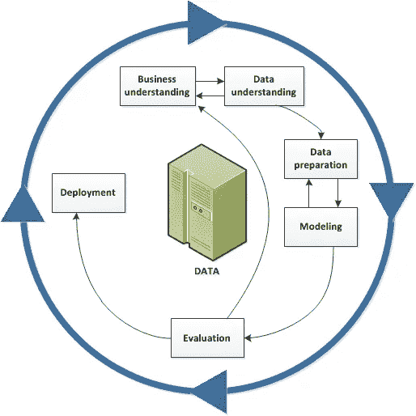

# 数据科学之窗(上):数据挖掘

> 原文：<https://medium.com/geekculture/a-window-into-data-science-part-i-data-mining-a3991ee148da?source=collection_archive---------13----------------------->

虽然 ***数据挖掘【DM】***和 ***数据科学*** 这两个领域有如此多的共同点，但数据挖掘可以被认为是更大的数据科学领域的子集。

# 什么是数据挖掘？

这是一个从大量原始数据中提取有用数据的过程。此外，它可以被视为在给定的数据集中发现趋势，并使用这些趋势来确定未来模式的一系列步骤。换句话说， ***数据挖掘*** 是通过发现数据中的异常、模式和相关性来理解数据的过程。

通常 ***、数据挖掘*** 和 ***知识发现*** 作为过程都被认为是同义词。然而，更简单的是把 ***数据挖掘*** 看作是 ***知识发现******【KDP】***过程中至关重要的一步。其中它通常包括分析以前被忽略的大量历史数据，以检测可用于未来预测或估计的有用信息。在加深我们对 ***数据挖掘*** 的理解之前，让我们先了解一下 ***知识发现过程*** 是什么。

# 知识发现过程

> **“知识发现**可以定义为从数据和信息或从现有知识的综合中开发新的隐性或显性知识。新的显性知识的发现最直接依赖于**组合**，而新的隐性知识的发现最直接依赖于**社会化 Sirje Virkus(塔林大学，2011 年)**

顾名思义， ***知识发现*** 是一个探索数据以便更好地理解并导致新的数据发现(如模式)的过程。

## KDP 的目标是:

知识发现过程(KDP)，也称为数据库中的知识发现(KDD)，致力于检测和发现数据中新颖的、可用的、潜在有用的、最终可理解的模式。

## **知识发现过程的步骤:**

*   **数据清理**—在此步骤中，噪音和不一致的数据被移除。
*   **数据整合**—在此步骤中，多个数据源被合并。
*   **数据选择**—在该步骤中，从数据库中检索与分析任务相关的数据。
*   **数据转换**—在此步骤中，通过执行汇总或聚合操作，将数据转换或整合为适合挖掘的形式。
*   **数据挖掘**—在这一步骤中，应用智能方法提取数据模式。
*   **模式评估**—在该步骤中，对数据模式进行评估。
*   **知识呈现**—在这一步，知识被呈现。

## 数据挖掘同义词:

> 知识提取、信息发现、信息收获、数据考古和数据模式处理。

随着许多不同学科的技术进步，数据挖掘应运而生。因为在用于诸如图像处理、数字信号处理、文本处理和各种形式的异构数据的处理的应用中，收集、存储和传输大量数据的技术已经有了巨大的改进。对更好、更快、更便宜地处理这些数据的需求也急剧增加。

## 数据挖掘与其他方法的对比:

***DM*** 的主要区别特征在于，它是*数据驱动的，相对于其他方法往往是 ***模型驱动的*** 。*

**

*与统计学不同，在统计学中，研究人员经常处理寻找最小数据量的问题，以给出足够有把握的估计。在 ***DM*** 中，我们处理的是相反的问题，即数据量很大，我们感兴趣的是构建一个小(不太复杂)但仍能很好地描述数据的数据模型。*

*找到一个好的数据模型，同时又容易理解，是 ***DM*** 的核心。然而，我们需要记住，没有一个生成的模型是完整的(使用数据的所有相关变量/属性)，并且我们几乎总是会在模型完整性和模型复杂性之间寻找一个折衷。此外，我们需要有一个行之有效的方法来指导我们的数据挖掘工作。所以才有了 ***CRISP-DM。****

# ****CRISP-DM:****

*它代表数据挖掘的跨行业标准过程，是指导任何数据挖掘工作的业内公认的方法。*

**

**The data mining life cycle**

*   *作为一种**方法**，它包括对项目典型阶段的描述，每个阶段涉及的任务，以及对这些任务之间关系的解释。*
*   *作为**流程模型**， *CRISP-DM* 提供了数据挖掘生命周期的概述。*

****CRISP-DM*** 型号的主要特点是灵活性，可轻松定制。此外，它允许其用户和采纳者创建一个数据挖掘模型，以满足他们的特殊和非常具体的需求。*

*此外， ***CRISP-DM*** 是一个非常可行的模型，它的用户可以决定每个阶段的重要性，并专注于更重要的阶段。例如，如果您的组织旨在检测洗钱，您可能会在没有特定建模目标的情况下筛选大量数据。代替*建模*，你的工作将集中于*数据探索*和*可视化*以揭示金融数据中的可疑模式。在这种情况下，*建模*、*评估*和*部署*阶段可能不如*数据理解*和*准备*阶段相关。因此，我们可以认为 CRISP-DM 是一个基于需求的模型，因为它可以被修改以满足其用户的需求。*

# *数据挖掘的阶段:*

**

*如上所述，数据挖掘被认为是知识发现过程*中许多其他步骤中的一步。因此，数据挖掘的使用本身并不是一个目标，而是一种帮助用户实现目标的工具。要正确使用这个工具(DM ),需要执行几个步骤。**

## **目标设定:**

**目标设定对任何项目来说都是至关重要的一步。在数据挖掘过程中，这一步不仅仅是设定项目的目标，而是制定一个清晰的主要计划。该计划从识别问题开始，它包括项目的时间表、指定目标和分配角色。**

## **数据收集:**

**在这一步骤中，以既定的系统方式收集和测量感兴趣的变量的信息，使人们能够回答既定的研究问题、测试假设和评估结果。**

****

**由于数据挖掘创建基于数据的模型，收集的数据需要准确。选择适当的数据收集工具(现有的、修改过的或新开发的)和明确定义的正确使用说明都可以降低发生错误的可能性。当我们使用不精确的数据时，我们可能无法正确回答研究问题，也无法重复和验证研究，我们会误导其他研究人员进行无意义的调查，这将导致无处可去。换句话说，使用不准确的数据是项目失败的直接原因，是一种极其危险的行为，会带来灾难性的后果。**

# **数据建模和分析**

> **数据建模是创建复杂软件系统的简单图表的过程，使用文本和符号来表示数据流动的方式—杰克·沃恩(TechTarget 高级新闻撰稿人)**

****

**这是使用各种数学模型和数据可视化工具来掌握数据中有意义的模式的阶段。通常，数据模型可以被认为是说明数据片段之间关系的流程图。它使涉众能够在编写编程代码之前识别错误并做出更改。**

# **数据分析**

**在这个阶段，数据被提取、清理和转换，以发现对业务决策有用的信息。通过结合商业智能和分析模型， ***数据分析*** 以与项目目标相关的方式对原始数据进行排序。**

# **部署**

****

**在数据挖掘的最后阶段，相关合作伙伴检验假设。有四种不同类型的模型部署:**

*   *****数据科学工具。*****
*   *****编程语言。*****
*   *****数据库*** 。**
*   *****SQL*** 脚本或(预测模型标记语言)。**

**挖掘的数据提供了单一的事实来源，可以指导业务决策向前发展。通过数据科学家之间的协调，IT 团队、软件开发和业务专业人员一起工作，将新模型与组织的现有生产系统集成。**

## ****参考资料和来源:****

*   **首席信息官，K. J .，Pedrycz，w .，Swiniarski，R. W .，& Kurgan，L. A. (2010 年)。数据挖掘:一种知识发现方法。2007 年版。).斯普林格。**
*   ***数据挖掘的定义*(未注明)。Https://Economictimes。Indiatimes.Com/Definition/Data-Mining.**
*   ***数据科学 vs 数据挖掘(2021 指南)| BrainStation* 。(未注明)。大脑站。[https://brain station . io/career-guides/data-science-vs-data-mining](https://brainstation.io/career-guides/data-science-vs-data-mining#:%7E:text=Since%20data%20mining%20can%20be,machine%20learning%2C%20and%20data%20transformation)**
*   ***数据挖掘——知识发现*。(未注明)。Tutorialspoint。[https://www . tutorialspoint . com/data _ mining/DM _ knowledge _ discovery . htm](https://www.tutorialspoint.com/data_mining/dm_knowledge_discovery.htm)**
*   ***CRISP-DM 帮助概述*。(未注明)。IBM。【https://www.ibm.com/docs/en/spss-modeler/SaaS? topic = DM-crisp-help-overview**
*   **在线，H. D. (2020 年 10 月 14 日)。*数据挖掘的 5 个步骤*。嘿，丹—语音转 CRM 解决方案。[https://heydan.ai/5-data-mining-steps/](https://heydan.ai/5-data-mining-steps/)**
*   ***数据采集*。(未注明)。Ori.Hhs.Gov。[https://ori . hhs . gov/education/products/n _ Illinois _ u/data management/DC topic . html](https://ori.hhs.gov/education/products/n_illinois_u/datamanagement/dctopic.html)**
*   **j .沃恩(2021 年 6 月 24 日)。*数据建模*。SearchDataManagement。[https://search data management . tech target . com/definition/data-modeling](https://searchdatamanagement.techtarget.com/definition/data-modeling)**

## ****图像**:**

** [## 2021 年 11 大数据挖掘技术

### 如今，组织正在获取越来越多的数据。为了成功理解这些数据，有必要…

justtotaltech.com](https://justtotaltech.com/data-mining-techniques/) 

[https://corporate finance institute . com/resources/knowledge/evaluation/store-of-value/](https://corporatefinanceinstitute.com/resources/knowledge/valuation/store-of-value/)

 [## 数据挖掘:定义、5 个免费工具和技术

### 在收集和准备过程之后，有必要进行数据分析，以发现数据集中的意义。看着一个…

www.intotheminds.com](https://www.intotheminds.com/blog/en/data-mining/)  [## 旅行是自我发现的终极旅程

### 如果有一件事是不可否认的事实，那就是旅行是你一生中能买到的为数不多的东西之一…

wp.nyu.edu](https://wp.nyu.edu/dispatch/2019/10/11/travel-as-the-ultimate-journey-to-self-discovery/)  [## 5 Temel Soruda Veri Madenciliğ(数据挖掘)Nedir？-维济奥纳·根茨

### 6698 saylki isel verilerin korunmas kanu nun ' nun(" kanun ")10。maddesi erevesinde yasal…

vizyonergenc.com](https://vizyonergenc.com/icerik/5-temel-soruda-veri-madenciligi-data-mining-nedir)  [## CRISP-DM 帮助概述

### 编辑描述

www.ibm.com](https://www.ibm.com/docs/en/spss-modeler/SaaS?topic=dm-crisp-help-overview) 

[https://www . Graham foster . co . uk/stages-of-a-branding-project/](https://www.grahamfoster.co.uk/stages-of-a-branding-project/)

 [## 创建有效大数据模型的 6 个技巧

### 大数据比传统数据更难预测，因此在构建模型时需要特别考虑…

www.techrepublic.com](https://www.techrepublic.com/article/6-tips-for-creating-effective-big-data-models/)  [## 定量研究中的数据收集

### 说到市场调研，我们需要关注两种不同的数据收集方式。这可以分两步完成…

www.ffind.com](https://www.ffind.com/es/2017/08/data-collection-quantitative-research/) 

[https://www . tech magic . co/blog/best-application-deployment-strategies/](https://www.techmagic.co/blog/best-application-deployment-strategies/)**