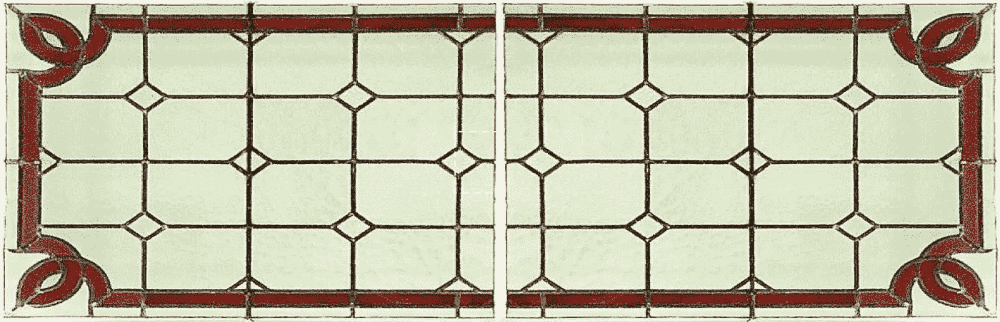

# SQL 窗口函数的窗口

> 原文：<https://medium.com/geekculture/a-window-into-sql-window-functions-64ed86c7c0ba?source=collection_archive---------8----------------------->

## 通过示例提供 SQL 中一系列窗口函数的透明度

Photo by the author

SQL 中的窗口函数对特定的行组(窗口)执行操作，并按组返回输出。与聚合函数不同，窗口函数返回查询结果集中每一行的输出，而不是每组返回一个输出行。