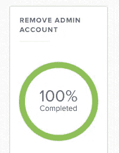

# 一个没有本地管理员帐户的世界

> 原文：<https://medium.com/geekculture/a-world-without-local-admin-accounts-19c4d3b60451?source=collection_archive---------8----------------------->

## DPG 媒体树立了保护 MAC 电脑的标准

*苹果系统工程师 Peter Loobuyck 撰写*

**在 Jamf Nation Amsterdam，我们在舞台上主持了一个关于 Mac 管理的会议。在我们讨论的主题中，有很多关于如何以及为什么不在被管理的 Mac 上使用本地管理员帐户的问题。这里有一些关于这个主题的背景知识，以及管理 MAC 的新的独特方法。**

Photo by [Martin Sanchez](https://unsplash.com/@martinsanchez?utm_source=medium&utm_medium=referral) on [Unsplash](https://unsplash.com?utm_source=medium&utm_medium=referral)

# 全球安全可靠的 Mac 管理

在 COVID 时代，世界已经发生了变化。几乎我们所有人每周都要在遥远的地方工作好几天。我们的设备可以在地球上的任何地方出现。此外，由于互联网的普及，这种行为现在已被普遍接受。

作为苹果管理员，我们必须思考如何管理 MAC 电脑，并重新考虑应该扳动哪个开关。我们已经介绍了许多安全策略:我们的设备在 Apple Business Manager 中注册，它们在设备管理服务器中进行管理，我们实施了基于 CIS 基准的安全策略，我们实施了 FileVault 加密，这只是我们已经采取的提高管理和安全级别的几个步骤。苹果管理员需要尽可能保证所有设备的安全，所以接下来，我们决定重新考虑这些本地管理员帐户。

# 没有账户，就没有风险

这些是苹果电脑上的账户，希望有安全的密码和管理权限。你可能已经感觉到了这一点:“为什么我们需要一个通用的本地管理帐户，它在所有设备上都是一样的？”这个问题的答案是:这显然不是一个好主意。

一些解决方案包括生成“每日密码”的工具。我们声称由静态规则生成的密码也是静态的。一旦知道了这些规则，就可以重复使用这些密码。甚至德国[的恩尼格玛机](https://en.wikipedia.org/wiki/Enigma_machine)也被破解了。黑客们只是喜欢带有安全工作错觉的用户。因此有了没有本地管理员的设备的想法。门上没有锁意味着无法进入。连个门都没有，没有可用的账号。

# 访问和支持

那么，我们如何提供一个没有本地管理员的设置呢？在 DPG 媒体公司，我们用 JAMF 专业版管理我们的苹果电脑，用 JAMF 连接版来加强用户账户的密码复杂性。MAC 与这些工具的结合让我们可以轻松管理设备。真正的问题是如何支持用户和服务台？

我们在自助服务中设置了一个策略，向本地用户授予管理访问权限，直到下次将设备签入 JAMF 实例。因此，我们服务台的人员可以向这些用户授予临时管理员访问权限。这允许服务台同事帮助用户完成需要提升权限的任务。

# 简单收益

只有一个用户登录设备也解决了其他问题，例如第一个登录 Mac 的用户启用了 MDM，允许像 JAMF 专业版这样的 MDM 解决方案管理某些特定于用户的管理设置。如果第一个创建的用户是本地管理员，那么该帐户将启用 MDM。这将不允许用户根据需要管理他们的设备。另一个解决的问题是安全令牌，它将被授予本地管理员帐户，而不是用户(加密密钥的实现、它们何时生成以及它们如何在 Mac 上存储都是安全令牌功能的一部分)

无论如何，不要太过拘泥于技术细节，在 DPG 媒体，自 2020 年以来，我们部署我们的 MAC 电脑时没有提供任何本地管理帐户。所有用户都可以像以前一样旅行到任何地方，用他们的 MAC 电脑工作。重新思考我们部署 MAC 的方式改变了政策，不仅仅是因为世界变了。我们的目标一直是尽可能安全地管理 MAC 电脑，同时让它们像苹果设计的那样易于使用。