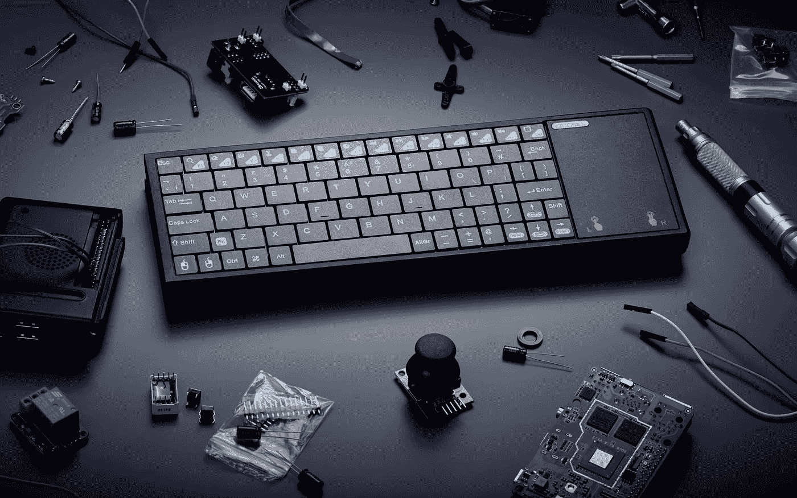

# AbacusBasic:不要等苹果的 iKeyboard，而是用这个

> 原文：<https://medium.com/geekculture/abacusbasic-dont-wait-for-an-apple-ikeyboard-get-this-instead-4662b7f019eb?source=collection_archive---------6----------------------->

## Pentaform 的电脑键盘已经上市，那么消费者对它有什么期待呢？

The Raspberry Pi 400 showed the way, yes, but the AbacusBasic is the first Windows-based “computer-in-a-keyboard” product coming to market. It might not be the last. (Image: Pentaform)

还记得假设的键盘电脑苹果公司[已经为](https://appft.uspto.gov/netacgi/nph-Parser?Sect1=PTO2&Sect2=HITOFF&u=%2Fnetahtml%2FPTO%2Fsearch-adv.html&r=42&p=1&f=G&l=50&d=PG01&S1=(apple.AANM.+AND+20220224.PD.)&OS=aanm/apple+and+pd/20220224&RS=(AANM/apple+AND+PD/20220224))申请了专利，而你的真正的[暂定名为 iKeyboard](/geekculture/would-you-buy-this-ikeyboard-computer-if-its-actually-released-sure-you-would-5288a779aae1) 只是为了好玩？是的，很可能是从[的](https://www.raspberrypi.com/products/raspberry-pi-400/)中汲取灵感的那一部……