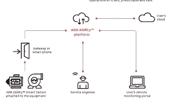
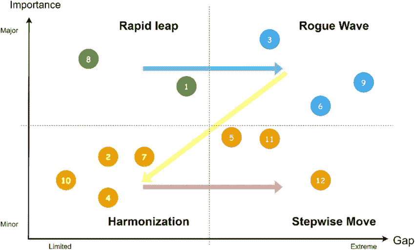
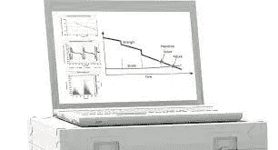

# ABB 能力飞跃传感器

> 原文：<https://medium.com/geekculture/abb-ability-leap-sensors-ccb980e09835?source=collection_archive---------6----------------------->

**简介**

ABB Ability LEAP 是研究高压汽车和轧机(≥ 5kV)定子绕组绝缘环境和预测寿命的现代供应商。该提供商包括:

*   测量范围内特别进化了[飞跃](https://www.technologiesinindustry4.com/2021/05/industry-4-0-abb-ability-iot-sensor-for-bearings.html)装备
*   使用卓越的分析设备记录评估，以了解、标记和量化绝缘内部的缺陷
*   预测虽然小玩意的国家可能会结束倾斜或至关重要
*   优化维护计划和建议的整体效果表现
*   除此之外，该文件还提供了快速和长期保养运动的建议，让客户能够更早地设计好，并避免价格过高的紧急制动。

**ABB 能力飞跃系统**

总是提前一步 [ABB 的能力飞跃](https://www.technologiesinindustry4.com/2021/05/industry-4-0-abb-ability-iot-sensor-for-bearings.html)很好地检测定子绕组绝缘内的容量问题，比它们变得重要和导致长时间停机的时间更早。来自未婚网站的准确数据在线测试和评估在未婚事件中实现，并可能与日常维护相结合。与传统策略相比，这是一个额外的好处，传统策略需要在能够提供有益输出之前从整个测量集合中获得趋势记录。延长使用寿命当设备的环境变得倾斜或重要时，效果被用来预期。基于这一点，特定的操作和供应商运动可能会事先深思熟虑，以避免过早的失败和增长您的汽车和工厂的寿命。

**ABB LEAP 技术数据收集**

*   实现一组测量来收集工作记录、查看效果和小工具数据。数据估计
*   对累积的数据进行分析，以了解绝缘退化系统。应力计算
*   [ABB](https://www.technologiesinindustry4.com/2021/05/industry-4-0-abb-ability-iot-sensor-for-bearings.html) 完成了预期寿命分析，并确定了对寿命有影响的元素和情况。
*   除了检查、维护、更换或升级之外，还为可行性制定了明确的计划。

**飞跃分析的重要性**

[ABB 能力飞跃](https://www.technologiesinindustry4.com/2021/05/industry-4-0-abb-ability-iot-sensor-for-bearings.html)将指导我们通过从完全以时间为基础转变为完全以环境为基础的优先化和制定计划软件来优化维护。ABB 能力飞跃的效果将有助于客户在需要的时候选择运动和计划。

对顾客的主要祝福是:

*   早期预警——为制定保养计划提供充足的时间
*   优化保养制定计划——允许你从完全基于时间的保养转变为完全基于环境的保养
*   降低拥有价值(首席运营官)—有助于延长生命周期，从而增加投资回报(ROI)
*   更好的决策—有助于在快速和长期维护以及运行/维修/翻新/更新选项方面做出决策
*   改善威胁缓解—通过降低威胁级别，最大限度地减少计划外停机
*   全面的高压保险——可用于您的整个高压车队，包括非 ABB 汽车和工厂

**ABB 产能飞跃**产量

[ABB 能力飞跃](https://www.technologiesinindustry4.com/2021/05/industry-4-0-abb-ability-iot-sensor-for-bearings.html)的输出是一份掩盖了评估结果的文件。ABB 的短期和长期建议非常精确，以便客户也有大量时间来设计强制维护或倒带和更换。

如何使用 ABB 能力飞跃来安排保养？

[ABB 能力飞跃](https://www.technologiesinindustry4.com/2021/05/industry-4-0-abb-ability-iot-sensor-for-bearings.html)使我们能够通过使用我们特殊的评估算法，建立一个带有未婚测量事件的指纹。从该评估中得出的参数可用于生存预期计算，然后与维持水平合并。基于 ABB 能力飞跃文件建议，客户可以更早地安排快速或长期维护。

**ABB 能力飞跃的优势**

传统测量研究包括绝缘电阻(IR)、极化指数(PI)和 Tan δ在内的数值，而 [ABB 能力飞跃](https://www.technologiesinindustry4.com/2021/05/industry-4-0-abb-ability-iot-sensor-for-bearings.html)则考察绝缘的电气因素。ABB Ability LEAP 是一家完全独一无二的软件提供商，该软件混合了 DC 和交流测量的评估，并对绝缘内部的缺陷进行表征和量化。此外，ABB Ability LEAP 预计定子绕组绝缘的最终寿命，这是长期维护计划的关键。

**种汽车或磨坊可闰测**

[ABB capability LEAP](https://www.technologiesinindustry4.com/2021/05/industry-4-0-abb-ability-iot-sensor-for-bearings.html)可用于过电压(> 5kV)汽车和工厂，与制造商无关。对于低于 5kV 的汽车和工厂，ABB 可以提供条件评估(不存在预期)作为替代方案。

更多详情请访问:[https://www . technologiesinindustry 4 . com/2022/09/abb-ability-leap-sensors . html](https://www.technologiesinindustry4.com/2022/09/abb-ability-leap-sensors.html)