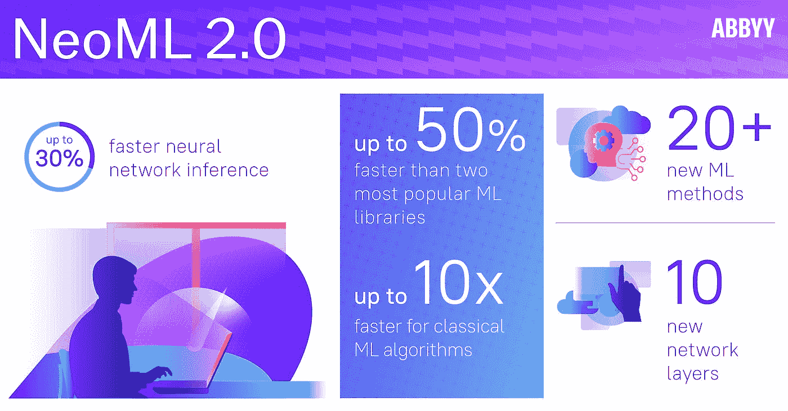

# ABBYY 的 NeoML 开源库增加了 Python 支持，速度提高了 10 倍

> 原文：<https://medium.com/geekculture/abbyys-neoml-open-source-library-adds-python-support-10x-speed-improvements-e75b5e3a5638?source=collection_archive---------82----------------------->

Source: [ABBYY](https://mms.businesswire.com/media/20210622005434/en/886691/5/infographic-ABBYY-NeoML-13262-final-en-100dpi.jpg?download=1)

## NeoML 提供了比其他流行的开源机器学习库快 50%的性能。

今天，数字智能公司 ABBYY 宣布了对 [NeoML](https://cts.businesswire.com/ct/CT?id=smartlink&url=https%3A%2F%2Fwww.abbyy.com%2Fneoml%2F&esheet=52449111&newsitemid=20210622005434&lan=en-US&anchor=NeoML&index=1&md5=fd18465d6e4d82165978a3b608c40f4f) 的重大更新，这是一个跨平台的开源机器学习库，允许开发人员构建、训练…