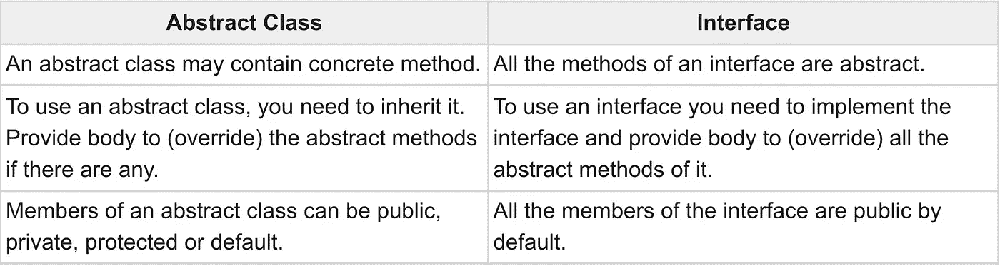

# 抽象类和接口(何时使用)

> 原文：<https://medium.com/geekculture/abstract-class-and-interface-when-to-use-a9693d357d00?source=collection_archive---------28----------------------->


理论上来说，在 Java 中很容易说明什么是抽象类，什么是接口。这篇文章可以帮助你理解在实践中什么时候可以使用抽象类，什么时候可以使用接口。

下面是抽象类和接口之间的基本区别:



From: [https://www.tutorialspoint.com/Difference-between-Abstract-Class-and-Interface-in-Java](https://www.tutorialspoint.com/Difference-between-Abstract-Class-and-Interface-in-Java)

**你知道的没错！**

但是当你决定你应该用什么的时候，这些例子可能会帮助你。

首先，考虑您想要在项目中创建的实体。列出你想包含在抽象类或接口中的方法。

我已经想到了一些，这是我的思考过程，来决定它最终是一个抽象类还是一个接口。

**什么时候使用抽象类:**

这里举一个超级英雄的例子，让我们用超级英雄通常做的常用方法创建一个抽象类“超级英雄”。

现在，为什么这里是抽象类而不是接口？因为可以有像蝙蝠侠，超人，蜘蛛侠这样的子类来扩展超级英雄类。他们都是英雄，但我们想把超级英雄传递给孩子们的特定事情，超级英雄必须做的事情。

它定义了类的通用行为和属性。比较笼统或者抽象。子类继承通用行为，但是如果子类需要通用行为的特定实现，可以覆盖它。

```
// Super class
public abstract class Superhero { abstract void haveTragicPast(); abstract void saveTheWorld(); abstract void wearFancyDress(); abstract void makeDramaticEntrance(); abstract void haveSecretIdentity();

}// Sub class
public class Batman extends Superhero {}
```

当…
i)您希望父抽象类的子类被强制覆盖具体方法时，您可以使用抽象类。从哲学上来说，你可以把它想象成一个父抽象类，给子类下达指令，让它们必须遵守。
iii)您想要定义一个特定实体，并限制其用于子实体。iv)你希望类有代码，而不仅仅是抽象方法。

**何时使用界面:**

接口有助于实现该类不常见的行为。这是该类希望拥有的特殊行为。超级英雄会飞，飞机会飞，鸟会飞，一些昆虫也会飞。在印度家庭中，鞋子也会飞。但这并不意味着鸟类或昆虫(或鞋子)是超级英雄。

在这种情况下，行为的契约在接口中定义。任何希望拥有这种行为的类都需要实现接口并遵守约定。

所以，可以有一个 FlyingBehavior 接口。

```
public interface FlyingBehavior {
    public void fly();
}//Usage
public class Batman implements FlyingBehavior {
    public void fly() {
        System.out.println("I am batflying!");
    }
}public class Pigeon implements FlyingBehavior {
    public void fly() {
        System.out.println("I am flying n' shitting!");
    }
}public class AirPlane implements FlyingBehavior {
    public void fly() {
        System.out.println("I am flying. Thank you Jet Engines!");
    }
}
```

当…
i)你想将接口方法的执行强制到任何底层类作为一个实现时，你可以使用一个接口。
ii)你不想在你的实现中有父子关系。
iii)你想设计一个插件，一组可以传递给任何实现它的类的事件。
iv)你想实现一个特定实体的通用行为。
v)你确定除了抽象方法之外，没有代码会出现在接口中。