# React 中具有高阶组件(HOC)的抽象布局。

> 原文：<https://medium.com/geekculture/abstract-layouts-with-higher-order-components-hoc-in-react-da8379f18c9a?source=collection_archive---------7----------------------->

在过去，很难创建一个布局一致的网站。如果你愿意，你需要在最好的情况下使用 iframes，在最坏的情况下使用 frameset。

在那个时候，javascript 是大多数人在网络上害怕的东西，几乎每个人都禁用了它(现在想想真是疯狂)。

但是拥有布局的固定和动态部分的能力是 web 开发人员和 web 设计人员一直梦寐以求的。横向菜单是一种常见的设计模式，它让用户可以随时访问网站的各个部分，顶部栏显示网站名称是一种品牌选择，几乎每个人都遵循这种选择。

幸运的是，我们不再回到过去的日子了:javascript 构成了 90%的 web，随之而来的是一系列被许多库和框架所利用的功能。

# 现代社会:做出反应

如果你点击了这篇文章，你可能会知道 React 是一个 javascript 库，它让你以声明的方式指定你的设计:你描述你的设计就像你用 HTML 做的一样，但是你可以在其中加入 javascript 变量，React 会神奇地将它呈现给你的 DOM。

但是如何用 react 实现这种复合布局呢？

呈现给你:react-路由器。

react-router 是 react 应用程序中处理路由的"*事实上的*"库。它会查看您所在页面的路径名，您可以通过编程方式指定哪个组件需要在特定时刻呈现。

但那只是说说而已，让我们来看看例子。

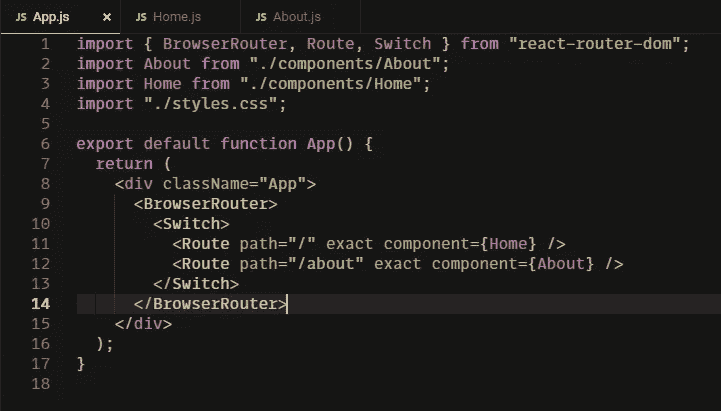

这是一个简单的 React 应用程序…BrowserRouter 是路由的提供者，交换机(两个组件都来自 *react-router-dom* 库)负责检查我们在哪个路由上，并显示 Home 组件或 About 组件。

结果不言自明:

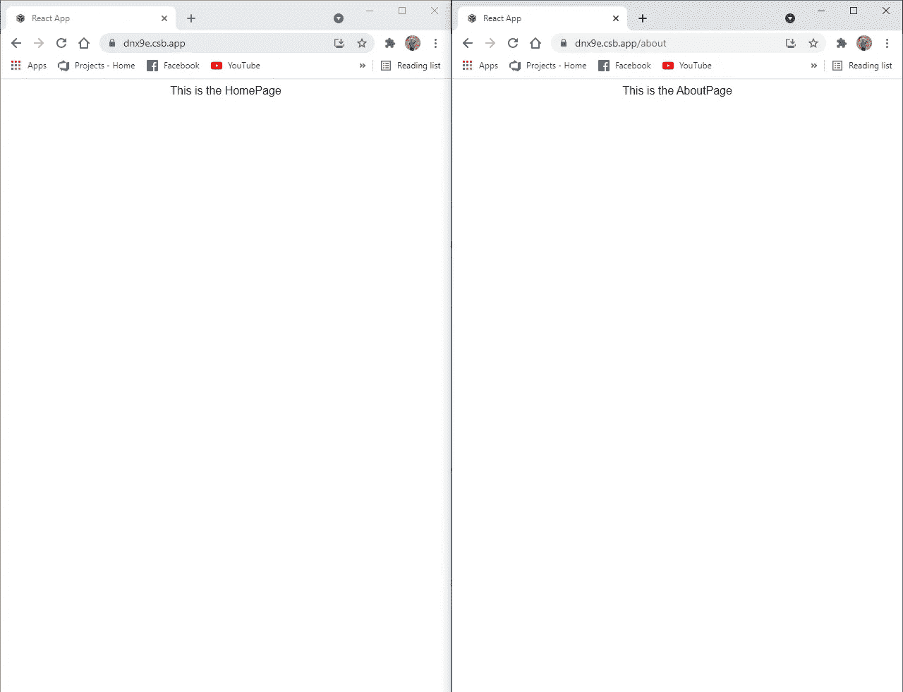

但是这对我们的情况没有帮助。让我们创建一些导航组件和一个应用程序栏组件，让我们稍微改变一下这个应用程序。

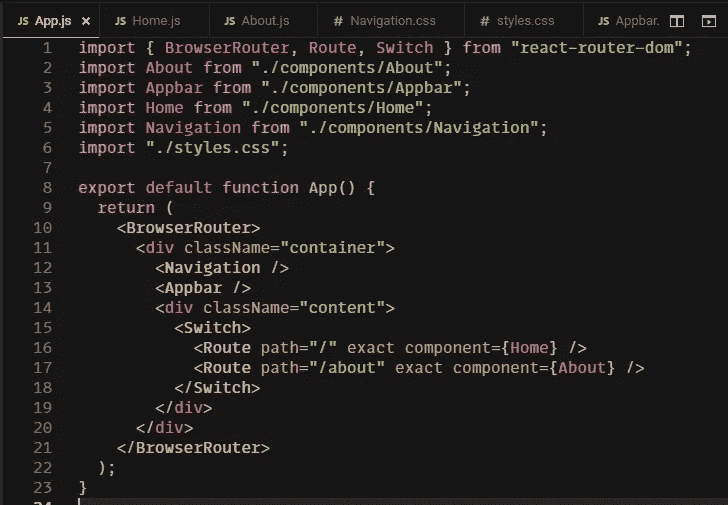

导航只是一个带有链接(react-router-dom 的 a 标签)组件的 ul，它指向不同的页面。appbar 只是一个名为 out fabolous webapp 的 div。所有东西都被包装在一个容器中，这个容器用 grid 定位这些元素，这里我们有一个通用的 webapp 布局:

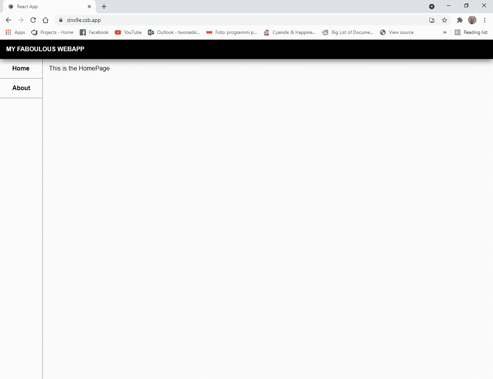

The layout in the home page

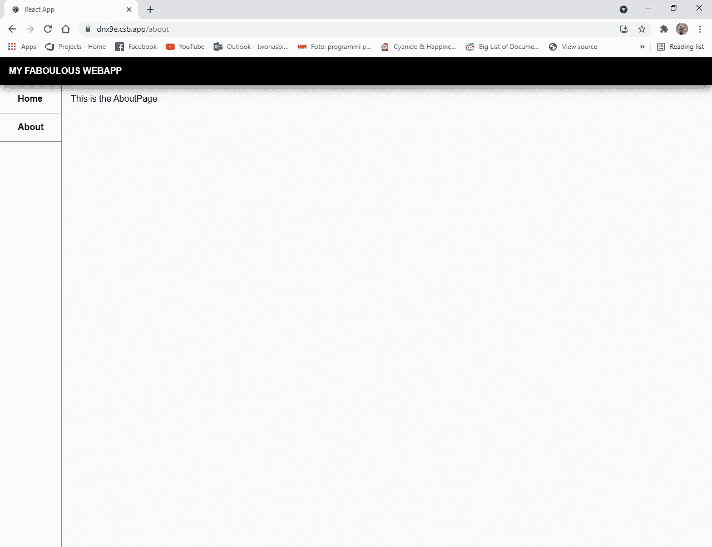

The layout in the about page

那很酷。而且你肯定能看出来我是个开发者，不是设计师。但是，让我们假设一个真正的设计师来了，说“嘿…你知道什么会很酷吗？中心区域可以有一个白色的背景，带有轻微的阴影，以便更好地聚焦内容。你能做到吗？”。

你可以用你最喜欢的 IDE 打赌，我可以。我只需要将样式添加到内容类中，对吗？

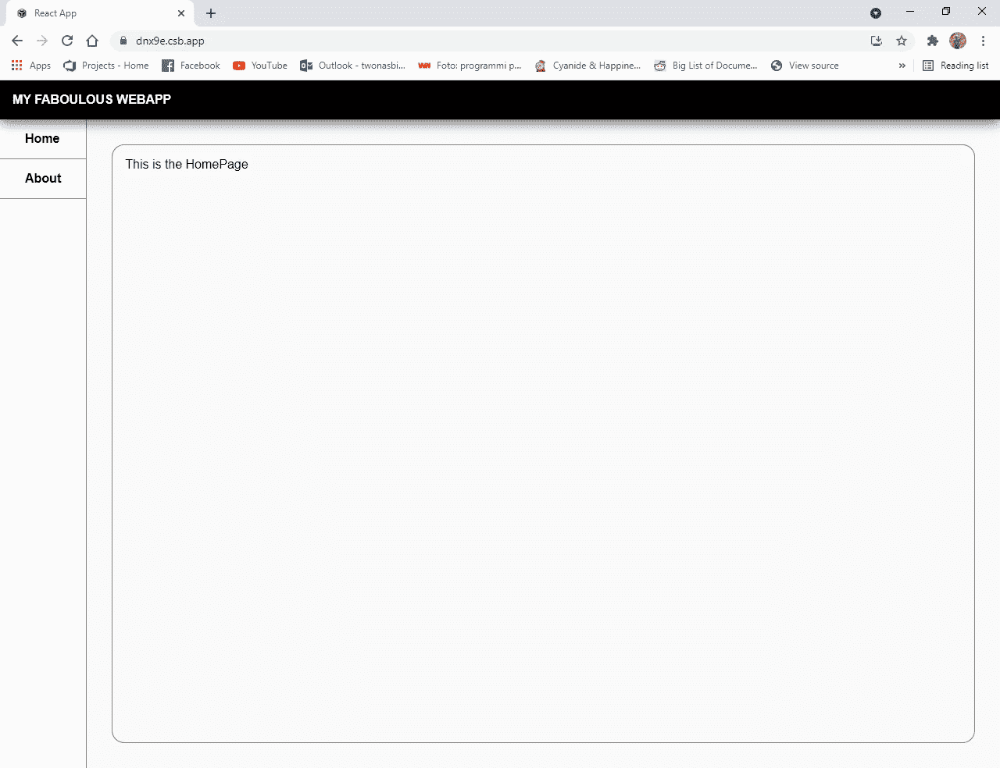

骄傲的开发商对设计师说:“我们走吧”。但是设计师说了一些让没有经验的开发者害怕的话:“嗯…这很酷，但是…我们不能在这个边框上加上页面的标题吗？”。

这改变了一些事情。容器不知道呈现的是什么页面。人们可以开发不同解决方案来解决这些问题，但是许多方案的设计都很糟糕，需要进行大量的维护工作:

1.  您可以简单地在每个组件内移动边框，并将标题直接写在组件内。但这意味着每次你写一个新的组件时，你必须写完整的代码来放置标题和边框，如果你想改变布局，你必须遍历每个组件来更新它。
2.  您可以创建一个新的组件，将组件和标题作为道具，并正确地呈现它们。但这意味着在应用程序的主页中，你必须记住不要渲染实际的组件，而是用正确的道具渲染这个包装组件。这对可读性没有帮助。
3.  您可以在 App.js 中添加一个状态变量，并将 setter 作为 props 传递给每个组件，然后在组件的 useEffect 中调用这个 setter。仍然没有很好的可读性。

但是后来我们的开发人员想起了在一篇关于 Medium 的很棒的文章中读到的一些东西。

# 高阶组件

Javascript 是一种很酷的语言。它是一种函数式语言。这是什么意思？这意味着你可以将函数存储在变量中，甚至可以将它们作为其他函数的参数来传递。

函数有一个特殊的子类，叫做高阶函数。这些函数要么接受函数作为输入，要么返回函数。这些函数的一些例子是数组的 map 函数或 React 中的 useState 函数。

鉴于 React 组件只是将道具作为输入并返回渲染函数的函数，我们可以将这些知识结合起来，创建我们的第一个高阶组件。

顾名思义，这些组件实际上是一些函数，它们将一个组件和您想要的任何参数作为输入，并返回一个函数，该函数返回一个渲染函数(因此基本上是一个新组件)…让我们看看如何在我们的应用程序中使用它:

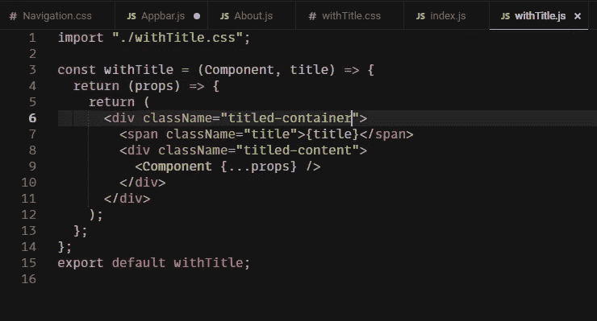

这是我们的 HOC:它将一个组件和标题作为输入参数，返回一个将 props 作为输入的函数，并返回一个渲染函数。这个 render 函数呈现一个有标题的容器(一个简单的网格，将标题和内容一个放在另一个下面),在 args 中呈现标题和组件的跨度，传递所有的属性。

然后，我们需要修改 App.js 中的旧 css 来删除我们添加的框(因为现在由这个 HOC 负责在视图周围呈现框)，我们需要修改 Home 和 About 页面，如下所示:

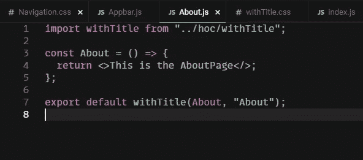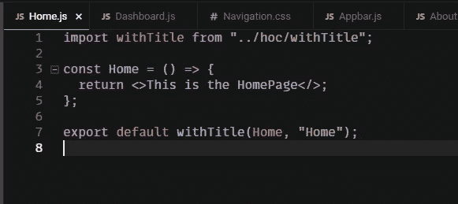

请注意，我唯一需要更改的是导出值。我不是只导出组件，而是导出了包装在 withTitle 函数中的组件，并且传递了必须呈现的标题。

我还添加了一个新组件，一个需要不带标题和框的仪表板，只是为了显示决定我是否需要一个带标题的组件是多么容易。

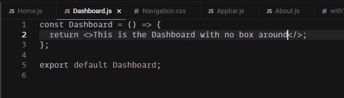

最棒的是……在 App.js 中，我不需要做任何修改……我只需要相同的、良好的、可读的代码

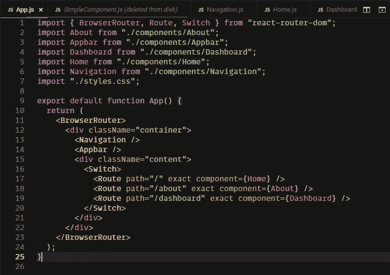

现在是最后一次展示，这是所有这些变化后的 webapp 的外观

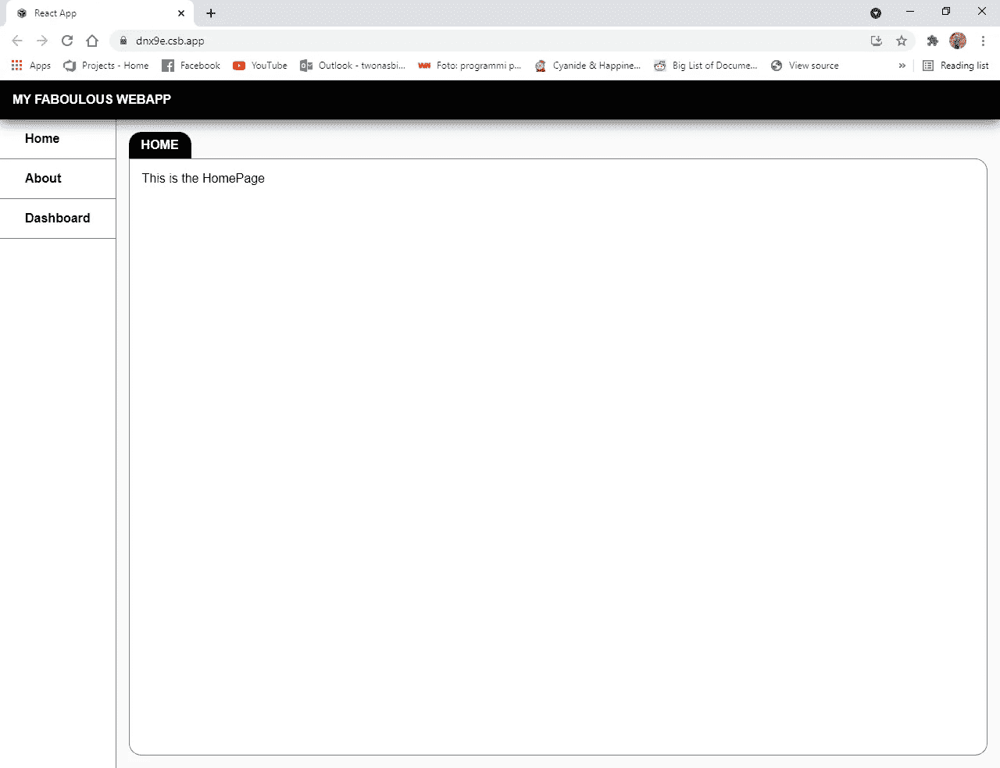

The Home page with the title Home and the box around

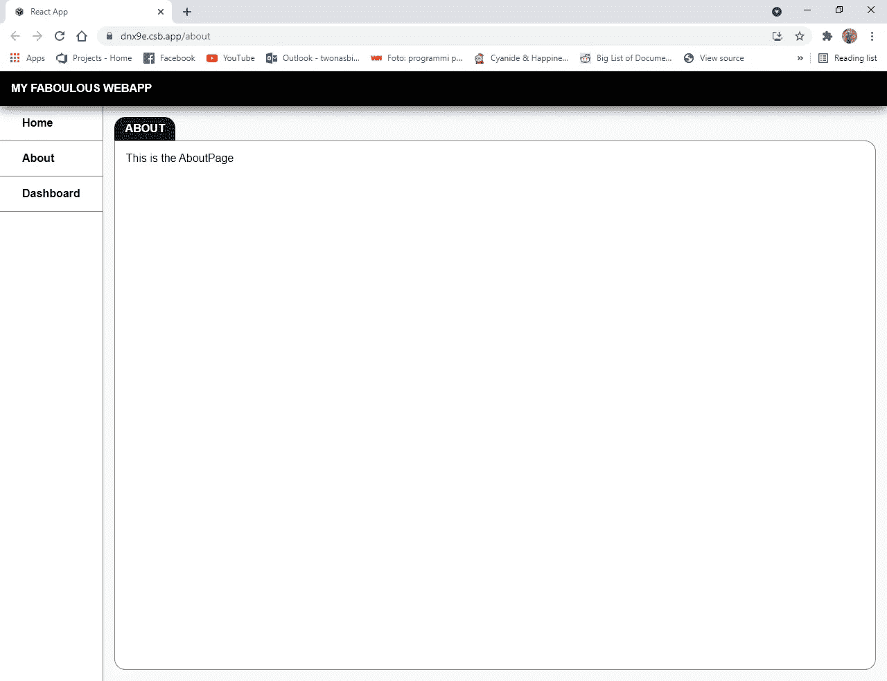

The About page with the title About and the box around

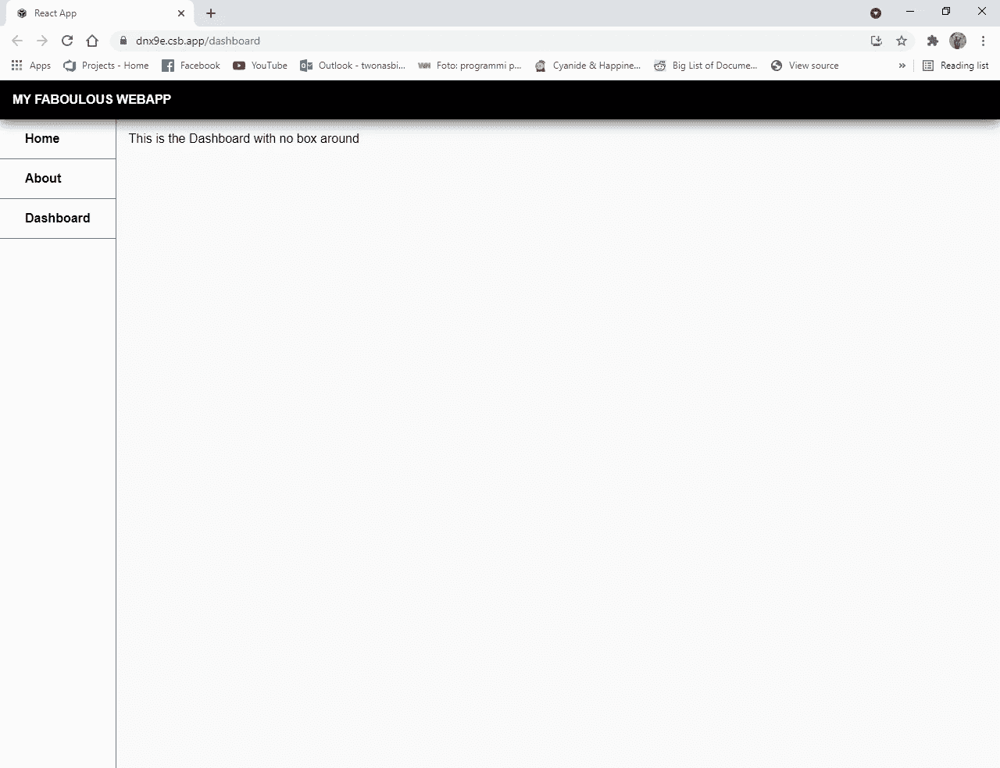

The Dashboard page without border and title

所以我们开始吧。我们做了一个开发者友好的方法来保持设计的一致性，如果我们想改变标题的外观，我们唯一要做的就是改变一个文件。

这整个高阶组件的东西，甚至对于布局以外的东西也是有用的。例如，您可以在呈现私有视图之前添加对用户身份验证的检查，或者执行 api 调用，将 get 作为道具传递给使用 HOC 的每个组件。

到目前为止，如果你想试验我的代码，我会在这里留下一个代码沙箱的链接。

如果你有任何问题，欢迎在评论区提问。

[https://codesandbox.io/s/hoc-dnx9e](https://codesandbox.io/s/hoc-dnx9e)