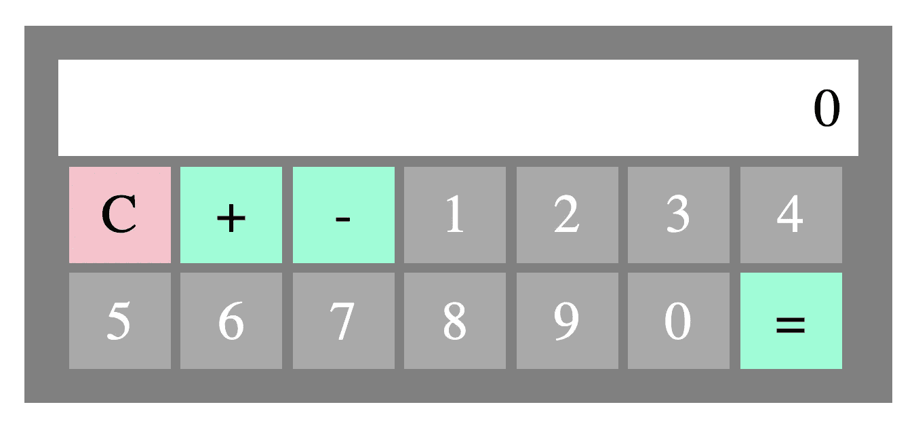

# 抽象、接口和世界构建——第二部分

> 原文：<https://medium.com/geekculture/abstraction-interfaces-and-world-building-part-2-99b9a504eea3?source=collection_archive---------24----------------------->

啊哈！一步一步地注意抽象，遍历代码。

跳过[第 1 部分](https://christo8989.medium.com/abstractions-interfaces-and-world-building-106502ee7bf8)没关系，但是如果你还没有检查过具有最小抽象的[栈](https://stackblitz.com/edit/calculator-without-abstractions?file=Calculator.tsx)，那么这是一个很好的起点。

同样，如果你想跳过前面的内容，[这是我的最终产品](https://stackblitz.com/edit/calculator-with-abstractions)。但是如果你想知道我是怎么到那里的，请留下来。