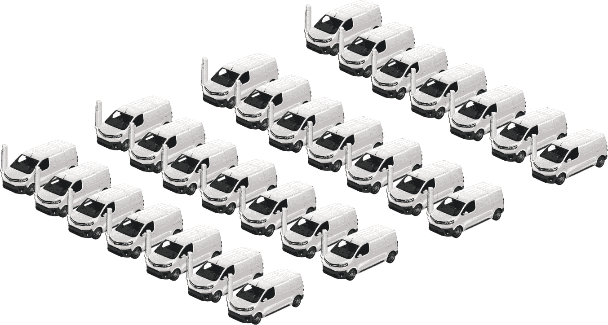
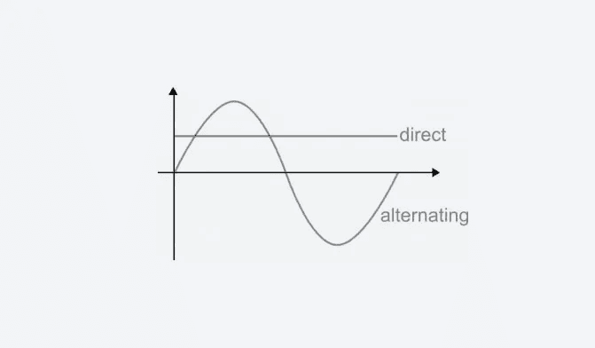
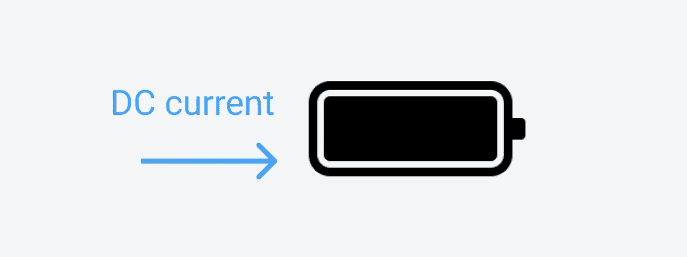
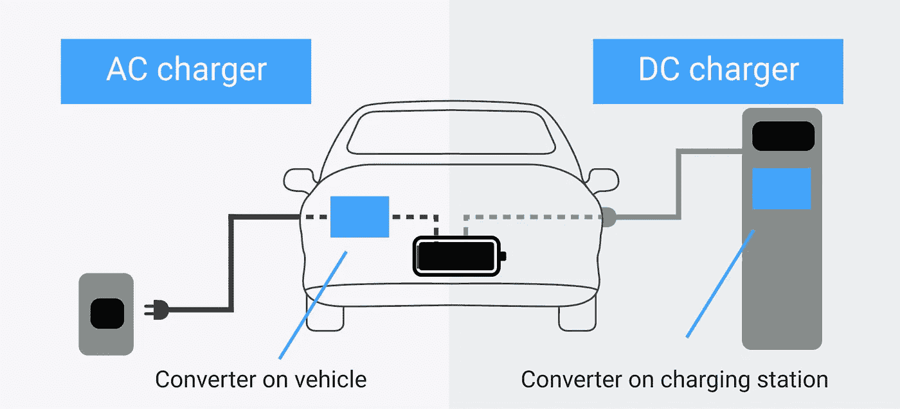
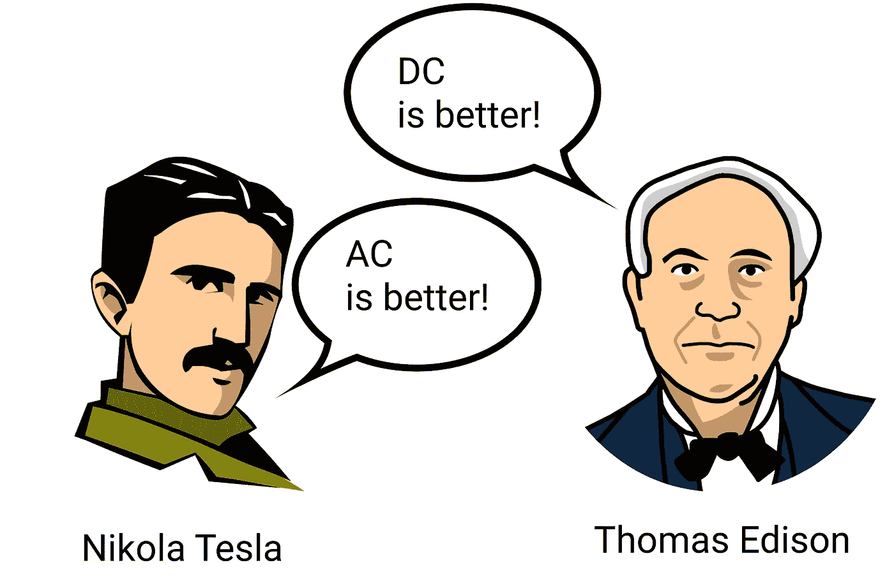
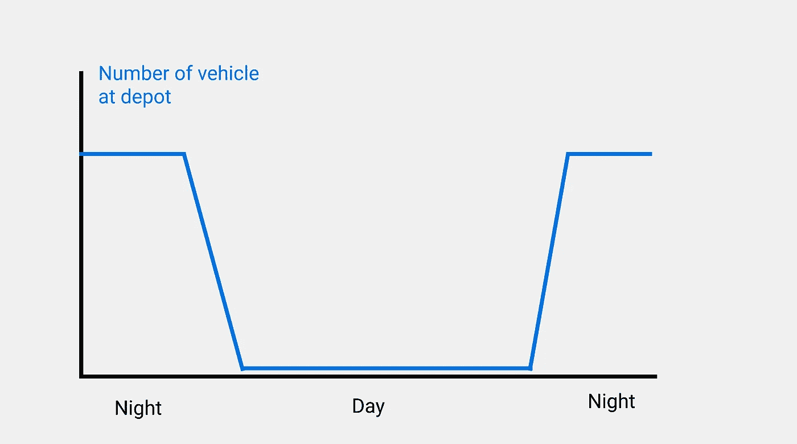
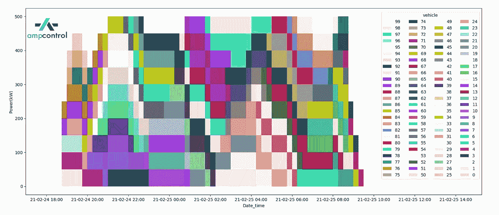
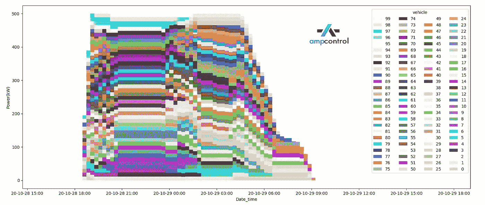
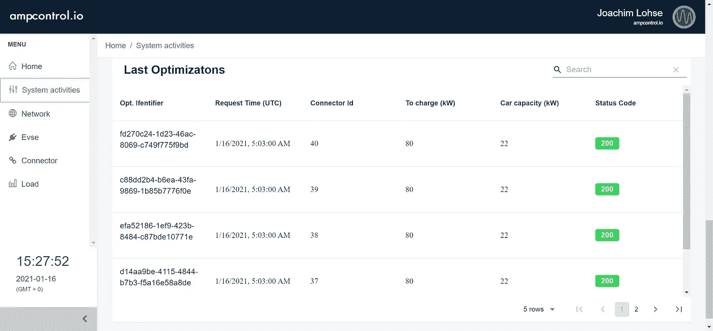

# 交流或 DC 充电站？电动车队车辆哪个最好？

> 原文：<https://medium.com/geekculture/ac-or-dc-charging-stations-which-is-best-for-electric-fleet-vehicles-2079f15b55e0?source=collection_archive---------2----------------------->

毫无疑问，温室气体(GHG)排放是现代世界的一个大问题。它们与空气质量普遍下降和气候变化有关。

交通是最大的罪魁祸首之一。在大城市，大约 30%到 40 %的温室气体排放是由内燃机车辆造成的。

> *大城市 30%到 40 %的温室气体排放是由内燃机汽车造成的*

这就是为什么世界各地的科学顾问和政府都在推动电动汽车的采用。通过增加电动汽车和电动汽车充电器的使用，政府将减少有害排放，实现交通脱碳目标。

因此，电动汽车充电站变得越来越普遍。你看到的大多数充电站都是交流充电器。直到最近，交流充电器一直是唯一的选择。

但是最近几年，像 T2 EvGo T3 或 T4 io nity T5 这样的公司已经开发了一种新技术，被称为 DC 快速充电器。公司现在可以应用不同类型的技术为车辆充电，比标准的交流充电器更快。

能源效率和可再生能源办公室表示，美国 70，000 个充电站中约有 16%是 DC 快速充电器(DCFC)。在欧洲，我们看到大约 11%的充电器是 DCFC 的。

DCFC 占交流充电器的比例越来越大。有新的国家倡议和激励措施来推广 DC 快速充电器。公用事业提供商正受到激励，帮助安装 DCFC 充电器。

但对许多人来说，问题仍然存在——车队车辆应该使用哪个充电站？有车厂的公司应该安装交流充电器还是 DC 充电器？这就是我们在本文中试图回答的问题。

# AC 和 DC 有什么区别？

[交流(AC)](https://www.power-and-beyond.com/back-to-basics-what-is-alternating-current-a-907931/) 电力可以简单地描述为从发电站出来并沿着电力线传输到家庭和其他建筑物的标准电力，有时也称为市电或公用电力。

直流(DC)功率，顾名思义，是沿直线运动的电流。

正如我们在上一篇文章中提到的，交流电和 DC 电流是由托马斯·爱迪生和尼古拉·特斯拉发明的。信不信由你，他们从来都不是最好的朋友…

# 汽车电池是如何工作的？

[电池需要 DC 电力](https://www.ampcontrol.io/post/what-is-better-ac-or-dc-current)。原因很简单。就像任何其他电池一样，汽车电池使用并提供 DC 能量。这意味着负载沿一个方向流动，并通过化学过程储存。

如上所述，交流电流周期性地改变方向。为了储存交流电，电池的端子需要以相同的速度改变极性(+和-)，这是不可能的。

用技术术语来说:将交流电源连接到电池来存储交流电源意味着电池只在正半周充电，然后在负半周放电。

换句话说，你不可能把交流电储存在电池里。

> *你不可能把交流电储存在电池里。*

# 交流充电器和 DC 充电器的区别

您的插座提供交流电源，而您的汽车电池需要 DC 电源。

实现这一点的唯一方法是将交流电源转换成 DC 电源输出。这就是我们所说的交流-DC 转换器(交流-DC 转换器)。

你有两个选择:

a)您将该转换器安装到您的车辆中，

b)您将此转换器内置于您的充电点。

**交流充电器使用选项 a。**这意味着车辆有自己的小型交流 DC 转换器。因此，车辆从充电点接收交流电源，然后车辆将其转换为 DC 电源。

**DC 充电器是选项 b。**这意味着充电器有自己内置的交流-DC 转换器，车辆直接接收 DC 电源。车内不需要转换。

# 为什么 DC 充电器这么快？

这是一个重要的问题。

让我们从逻辑上看问题…

电池充电速度越快，需要提供的电量就越多。快速充电通常在 50 千瓦以上，慢速充电通常在 1-22 千瓦之间。

因此，为了在给电池充电时提供更大的功率，你需要一个更大的交流 DC 转换器。

问题是——从交流和 DC 转换高功率是昂贵的。一个大型转换器很容易就要 10，000 美元。

很明显，你不希望你的车里拖着又重又贵的转换器。因此，大功率充电最好使用内置于充电站的转换器，而不是汽车。

这就是为什么 DC 充电器似乎比交流充电器更快的主要原因。它们并没有真的更快；在充电器中产生高功率 DC 输出比在车辆本身中转换交流充电器的输出更容易、更便宜。

# DC 充电器总是更好吗？

看来 DC 充电器是一个更加明智和有效的选择，对不对？

不一定。

DC 充电器比交流充电器贵很多。DC 充电器需要更多的空间，需要更复杂的备件来促进主动冷却等过程。

此外，[高功率充电需要高功率连接到电网](https://www.ampcontrol.io/post/have-grid-interconnections-become-a-hurdle-for-ev-charging-projects)。在典型的住宅电网连接中，你无法安装 DC 充电器。

此外，试图安装十个 150 千瓦的充电器是一个复杂而昂贵的项目。

另一方面，安装十个 11 千瓦的充电器相当简单，也更实惠。

经验法则是:需要快速充电时安装 DC 充电器，不需要时安装交流充电器。

# 车队车辆的最佳充电站是什么？

在本文的其余部分，我们将重点关注[车厂电动汽车充电](https://www.ampcontrol.io/post/3-tricks-to-build-your-ev-fleet)。

出于本文的目的，我们不会考虑在多个仓库充电的员工车队，因为这将使分析更加复杂。

对于传统的单个仓库收费，我们将研究第一个主要用例:送货车辆的夜间仓库

我们将看看他们的日常运作，以及在这种情况下交流或 DC 充电将如何工作。你会看到它们之间的巨大差异。

对于每个使用案例，我们将应用以下图表:

**车辆数量:** 100 辆

**停留时间/停留时间:**10-12 小时(仓库，夜间)

**电网容量:** 500 千瓦

以下是车辆到达停车场的方式:

# 仅 DC 充电

我们用我们的软件来模拟车队如何只用 DC 充电器充电。我们考虑了 10 个 500 千瓦的 DC 充电器。由于当地的电力限制，我们无法安装更多的充电点。

仿真结果表明

*   DC 充电器整晚都很活跃
*   并非所有车辆都能够充电
*   一些车辆已充电，但无法按时充满电

10 个 DC 充电器(每个 50 千瓦)

这一结果的一个主要原因是，电池不会在 50 千瓦 DC 功率下一直充电。在不详细说明这个问题的情况下，充电功率将降至 10 千瓦，稍后降至 5 千瓦(取决于车辆)。这被称为恒压阶段(CV 阶段)

# 仅交流充电

对于第二次模拟，我们考虑了不同的设置。我们为该场所配备了 100 个交流充电器，并使用 Ampcontrol 的[智能负载管理](https://www.ampcontrol.io/smart-charging-software)来优化利用率。

模拟结果表明:

*   交流充电器可以为更多的车辆充电
*   所有车辆都可以充电
*   所有车辆都要充电

100 个交流充电器(每个 11 千瓦)

显然，这种情况表明交流充电对车队仓库来说是足够的。但这真的取决于场景，没有通用的答案。

> *交流充电能够在较长的停留时间内为车辆充电，充分保证准时发车。*

DC 充电也能完成这项工作。DC 充电器可以在 2 小时或更短的时间内为车辆充电。然而，你需要记住，电池不可能在整个周期充满电。

此外，在 DC 电力公司给太多车辆充电会导致电力需求激增。

好消息是，通过应用 Ampcontrol 等智能充电软件，车队经理可以确保全电动汽车按时准备就绪。软件协调车队仓库的[车辆和充电站。](https://www.ampcontrol.io/)

# 混合交流和 DC 充电

比方说，我们有几辆车需要快速充电，需要在 2 小时内离开车厂。这需要 DC 快速充电器。然而，大多数车辆在停车场停留长达 12 小时。

我们只需要安装 DC 快速充电器吗？不，我们可以明智地混合使用交流和 DC 充电器，以从两者中获益。

怎么会？我们将车辆分配到正确的充电站，并管理每个充电点的电力。例如，如果车辆需要更快离开，高功率可以输送到 DC 充电器。如果车辆停留超过 9 小时，交流充电器可以提供正常电力。

这些用例真正受益于[电动汽车智能充电软件](https://www.ampcontrol.io/smart-charging-software)。

Ampcontrol: software for smart charging

在没有智能充电软件的情况下，为车队运行这些混合装置几乎是不可能的，因为它需要对电力、驾驶员、时间、操作和员工进行持续监控。

# 结论

DC 快速充电器非常适合为需要快速上路的电动汽车充电。但是安装和维护它们比交流充电器更贵。

如果时间对你的舰队至关重要，那么 DC 充电器将是最好的选择。

如果你有一个混合车队，即一些需要快速充电，一些不需要，那么混合使用交流和 DC 充电器是最好的。

无论如何，[电动汽车智能充电软件](https://www.ampcontrol.io/smart-charging-software)可以帮助车队经理通过降低持续能源成本来抵消部分或全部额外的初始支出。

要了解 [Ampcontrol](https://www.ampcontrol.io/) 如何帮助您实现车队充电目标，请立即联系。

或者[联系我们](https://www.ampcontrol.io/contact)咨询更多问题！