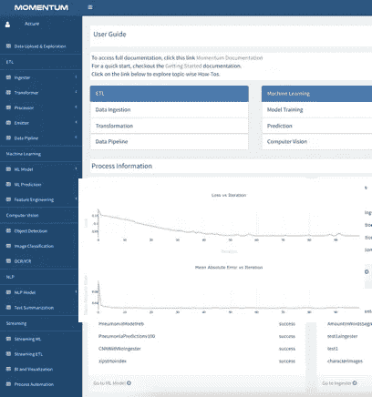
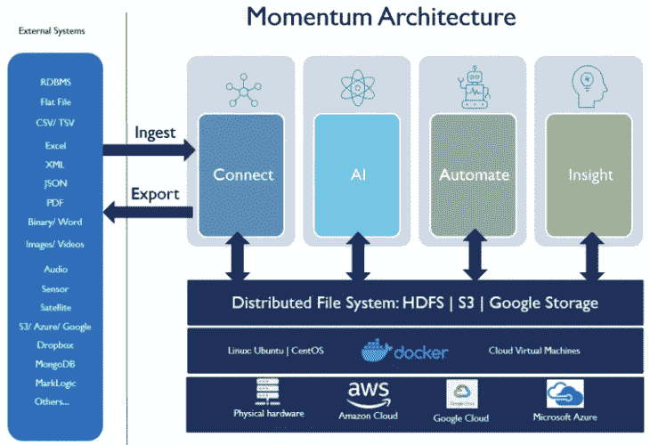
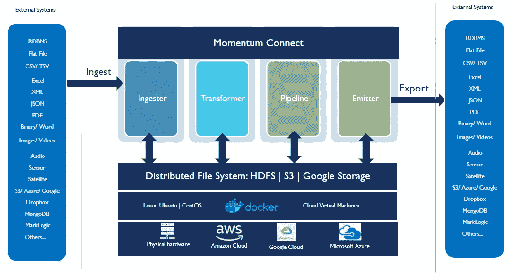

# 加速数据科学、人工智能和流程自动化的发展

> 原文：<https://medium.com/geekculture/accelerate-data-science-ai-and-process-automation-with-momentum-e27eb79cc8cb?source=collection_archive---------65----------------------->

Momentum 是一套软件平台，使数据工程师、科学家和分析师能够有效地解决机器学习问题并自动化业务流程。

Fig 1\. Momentum AI home page screen shot

**民主化人工智能开发**

Momentum 支持端到端的企业自动化，不依赖任何第三方。

1.  无需编码的单一平台和 UI 驱动的方法可以快速构建复杂的自动化任务。
2.  没有第三方依赖性，节省了许可成本，避免了集成的复杂性。
3.  使用该平台不需要专业技能。
4.  一个企业规模的数据科学平台，用于训练机器学习、计算机视觉、人工智能和 NLP 模型，实现智能自动化。

**气势建筑**

Fig 2\. Momentum Architecture

为了实现端到端的企业人工智能自动化，Momentum 由以下四个组件组成:

1.  **连接**以执行企业级的高速提取-转换-加载(ETL)。
2.  **机器学习和 AI** 通过 UI 驱动的方法训练和部署模型，快速解决机器学习问题。
3.  **自动化**允许使用基于直观用户界面的拖放工具实现业务流程自动化。
4.  4. **Insight** 以图形、图表和仪表盘的形式监控、跟踪和可视化人工智能成果。它还提供了一个确认和验证工作流引擎，以手动纠正人工智能模型的异常输出。

**动量有助于做什么？**

1.  **摄取:**来自所有 RDBMS、NoSQL、定界、文本、pdf、图像、视频、音频、传感器、卫星、Restful、医学图像、S3、Google Cloud、Dropbox 等等。​
2.  **转换:**高度可扩展的、简单的、基于用户界面的引擎，以一定的规模和速度转换、合并、连接、混合和过滤来自多个来源的所有数据。​
3.  **数据管道:**通过构建定制管道，以实时、预定或批处理模式处理数据，实现数据接收、转换、处理和交换的自动化。​
4.  **ML & AI:** 利用无编码 AI 平台，执行自动化特征工程，训练 AI 模型并部署到生产中。​
5.  **计算机视觉:**训练和部署基于图像和视频的分类、对象检测和面部识别模型。使用预先训练和定制的 OCR/ICR 模型。​
6.  **NLP:** 使用或训练用于语言建模、文本摘要、POS、NER、情感分析、文档相似性等模型。​
7.  自动化:通过自动化重复的任务来创造数字化的劳动力。利用人工智能模型，通过用户界面驱动的方法构建复杂的业务流程自动化。​
8.  **可视化:**可视化人工智能成果，使用带有图形和图表的直观的基于 web 的仪表板监控和跟踪 KPI。使用可定制的工作流程执行验证和确认。​

**平台规格**

**数据来源**

Momentum 支持 ETL 输入和输出的以下数据源

1.  RDBMS: MySQL、MSSQL、Oracle、DB2、Postgres 和所有支持 JDBC 的 RDBMS。
2.  NoSQL: Cassandra，MongoDB，MarkLogic，Solr，Elastic sea chr 等等。
3.  结构化文件:CSV、TSV、文本、XML 和 JSON
4.  非结构化文件:文本、图像、视频、音频、传感器和卫星数据
5.  分布式文件系统:HDFS、谷歌云存储、S3 和 Dropbox
6.  可插拔架构，增加更多的来源。

**BI 集成**

1.  动量洞察力
2.  （舞台上由人扮的）静态画面
3.  Qlik
4.  功率 BI
5.  碧玉
6.  微观策略
7.  斯帕戈比

**内置转换功能**

**数学函数**

1.  圆形()，地板()，()，天花板()
2.  rand()，exp()，ln()，log()，log2()，pow()
3.  sqrt()、hex()、unhex()、abs()、pmod()
4.  sin()，asin()，cos()，acos()，tan()，atan()
5.  度数()，弧度()
6.  正()，负()，符号()
7.  e()、pi()

**聚合函数**

1.  count()，sum()
2.  avg()、min()、max()、variance()、var_pop()、var_samp()
3.  stddev_pop()，sdtdev_samp()
4.  cov_pop()，covar_samp()，corr()
5.  百分点()，百分点 _ 近似值()
6.  histogram_numeric()，collect_set()

**日期功能**

1.  from_unixtime()，unix_timestamp()，to_date()
2.  年()、月()、日()、小时()、分钟()、秒钟()、星期()
3.  datediff()，date_add()，date_sub()
4.  from_utc_timestamp()，to_utc_timestamp()

**条件函数**

1.  如果()
2.  联合()
3.  情况..当...的时候..然后..结束

**机器学习算法**

**监督回归**

1.  [广义线性回归](https://one.accure.ai:8443/mv-admin/jsp/ML.jsp#)
2.  线性回归
3.  随机森林回归
4.  决策树回归
5.  深度学习/人工神经网络回归
6.  索引模型的字符串
7.  递归神经网络回归(LSTM)
8.  梯度推进树(GBT)回归
9.  生存回归
10.  保序回归
11.  因式分解机回归

**监督分类**

1.  逻辑回归
2.  决策树分类器
3.  随机森林分类器
4.  深度学习/人工神经网络/多层感知器分类器
5.  马尔可夫链与神经网络
6.  卷积神经网络(CNN)
7.  梯度增强树(GBT)分类器
8.  线性支持向量机(LSVM)
9.  朴素贝叶斯分类器
10.  因式分解机器分类器

**无监督机器学习**

1.  k 均值聚类
2.  潜在狄利克雷分配(LDA)聚类
3.  对分 K-均值聚类
4.  高斯混合模型(GMM)聚类
5.  幂迭代聚类

**自然语言处理**

1.  Word2Vec
2.  文档相似度
3.  标记化、句子切分、词性、NER 和概念分类
4.  文本摘要
5.  情感分析

**使用交替最小二乘法的推荐引擎/协同过滤**

**计算机视觉**

1.  LSTM 为 OCR 和 ICR
2.  卷积神经网络(CNN)
3.  使用单次多盒检测(SSD)的对象检测
4.  使用 YOLO 的目标检测
5.  使用 RCNN、快速 RCNN 和更快速 RCNN 的对象检测
6.  面部识别

**特色工程**

1.  皮尔逊卡方检验
2.  相关系数——皮尔逊和斯皮尔曼
3.  重击
4.  要索引的字符串
5.  OneHotEncoder
6.  估算者
7.  主成分分析

**作为数据平台的势头**

Fig 3\. Momentum Data Platform Architecture

Momentum Connect 通过使用直观的用户界面创建数据管道，允许自动接收、转换和处理数据。除了简化机器学习的数据争论之外，它还允许构建可扩展的数据湖，该数据湖具有对复制、容错、故障转移和高可用性的内置支持。

**高级功能**

**安全性** : Momentum 集群部署在受保护的安全网络基础设施中。

**隐私和访问保护:**数据模型、洞察和输出级保护和访问通过基于角色和共享机制进行管理。

**监控和警报:**内置对失败/成功的数据和流程审计、系统监控、通知和警报的支持。

**光学字符和手写识别(OCR/ICR):** Momentum 支持训练自定义模型来识别几乎所有语言的打印和手写文本。

**用于再培训的反馈:** Momentum Insight 提供了一个可定制的基于 web 的验证和确认(vnv)引擎，用于传输异常输出以进行手动纠正。手动校正的输出可以作为模型的反馈给出，以重新训练和提高精度。

**气势入门**

Momentum 可通过基于网络的交互式用户界面访问。要访问，请点击链接注册一个免费账户:[https://impulse.accure.ai/register/](https://impulse.accure.ai/register/)