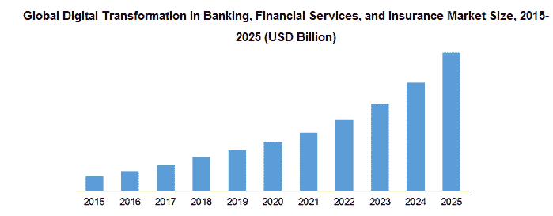
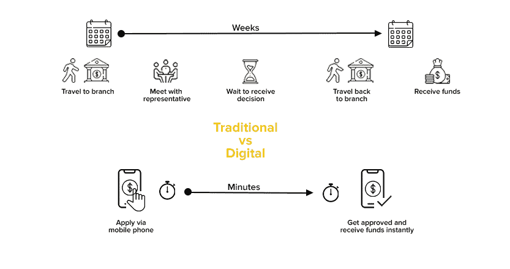
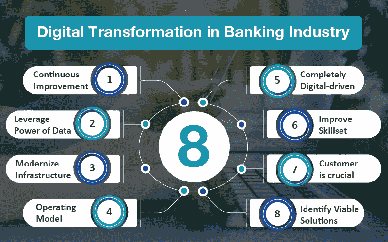

# 加速银行业的数字化转型:银行如何在数字化时代保持竞争力？

> 原文：<https://medium.com/geekculture/accelerating-digital-transformation-in-banking-how-banks-can-remain-competitive-in-the-digital-age-af1a1466254d?source=collection_archive---------8----------------------->

资料来源:AiMultiple

随着我们不断进入数字时代，商业和服务部门有必要将其运营数字化。尤其是在银行业，人们越来越多地使用移动和在线银行方式。

这导致各银行竞相采用数字化转型战略，以便在数字化时代保持竞争力和相关性。

甚至全球数字化转型的市场规模也在快速增长，到 2025 年将达到 299.7 亿美元。

但这意味着什么呢？银行如何着手去做呢？这些是我们将在今天的博客中寻找的一些问题。

这将帮助您实施最佳数字化转型战略，成为这场竞赛中的唯一参赛者。我们还会给出一些关键的提示，告诉你如何保持领先。

所以，事不宜迟，我们进去吧。

# 什么是银行业的数字化转型？

银行业的数字化转型正在彻底改革银行的运营，使其在数字时代更加高效和有效。这可能包括使用数字渠道与客户互动、自动化流程以及使用分析来更好地了解客户行为。

资料来源:appinventiv。

许多银行都在努力跟上数字世界的快速变化，他们正在被提供创新银行产品和服务的技术型创业公司所取代。

为了保持竞争力，银行需要接受数字化转型，并使其系统和流程适应现代时代。数字化转型的一些主要优势包括提高效率、降低成本和提高客户满意度。

***亦读*** [***人工智能如何重新定义数字化转型战略的成功？***](https://www.valuecoders.com/blog/technology-and-apps/how-artificial-intelligence-is-redefining-success-of-digital-transformation-strategies/)

# 推动银行业数字化转型的关键因素

数字驱动的市场继续增长，越来越多的客户将交易和银行活动转移到网上。这迫使银行采用新技术来快速保持竞争力。推动这一数字化转型的关键因素包括以下变量:

*   **客户的重要性**

客户满意度是任何企业成功的关键因素，对银行来说尤其如此。为了在数字时代竞争，银行需要专注于提供满足客户需求的卓越客户体验。

这包括提供方便易用的数字渠道和创新产品及服务，帮助客户节省时间和金钱。您还可以联系 [**顶级数字化转型咨询公司**](https://www.valuecoders.com/blog/technology-and-apps/top-10-digital-transformation-companies-you-must-consult-to-adapt-modern-tech/?utm_source=top_blog&utm_medium=Guest_Blog&utm_campaign=Medium&utm_id=NKY) ，利用数字化转型服务。

*   **运营模式**

对于数字化转型，银行需要思考自己的整体运营模式。这包括他们提供的渠道、他们提供的产品和服务，以及他们如何与客户互动。

银行需要确保其运营模式足够灵活，能够随着时代的变化而变化，并满足客户的需求。

*   **数据的力量**

数据的力量是推动银行业数字化转型的关键因素之一。银行可以使用分析来了解客户的行为和需求，这可以帮助他们为客户创造更个性化的体验。

此外，银行可以利用数据改善运营，做出更明智的决策，并降低成本。

*   **完全数字化驱动的市场**

银行需要专注于数字化转型，以保持领先地位。这包括创建一个数字化驱动的市场，为客户提供引人入胜的便捷体验。

但是，您可以联系数字化转型服务公司，帮助您对银行服务和产品进行数字化转型，以覆盖最大范围的受众。

通过这种方式，银行可以提高客户保持率，增加市场份额，并增加收入。

***亦读*** [***数字化转型如何成为企业扭亏为盈的决定性因素|认识要领***](https://www.valuecoders.com/blog/technology-and-apps/all-about-digital-transformation/)

# 现代银行使用的数字技术

为了应对这些挑战，银行正在转向人工智能(AI)、大数据、区块链和其他前沿技术。

*   **人工智能**

银行正在使用人工智能完成各种任务，包括客户服务、欺诈检测和贷款审批。人工智能可以通过提供更个性化的服务和基于客户行为的建议来帮助银行改善客户体验。

此外，AI 可以‌streamline 内部操作，如处理贷款申请或识别潜在的洗钱活动。最后，AI 可以通过识别可疑活动并标记它以供进一步调查来‌combat 网络犯罪。

您还可以联系[**IT 转型顾问**](https://www.valuecoders.com/it-strategy-consulting-firms?utm_source=IT_Strategy&utm_medium=Guest_Blog&utm_campaign=Medium&utm_id=NKY) ，将 AI 技术融入您的银行产品或服务。

*   **大数据**

推动银行业数字化转型的另一项关键技术是大数据。通过分析大量的客户数据，银行可以更好地了解客户，开发更有效的产品和服务。

例如，通过使用预测分析技术，金融机构可以识别客户行为模式，帮助他们做出更明智的业务决策。

此外，大数据使银行能够更好地了解欺诈风险，并在网络攻击发生前加以防范。

*   **区块链**

许多银行也将区块链技术作为其数字化转型努力的一部分。区块链是一个分布式账本系统，提供网络上发生的所有交易的不可变记录。

这使得它非常适合于跟踪多方之间的复杂交易，如金融交易或供应链活动。

区块链还可以用于安全存储和共享敏感数据，如医疗记录或客户信息。总体而言，区块链有潜力彻底改变银行和金融的许多方面，最终帮助银行在当今快速变化的数字环境中保持竞争力。

*   **物联网**

物联网(IoT)是推动银行业数字化转型的另一项关键技术。物联网是一个设备网络，这些设备相互连接并可以相互通信。

这允许各种应用，例如跟踪仓库中的库存或监控城市中的能源消耗。

银行已经通过将物联网集成到其产品和服务中来利用物联网的力量。例如，银行正在利用物联网开发新的移动支付应用，允许客户用智能手机支付产品和服务。

此外，银行正在使用物联网创建“智能城市”，这些城市使用传感器和数据分析来优化能源消耗、交通流量和城市化的其他方面。

# 银行业数字化转型的主要优势

资料来源:veritis

1.  **改善客户体验**

经历了数字化转型的银行看到了客户体验的显著改善。这是因为客户现在可以随时随地通过任何设备访问他们的帐户和服务。

此外，在线银行和移动应用程序等数字渠道提供了更大的透明度和客户信息的可访问性，使他们更容易按照自己的方式管理财务。

**2。提高效率和生产力**

银行业数字化转型的另一个重要好处是提高了效率和生产力。

通过简化流程和自动化传统手动或使用纸质文档手动完成的任务，银行可以腾出员工的时间来专注于更高价值的活动，如开发新产品或服务。

**3。增强的安全性**

增强的安全性也是银行业数字化转型的显著优势之一。随着银行转向更加数字化的生态系统，它们可以利用高级风险检测和分析工具来监控客户数据和交易中的可疑活动。

这些技术有助于保护客户免受欺诈和其他类型的网络犯罪，同时确保遵守 KYC 和 AML(反洗钱)政策。

**4。更大的竞争优势**

数字化转型可以让银行在市场中获得更大的竞争优势。通过提供更现代、更便捷的客户体验，银行可以吸引新客户并留住现有客户。

此外，数字化转型带来的效率和生产率的提高可以帮助银行节省运营成本，这可以在创新或营销等其他领域实现‌invest。

**5。个性化服务**

个性化服务是银行业数字化转型的主要优势之一。通过了解客户的个人需求和偏好，银行可以为他们创造更加个性化的体验，满足他们的特定需求。

这可以包括量身定制的产品推荐、个性化的帐户报表，甚至只是一个更友好的用户界面。

此外，银行可以使用数据和分析工具来获得对客户行为的洞察，然后利用这些洞察来开发更好地满足客户需求的新产品和服务。

***也看*** [***估价师如何开发出世界级的网上支付银行 app？***](https://www.valuecoders.com/blog/technology-and-apps/how-valuecoders-developed-a-world-class-online-payment-banking-app/)

# 总结想法

如上所述，数字化转型是现代银行业的重要组成部分，为银行及其客户带来诸多好处。这些好处包括改善客户体验、提高效率和生产力、增强安全性等。

因此，数字化转型是任何当代银行成功的关键。如果您是银行业专业人士，了解最新的数字趋势和工具并确保您的机构跟上这个快速发展的行业非常重要。一家 [**定制软件应用开发公司**](https://www.valuecoders.com/custom-software-development-services-company?utm_source=cust_deve&utm_medium=Guest_Blog&utm_campaign=Medium&utm_id=NKY) 可以帮你实现这种转变。

因此，无论您是希望踏上数字化转型之旅，还是需要帮助来优化您现有的工作，您都可以联系一家 [**数字化转型服务公司**](https://www.valuecoders.com/digital-transformation-development-services?utm_source=dig_trans&utm_medium=Guest_Blog&utm_campaign=Medium&utm_id=NKY) 。它们将帮助您在当今竞争激烈的金融环境中茁壮成长。