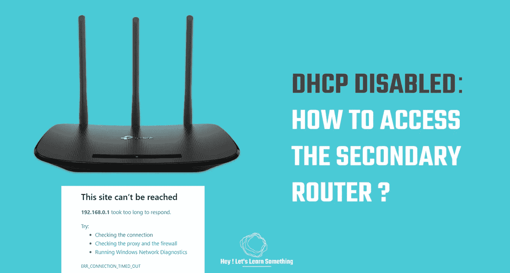

# 在关闭 DHCP 的情况下访问辅助路由器

> 原文：<https://medium.com/geekculture/access-the-secondary-router-with-dhcp-off-9026a2182fc6?source=collection_archive---------10----------------------->

**另外，学习登录用作接入点的二级路由器**

我们使用旧路由器作为备用路由器，禁用了 DHCP。DHCP 一关闭，对辅助路由器的访问就中断了。重置是唯一的选择，但我们正在寻找替代方案。因此，只要稍微摆弄一下 IP 地址，我们就能访问辅助路由器…