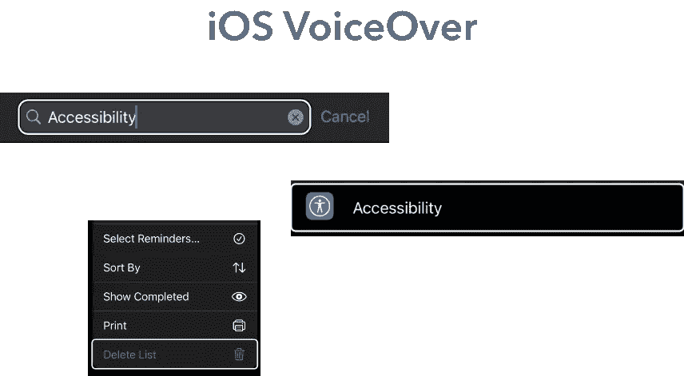

# iOS 中的可访问性

> 原文：<https://medium.com/geekculture/accessibility-in-ios-ce09f6df992b?source=collection_archive---------6----------------------->

## 带画外音



## 介绍

> VoiceOver 是一个屏幕阅读器，可以与应用程序中的对象进行交互，因此用户即使看不到它，也可以驱动界面。确保应用程序中的用户界面元素是可访问的和有用的。
> ——[苹果](https://developer.apple.com/accessibility/ios/)

尽管 Apple 在您的应用程序中提供了许多默认的辅助功能元素，如标准 UIKit 控制和视图，但更复杂的视图可能会导致 VoiceOver 与您的视图组件不兼容。因此，在构建 VO 时，确保牢记用户体验是很重要的；不管是通过接口生成器还是协议实现。

VoiceOver 的目的是将来自应用程序界面的信息传达给残疾用户，以便帮助他们有效地使用应用程序。

## 提示和技巧

在进入 UIAccessibility 的各种组件之前，让我们先来看一些初步的提示和技巧，它们将帮助您在设备上方便地使用和测试 VoiceOver 功能:

*   **辅助功能快捷方式** : *设置>辅助功能>一般:辅助功能快捷方式*
    选择 VoiceOver 可以三次点击侧面按钮来切换功能的开/关。
*   **画外音速度** : *设置>无障碍>画外音>语速:并调整。
    或
    切换辅助功能转盘(双指扭转运动)>导航至语速>用一个手指上下滑动以调整语速*
*   **原生应用参考**:我个人喜欢参考某些 iOS 应用，以确保我实现的 VO 行为与苹果的设计模式相似。我参考的一些应用有:
    -设置
    -应用商店
    -消息
    -地图
    -音乐
*   **A11y**:“accessibility”的缩写，来源于通过用中间字母的数量代替中间字母来缩短长单词。在“a”和“y”之间有 11 个字母，所以“accessibility”变成了 a11y—[https://www.boia.org/blog/what-is-a11y](https://www.boia.org/blog/what-is-a11y)

# 目录

**ui Accessibility** *—is Accessibility element* *—Accessibility label*
*—Accessibility value
—Accessibility hint
—Accessibility trait
—UIAccessibility element* —*UIAccessibilityCustomAction
—uiaccessibilitypostonification* 

# **ui 可访问性**

> **一组方法，提供有关应用程序用户界面中视图和控件的可访问性信息。
> ——[苹果](https://developer.apple.com/documentation/objectivec/nsobject/uiaccessibility)**

**标准 UIKit 控件和视图实现了`UIAccessibility`方法，默认情况下辅助应用程序可以访问它们。然而，当创建定制视图和控制器时，您可能需要创建一个`UIAccessibilityElement`实例来与辅助功能接口。**

## ***UIAccessibilityElement***

**一个实现`UIAccessibility`非正式协议的类。这允许您将属性和方法设置为可由辅助应用程序访问。**

**以下是 UIAccessibilityElement 实例的示例。确保父视图可以通过父视图的`accessibilityElements`属性访问 accessibility 元素。**

**第 3 行将突出显示的框架设置为标题和副标题框架的并集。**

**现在让我们更深入地了解一些常见的可访问性属性**

*   **`isAccessibilityElement` *:布尔值，表示该元素是否为辅助应用程序可以访问的辅助功能元素。*
    当不希望辅助应用程序访问视图中的子元素时，可以将子元素`*isAccessibilityElement*` 设置为 false，或将视图`*isAccessibilityElement*` 设置为 true。
    如果视图`*isAccessibilityElement*` 为真，辅助应用将无法访问子视图。**
*   **`accessibilityLabel` *:本地化字符串中标识可访问性元素的简洁标签。* 该属性的默认值是`nil`，除非该元素是一个 UIKit 控件，在这种情况下，该值是一个从控件标题派生的标签。如果控件是图像，即 UIButton 中的图像，则该标签应设置为图像描述的内容，如果图像是播放/暂停图标，则该标签应设置为“播放”或“暂停”。标签也不应该包含控件的类型，例如一个按钮——“播放按钮”。这是因为 accessibilityTrait 应该包含该信息和/或 accessibilityHint。**
*   **`accessibilityValue` *:包含 accessibility 元素值的本地化字符串。当辅助功能元素具有静态标签和动态值时，设置此属性以返回值。* 即具有标签“Email”的 UITextField，但是用户在文本字段内的文本作为可访问性值。**
*   **`accessibilityHint` *:本地化字符串，包含对 accessibility 元素执行操作的结果的简要描述。* 该属性的默认值为`nil`，除非该元素是 UIKit 控件，在这种情况下，该值是系统提供的从控件类型派生的提示。
    设置这个属性可以让用户更清楚他们的行为会导致什么结果。
    遵循苹果公司提供的[这些指南](https://developer.apple.com/documentation/objectivec/nsobject/1615093-accessibilityhint)来设置辅助功能提示。**
*   **`accessibilityTrait` *:最能表征可及性元素的可及性特征的组合。* 如果你实现了一个定制的控件或者视图，你需要选择所有最能表征对象的可访问性特征，并通过执行一个 or 操作将它们和它的超类的特征(也就是用`super.accessibilityTraits`)结合起来。
    点击查看可用的[辅助功能列表。](https://developer.apple.com/documentation/uikit/uiaccessibility/uiaccessibilitytraits)**

**`accessibilityLabel`和`accessibilityValue`由逗号**、**分隔，而`accessibilityHint`和`accessibilityLabel && accessibilityValue`由句号**分隔。**这使得 VO 读出文本的方式大不相同。与 a11y 标签和值相比，在读出 a11y 提示之前总是有更长的暂停。**

## ***UIAccessibilityCustomAction***

***与内置动作一起显示的自定义动作数组。***

**当有多个操作可用时，使用自定义操作。用户可以上下滑动来切换动作。**

****💡**如果您有一个带有一个预期动作的自定义视图，考虑覆盖自定义视图的`accessibilityActivate()`方法，当用户用一个手指双击元素时，该方法被触发。稍后我将在**可访问性方法&属性**中介绍这一点。**

**上面，我们已经将 accessibilityCustomActions 的作用域设置为 call 和 email 动作。当用户上下滑动动作时，`name`将是 VO 读取的内容，而`selector`方法将是用户激活它时触发的内容。**

**当 VO 检测到一个元素上有基于`accessibilityCustomActions`属性的自定义动作时，VO 会添加可用的*动作。向上或向下滑动以选择自定操作。然后，双击激活。*"文本为 accessibilityHint。**

> ****很高兴知道*💡*** :启用 VO 的用户可以用两个手指在屏幕上做出“Z”的手势，作为后退/退出动作。只需覆盖视图控制器上的`*accessibilityPerformEscape()*`方法进行进一步的定制——使用术语“进一步的定制”,因为视图控制器默认具有该功能！**

## **uiaccessibilitypostonnotification**

***向辅助应用发布通知。***

**当您的视图组件频繁变化或出现或消失时，请调用`UIAccessibility.post(notification:argument:)`。**

**点击查看通知列表[。](https://developer.apple.com/documentation/uikit/uiaccessibility/notification)**

```
UIAccessibility.post(notification: .announcement, argument: "some text")
```

**一旦上面的行被触发，VO 将读取“一些文本”。**

# **辅助功能方法和属性**

*   **`accessibilityIncrement()` | `accessibilityDecrement()` *:告诉 accessibility 元素增加或减少其内容的值。* ⚠️元素必须有一个`adjustable`的 accessibilityTrait，方法才能被触发。
    这可以在 UISliders 中看到**
*   **`accessibilityPerformEscape()` *:关闭模态视图，返回动作成功或失败。***
*   **`accessibilityActivate()` *:告诉元素激活自身，并报告操作的成功或失败。***
*   **`accessibilityFrameInContainerSpace` *:辅助功能元素的框架，在其容器视图的坐标空间中。* 使用该属性设置一个元素的框架矩形，该元素的框架矩形可能会受到其容器视图的影响。
    即`titleLabel.frame.union(subtitleLabel.frame)` 使用框架，因为你需要屏幕上的坐标，而不是与父视图相关的坐标。点击阅读更多关于框架和边界[的差异。
    ⚠️有时 a11y 帧显示不正确，请查看在`viewDidLayoutSubviews()`方法中设置*accessibilityframeincainerspace*。](https://github.com/RinniSwift/Computer-Science-with-iOS/blob/main/ui.md#frame-vs-bounds)**
*   **`accessibilityViewIsModal` *:一个布尔值，指示 VoiceOver 是否忽略视图中作为元素同级的辅助功能元素。* ⚠️重要提示:有时当一个视图控制器没有完全呈现时，VO 可以检测到当前呈现的视图控制器之外的元素。只需将该属性设置为 true，这将使 VO 只访问当前视图控制器中的元素。**

## ****参考文献****

**[https://developer.apple.com/accessibility/ios/](https://developer.apple.com/accessibility/ios/)
[https://developer . apple . com/documentation/objectic/nsobject/ui accessibility](https://developer.apple.com/documentation/objectivec/nsobject/uiaccessibility)
[https://developer.apple.com/videos/play/wwdc2018/226](https://developer.apple.com/videos/play/wwdc2018/226)
[https://developer.apple.com/videos/play/wwdc2016/202](https://developer.apple.com/videos/play/wwdc2016/202)
[https://developer . apple . com/videos/frameworks/accessibility/](https://developer.apple.com/videos/frameworks/accessibility/)**

**有多余的时间吗？看看这个 GitHub 回购:
[IOs 版计算机科学](https://github.com/RinniSwift/Computer-Science-with-iOS) ⭐️**

**📌在 LinkedIn 和 GitHub 上找到我。😃**

**请在下面的评论区留下你发现的任何可访问性提示和技巧！**