# 从 Flutter 应用程序访问 AWS S3

> 原文：<https://medium.com/geekculture/accessing-aws-s3-from-a-flutter-app-a7189cb74e3c?source=collection_archive---------4----------------------->

# 概观

AWS Amplify 是一套工具和服务，可以一起使用或单独使用，以帮助前端 web 和移动开发人员构建可扩展的全栈应用程序，由 AWS 提供支持。使用 Amplify，您可以在几分钟内配置应用后端并连接您的应用，只需几次点击即可部署静态 web 应用，并在 AWS 控制台外轻松管理应用内容。

Amplify 支持流行的 web 框架，包括 JavaScript、React、Angular、Vue、Next.js，以及移动平台，包括 Android、iOS、React Native、Ionic、Flutter。借助 AWS Amplify 更快上市。

我试图了解如何使用 Amplify for Flutter 来访问 AWS S3。我按照文档@ [链接](https://docs.amplify.aws/lib/storage/getting-started/q/platform/flutter)为 Flutter 添加了 AWS S3 支持。

# 首要先决条件

按照这个演示，Flutter 应用程序应该已经配置为支持 Amazon Cognito。跟随[这个](/geekculture/aws-amplify-for-flutter-613c1c07b0e2)添加 Cognito 支持。

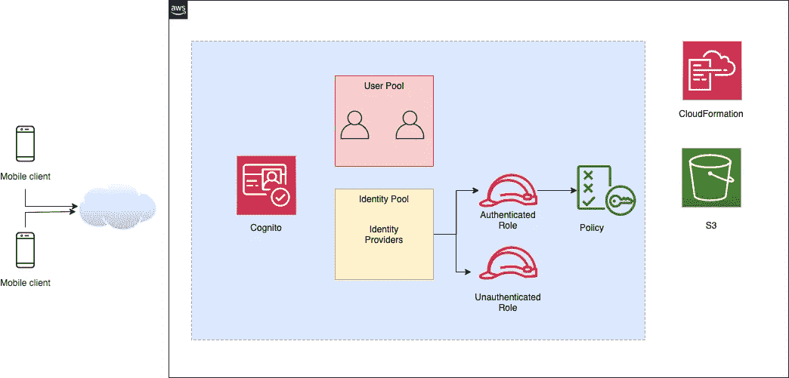

# 使用的 AWS 服务

虽然科宁托和 S3 是直接使用的，但下面是其他间接使用的 AWS 服务。

*   Cognito —用于身份验证
*   简单存储服务(S3) —用于对象存储
*   身份和访问管理(IAM) —针对角色/策略
*   安全令牌服务(STS) —生成临时凭据
*   云形成—使用模板部署资源

# #2 增加 S3 支持

在 Flutter 应用程序的根目录下，从命令行执行以下命令。

```
➜ cd ~/Desktop/flutter_aws_s3
➜ amplify add storage
```

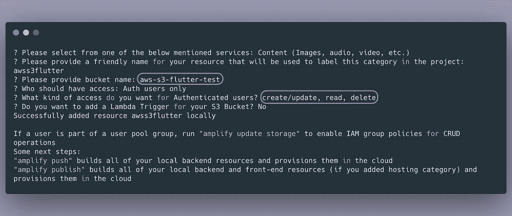

*   S3 指定的桶名是`aws-s3-flutter-test`。但是，AWS 在末尾添加了随机字符串，以确保该 bucket 不存在。
*   我们在这里指定的访问是`create/update, read, delete`。这决定了将创建并附加到角色的 IAM 策略。

# 在云中创建资源

这一步在云中创建物理资源— S3 存储桶、更新 IAM 角色、创建 IAM 策略等。

```
➜ amplify push
```

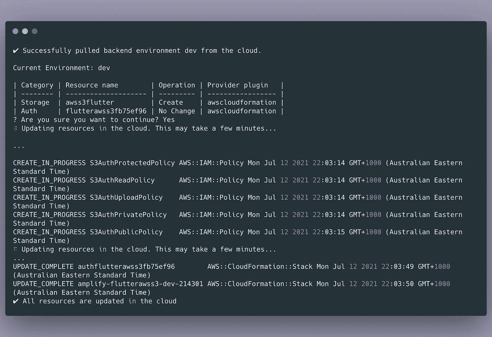

# 确认

我们将使用 AWS CLI 来验证云中创建的资源。按照此页面安装 AWS CLI。

## 列出用户池

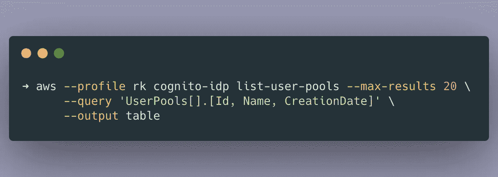

## 列出身份池

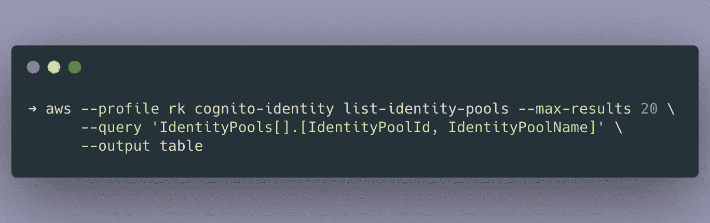

## 列出与身份池关联的角色

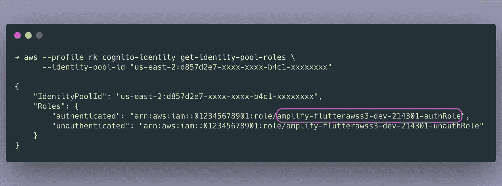

现在，用经过身份验证的角色名创建一个环境变量。我们将使用它来查看附加到角色的策略。

```
➜ auth_role='amplify-flutterawss3-dev-214301-authRole'
```

## 显示附加到角色的策略

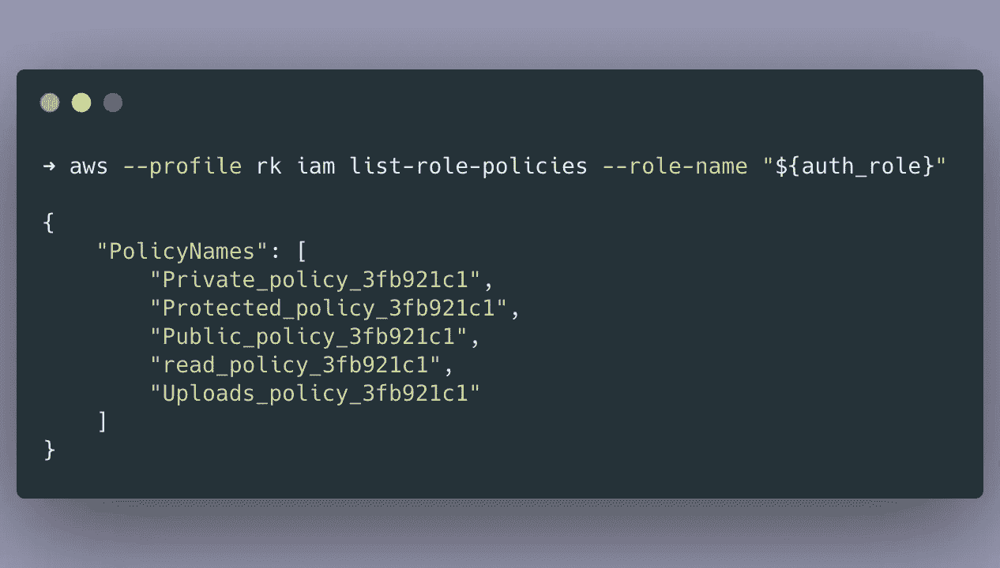

## 显示私人政策

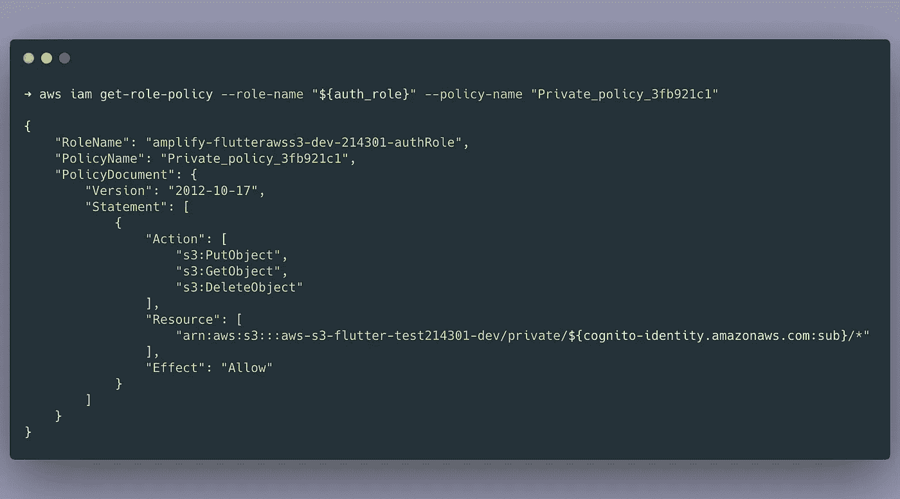

记下**资源**的名称。此策略允许用户上传/下载/删除对象。但是，他只能对 **private/***(私有/***)下存储在自己空间中的对象执行这些操作。****`cognito-identity.amazonaws.com:sub`是登录用户的身份。**子**用于**主题**。**

**类似地，可以使用以下命令查看其他策略。(根据上面的输出更改策略名称)。**

```
➜ aws iam get-role-policy --role-name "${auth_role}" --policy-name "Protected_policy_3fb921c1"➜ aws iam get-role-policy --role-name "${auth_role}" --policy-name "Public_policy_3fb921c1"➜ aws iam get-role-policy --role-name "${auth_role}" --policy-name "read_policy_3fb921c1"➜ aws iam get-role-policy --role-name "${auth_role}" --policy-name "Uploads_policy_3fb921c1"
```

**最后，我们可以验证 S3 桶。**

**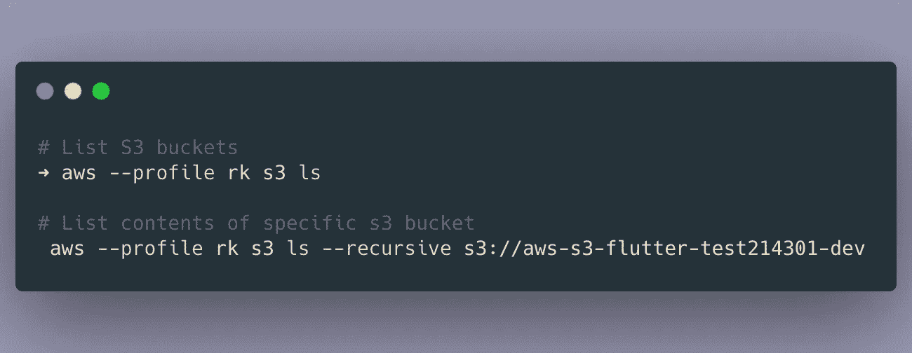**

**一旦创建了资源，Amplify 还会更新`lib/amplifyconfiguration.dart`。这就是 Flutter app 如何知道使用哪个用户池/身份池以及访问哪个 S3 桶。**

****

# **#3 对 Flutter 应用程序的更改**

# **3.1 更新`pubspec.yaml`**

**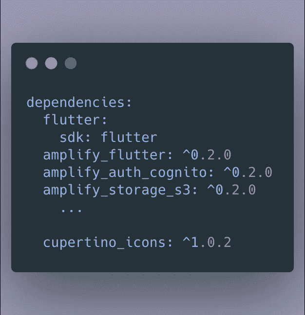**

# **3.2 初始化**

**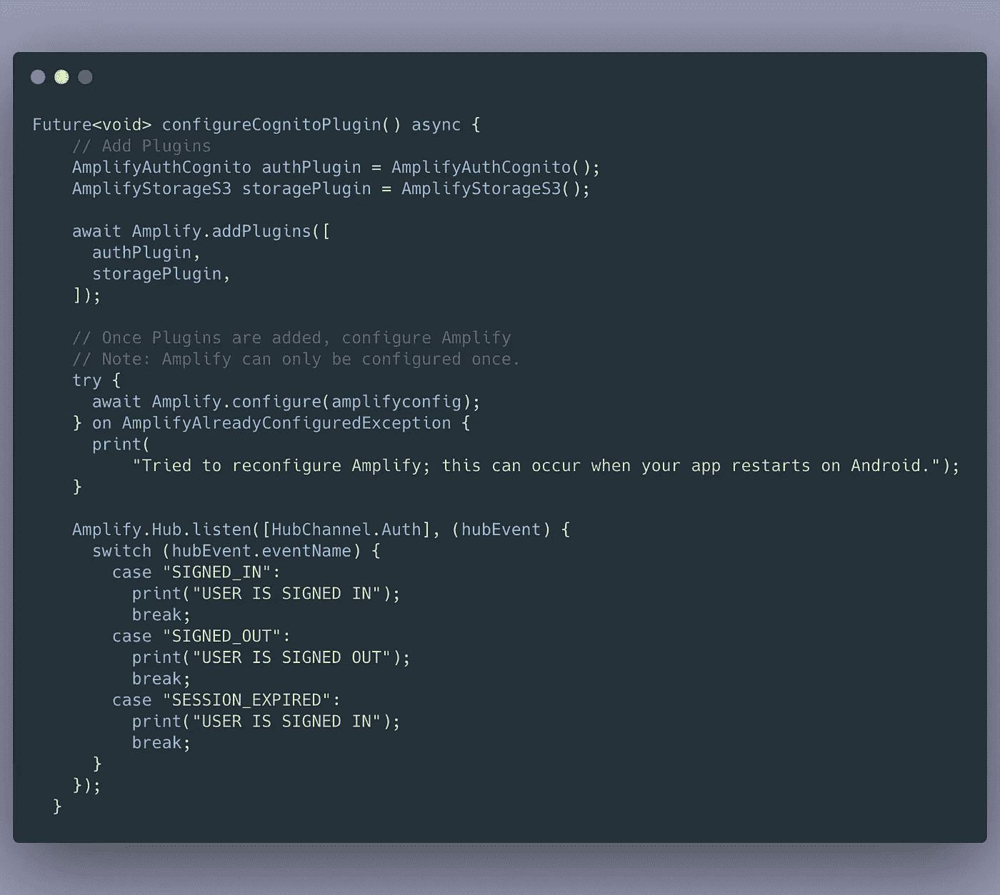**

## **3.3 上传对象**

**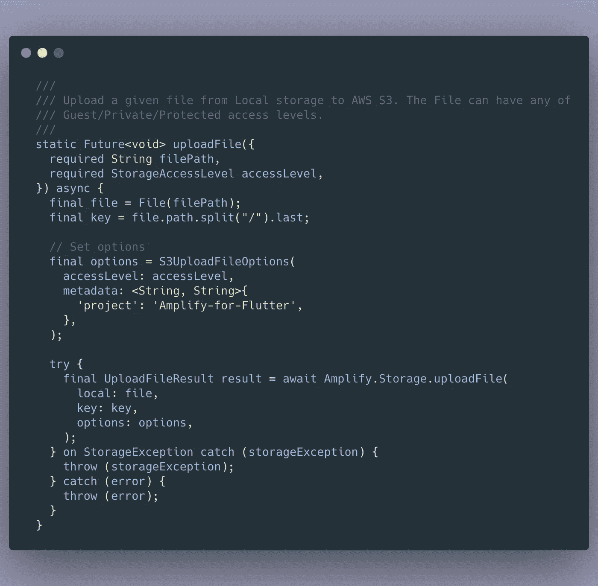**

## **3.4 列出对象**

**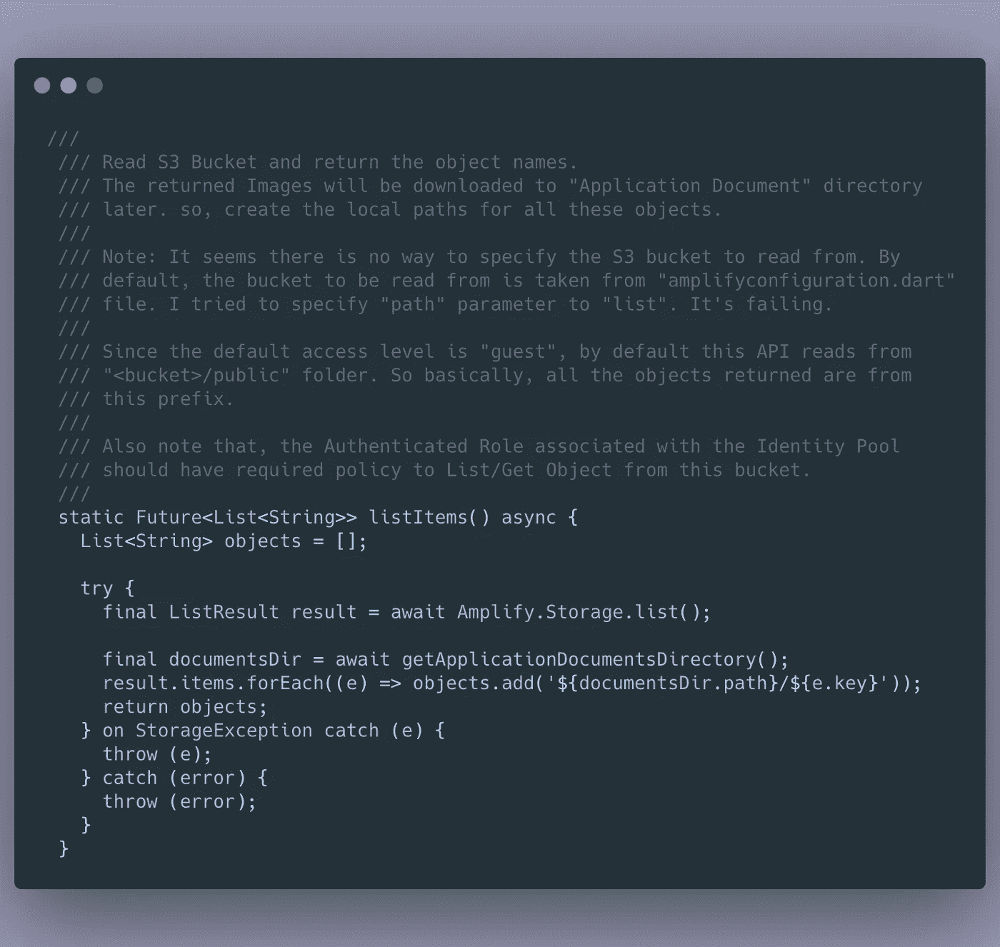**

## **3.5 下载对象**

**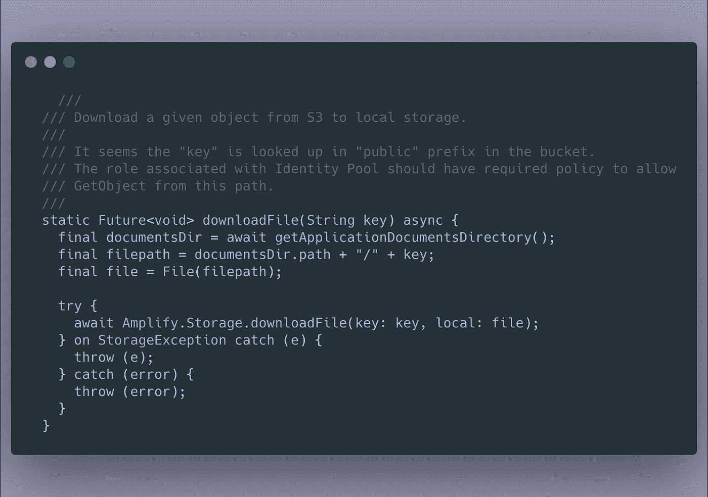**

# **#4 示例应用程序**

**我使用 Amplify 编写了一个示例颤振应用程序。它具有从手机上传图片到 S3，以及从 S3 下载图片到手机上的临时目录的功能。**

**GitHub — [回购](https://github.com/ryandam9/aws-amplify-s3-for-flutter-)**

**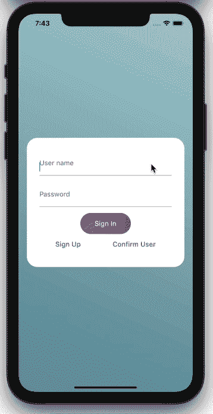**

# **#5 观察结果**

1.  **要使用的 S3 桶在`lib/amplifyconfiguration.dart`文件中配置。有时，我们可能需要使用多个 S3 桶。我不确定如何以及在哪里配置它。**

**这是上传文件的函数的签名。它没有指定存储桶名称的选项。**

**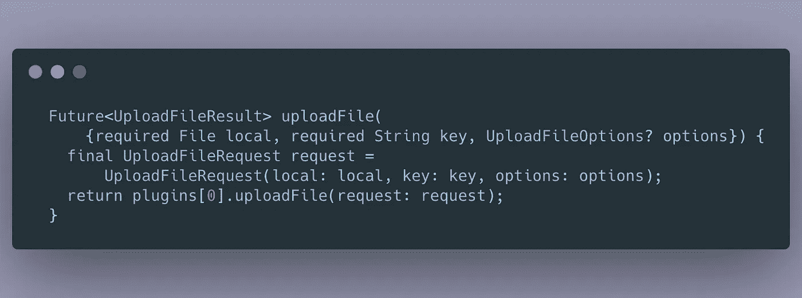**

**2.**文件夹** ( *注意，S3 并没有真正的文件夹/目录。它是一个扁平的结构。然而，通过使用正斜杠，它显示好像对象存储在子文件夹*中，其中图像存储在 S3 桶中由上传图像时选择的**访问**确定。**

****

****嘉宾****

*   **存储在**公共**前缀中**
*   **拥有访客权限的多个用户上传的图像将存储在此处。因此，访问他人的公共图像是可能的。**
*   **“访客”访问并不意味着图像可以被互联网上的任何人访问(假设他们知道路径)。访客只能访问该应用程序的用户(使用通过 amplify 创建的默认 IAM 策略)。**

****私人****

*   **所有图像都存储在**私有的**前缀中。**
*   **但是，每个用户都有自己的空间(目录/前缀)。不可能访问他人的私人图像。每个经过身份验证的用户在身份池中都有一个 ID。此 ID 用于创建用户空间。**

***以下是认证用户的身份 ID。***

**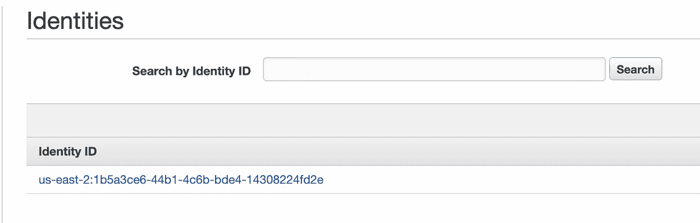**

**当他使用**私人**访问上传图片时，这是他的图片将被存储的地方:**

**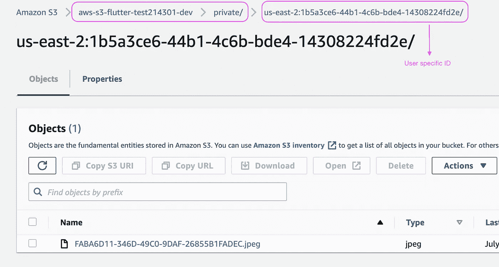**

# **#6 关于我**

*   **https://ryandam.net**