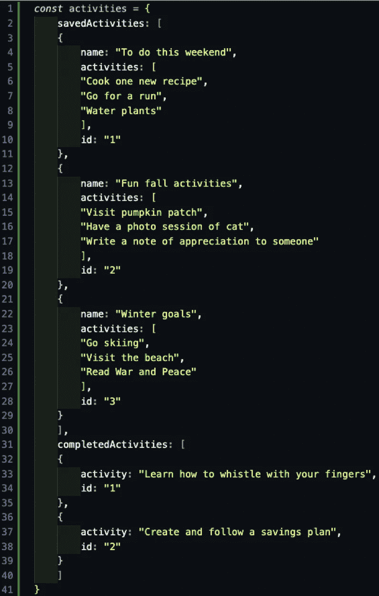
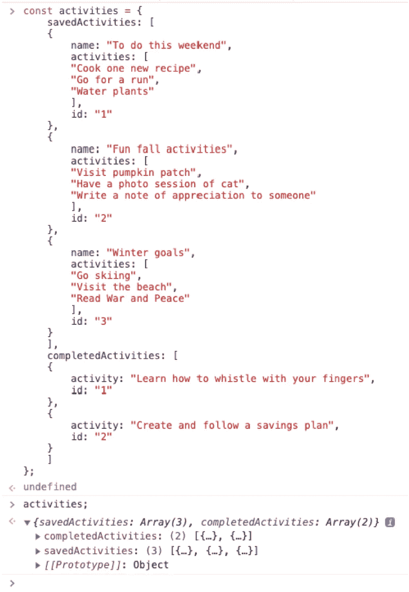
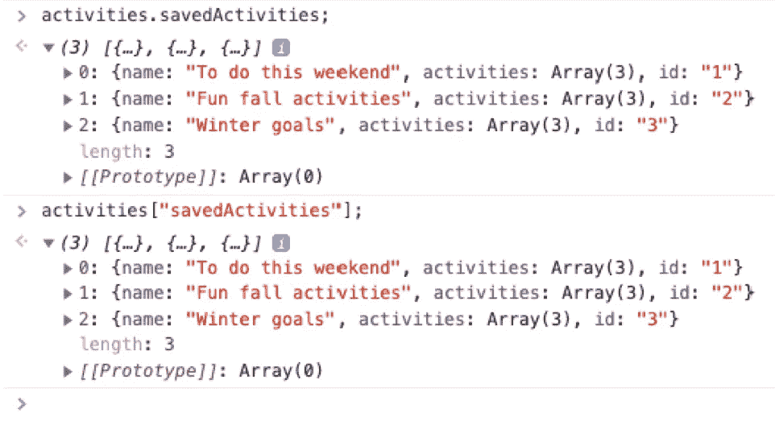
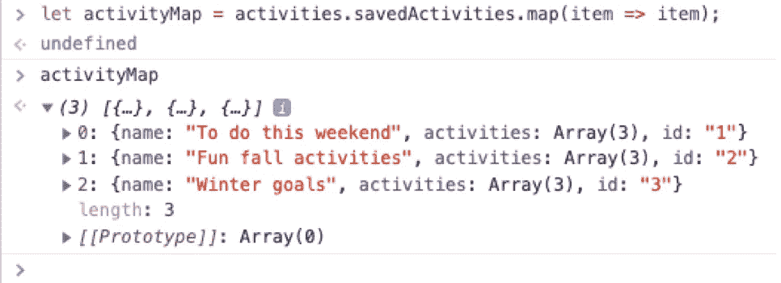
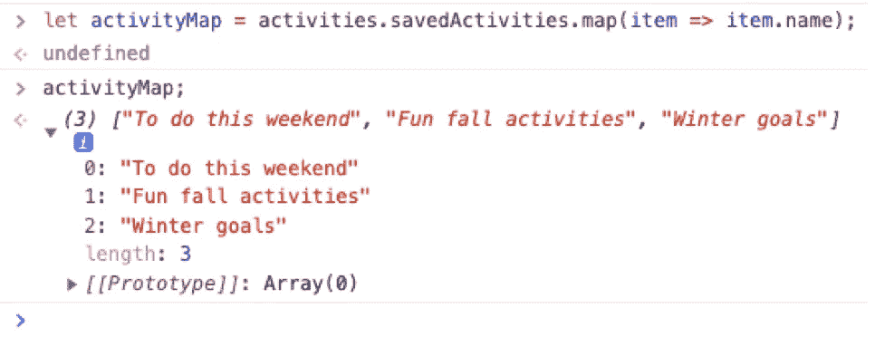

# 在 JavaScript 中访问嵌套数据结构中的数据——一个例子

> 原文：<https://medium.com/geekculture/accessing-data-inside-nested-data-structures-in-javascript-an-example-21c5ea1372e3?source=collection_archive---------11----------------------->

当我第一次接触 JavaScript 中的嵌套数据结构时，我很难理解如何从最内层提取数据。我将在这里向您展示一个例子，希望对其他 JavaScript 学习者有所帮助。解释 JavaScript 对象和数组不在这篇博文的范围之内，所以欢迎您在这里查看 JS 对象和数组的 MDN(或其他)资源:[数组](https://developer.mozilla.org/en-US/docs/Web/JavaScript/Reference/Global_Objects/Array)和[对象](https://developer.mozilla.org/en-US/docs/Web/JavaScript/Reference/Global_Objects/Object)。

请随时给我留言，让我知道这些例子是否对你有帮助，或者你有什么建议。感谢您的阅读，祝您好运掌握 JavaScript！

## 小抄

这里有一个简短的备忘单，列出了关于 JavaScript 对象和数组需要记住的重要事情:

*   JavaScript 对象——请记住，您可以使用点符号和括号符号来进入对象以访问其中的数据。我发现点符号更容易使用，因为它更容易读写，尽管记住可能需要括号符号的情况(非标准键和使用变量而不是文字键)很重要。
*   JavaScript 数组——记住你的数组方法，比如。forEach()和。地图()。我个人发现。map()更有用，因为它自动返回到一个新数组中，还因为它允许方法链接。

## JavaScript 对象和数组的复习

您可能熟悉 JavaScript 对象和数组，它们都是允许我们将相关数据集放在一起的数据结构。从技术上讲，数组是一种特殊类型的对象，尽管数组和对象之间存在一些差异，这要求我们在处理这些结构的方式上有所不同。您可能还记得，对象用花括号表示(即{})，而数组用直括号表示(即[])。数组和对象都保存相关的数据组，尽管记住数组一定是有序的而对象不是，这一点很重要。要进一步研究 JavaScript 对象和数组，请查看上面的链接资源。

## 什么是嵌套数据结构？

作为一个视觉学习者，我喜欢把嵌套的数据结构想象成一个有许多层的物理对象。

如果你把这个物体作为一个整体来看，一开始它可能看起来很大，很吓人。但是，如果你只是单独处理每一层，然后一层一层地剥离它们，我发现这使得嵌套的数据结构更容易理解和处理。

下面我们来看一个例子:

我们看到我们有一个名为 *activitiesList* 的对象。在该对象内部，我们看到两个数组——一个名为 *savedActivities* ，另一个名为 *completedActivities* 。在 *savedActivities* 内部，我们面对的是另一个数组。在这个数组中，我们还有 3 个对象。这三个对象都有一个名称、一个 ID 号和另一个字符串数组，其中该数组是与键/值对中的 *activities* 键相关联的值。

哇，一下子把这些读出来听起来太复杂了！我们如何从这些嵌套结构的中间提取数据呢？让我们忘记这个描述，一层一层来。

如果您还没有，请将 *activities* 对象复制到您的控制台中，这样您就可以跟随我们进入每一层。一旦你这样做了，继续前进，只是进入*活动；*进入你的控制台。毫无疑问，我们可以看到它返回了包含两个数组的对象。

*   提示:您可以看到它在上面的最后一行返回一个对象，这里写着“Prototype: Object”，因为它在原型上面几行的“savedActivities: Array(3)，completedActivities: Array (2)”响应周围显示了花括号(表示 JS 对象)。

为什么我们不首先想象我们想要从 *savedActivities* 数组中获取每个 *name* 值。首先，从上面我们知道外层是一个对象，我们也知道我们可以使用点符号和括号符号来获得对象的内部。有了这些知识，让我们测试点标记法和括号标记法。

使用点符号，我们将在控制台中键入*activities . saved activities*，我们将得到一个包含三个对象的数组。类似地，使用括号符号，我们可以在控制台中键入*activities[" saved activities "]*,我们将得到相同的三个对象的结果数组。

*   注意:记住，我们不能使用索引(例如 activities[0])来进入 savedActivities，因为对象的排序方式不同于数组。

由于上面的点符号和括号符号的例子将返回相同的结果，选择一种方法通常是个人偏好的问题。我通常选择点符号，因为它更容易键入和阅读，但也有一些情况需要括号符号，例如键是字符串的情况(即非标准键)，以及您可能需要使用变量而不是文字键来访问值的情况(即动态访问属性)。

既然我们已经剥离了外部的对象层以显示内部的两个数组，我们可以开始访问 *savedActivities* 数组内部的数据。而且，现在我们正在 savedActivities 数组内部工作，我们将有机会使用我们的数组方法。呜哇！

在这里，您可能想要查看关于数组方法的 MDN 文档。forEach()和。地图()。去吧，我等着！

虽然这两种方法都允许您遍历数组内部的数据，但我倾向于使用。map()，因为它会自动返回到一个新数组中。让我们试一试。

但是首先——记住。map()返回一个新的数组，所以这次我们需要赋值。。map()也接受每个条目并对其进行处理，尽管在下面的第一个例子中，我选择不做任何处理:

有意思！说白了，我们的。map()基本上是这样说的:“获取 *savedActivities* 数组中的每一项(在本例中是对象)，并将每一项放入一个新数组中，我们称之为 *activityMap* ”。这看起来眼熟吗？事实证明，这与我们之前简单地调用*activities . saved activities*得到的结果是一样的，因为我们实际上没有对映射到这里的项目做任何事情。

为了更深入一层，让我们使用点符号对 *savedActivities* 中的每一项执行一个操作。我们之前决定要获取与 *name* 键成对的值，所以我们知道我们可能需要在我们的操作中使用该键，如下所示:

完美！这一次。map()本质上说的是同样的事情，但是它没有返回新数组中的所有项目，而是只返回名称值。

换句话说，我们使用点符号剥离大的 *activities* 对象并访问 *savedActivities* 数组。然后我们使用了。map() array 方法对数组中的每一项执行任务。在本例中， *savedActivities* 数组中的项目是对象，每个对象都有一个键/值对，键为“name”。这意味着我们可以在。map()函数。中的点标记。map()函数本质上是说，“取 *savedActivities* 数组中的每个对象，只返回与‘name’键成对的值。”最后，既然。map()自动返回到一个新的数组中，我们看到名称值被放入我们为自己声明的数组中。太棒了。

既然您已经完成了这个示例的每一步，那么就可以在您的控制台上随意操作了。练习使用括号符号代替点符号，或者尝试访问不同的值。您正在掌握从嵌套数据结构中提取数据的艺术！