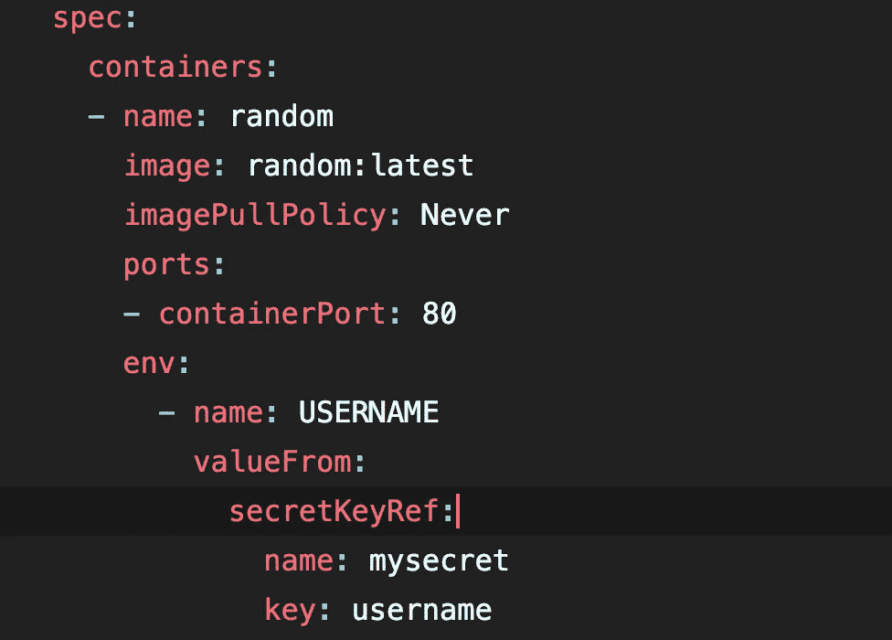
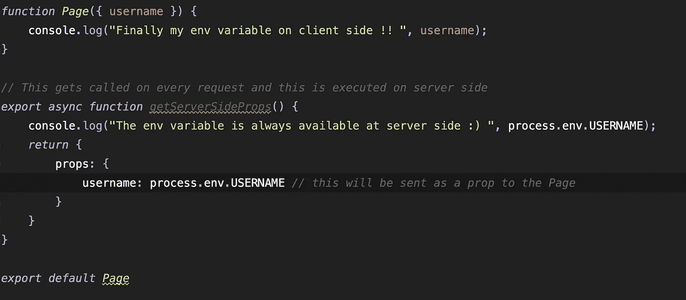
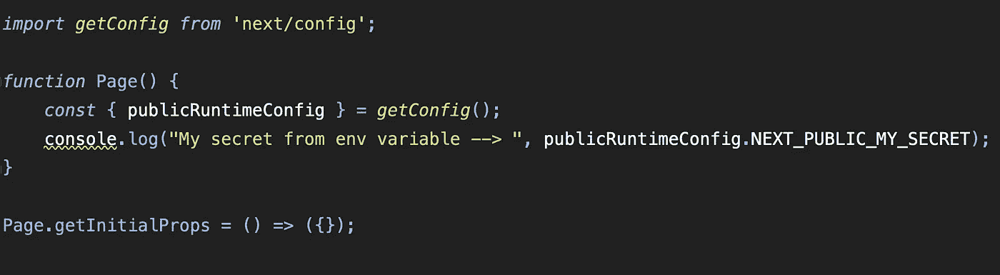

# 在客户端从 NextJs 应用程序中的 kubernetes/helm 访问环境变量

> 原文：<https://medium.com/geekculture/accessing-environment-variables-from-kubernetes-helm-in-nextjs-app-on-the-client-side-281cf5b60a3a?source=collection_archive---------0----------------------->

我将一个 kubernetes 秘密作为环境变量注入到我的 NextJs 应用程序中，如下所示:

我想在客户端代码中使用这个秘密的 env 变量(用户名)。

为了做到这一点，我遵循了以下文件-

 [## 基本功能:环境变量| Next.js

### 学习在 Next.js 应用程序中添加和访问环境变量。

nextjs.org](https://nextjs.org/docs/basic-features/environment-variables#exposing-environment-variables-to-the-browser) 

在使用“yarn dev”运行我的应用程序之前，当我导出变量时，我能够在本地以 NEXT_PUBLIC_USERNAME 的身份访问用户名。

但是当我在更高的环境下推送这段代码时，我发现客户端的 NEXT_PUBLIC_USERNAME 是**` undefined`****。**

****虽然在服务器端，同样的变量给出了正确的值。原来在运行时注入的环境变量在 NextJs 应用程序的服务器端总是可以访问的。****

**然后我仔细阅读了上面的文档，要暴露给 browser/client 的 env 变量将只在构建时设置其值**。****

**但是在更高级的环境中，这些 env 变量是在运行时使用 kubernetes **注入到容器中的。因此在构建时，设置给这些 NEXT_PUBLIC_* env 变量的值是未定义的。****

**NEXT_PUBLIC 变量未定义的另一个主要原因是**它与 NextJs 提供的** [**自动静态优化**](https://nextjs.org/docs/advanced-features/automatic-static-optimization) **不兼容。****

# **解决方案#1 —**

**因为 NEXT_PUBLIC 的东西帮不了我们。剩下的唯一方法是**以某种方式将 env 变量从服务器传递到客户机**。**

**看了很多文档，碰到一个服务器端函数`getServerSideProps`。**

****这个函数只在运行时针对每个页面请求在服务器上运行**。使用这个函数，我们可以在运行时将道具从服务器端传递到客户端。就在那时我有了这个想法！**

****

**这就是我在客户端成功访问 kubernetes 注入的 env 变量的方法！！**

**我认为代码是不言自明的，如果你通过下面的链接-**

** [## 数据提取:getServerSideProps | Next.js

### 如果您从页面中导出一个名为 getServerSideProps(服务器端呈现)的函数，Next.js 将预先呈现这个…

nextjs.org](https://nextjs.org/docs/basic-features/data-fetching/get-server-side-props) 

**如果我们没有任何敏感的 env 变量要从服务器传递到客户端，这个解决方案可以很好地工作。如果我们有它们，那么使用这个解决方案不会有帮助，因为它会在 network 选项卡中显示一个条目，并且我们敏感的 env 变量会被暴露。**

# 解决方案#2 —

如前所述，运行时的 NEXT_PUBLIC env 变量与 NextJs 提供的[自动静态优化](https://nextjs.org/docs/advanced-features/automatic-static-optimization)不兼容。

因此，如果我们想在没有任何间歇性问题的情况下使用它(值在重新加载或重定向时未定义，或者无论如何值本身未定义)，**我们应该使用** `**getInitialProps**` **退出** [**自动静态优化**](https://nextjs.org/docs/advanced-features/automatic-static-optimization) **。**

这将始终确保我们能够访问 NEXT_PUBLIC env 变量的正确值。

我们还需要在 next.config.js 文件的 publicRuntimeConfig 中添加相同的配置，如下所示:

现在，我们可以按以下方式使用 env 变量:

**如果我们要从其他页面重定向到这个页面，我们也必须在所有其他页面中使用这个 getInitialProps。否则，env 变量将给出未定义的值。**

声明:我对 NextJs 非常陌生，所以如果我在上面的帖子中提到了什么错误，请纠正我。如果有任何疑问，也可以在这里发表评论。**