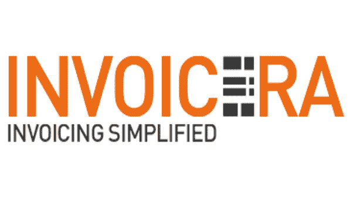

# 应收账款和应付账款:在线利弊

> 原文：<https://medium.com/geekculture/account-receivable-account-payable-online-pro-cons-69bd29bc11b4?source=collection_archive---------15----------------------->

[来源](https://www.zoho.com/books/articles/accounts-receivable-accounts-payable-guide.html)

应收账款和应付账款是企业两个最重要的财务管理程序。正确管理这些流程可能是决定一家公司发展成功或失败的最大因素之一。

因为一个企业的成长，它经常会超越它的会计系统。由于业务复杂性和处理的交易数量增加，It 部门可能需要升级或更换系统。

在线应收账款和 [**应付账款软件**](https://www.invoicera.com/accounts-receivable-payable-management.html?utm_source=gp&utm_medium=promotion&utm_campaign=RN) 工具正在帮助企业比以往任何时候都更快、更有效地处理他们的付款和发票。许多聪明的商业头脑已经转移到在线应收账款和在线应付账款解决方案。

但是，尽管这些程序可以提供所有的好处，在某些情况下使用它们仍然有一些缺点。在你采用这种方法之前，先看看在线应收账款和应付账款工具的优缺点，这样你就可以确定它们是否适合你的企业。

**应收账款的利弊**

*   **快速资助**

[来源](https://thestartuplab.in/funding-2021-indian-startups-receive-around-2-billion-funding-in-first-two-months/)

应收账款的一个重要优势是它的快速融资。现金流对任何企业来说都是一个重要的因素。但是，您可以将现金长期滞留在应收账款中。该公司必须等到顾客付清货款后才能动用这笔钱。

这一等待期可能需要购买的销售日期后的 30-90 天。这就是应收账款融资的用武之地，它允许公司更快地从购买中获得资金，这样他们就可以将资金用于商业目的，如为工资单、新库存等融资。

*   **最低信贷要求**

应收账款融资的另一个优势是它有最低限度的信贷要求。任何企业都需要信贷来支付某些时候的购买。然而，对于应收账款，公司没有必要向银行证明他们有良好的财务状况或任何其他此类文件。

因此，它使得那些由于规模和历史原因可能不提供这些信息的小公司有可能获得与大公司相同的资金。这有助于他们拓展业务，并与已经涉足该领域的大公司竞争。

*   **外包收款的能力**

外包收款能力是应收账款的一大优势。这使得公司在处理应收账款时，可以专注于其他更重要的领域。外包商可能会有许多不同的应收账款的经验，他们可以更好地专注于深入分析它们，而不仅仅是收集你所欠的。

**应收账款的弊端**

*   **可能很贵**

开具发票和收取应收账款的过程实施起来成本很高。您需要从各种来源收集数据，如客户、银行对账单和供应商。

然后需要有人监控发票的进度，以确保按时支付。这可能会很困难，因为对于逾期账款和核销等问题，存在具有挑战性的界面。

*   **缺乏控制**

应收账款的另一个缺点是难以控制。付款可能需要几天时间才能处理到账户上，这可能会导致现金流问题。如果发票没有在指定的时间框架内支付，这可能会更成问题，因为它还会导致滞纳金。

*   **对客户的依赖**

应收账款的一个缺点是客户依赖公司来维持平衡的现金流。风险可能很大，因为客户可以付费，也可以不付费，这将影响收入流。

公司处理这一问题的最佳方法是制定良好的信用政策，防止无法收回的应收账款的积累。

**应付账款的理由**:

*   **省钱**

应付账款将帮助您的公司通过自动化发票处理和减少错误来节省资金。正确的系统将使大部分发票处理自动化，并减少任何导致延迟付款等错误的人为错误。

应付账款还可以帮助您的公司保持准确的记录，并为税务目的提供一个源文档系统，该系统提供您需要的所有功能，并且对您的业务来说是负担得起的。

*   **提高效率**

AP automation 将通过根据付款到期日加快文件的处理和优先排序来提高效率。它还可以发送批准提醒以避免延误，这对于需要尽快处理订单的企业来说是非常好的。

*   **减少错误**

[来源](https://www.critigen.com/insights/news-and-blog/utility-network-resolving-data-errors/)

手动将数据输入系统时，人为错误的可能性总是存在的。只需要一个小错误就可以引入错误，这些错误会导致准确付款和保持记录的问题，在审计时会妨碍他们。

自动化解决了这个问题，它自动捕获所有收到的发票，再也不会丢失或被遗忘。

*   **加强文件控制**

自动处理应付账款是集中所有财务文件的好方法。这意味着文书工作不会在办公室丢失或被忽视，因为它们以数字形式保存在公司的计算机系统中。

*   **改善欺诈控制**

[来源](https://www.inc.com/david-finkel/the-top-20-financial-controls-to-protect-your-company-from-fraud-theft-and-embez.html)

应付账款是打击欺诈的强大解决方案。它可以帮助您了解您的公司正在发生什么，并创建使审计更容易的记录，从而保持警惕，抓住想要伤害的罪犯。

**应付账款的弊端**

*   **过渡到新系统**

在过渡到新系统的过程中，总会有一定的停机时间。基于云的 AP 自动化可以快速简单，但员工仍需要一些时间来适应他们新采用的工具集。更需要付出比平时更多努力的是让人们熟悉你所做的改变。所以试着寻找那些优先考虑容易的系统。

*   **数据安全风险**

[来源](https://www.globaltimes.cn/page/202107/1228380.shtml)

数据失窃的风险非常严重，任何人都可能遭遇这种风险。以数字形式存储在服务器上的数据比其他类型的数据更容易受到攻击，但仍有可能有人会入侵供应商的系统——也会危及你的信息。

*   **缺乏控制和定制**

自动化你的系统意味着放弃一定数量的控制。因此，您将使用其他人的软件，并且必须相应地调整您的 AP 过程。尽管如此，根据这家自动化公司的定制，你可以定制他们如何控制一切。

**使用 Invoicera 简化 AR 和 AP 流程**

[**Invoicera**](https://www.invoicera.com/?utm_source=gp&utm_medium=promotion&utm_campaign=RN) 是一个简单易用的仪表盘，可满足您所有的应付账款和应收账款管理需求。它通过将您所有的发票需求简化到一个简单的平台中，使您的会计工作变得更加轻松。

此外，Invoicera 是任何企业的理想选择，从小型零售店到需要发票、库存、物料清单和采购订单会计的大型公司。

**使用 Invoicera，您可以:**

*   管理信用和收款。
*   做预算，预测财务。
*   发送自动付款提醒和收据。
*   轻松管理报告和快速分析。
*   实时跟踪发票状态。
*   轻松创建评估。
*   查看详细的财务报告。
*   管理在线定期支付和订阅账单。

**总结！**

既然我们已经详细讨论了 AR/AP 的利与弊，你一定知道为了你公司的更好发展，采用这些解决方案是势在必行的。如果你想让你的公司省钱，提高效率，减少错误，把应付账款自动化是个好主意。它还可以加强文件控制，改善欺诈控制，并使过渡更容易。

AP/AR 自动化系统的选择甚至更为关键，因为它会影响您应付账款流程的效率和准确性以及您公司的声誉、安全性和控制力。因此，请记住选择适合您业务的系统。然而，Invoicera 对你的 AR/AP 财务管理很有帮助。

祝你好运！