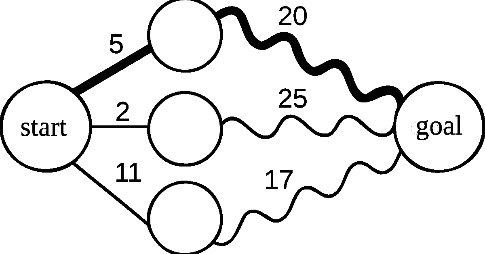

# 应对编码挑战

> 原文：<https://medium.com/geekculture/acing-coding-challenges-816d9b6f1aaf?source=collection_archive---------60----------------------->

对于任何年轻的开发人员来说，技术评估和编码挑战都是一个充满压力的时期。你是这个行业的新人，你是面试过程的新手，你害怕搞砸。这些都无助于有效地构建问题的解决方案。我花了几个月的时间准备我的第一次技术面试。我每天都在努力提高我的编码技能，将新的框架和库集成到我的全部技能中，并且完成了一个又一个个人项目。然而，在我的面试中，当谈到编码解决方案时，我被难住了。我不知道从哪里开始。面试结束后(我失败得很惨)，我意识到我问题的根源:当我在做我的个人项目时，我只参与那些我已经知道如何解决的问题。当我遇到一个全新的问题时，我不知道如何开始制定我的解决方案。这让我从更有经验的程序员和问题解决者那里寻找技巧，我学到了一些有价值的东西，现在我很高兴能与你分享。

# 充分理解这个问题

当你第一次看到一个问题时，有一种强烈的冲动要立即开始编码。抑制这种冲动。相反，后退一步，确保你完全理解问题要求你做什么。我试着回答以下问题:

## 你得到了什么输入？

在这个问题中你得到了什么样的数据/信息？是否给了你一个数字数据列表？人们的时间表？原始字符串？输入会一直一样吗？如果你有任何不确定的地方，这是一个向面试官寻求澄清的好时机。确切地知道你将使用什么是至关重要的。

## 你应该给出什么样的输出？

也许理解这个问题最重要的部分是在你触摸一个键之前确定你的输出应该采取的形式。当我着手解决问题时，这通常是我做的第一件事，当我开始构建我的解决方案时，我开始写出我最终输出的形式，并从那里开始工作。了解您希望数据在问题结束时是什么样子是至关重要的，这样您就可以更好地了解如何在整个过程中处理数据，以及输入的哪些部分是真正重要的。

# 创建示例

解决问题的下一步是创建一些简单的例子。制造简单、容易的输入，并将它们映射到正确的输出。了解你可能收到的每种类型的输入应该导致什么，并尝试制定一个过程来帮助你从头到尾得到。

创建简单的例子后，开始做一些更复杂的例子。在这里，我会开始考虑可能出错或使过程复杂化的事情。如果我接收字符串而不是整数作为输入会怎样？这是与面试官交流的另一个重要点，如果没有数字，他们可能会告诉你返回一个错误信息。他们可能还会告诉你，假设你的输入总是数字，在这种情况下，你不需要担心任何例子，他们不是。

# 制定行动计划

至此，您应该开始理解这个问题了。您应该知道需要什么来获取您的输入并返回您的解决方案所期望的输出。在这一部分，你将把注意力集中在这一点上，并开始制定解决问题的个人计划。为此，我喜欢使用伪代码——用简单的语言描述程序解决问题的步骤。现在还不要担心任何语法。专注于你将要采取的实际步骤，以及每一步之后的结果。对于一些简单的事情，比如返回两个数之和，您的计划可以简单到:

1.  创建一个总和变量
2.  将第一个输入与第二个输入相加
3.  将该值存储在 sum 变量中
4.  将 sum 变量作为我的输出返回

这就是你的全部计划。对于更复杂的问题，你会有更多的步骤。如果你开始难以跟踪你的计划，并且开始难以从代码的角度定义下一步，那么后退一步，想想你将如何自己解决这个问题。这有助于澄清事情。

# 解决问题

这一步在概念上很简单。你所要做的就是拿出你的伪代码，写出你真正的代码。如果你的计划写得很好，你会发现一步一步地把你简单的语言笔记变成语法正确的代码是很容易的。在这个阶段要记住的一件重要的事情是，在回去优化任何东西之前，按照你第一次计划的方式写完你的整个解决方案。你很容易在中途被一些你现在意识到效率低下的事情分心，但是你在这个过程中所做的任何改变都会让你更难完成剩下的代码。相反，按你最初写的方式完成它，然后回去做必要的修改。

# 思考你的解决方案

一旦你有了一个可行的答案，花点时间更仔细地审视它，如果需要的话进行改进。如果你看到一些可以被重构以更有效工作的东西，这可能是时候这么做了。当我看着我的代码时，有一些重要的事情我总是喜欢问自己:

*   有没有不同的方法得到这个答案/解决这个问题？这种方法比我选择的方法更好吗？
*   容易一目了然吗？如果一个没有看过你的代码或问题的人过来坐下来，他们能很容易地知道你的解决方案是什么吗？
*   这和我以前解决的问题相似吗？有什么我可以从过去的经验中吸取的吗？

这一步可能永远不会真正完成。每个开发人员都有一些代码，他们以后会查看这些代码并希望进行修改。这些问题对你的工作和个人项目都有帮助。

# 结论

在本文中，我们已经讨论了解决任何编码问题的四个步骤。让我们回顾一下:

1.  理解问题
2.  制定行动计划
3.  解决问题
4.  思考你的解决方案

实践这种解决问题的方法在我的技术面试中以及我做的所有其他编码中对我有很大的帮助，无论是专业的还是私人的。

如果你仍然对解决编码问题没有信心，请记住，这和其他事情一样，是一项技能，要做得更好需要时间和练习。

如果你喜欢这篇文章，请关注我在 Medium 上的页面，每周都会有新的文章。感谢阅读，祝你好运！