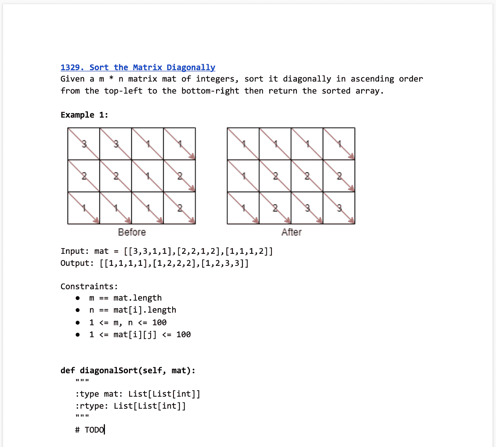

# 在软件工程师面试中表现出色

> 原文：<https://medium.com/geekculture/acing-the-software-engineer-interview-5851d4488267?source=collection_archive---------6----------------------->

## 4 个月内从零到英雄，获得 8 个报价

The offers I received set to a blueprint background: Google, Robinhood, Airbnb, Uber, Tiktok, Microsoft, Scale, and Cloudflare.

# 介绍

互联网上有无限的资源来学习软件工程师面试。然而，没有明确的方向，很难浏览这些资源。如果你制定一个计划，它会起作用吗？你会因为关注错误的事情而毁掉你的面试吗？你配得上这家公司吗？

我开始准备的时候就纠结于这些问题。

在这篇文章中，我将向你展示我的过程。我们将讲述我是如何在不到四个月的时间里学习、面试并获得 8 份工作机会的。这篇文章是 4 篇文章系列的一部分。你可以在这里找到第一个帖子[。](https://kencortereal.medium.com/how-i-got-8-offers-from-8-top-tech-companies-during-the-pandemic-17cee27bb482)

我们将定义面试的形式和工具，我遵循的护栏(不是规则)，我的学习计划，一个样本程序，以及我在面试前和面试中的建议。我分享这些信息的目的是提供一种可行的方法！

# 面试形式和工具

Photo by [Todd Quackenbush](https://unsplash.com/@toddquackenbush?utm_source=medium&utm_medium=referral) on [Unsplash](https://unsplash.com?utm_source=medium&utm_medium=referral)

理解一些术语很重要。

面试过程是分层的:如果你通过了上一轮，你将进入下一轮。

这些步骤是:

1.  **招聘人员来电**:讨论角色和面试流程。
2.  **编码挑战/电话筛选**:初步面试，以确定你是否具备通过现场测试的必要技能。
3.  现场:一系列 4-5 次面试，通常每次一小时。从这些面试中得到的反馈会被用在雇佣决定中。
4.  提供/拒绝:打电话或发电子邮件告诉你你已经通过了(他们会延长提供)或失败了(几个月后再试)。

每次面试都有一个一致的模式:

1.  **介绍** (5 分钟):面试官自我介绍，你自我介绍。
2.  **行为/编码/系统设计**(30-50 分钟)**问题**:每一轮测试的内容详见下文。
3.  **选择。问&答** (5 分钟):你可以问一些关于他们的角色、公司等等的问题。

面试大致有三种类型:

*   **行为**:描述你的职业经历来回答一个问题。比如:*“告诉我一个你纠结于期限的时候。”*
*   **技术/编码**:解决一个技术编码问题可能涉及数据结构、算法、调试等等。例如:*“给定一个整数数组和一个整数目标，返回两个数字的索引，这样它们加起来就是目标的。”*
*   **系统设计**:解决一个技术编码问题，可能涉及数据结构、算法、调试等等。例如:*“给定一个整数数组和一个整数目标，返回两个数字的索引，这样它们加起来就是目标的。”*

面试过程是有意设计的，旨在测试公司认为是做出招聘决定的重要因素的某些特征和经验。每个公司都有他们的细微差别和怪癖，但总体过程是相似的。

了解一些我们可以用来提高成功几率的工具也很有用。

工具:

*   付费: [**Leetcode Premium**](https://leetcode.com/subscribe/) (强烈推荐):Leetcode 是一个练习编码题的在线平台。我推荐购买他们的付费服务 Leetcode Premium，因为它解决了决定学习什么的难题。使用问题频率计&公司特有的题库，你可以提高在面试中看到编码问题的几率。
*   [**Blind**](https://www.teamblind.com) : Blind 是一款匿名的职场聊天应用。你可以讨论一系列话题，包括薪酬和面试。使用 Blind，你可以通过与最近经历过相同面试的人交谈，获得更好的面试感觉。例如，如果 X 公司有一个调试面试，你可以从做过面试的人那里了解更多关于如何准备的信息。
*   [**YouTube**](https://www.youtube.com):YouTube 是一个可以观看视频的在线平台。对于面试准备，这是理解系统设计问题的一个很好的资源。我无法阅读关于系统设计的学术性、枯燥的书籍或文章。Youtube 很吸引人，我可以加快视频播放速度来节省时间。
*   [**Google docs**](https://www.google.com/docs/about/) (强烈推荐):Google docs 是一款在线文字处理器。我建议在模拟面试中使用像 Google docs 这样的准系统 word 文档编辑器进行练习，因为你没有代码自动完成、语法突出显示和调试器的帮助。有了谷歌文档，实际的面试*感觉*更容易，因为你可能会得到一个具有这些功能的在线编码编辑器。

An example of using Google Docs to practice during mock interviews

有了面试过程的基本组成部分以及所涵盖的工具，让我们深入研究一下规则——咳咳，咳咳护栏——我遵循这些规则来获得我的工作机会。

# **规则 vs 护栏**

Photo by [Hogarth de la Plante](https://unsplash.com/@hogarthd?utm_source=medium&utm_medium=referral) on [Unsplash](https://unsplash.com?utm_source=medium&utm_medium=referral)

在我开始面试之前，我思考了什么类型的学习适合我。我得出了四个结论，我相信这些对任何人都有帮助:

1.  🏓刻意练习
2.  🪞尽可能地反映面试环境
3.  📝尽可能仔细地研究“测试”
4.  😱减少意外/保持舒适

这些为我学习计划的每一步打下了基础。它们提供了结构，让我和目的地大致保持一致，就像护栏一样。

值得一提的是，我最初阅读了《编程面试的要素》,但很快就被这些难题弄得心灰意冷。这让我陷入了一周左右的循环，放下采访准备，在我沉浸在自怜中时狂吃网飞系列，重新获得动力，以新发现的认真和精力处理这本书，然后像洗衣机一样冲洗和重复。

最终，我改变了态度，然后*实际上*决定思考什么类型的学习适合我。让我们详细介绍一下这些原则，这样你就可以避免那些导致你狂吃《瑞克和莫蒂》五季的动机规则——我不判断你是否会这样做。

## 护栏#1:刻意练习

刻意练习(在面试的情况下)意味着学习和练习面试的各个部分，衡量你在每个方面的优势，并通过优先考虑薄弱环节来优化你的学习时间。

这是我解决面试准备时间过长和不必要地磨 Leetcode 问题的方法。

以下是技术面试的组成部分:

1.  自我介绍
2.  理解给定的问题提示
3.  确定解决方案
4.  解释你的方法
5.  编码解决方案
6.  给自己定步调，在规定的时间内完成
7.  测试它
8.  如果代码不起作用，就调试它
9.  优化您的解决方案

你或许可以把它进一步分解。根据我的经验，大多数人倾向于纠结于步骤 2-5，所以我练习了这些。

当你第一次开始的时候，你很可能在这些方面都很糟糕。那是意料之中的！如果你不知道你的基线表现，你就不能合理地提高。你的基线表现可能会很差。在你的前几次模拟面试之后，你会对你正在努力的部分有一个不错的想法。把这些写下来，在你下一次模拟面试时关注它们。

**护栏#2:尽可能地反映环境**

为了让刻意练习有效进行，你需要尽可能好的环境。最好的环境是与实际面试最相似的环境:用随机的、中等难度的编码问题对朋友或同事进行定时模拟面试。

模拟面试是模拟面试，除了和朋友或同事，你要经历真实面试的动作。所以，你介绍自己(我知道，这很奇怪)，模拟面试官和你分享一份谷歌文档，然后你开始提问&解释你会做什么。最后，你会问一些关于他们公司的简短问题，然后总结！之后，请你的朋友或同事给你一些建议&反馈你做得好的地方和做得不好的地方。理想情况下，遵循你们双方事先同意的评分标准，这样你就可以更具体地衡量你在模拟面试中的表现。

这个想法是用模拟面试作为实际面试表现的晴雨表。

通过模拟面试模拟面试环境，您可以:

*   **让自己熟悉实际面试的压力和紧张**。当你努力想出一个问题时的焦虑感？你在实际面试中也会有同样的感受。对你的方法沟通不畅，结果是一团乱麻？那也是。模拟面试给我们空间去感受这些情绪，并学会管理它们。通过处理它们并学会如何有效地控制它们，你会在实际面试的压力下保持冷静、镇定和沉着。
*   **提高你的速度**。我为技术编码问题本身分配了大约 30 分钟。大多数情况下，你会有 40 分钟的时间来解决实际面试中的问题，所以通过在更紧的时间限制下练习，你会加快实际面试的速度。如果你刚刚开始，我建议你预算 40 分钟，然后逐渐减少到 30 分钟。
*   **获得反馈**。通常，你的朋友/同事和你会为对方进行模拟面试，这意味着你将同时拥有面试官和被面试者的经历。体验两者都很重要，因为你会明白对方在寻找什么，以及在哪里容易陷入困境。之后，你可以从你的模拟面试官那里得到反馈。

**护栏#3:尽可能仔细地研究“测试”**

当我们使用最好的材料来促进优秀的实践课程时，刻意的练习和模拟面试效果最好。你需要的一个关键因素是实践真实，谷歌/优步/脸书等。—分级提问以适应这些面试的难度。

通过练习大 N 个公司级别的问题，我们正在研究“测试”，因为如果我们与这些公司中的任何一家进行面试，我们可以合理地期望他们提出的编码问题与我们练习的问题类似。

最后，在研究“测试”时，确保你专注于从每次面试中学习，并找出哪里错了，哪里做得好。这有助于通过从我们的错误中学习来完善有意识的练习。

**护栏#4:减少意外和/或保持舒适**

在一天结束的时候，这整个过程都是关于通过技术面试来最大化你获得工作机会的。有很多人非常精通技术，但仍然被拒绝。

我过去开始学习技术面试的时候，重点是达到一定数量的 Leetcode 问题。可能是 200 或 300 人——与一些人相比，即使这些都是新人的数字——但我仍然会被拒绝。

这一次，我不太关注 leetcode 的实际数量和时间，而是更关注我的舒适度。有几个星期我做了 3 道 leetcode 题，其他时候我做了 15 道。我认为这两个案例都是成功的，因为我对自己在那几周的练习水平和深度感到满意。

我相信舒适应该是你的北极星:我非常相信这一点，所以在实际面试的前一两天，我避免进行电话筛选或模拟面试，只是因为我不想摧毁我的信心。

让我感觉更舒服的一个方面是减少惊喜。因此，在面试的背景下，这意味着要做好你的介绍，传达你的行为故事，并提出后续问题。**我有效地从前面提到的面试要素列表中去掉了这些部分，通过练习，我感到相当舒服，可以在实际面试中自动表现良好**。

积累一切对你有利的优势。

有了引导你成功学习的护栏，让我们来看看我的学习计划。

# **学习计划**

Photo by [freddie marriage](https://unsplash.com/@fredmarriage?utm_source=medium&utm_medium=referral) on [Unsplash](https://unsplash.com?utm_source=medium&utm_medium=referral)

在这一部分，我们将讨论我的学习计划。然后，我们将涵盖每个主题领域——将您的介绍、行为、编码和系统设计一点一点地固定下来，以获得最佳实践、具体提示和您可以采取的取得进展的基本第一步。

在我们制定了一个基本程序后，我们将讨论如何在实际的面试过程中实施这个学习计划。所以，这包括模拟面试(在电话筛选和现场面试之前)、面试之前以及面试期间。

## 介绍

你的介绍只是面试的一小部分，但却是为接下来的面试定下基调的重要部分。在高层次上，一个好的介绍包含:

*   对面试官的问候
*   告诉他们你的名字(这样他们就知道怎么发音)
*   对你的经历的简要总结(最重要的部分)

我在介绍中使用的通用公式是:

> “H ey，我叫**【姓名】**。我目前在**【团队】**的**【公司名称】**做**【角色】**。我加入了**【你开始工作的年数】**，在此期间，我参与了**【有趣的项目 1】****【有趣的项目 2】**”

这里有一个具体的例子:

> “嘿，我叫肯。我目前是谷歌的一名软件工程师，在 AdSense 团队工作。我大约在两年前加入，在那段时间里，我有机会参与了许多有趣的项目，比如广告分页和广告的网络表现。”

对于介绍来说，要记住的最重要的事情是练习，直到它变得流畅，排练到自动的程度。你不希望这部分花太多时间，搞定它会给你信心做好接下来的事情。

这里有一个很好的第一步:按照上面的公式写下一个简短的介绍。大声练习三遍。一定要在模拟面试中预演这些！

随着你的介绍下来，让我们来看看如何回答行为问题。

## 行为问题

行为问题是面试官问你的关于你职业经历的问题。然而，它们通常不是用来评估你的技术能力，而是用来了解你是否拥有公司看重的某些特质、经验和技能。

行为问题通常由一套公司价值观构成。例如，亚马逊有 [16 条领导原则](https://www.amazon.jobs/en/principles)，这些原则构成了他们的行为问题。Airbnb 有四种核心价值观，面试官会从应聘者身上寻找。优步有 [8 项被认为对公司文化很重要的文化规范。这样的例子不胜枚举。](https://www.uber.com/newsroom/ubers-new-cultural-norms/)

任何行为问题的通用公式是:

> “说说你做过的一次**【公司价值】。**”

例如，一个评估亚马逊对行动领导原则的偏见的问题是:“*告诉我你在紧张的截止日期前工作，并且在做出决定之前没有时间考虑所有选项的一次经历*”。

通过问这样的问题，公司会促使你给出一个你能证明其价值的故事。如果你展示得好，对公司来说是个好兆头！如果你不这样做，或者更糟，做与价值观完全相反的事情，这可能是公司的一个危险信号。

虽然这听起来令人生畏——有很多公司，每个公司都有自己的价值观——**在行为问题上做得好背后的真正诀窍是提前写下一些你的答案，并反复练习，直到它成为你的第二天性**。这些被称为行为故事。

## 行为故事

行为故事是你对行为问题所说内容的书面脚本。通过提前写故事，可以练习到流畅为止。

要写一个好的故事，尽量简短(最多 250 个字)，以问题—行动—结果的格式(P.A.R .)来写你的故事。

保持简短，更容易记忆。

虽然你可以遵循任何格式，P.A.R .格式是一种以结构化格式编写行为故事的方式。您简要描述了问题、解决问题所采取的措施以及措施的结果。它让你的故事保持正轨。此外，你的面试官会记下你的回答，写这些笔记的常见格式是 S.T.A.R(情景—任务—行动—结果)或 P.A.R .格式。如果你在故事中使用类似的格式，他们会更容易记下细节。

最后，在我写一个故事之前，我会写下一系列我希望这个故事展示的品质。这些通常是普遍的品质和经验，如主动性、指导初级工程师、跨团队工作等..这些启发了我的写作，并概括了我对各种各样的行为问题的答案。当回答一个行为问题时，你可以稍微调整你的故事来强调一个品质而不是另一个。

格式如下:

> **【故事名称】**
> 
> **特质:**【写出你想强调的特质】
> 
> **问题:**【简要描述上下文和问题】
> 
> **行动:**【描述你采取的行动，确保这些行动有助于问题的解决】
> 
> **结果** : 【您采取上述措施的结果是什么，是否解决或减少了问题？]

这里有一个简短的例子:

> **服务器端分页**
> 
> **品质**:解决难题，获得不同团队的共识，保持好奇心
> 
> **问题**:我的组织需要一个用于我们平台的分页 API，但是不同的团队在 API 格式上没有达成共识。
> 
> **行动**:我在我的组织内收集了所有关于分页的设计文档，精简了 API 以使用通用的行业标准参数，比如 next token 和 limits，并编写了一个新的文档来解释 API。
> 
> **结果**:在不同团队之间传阅 API 并向他们提供示例实现后，新的分页 API 已经在很大程度上成为我的组织内的标准(并删除了各种单一用例)，并将开发速度提高了 10%。

当你回答一个行为问题时，你可以在脑海中快速浏览你的 3-4 个故事，选择最适合这个问题的一个。**我建议你记住 3-5 个故事，这些故事尽可能包含不同的品质和经历，这样你就可以回答各种各样的行为问题。**

**迈出第一步**:以要点的方式，列出 3 个左右高层次的经历。因此，一个示例要点可以是:平台团队的服务器端分页@ Amazon。

然后，首先，用 50 个字描述问题，50 个字描述解决问题的方法，50 个字描述结果。对所有的故事重复这个步骤。

有了行为故事，让我们继续编码。

## 编码面试—基础知识

准备编码面试有两个不同的部分:学习基础知识(数据结构、算法等)。)和练习 Leetcode。

为了学习这些材料，我利用自己的能力，在没有太大压力的情况下观看了大量视频——谢谢网飞——还在 Youtube 上观看了 BaseCS。下面是他们的[媒体文章](https://medium.com/basecs)和 [youtube 视频](https://www.youtube.com/watch?v=Po1nQOBBig0)。*强烈推荐*这些文章和视频。当我在报道一个特定的话题时，我在 Leetcode 上解决了相关的问题。

当我在研究一个特定的数据结构或算法时，我也记住了它在实际面试中出现的频率。以下是我研究的课题列表:

1.  **数组**(非常常见):有很多方法可以让数组问题变得困难，包括:双指针技术、滑动窗口和矩阵。基于字符串的问题类似于数组。
2.  **链表**(非常罕见):在我 50 多次面试中，1 个问题我都回答了。如果你真的得到了一个，大多数问题往往集中在管理指针或检测循环。
3.  **栈**(常用):通常用作解决问题的支撑数据结构。堆栈问题是一种流行的方式，可以从你的普通数组问题中增加问题的趣味。它们对于解析和维护数据的顺序特别有用。
4.  **队列**(罕见):队列用于其他算法，如 BFS。我不记得在面试问题中看到过以排队为焦点的问题，但了解它们是很有用的。
5.  **树**(非常常见):树是非线性的数据结构，有大量的用例。我收到的最常见的问题集中在两种类型的树:二叉树&二分搜索法树。
6.  **树遍历算法**(非常常见):你要关注的是按序、前序、后序和层次顺序。对于高级面试题，我拿到了很多层次顺序遍历题。
7.  **Trie** (罕见):在我的采访中，我收到了两个很难的 Trie 问题，它们通常包含一些与有效存储和解析字符串前缀有关的内容。
8.  **堆&优先级队列**(罕见):堆在优先级队列相关的问题中表现自己，并且那些倾向于在图形相关的问题中使用(例如 Dijkstras)。花时间学习如何实现优先级队列或使用库版本。
9.  **哈希表**(非常常见):哈希表可以是问题的主要焦点，也可以是优化解决方案的关键方式。在我的采访中，我总是考虑使用散列表。字典是你优化一个运行缓慢的解决方案的面包和黄油。
10.  **二分搜索法**(通用):老实说，这往往是一个痛苦的记忆，虽然算法很容易理解，但在问题中的实现和使用是一个痛苦的世界。我收到了 5 个二分搜索法的问题，其中有 3 个做得很好。将来，我可能会花更多的时间来研究这个。
11.  **排序算法**(很少):通常，我会在需要时使用库排序函数。然而，在排序有问题的情况下，学习 mergesort 和 quicksort 是两个最重要的问题。
12.  **图表**(常见):像树一样，图表是非线性的数据结构，当面试官想要在困难中打开局面时，图表被用作第二个面试问题。例子包括:从一个节点到另一个节点的旅行，完全覆盖图，克隆图，或者管理指针(在有向图的情况下)。
13.  **图遍历算法**(很常见):学习三种算法:DFS、BFS、Dijkstras。一个很少见也很难的面试题型是拓扑排序。还有，我也没有研究过什么 Kruskals，Prim，Bellman-Ford 等“名字”算法..除了迪克斯特拉斯。
14.  **递归**(常见):递归问题用于测试你如何组织和重用代码。我经常发现使用递归可以很好地解决问题。
15.  **回溯**(常见):对基于递归的问题做了一点改动，保留给更难的算法问题。
16.  贪婪算法(罕见):我不认为我遇到过任何明显贪婪的问题，谢天谢地我没有花太多时间讨论这个话题。我建议花一天时间刷新你对贪婪问题的认识。
17.  **动态编程**(非常罕见):我只拿到了两个(一个来自 Google &微软)。我不知道如何做好这些问题，它们基本上是我的克星。我仍然需要花一些时间来熟悉一些概念——比如制表&记忆化——因为即使你不完全理解动态编程，它们也会对你有用。

这并不详尽，但它以最少的努力为您提供了 80%以上的结果。

我省略了几个话题。这些是用例特定的主题，如果你知道它们会出现，你就可以涵盖它们。

*   **二进制相关问题**(掩码、移位、使用不同的运算符，如异或)。我省略了这些，因为它们只会出现在嵌入式系统或硬件工程等底层系统中。
*   **面向对象设计题**(继承、封装、固体原理等。).我按功能编码，所以这不是我的风格。然而，我收到了 Snap 发来的一个关于 OOP 设计的问题，尽管我搞定了其他三个面试，但我在这一个面试中表现糟糕，结果没有收到录用通知。
*   **并行编程/并发/操作系统/数据库/等等。** —类似于二进制，这些是特定于工作的，不是我想每天都使用的东西。
*   **前端** (JavaScript，CSS，HTML，React 等。)—我面试的是全栈工程师，但是对于如何面试 frontend 完全没有概念。不幸的是，这种类型的问题出现在罗宾汉和优步身上，我依靠已有的知识勉强应付过去。我应该多学学这个。

**第一步**:利用上面的主题，观看 YouTube 上的 baseCS 视频，并做一些简短的笔记。你会让你的大脑识别其中的一些。当你涉及到这些话题时，你也可以做一些关于这些话题的 Leetcode 问题。

此外，为自己制定一个时间表来涵盖这些。例如，你将学习一周的数组知识，并做数组 leetcode 问题。然后你会花两天时间学习链表，做链表 leetcode 问题。我会按照上面的列表按顺序进行，并根据稀有程度花一定的时间来讨论这些主题。您也可以遵循本文稍后讨论的例程。

在对数据结构和算法有了基本的了解之后，您应该有足够的信心能够辨别一个编码问题在问什么，以及使用数据结构或算法的解决方案的暗示。

是时候学习如何处理 Leetcode 了。

## 编码面试— Leetcode

Leetcode 很难磨。如果做得恰当，你可以自信地认为你在研究你需要的最少数量的问题，并且通过理解解决问题的核心方法获得大量的知识。大多数问题都是一些模式的变体。

我的总体策略是首先研究高频 Leetcode 问题。我的目标是最大化我在实际面试中看到类似问题的几率。此外，我主要关注中等难度的问题。它们代表了我的大部分问题(65%)，而其余的来自困难(25%)和容易(10%)的困难。

当你研究一个主题时，用数据结构或算法来涵盖问题。您可以按主题过滤，也可以按频率排序，以便在讨论主题时获得最佳的复习问题集。在你已经涵盖了所有的数据结构和算法之后，从总体上开始看所有的高频问题(不考虑主题)。最后，一旦你安排了面试，就开始查看公司的问题库，并按频率和过去 6 个月内进行排序。如果你完成了 6 个月的清单，继续一年。

这就是我学习 Leetcode 的基本方法——以分层的方式研究高频率、中等难度的问题，以最大限度地提高我看到问题或类似问题的几率。

当你在做一个问题时，如果你不能解决它，确保你在 15-30 分钟后停下来。尽快止损，这样你就不会浪费时间盯着一个空白屏幕。阅读问题讨论选项卡上的最高投票答案，并从头开始重写解决方案，以便理解它是如何工作的。根据我的经验，解决一个问题的一半困难在于确定一个可行的方法。通过重写，从一个清晰明了的解决方案向后工作，可以更容易地吸收解决方案，而不是试图解决问题，然后为解决方案编码。

通常，你会在观看 BaseCS 视频、放弃、练习 LeetCode、放弃和重复之间来回跳跃…..那是自然的。专注于一致性——每天至少做一个问题。如果可以的话再多一点。注意你的精力和休息日。多休息以避免精疲力尽。放松，你会得到这份工作的。

另外，提前计划好你要做的问题。这就去掉了一个关键的决策步骤，这样你就可以在不知道自己想做什么的情况下开始新的一天。

最后，如果你需要说服自己你正在取得进步，把盲人的 75 条清单作为一个临时清单。共有 75 个问题，你可以省略其中的几个。

## 系统设计

除了一次面试(面试官很糟糕，当我问一个问题时，他不停地告诉我反复阅读问题，咳咳[特使](https://envoy.com/))，我完全摧毁了我的系统设计面试。我展示了对依赖、容错、瓶颈的理解，并提出了适当的解决方案。

每当我的朋友问我是如何准备的，我都会给他们一些非传统的智慧:看两个 YouTube 视频。我不骗你。事实上，总的来说，我是通过看 YouTube 视频和在纸上画出图表来学习系统设计的。如果适用的话，我还会添加任何注释和评论。

这两个视频是:

1.  [谷歌系统设计采访一位前谷歌员工](https://www.youtube.com/watch?v=q0KGYwNbf-0)——设计一个代码部署系统
2.  要么是图沙尔的视频，要么是瓜拉夫设计消息应用的视频(选一个): [Whatsapp 系统设计:面试聊天消息系统](https://www.youtube.com/watch?v=vvhC64hQZMk)或者[系统设计:设计 Facebook Messenger 或者 Whatsapp 之类的消息/聊天服务](https://www.youtube.com/watch?v=zKPNUMkwOJE)

我练习系统设计面试的方法的要点是模仿思维过程和复制方法，直到我学会技巧、陷阱和经验法则。

观看完两个视频后，扩展到其他主题:

1.  设计网络爬虫
2.  设计新闻源
3.  设计 TinyUrl
4.  设计搜索自动完成
5.  设计网飞
6.  设计优步/位置跟踪器

一旦你完成了一个视频，你应该有一套漂亮的图表笔记和注释。你可以在面试前浏览一下这些，以提醒你的记忆、技巧和注意事项。

在介绍了系统设计之后，让我们转到一个简单的例程上来。

# **例行程序**

Photo by [Debby Hudson](https://unsplash.com/@hudsoncrafted?utm_source=medium&utm_medium=referral) on [Unsplash](https://unsplash.com?utm_source=medium&utm_medium=referral)

这个例程就是一个例子。您可以混合搭配、填充或跳过内容。

## **3 个月后**

1.  覆盖数组(5 天)、链表(1 天)、堆栈(3 天)和队列(1 天)。在 BaseCS 上看相应的视频，每个题目做一些 Leetcode 题。
2.  安排每周与朋友的模拟面试。
3.  为你的面试问题制作一个谷歌文档模板，如面试格式和工具部分所示。理想的情况是，在文章的最后加上一个评分标准。每次进行模拟面试时，都要复制一份这个模板。这是我的模板。
4.  创建一个新的 leetcode 会话(以跟踪您的进度)
5.  节省一些 PTO 时间(如果你在工作的话)。
6.  开始并完成你的 3-5 个行为故事。

## 两个月后

1.  覆盖树和树遍历算法(5 天)、堆和优先级队列(1 天)、哈希表(3 天)和二分搜索法(2 天)。观看相应的 BaseCS 视频，并为每个视频做几个 Leetcode 问题。
2.  继续模拟面试。
3.  你想采访的研究公司。
4.  Opt:复习其他题目或者多做 Leetcode 题。
5.  选择:在 Youtube 上观看系统设计面试，可能每周 2 次。

## 1 个月后

1.  排序算法(2 天)、图形和图形遍历算法(4 天)、递归(3 天)和动态编程(2 天)。
2.  继续模拟面试。
3.  在 LinkedIn 上添加招聘人员，给他们发信息设置电话屏幕。也可以网上申请。
4.  为真实世界的实践会议安排一些你不关心的小公司的面试。
5.  Opt:复习你想要的任何其他话题或做更多的 Leetcode 问题。
6.  选择:回顾系统设计概念，并继续在 Youtube 上每周观看 2 个视频。

## 在电话屏幕前

1.  在电话屏幕上从招聘人员那里获取任何信息，以及问题的类型。
2.  在这个电话屏幕前的 3 天左右，避免任何模拟面试。
3.  在盲/Leetcode 讨论中搜索公司名称+电话屏幕，了解您能找到的关于这些问题的任何信息。
4.  高频复习公司关于 Leetcode 排序的题库。把你的答案打出来，打印出来，随身携带，这样你就可以随时查阅。
5.  通知任何和你住在一起的人你什么时候会做电话筛选。或者，找一个你可以采访的安静的地方。
6.  Opt:复习你想要的其他题目。

## 在你手机屏幕前一小时

1.  排练你的介绍，略读你的行为故事。
2.  设置你的环境:检查笔记本电脑和互联网是否工作正常，手机是否充电，你是否有一瓶水，你是否吃过快餐，是否去过洗手间。

## 在电话筛选期间

1.  如果您的屏幕是一个编码挑战(而不是一个活动的电话屏幕)，请大量使用 print 语句来检查您的代码是否如您所愿。还要记住有多少问题，并相应地调整自己的节奏。
2.  如果你的屏幕是实时聊天，问候面试官(问他们怎么样)，在他们介绍完自己后，给你介绍。
3.  如果你被问到行为问题:暂停，从你写的 3-5 个故事中选择你最适用的故事，然后开始讲故事。
4.  如果你正在编码，打开在线编码编辑器并检查它的功能。选择您的首选语言。一旦面试官将问题粘贴到文档中，花点时间阅读它。不要开始编码——问任何问题，涵盖给出的一些例子，或者让你自己。
5.  在脑海中浏览数据结构和算法，然后选择一个。如果你知道的话，试试暴力解决方案。记住，页面上有代码总比没有代码好。
6.  明确地向面试官写下或口头解释你最初的方法，并询问他们是否同意尝试这种方法。浏览任何你认为必要的例子来检验你的方法。
7.  编码时，使用清晰的变量名、注释(如果需要)，并利用库函数(如果允许的话)。
8.  在你编写了暴力或类似的解决方案之后，用提供的例子或你想出的例子来测试它。确保获得正确的输出。重要的是，不要花太多时间详述所有的中间状态和变量的变化，只需浏览一下代码如何处理不同的例子。
9.  如果有必要优化您的解决方案:确定代码中的瓶颈，考虑最小运行时(例如，处理数组通常意味着最小 O(n)运行时，因为有 n 个元素要查看)，或者在脑海中浏览所有的数据结构，针对问题测试每个数据结构，看看它们是否会以某种方式帮助您。
10.  用上面同样的方法回答任何后续的编码问题。
11.  留意时间，通过清理函数、变量和添加注释来完成编码。解释你将如何使它变得更好，我们想要强有力地冲过终点线！

## 到达现场前

1.  从你的招聘人员那里获得关于面试类型和每轮面试内容的信息。
2.  在面试当天请假。
3.  对最近现场提问的盲或 Leetcode 讨论渠道进行研究。
4.  使用 Leetcode Premium 公司特有的题库查看最常见的问题。
5.  告诉和你住在一起的人你需要一个安静的环境，或者安排在别的地方面试。
6.  在现场面试前 3 天左右避免任何模拟面试。
7.  研究公司，了解他们的产品和文化。

## 现场期间

1.  重复上述“在电话筛选过程中”一节中提到的步骤。以下步骤是特定于现场的，所以也要记住。
2.  调整好自己的节奏，不要在第一次面试时就耗尽所有的精力。我们今天要跑马拉松。
3.  如果你在两次面试之间有时间，回顾一下任何公司特有的问题及其解决方案。你可能会收到一个你刚才正在看的问题！
4.  在现场采访之间的休息时间，确保您的视频和麦克风关闭。如果可以，关上你的笔记本电脑。
5.  如果需要的话，在面试间隙休息一下或者使用洗手间。

# **总结&反思**

Photo by [mckenzie toyne](https://unsplash.com/@mckenzietoyne?utm_source=medium&utm_medium=referral) on [Unsplash](https://unsplash.com?utm_source=medium&utm_medium=referral)

唷，感谢你阅读这篇文章。希望对你有帮助！让我们来讨论一些要点:

*   **🎯刻意练习**。面试伴随着许多令人感动的部分。有了正确的工具和实践，你就可以为如何应对所有的面试绘制蓝图。这样可以释放你的工作记忆，让你在面试的时候有更多的思考空间。为了练习，分析面试中你可以做得更好的部分，走过场，从你的发现中学习，然后重复。
*   **💪积累所有对你有利的优势**。对我来说，观看视频而不是阅读像《破解编码面试》或《编程面试要素》这样的书籍是一个重大的思维转变。记住我的介绍&行为故事是另一件事。面试已经充满了压力和焦虑——让自己轻松一些。
*   **📈一致性**。遵循常规，就像护栏一样，让你保持在正确的轨道上，指引你实现目标。我的学习方式和日常生活对我的成功和最终工作有着直接的、可衡量的影响。

请随意评论您想了解的更多信息。我审查每一条评论。在此期间，敬请关注下期帖子，如何组队匹配为你找到队伍！

如果你想支持我的写作，在这里注册一个中级会员:【https://kencortereal.medium.com/membership】T4。