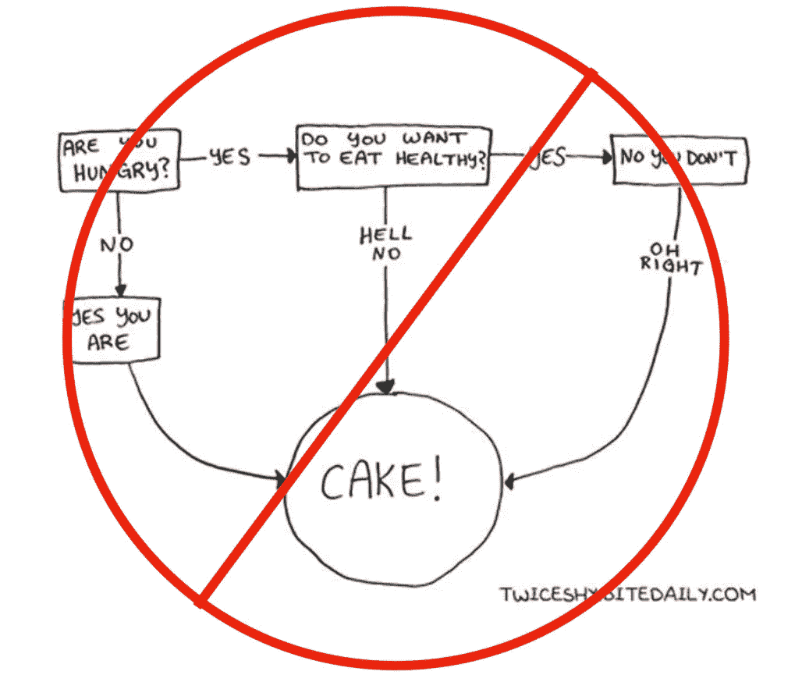
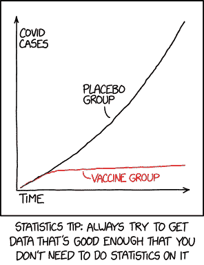

# 行动分析

> 原文：<https://medium.com/geekculture/action-analytics-bcc60c988df4?source=collection_archive---------6----------------------->

## *数据分析最佳实践、团队结构等的框架。*

分析对于理解不断增长的海量数据至关重要。数据分析师冒着在这个越来越危险的领域迷路的风险，没有目的地和方向。行动分析是一个框架，提供了这一明确的目的地和方向，即*改变行动*。虽然这乍听起来很简单，但它为数据分析师和决策者带来了许多有用且不常见的最佳实践。

# 思维实验

想象一下分析做得“完美”:在任何人提出要求之前，数据的每一部分都准备好了；以高准确度对用户行为建模；仪表板实时更新；为投资者准备的漂亮的一次性报告；收入预测几乎没有误差；广告归属和 CAC 计算到一分钱等。虽然这听起来很棒，但上述所有情况都可能是真的，因此公司最好解雇所有促成此事的人。如果每个仪表板、分析和报告都证实了已知或可疑的情况，那么影响和价值是什么？没有和零。如果什么都没做，同样的行动也会被采取(不用支付昂贵的工程师和分析师！).**真正的、*也是唯一的、*分析的价值在于它对行动的影响。**

# 目标是改变行动

分析的更微妙的价值是:随着时间的推移，将导致更低价值的行动改变为导致更高价值的行动。

对于那些倾向于数学的人(毕竟这是一篇分析文章！)，分析的净值是:

*净值=(采取行动的结果的价值)-(没有分析的默认行动的结果的价值)-(分析的成本)*

总结了许多行动的机会，越高越好。下面是这个等式的一些要点。

*   确认默认操作的值为零，减去花费在分析上的资源后，净值为负。
*   有些分析会导致行动没有变化，有些会。当重复应用该方程时，这个概率被平均。
*   对于高价值或高风险的行动，例如，将一家初创公司(可能从 B2C 转向 B2B)，影响行动的机会可能很低，但仍然值得进行分析。如果在许多类似的高风险分析中，至少有几个受到影响，使得净值总和为正，那么这是合理的。
*   重要的不是改变的动作数量，而是价值的差异。改变许多低风险的行为，或者过度优化或过度分析高风险的行为，而这些行为的违约率已经很高了，这可能不会产生正的净值。

本·霍洛维茨提出了一个颇有见地的问题:“你知道什么别人不知道的事情？”。在这篇文章中，我们将问题重述如下:“什么是分析学知道而其他人不知道的？”。

与本文更广泛的观点一致，到目前为止，抽象的价值只取决于它们所改变的动作。接下来是这些见解导致明确行动的方式，人们可以采取这些行动来从数据和分析中获得最大价值。

# 行动前的分析—“如果这个与那个相比较会怎样？”

在执行分析之前，了解不同的结果如何导致不同的行动是很有帮助的。最纯粹的形式是决策树，但是通常没有必要这么正式。一个很好的开始是问，“如果我们找到这个和那个呢？”。这么简单的问题应该很容易回答，但往往不是！

如果相关结果是一个单一数字，那么在进行任何分析之前，询问“如果该数字处于合理范围的低端与高端，这意味着什么，会导致什么样的*不同的*行动？”。有时这种想法揭示出结果是不相关的，因为不会产生不同的行动。一个额外的好处是，这种“如果…会怎样”的思考通常会揭示采取一种行动与另一种行动相比的最重要的原因，哪些*其他*分析值得做，并且可以更快地做出决定。

Avoid comically pointless analysis.

除了避免不必要的分析和发现真正重要的东西之外，第三个好处是分析师了解不同的结果会导致什么不同的行动。这种理解指导了对分析的技术细节的选择，导致更相关的结果和更少的与最终决策者的昂贵的来回争论。

因此，在进行分析之前，用决策树之类的东西将结果映射到行动，甚至是非正式的，提供了以下三个主要好处。

1.  确定分析是否有可能改变行动。
2.  发现一个不同的，更好的，可以导致行动改变的分析。
3.  分析师对结果如何导致不同行动有了更好的理解，从而改进了分析。这些知识指导着分析师在处理复杂数据时的选择。

一如既往，也有例外。一些高层次的分析可能不依赖于特定的决策或行动，而是作为许多决策的一部分。一个例子是顾客的性别分类。对于这些，可以跳过上面的过程，因为结果会以部分方式影响许多操作。

另一个可能但不常见的例外是，存在一个已知的问题，但所有可能的行动都是未知的，并且将通过分析得到信息。这种开放式的分析可能耗时且成本高昂。它至少应该从一个具体的目标和一些可能的行动开始，即使还可以发现更多。最好对可能的好处有所了解，以避免花费过多的时间。

# 例子

一个简单的例子是决定修复或删除用户更新支付方式的方式。这个功能有很多问题，大多数用户不会使用它。对使用频率的分析似乎是合理的，对吗？也许不是。在仔细思考了“如果…会怎样”这个问题后，发现即使它几乎从未被使用过，也不能被删除，因为还没有其他动作存在。该分析将是不相关的，并且具有负净值。在分析之前，需要确定除移除特征之外的选项。

接下来，假设“如果...会怎样”的问题会导致一个预先决定，即超过 2%的用户会修复更新支付功能，而低于 2%的用户最好删除它并让用户寻求支持。分析师被要求找出更新其支付方式的用户的百分比，这是一个非常具体和简单的请求。分析师不知道为什么这样做，他计算出:(更新的用户数)/(总用户数)，也就是 1%。麻烦的功能去掉了，耶！耶。不不耶。没有幸福的结局。该公司发展迅速，大多数用户都是新用户，还不需要更新他们的支付方式。如果分析师了解结果如何映射到行动，他们会只关注一年前加入的用户，这将显示 4%的用户更新了他们的支付方式。犯了一个代价高昂的错误，没有人高兴。

# 行动后的分析——事后诸葛亮！

应用于先前行动的数据分析可以称为“第二次猜测”，是一种 QA(质量保证)。工程师不是完美的，所以产品由 QA 测试；数据分析对决策者来说扮演着类似的角色。重要的是要有正确的团队结构、激励和心态，以便数据分析师能够履行这一重要角色。

为了检查工程师的工作，QA 与工程师密切合作，但有一定的自主权。对于分析人员和决策者来说也是如此。不像在测试硬件或软件时，正确的行为大多是客观的，决策更主观。此外，决策者是公司中最有权力的人。这种主观性和权力意味着分析师需要在与决策者的合作和自主之间取得平衡，以避免在他们的结果违背决策时出现偏见和不当待遇。实现平衡的一个方法是不要让分析师直接向他们将影响其决策的人汇报。相反，他们可以与决策者在一个跨职能团队中，以鼓励协作，同时向分析经理报告。

在最好的情况下，一个有效的分析团队和决策者通过学院式的对抗使彼此变得更好，就像 QA 和工程师一样。其他功能将依靠分析来帮助他们做出选择，进行早期实验，并指导高风险决策。然而，不可避免的是，一个有效的数据分析团队偶尔会让决策者感到不安，决策者的工作就是做出好的决策。

此外，分析团队还应该*独立地*根据业务净值优先分析之前的行动。简而言之，随着更多数据的可用、条件的变化等，他们应该验证假设并对之前的行动进行第二次猜测。决策者可能不希望这种情况发生，这是人的本性，因此需要自主权。正如[希尔伯特·西蒙](https://en.wikipedia.org/wiki/Herbert_A._Simon)所观察到的，决策必然是在不完全信息和启发的情况下做出的。当更多的数据和分析可以用于之前的决策时，可能会出现更好的替代方案。

# 例子

回到前面的例子，假设决定支持几种支付方式，这样每个用户都可以尽可能少地支付。“我们*永远不会*失去一笔有意愿的买家交易！我们的生死取决于转换率”，有人惊呼道。一年后，其中一项支付服务似乎出现了不成比例的问题。

Action Analytics 数据分析团队听说了这些问题，并决定调查关闭麻烦的支付服务是否值得。注意，这需要两件事:第一，团队要意识到问题，第二，当最初的决策者没有兴趣重新审视问题时，团队要有独立调查问题的自主权。

结果显示，只有一小部分用户使用支付服务，并且假设几乎每个新用户都可以使用另一种支付方式，这样就不会有销售损失。A/B 测试隐藏了支付服务，转换率是一样的。耶！它被删除了，为公司节省了大量的资源和麻烦，最终，最初的决策者很高兴并尊重这一过程。

# 高效的数据分析师

能够理解分析背后的宏观图景和原因的数据分析师是最有效的，因为他们能够更好地利用自己的结果来改变行动。特别是，当在行动后进行分析时，分析师需要独立评估哪些假设和先前的行动在他们新的数据驱动的审查下可能是次优的。

一个新的趋势是区分数据科学家和决策科学家，前者被视为更具技术性，而后者更注重行动和商业，并使用数据科学家的数学结果([见此处](https://towardsdatascience.com/data-science-vs-decision-science-8f8d53ce25da))。虽然决策科学的功能是走向行动分析的一个积极步骤，但决策科学家和数据科学家的这种区分是适得其反的。从事数据分析的数据科学家应该理解根据他们的结果做出的行动和决策。当然，数据科学家有各种各样的技能，有些可能是统计奇才，而其他人更擅长选择正确的行动进行调查。一个高功能的团队应该有一个组合，但是划分角色和职责会适得其反。有几个原因可以说明数据分析师应该同时具备数据和决策科学的技能。

1.  由于数据驱动的思维现在很普遍，每个决策者都应该了解一点决策科学。
2.  除了少数例外，数据科学家也应该是不错的决策科学家。分析的过程是高度迭代的。一个人可能会着手解决一个广泛的问题，但路径是未知的，在这个过程中需要大量的判断。在这种情况下，如果分析师有足够的背景和技能来进行大多数判断，那是最理想的(在不常见的需要的情况下，可以在以后进行复查和撤销)。
3.  很少有统计向导能够对投资回报率产生巨大的影响。如果一个分析是如此复杂和微妙，以至于需要一个数学天才来解决它，那么它很可能比另一个行动好一点点。对于除了最大的公司以外的所有公司来说，这样的利润率不值得研究，资源最好用在其他地方。人们会希望，即使是最大的公司，在经过非常复杂的分析后，当投资回报率只有轻微的正值时，也会有更高的投资回报率。

就小型创业公司而言，出于对数据驱动的渴望，他们会在最初的 5 到 10 名员工中雇佣一名分析师。这通常是一个错误。当这么小时，数据量是小的、简单的，并且严重偏向早期采用者、一个大客户等。不需要或不值得进行复杂的分析，通常只需要或甚至可能对平均值的明显趋势进行简单的检查。

Credit [https://xkcd.com/2400/](https://xkcd.com/2400/)

此外，还有许多其他合理的战略理由来采取直接违背数据的行动，进一步降低了净值等式。大多数项目经理和工程师能够胜任简单的值得做的分析，而一个分析师将会被利用不足。

# 警告:行动和决策不全是数据

有些时候，有充分的理由否决数据可能会说什么。首先，对任何分析和偏见的健康怀疑是合理的。俗话说得好，[“有三种类型的谎言:谎言、该死的谎言和统计数据”](https://en.wikipedia.org/wiki/Lies,_damned_lies,_and_statistics)。概括地说，总有一些不确定性，应该在可能的时候进行估计。正如[内特·西尔弗](https://en.wikipedia.org/wiki/Nate_Silver)指出的，“我们厌恶不确定性，即使它是我们试图解决的问题中不可或缺的一部分”。消除不确定性并不总是可能的。

还有一些实际上无法估量的因素，如道德或长期影响。通过优化包括花在应用上的时间和利润在内的指标，脸书对其用户的福祉造成了伤害，并对他们和其他科技巨头赖以生存的定向广告商业模式造成了(或至少加速了)反弹(关于[俄国干涉 2016 年大选的国会听证会](https://www.wired.com/story/mark-zuckerberg-congress-facebook-troubles/)、 [#deletefacebook](https://www.cnet.com/news/deletefacebook-hashtag-trends-twitter-facebook-users/) 、[、网飞“社会困境”](https://en.wikipedia.org/wiki/The_Social_Dilemma)、[《大西洋月刊》文章](https://www.theatlantic.com/magazine/archive/2017/09/has-the-smartphone-destroyed-a-generation/534198)、[华盛顿月刊文章](https://washingtonmonthly.com/magazine/january-february-march-2018/how-to-fix-facebook-before-it-fixes-us/))。牺牲一些指标来换取道德和长期可持续性是不采取的更好的行动。所有这些都是说，在某些情况下，人类的判断应该压倒分析，特别是当人类因素或不可观察的因素至关重要时。

当否决分析中推荐的行动时，应该有意识地进行，并向所有相关人员充分解释清楚原因。理想情况下，这些原因将在以后被重新审视和检查。

# 摘要

本文本身遵循行动分析的格式——遵循分析的结果，直到推荐行动的最终结果。一般来说，导致没有行动的“见解”的岔路是未来导致行动的分析的可能种子，但其本身只是有趣的、“酷的”、无用的、[傻瓜的黄金](https://www.investopedia.com/terms/f/foolsgold.asp)。下面是一些动作分析的最佳实践。

1.  在开始分析之前，先问:“如果结果是这个对那个呢？”将可能的结果映射到不同的操作。
2.  分析应作为决策者的 QA，并对之前的行动和测试假设进行事后分析。
3.  分析师应该独立于决策者，不直接向他们报告。他们需要比工程 QA 更多的自主权。
4.  数据分析师需要背景，因此应该与其他人密切合作。一种方法是加入跨职能团队。
5.  有效的分析师了解更大的图景，以及如何对他们的工作所导致的行动变化产生最大的影响，即使是以牺牲一些技术技能为代价。招聘时，应优先考虑这些候选人。分析师也应该专注于提高这些技能。
6.  早期创业公司一般不应该雇佣分析师。
7.  有时有很好的理由否决数据驱动的结果。在这种情况下，重要的是向所有相关人员清楚地陈述这些原因，然后分析这些原因是否有效，以便采取不同的行动。

面向行动的心态还有更多含义，这里介绍的只是一个开始。同样，一个软件组织可能会说他们遵循一个敏捷的开发过程，我希望许多组织和数据分析团队会采用行动分析。