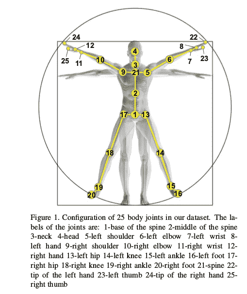
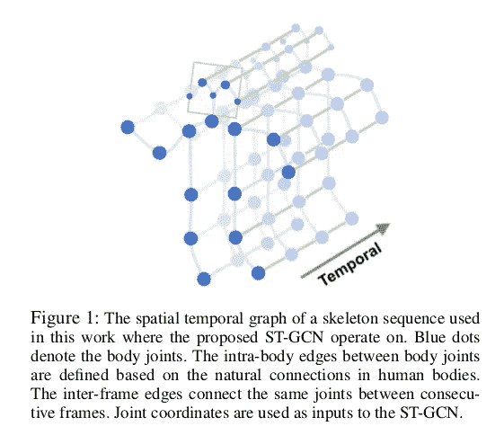
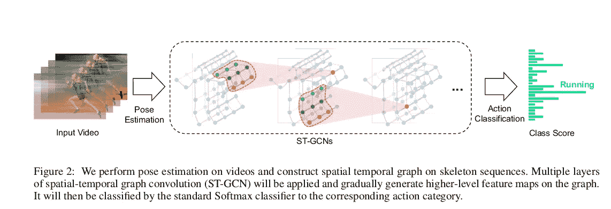
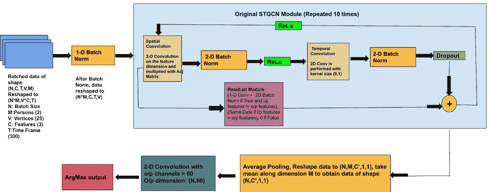
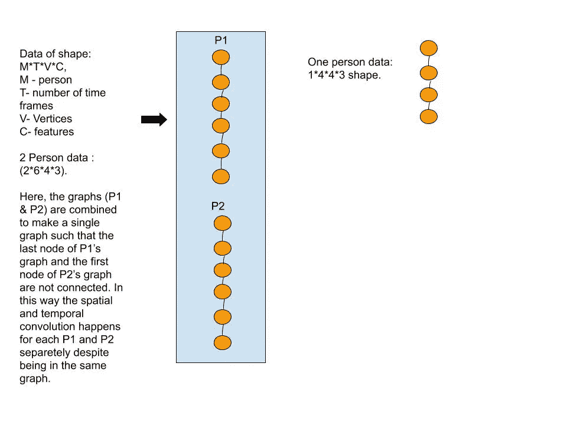
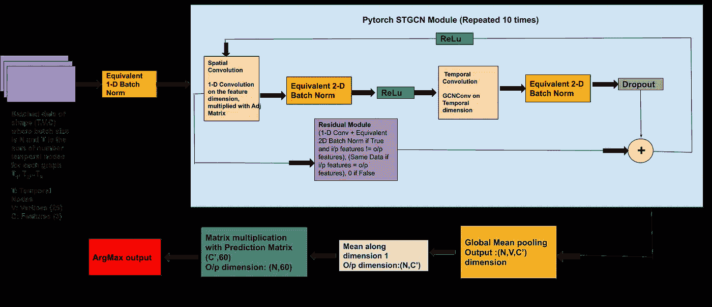
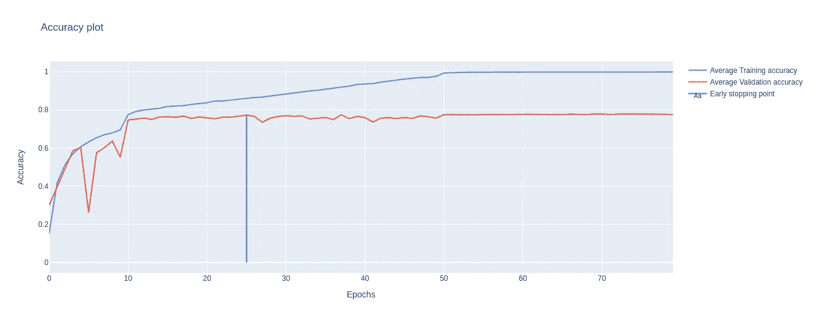
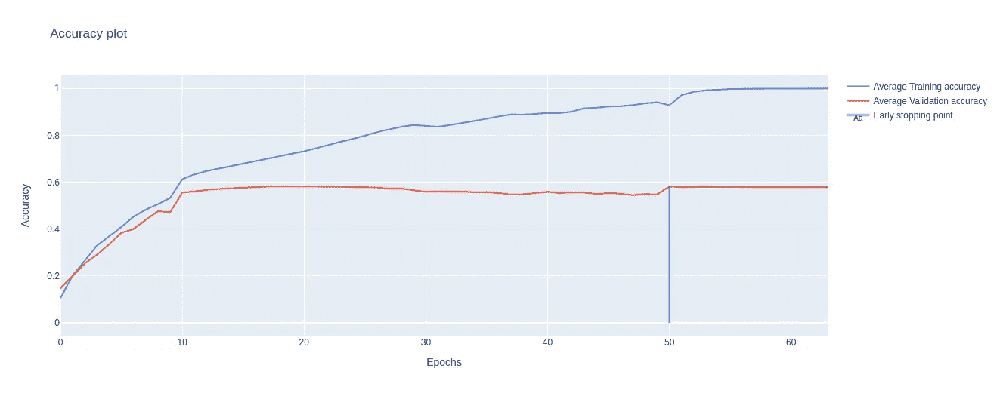

# 基于 Pytorch 几何的动作识别

> 原文：<https://medium.com/geekculture/action-recognition-using-pytorch-geometric-d50ca8de0f6e?source=collection_archive---------11----------------------->

我曾在海德拉巴国际信息技术学院(IIITH)的 Ravikiran Sarvadevabhatla 博士的指导下研究动作识别。我的工作是使用 [Pytorch 几何库](https://pytorch-geometric.readthedocs.io/en/latest/index.html)实现基于骨架的动作识别 (STGCN)的研究论文[时空图卷积网络。所用的数据集是](https://arxiv.org/pdf/1801.07455.pdf) [NTU-60](https://github.com/shahroudy/NTURGB-D) 数据集(所用的行动类别是 A1-A60)。

> 由于下面的文章使用了图卷积网络，如果您不熟悉这个概念，请阅读“[获得图神经网络的直觉](/analytics-vidhya/getting-the-intuition-of-graph-neural-networks-a30a2c34280d)”、“[了解用于节点分类的图卷积网络](https://towardsdatascience.com/understanding-graph-convolutional-networks-for-node-classification-a2bfdb7aba7b)”以对图神经网络有一个基本的了解。

# **什么是 NTU 60 数据集？**

NTU-60 数据集将人体骨骼建模为一组 25 个关节，每个关节有 3 个值(x，y，z)来表示空间信息。当执行一个动作时，25 个关节的值随时间而变化。

Fig 1: 25 body joints in NTU dataset

# 现有 STGCN 代码

[STGCN 代码](https://github.com/open-mmlab/mmskeleton/tree/master/deprecated/origin_stgcn_repo)旨在捕捉每个时间帧(空间卷积)的这些特征值如何在空间中变化(即，对于给定关节，其连接关节的值如何变化)以及每个关节的值如何在时间帧中变化(时间卷积)，以将视频分类为特定动作。网络的输入是联合值，它在最终分类层之前通过多个 STGCN 块(即执行空间和时间卷积的块)。通过每个块后，生成更高级的特征图(即每个关节的数值增加)。

Fig 2: STGCN skeleton sequence

Fig 3: Spatial and Temporal Convolutions performed multiple times on the sequence before classification.

由于数据是以批处理的方式进行处理的，因此在传递到网络之前，数据具有以下形状:N x C x T x V x M 其中:

n:批量大小，C:通道/特征的数量(开始时为 3)，T:时间帧的数量，V:顶点的数量(总是 25)，M:时间帧中出现的人数。

为了批量处理不同的视频，一批视频的尺寸必须相同。但是数据集的视频具有不同的时间帧，并且在这些帧中存在不同数量的人(1 或 2)。为了确保统一的尺寸，视频用 0 填充，使得数据集中的时间帧的数量为 300，并且每个帧中的人数为 2(如果一个帧有一个人，则复制该帧，使得第二个人的关节的特征值为 0)。现在传递给网络的数据有以下维度:N x C x 300 x V x 2。

数据在通过第一个 STGCN 块之前被整形为 N*2 x C x T x V。

STGCN 代码使用了 [nn。用于空间和时间卷积的 Conv2d](https://pytorch.org/docs/stable/generated/torch.nn.Conv2d.html) 包。对于[空间卷积](https://github.com/open-mmlab/mmskeleton/blob/master/deprecated/origin_stgcn_repo/net/utils/tgcn.py)，使用[邻接矩阵](https://github.com/open-mmlab/mmskeleton/blob/master/deprecated/origin_stgcn_repo/net/utils/graph.py)的概念来确定骨架中存在的邻居，并且在给定的时间帧中，空间特征被卷积以生成新的空间特征图。对于[时间卷积](https://github.com/open-mmlab/mmskeleton/blob/master/deprecated/origin_stgcn_repo/net/st_gcn.py)，使用的核大小是(9，1)，即它捕获 9 个时间帧中每个关节的特征值，并卷积成单个特征。体系结构如下所示。

Fig 4: Original STGCN Code Architecture

# 此方法的问题:

在这种方法中，填充输入数据以执行批处理和卷积的必要性意味着消耗更多的空间，并且对填充的数据(用 0 填充)执行不必要的卷积。

为了避免使用填充，我尝试使用 Pytorch 几何库重写相同的代码。

# Pytorch 基于几何的代码:

Pytorch 几何库提供了在不规则数据结构上实现深度学习网络的各种方法。我做图形卷积用的包是 [GCNConv](https://pytorch-geometric.readthedocs.io/en/latest/modules/nn.html#torch_geometric.nn.conv.GCNConv) 。Pytorch Geometric 允许[批处理](https://pytorch-geometric.readthedocs.io/en/latest/modules/data.html#torch_geometric.data.Batch)节点数量可变但特征数量相同的图。为了更好地利用这一点，我将 NTU 60 数据集视为一组图表。这些图具有不同数量的时间节点，但特征保持不变。

图形的形状是 T×V×C(T:时间节点，V:顶点，C:通道数)。批量大小为 5 意味着将 5 个图作为单个不连接的图一起批量处理，其中值 T 将是每个图的时间节点的数量之和。

这也解决了两个人所需的填充，方法是将每个人视为一个图，并将他们作为一个不连通的图分批在一起。

下面的图 4 展示了一个玩具数据集，显示了这些图形是如何组合在一起的。在该数据集中，折点数(V)固定为 4，要素数(C)固定为 3。

Fig 5: The orange-colored nodes are the temporal nodes and within each node, there is a graph of dimension VxC.

在[处理完数据](https://github.com/hariharannatesh/Action-Recognition-using-Pytorch-Geometric/blob/master/expt_6/expt_6g/Code_pytorch_geom/utils_temp/stgcn_dataset.py)后，图表通过 [STGCN 模块](https://github.com/hariharannatesh/Action-Recognition-using-Pytorch-Geometric/blob/master/expt_6/expt_6g/Code_pytorch_geom/utils_temp/gstcn.py)并通过最终分类层。由于 Pytorch STGCN 代码的数据格式不同，因此[批量标准化](https://github.com/hariharannatesh/Action-Recognition-using-Pytorch-Geometric/blob/master/expt_6/expt_6g/Code_pytorch_geom/utils_temp/pyg_batchnorm.py)也必须进行编码，以使其等同于原始的 1-D、2-D 批量标准化。体系结构如下所示。

Fig 6: Pytorch STGCN Code Architecture

显示了原始 STGCN 代码和 Pytorch 几何代码的曲线。

Fig 7:Training and Validation Accuracy plot for original STGCN Code.

Fig 8:Training and Validation Accuracy plot for Pytorch Geometric STGCN Code.

可以看出，原始 STGCN 代码具有大约 78%的验证准确度，而基于 Pytorch 几何的 STGCN 代码具有大约 58%的验证准确度。尽管这两种代码在概念上执行空间和时间卷积，但卷积模块中涉及的参数数量是不同的。

# Pytorch 几何模型为什么不行？

在 Conv2d 包中，如果内核大小给定为(9，1)，则卷积运算的可学习参数数为[9 x 输入特征数 x 输出特征数]。除此之外，这还意味着在给定的数据点，该数据点两侧的 4 个邻居的特征被卷积，即给定的数据点有 8 个邻居。

为了使用 GCNConv 包执行等效操作，需要预先定义邻接矩阵，使得任意节点具有 8 个节点的邻居。基本的图卷积运算是归一化邻接矩阵、图、可学习权重矩阵的乘积。权重矩阵的形状为[输入要素的数量 x 输出要素的数量]。这意味着尽管邻接矩阵照顾到了邻居，但是每个 STGCN 操作的可学习操作符的数量减少了 9 倍(即内核大小)。邻域特征被同等地呈现。这种类型的内核被称为各向同性内核。

# 结论:

如果内核不是像 [SplineConv](https://pytorch-geometric.readthedocs.io/en/latest/modules/nn.html#torch_geometric.nn.conv.SplineConv) 包所使用的那种各向同性内核，那么精确度可能会提高。然而，SplineConv 包只能容纳二维图形，而我们的图形是三维的。如果一个图形包可以容纳三维图形，并且没有各向同性的内核，那么我相信在不使用填充数据的情况下可以达到更高的精度。

*链接到 Pytorch 几何知识库:*[*https://github . com/hariharannatesh/Action-Recognition-using-py torch-Geometric*](https://github.com/hariharannatesh/Action-Recognition-using-Pytorch-Geometric)