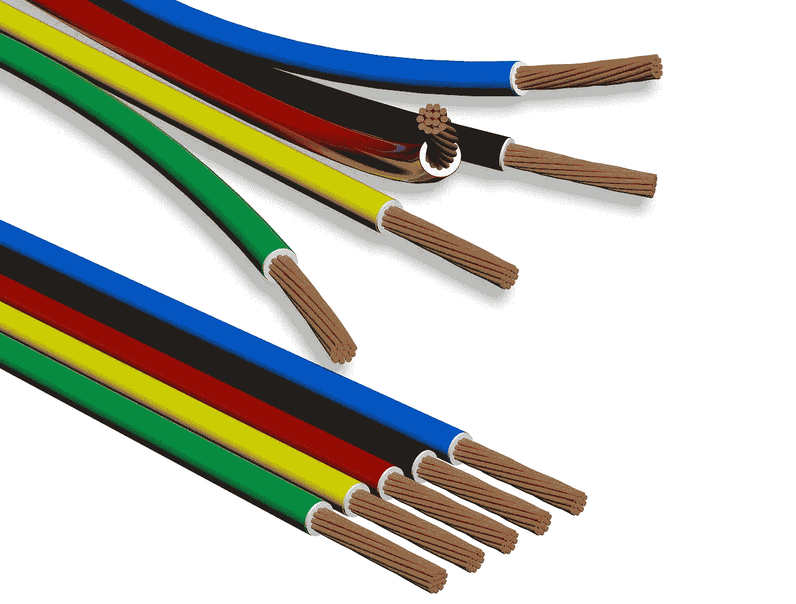

# action 电缆到任何电缆

> 原文：<https://medium.com/geekculture/actioncable-to-anycable-c9d9d54665f0?source=collection_archive---------3----------------------->

ActionCable 随着 Rails 5 变得流行起来。正如本文所述，Action Cable 在以下方面存在性能问题:

*   记忆
*   中央处理器
*   消息广播时间

任何电缆来拯救。它允许您使用任何 Websocket 服务器来替代 ActionCable，同时保持相同的协议，并且不改变客户端代码。

