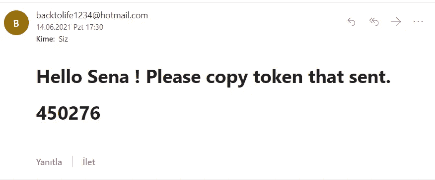

# 使用 NodeJs 和 MongoDB 激活帐户(最终版本)

> 原文：<https://medium.com/geekculture/activate-account-with-nodejs-and-mongodb-final-version-3e6f646b4f8?source=collection_archive---------45----------------------->


在这篇文章中，我将讲述如何用 NodeJs 激活一个帐户。这和我之前的文章是有联系的，所以如果你看了，你就很容易理解这个项目。链接在这里:

[](/geekculture/signup-function-with-nodejs-and-mongodb-final-version-18caa017a3b) [## 用 NodeJs 和 MongoDB 注册函数(最终版本)

### 我写了这个函数和其他函数，但是在我写的时候这个项目还没有完成。所以，我完成项目并想…

medium.com](/geekculture/signup-function-with-nodejs-and-mongodb-final-version-18caa017a3b) 

开始吧！

首先，我们在请求中有一个电子邮件和一个 randomCode。

```
const { email, randomCodeReq, } = *req*.body;
```

随机代码给了我们注册功能。在这个函数中，我们向用户发送一封电子邮件。在电子邮件中，我们有一个 6 位数的号码，就像这样:



对于电子邮件，我们在数据库中搜索一个用户，并将其等同于常量 userEmailSearch。如果 randomCode 等于用户的 randomCode，而用户的登录等于 false，则我们在 If 内部。

```
const userEmailSearch = await User.find({ email: email });if (randomCodeReq == userEmailSearch[0].randomCode && userEmailSearch[0].login == false) {}
```

在 if 语句中，我们有一个 try/catch。在 try 部分，我们将创建一个名为 user 的常量。用户将电子邮件等同于给定的电子邮件。在数据库中，我想在激活后删除 randomCode。为此，我会写

```
user.randomCode = 0;
user.save()
```

之后，我将在数据库的模型部分创建一个函数并删除 randomCode。但那是在我的下一篇文章中。我就想说这些，所以如果你不明白为什么，你可以直接跳过那部分。

现在，我们有一个用户，这个用户在数据库中有 id、refreshToken 和其他列。我返回一个响应，在响应中是一个成功:true、用户 id 和 refreshToken。

```
*res*.status(200).json({success: true,id,refreshToken});
```

在 catch 块中，如果有错误，我们将返回状态代码 500。

现在，我们需要路由这个函数。为此，我转到 routes/auth.js 文件并添加以下代码:

```
router.post('/email-activate',activateAccount)
```

这篇文章写完了，我会写下一篇文章，所以请关注我。感谢阅读！