# 行动者-批评家:实现行动者-批评家方法

> 原文：<https://medium.com/geekculture/actor-critic-implementing-actor-critic-methods-82efb998c273?source=collection_archive---------5----------------------->

在这篇文章中，我将使用我以前文章中的[策略梯度方法](/nerd-for-tech/reinforcement-learning-introduction-to-policy-gradients-aa2ff134c1b)和[价值函数近似法](/geekculture/actor-critic-value-function-approximations-b8c118dbf723)来实现一些行动者-批评家方法。我不会太关注理论和细节，但更多的是结合演员和评论家以前的想法。

# 演员-评论家算法

首先，让我们看看萨顿&巴尔托给出的一步演员-评论家算法:

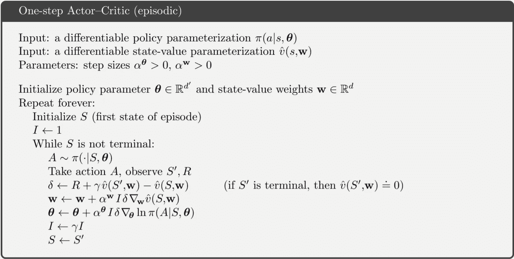

Taken from Sutton&Barto 2017

我们已经学习了如何更新“批评”当前状态的批评家(价值函数)和按照批评家告诉我们的方向更新的参与者(政策函数)。这里的单步演员-评论家算法完全在线，评论家使用 TD(0)算法来更新价值函数的参数 w。回想一下 TD(0)更新公式:


Taken from David Silver’s UCL Lecture 7

这里，我们使用目标值和近似值之间的时间差来更新梯度方向上的值函数。因为 TD(0)算法在每个时间步长更新，所以通过自举来估计目标值。

现在我们来看看演员。参与者使用批评家的评估来更新策略参数θ。回想一下我们从策略梯度定理导出的策略更新等式:

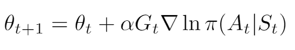

Taken from David Silver’s UCL Lecture 7

这个策略更新方程被用在加强算法中，该算法在对整个轨迹进行采样之后进行更新。由于 Sutton&Barto 的一步行动者-批评家使用在线更新，我们在由价值函数近似的状态-行动值的方向上更新政策参数，而不是使用累积报酬 Gₜ.现在，如果我们只使用值函数来确定更新的方向，这将导致一个相当有偏差的结果。我们可以用减去基线的概念来使它无偏。你可以在这里阅读更多关于我用基线[加固的实现。](/nerd-for-tech/policy-gradients-reinforce-with-baseline-6c871a3a068)

在用基线强化中，我们使用价值函数作为基线，所以自然地，我们在这里也可以。我们不是在近似状态-动作值的方向上更新策略，而是通过在该状态下选择特定动作的优势来调整它。我们可以通过查看状态值和状态-动作值之间的差异来计算这种优势。

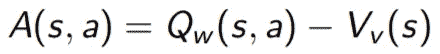

Taken from David Silver’s UCL Lecture 7

快速回顾一下:Q(s，a)是采取行动 a 后一个状态 s 的值而 V(s)只是一个状态 s 的值。

简单的方法是通过学习具有不同参数的状态-动作值函数 Q 和状态值函数 V。这样做会使我们的算法更加复杂，因为我们必须跟踪 Q、V 和策略参数。萨顿和巴尔托在这里使用了一种更简单的方法。我们可以用(R + V(s ')作为估计的状态-动作值来计算优势，和 TD 误差一样！

如果您查看 Actor-Critic 算法的不同实现，您可能会注意到一些差异。例如， [Keras](https://keras.io/examples/rl/actor_critic_cartpole/) 和 [Pytorch](https://github.com/pytorch/examples/blob/master/reinforcement_learning/actor_critic.py) 使用蒙特卡罗方法更新演员和评论家。虽然萨顿&巴尔托并不认为蒙特卡罗方法是一个真正的行动者-批评家方法，因为批评家只是用来作为减少方差的基线，这些方法仍然是有效的。

你现在可能有的一个问题是，评论家可以使用不同的价值近似值方法吗？答案是肯定的。回想一下我们讨论过的不同的[近似方法](/geekculture/actor-critic-value-function-approximations-b8c118dbf723):

蒙特卡洛:

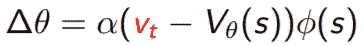

Taken from David Silver’s UCL Lecture 7

萨顿&巴尔托所用的 TD(0):

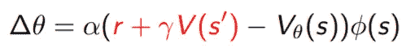

Taken from David Silver’s UCL Lecture 7

前视 TD(λ):

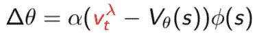

Taken from David Silver’s UCL Lecture 7

后视 TD(λ):

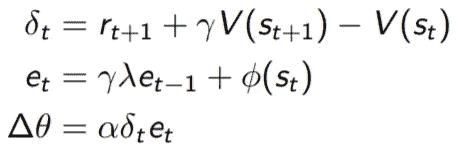

Taken from David Silver’s UCL Lecture 7

我们甚至可以为演员的优势函数做同样的事情。简单的用ϕ(s = ∇lnπ(a | s，θ)代替演员来代替评论家ϕ(s) = ∇v(S，w)。

以下是萨顿&巴尔托为《演员和评论家》使用后视 TD(λ)的在线演员评论家的伪代码:

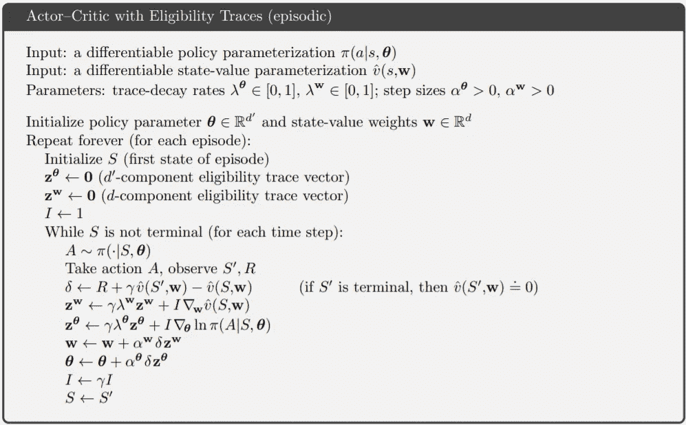

Taken from Sutton&Barto 2017

我们还可以为演员和评论家实现一个前视 TD(λ),但类似于蒙特卡罗方法，我们必须对整个轨迹进行采样，并不定期地执行离线更新。

# 履行

在这篇文章的其余部分，我将展示我的演员-评论家方法的 Pytorch 实现，并谈论一些挑战和我做的事情。我已经使用 TD(0)、后视 TD(λ)和前视 TD(λ)实现了 Actor-Critic。对于蒙特卡罗实现，请参考我的帖子[用基线](/nerd-for-tech/policy-gradients-reinforce-with-baseline-6c871a3a068)加强。以下是我用来参数化我的策略和价值函数的神经网络:

```
class PolicyNetwork(nn.Module):

    #Takes in observations and outputs actions
    def __init__(self, observation_space, action_space):
        super(PolicyNetwork, self).__init__()
        self.input_layer = nn.Linear(observation_space, 128)
        self.output_layer = nn.Linear(128, action_space)

    #forward pass
    def forward(self, x):
        #input states
        x = self.input_layer(x)

        #relu activation
        x = F.relu(x)

        #actions
        actions = self.output_layer(x)

        #get softmax for a probability distribution
        action_probs = F.softmax(actions, dim=1)

        return action_probs
```

国家价值网络:

```
class StateValueNetwork(nn.Module):

    #Takes in state
    def __init__(self, observation_space):
        super(StateValueNetwork, self).__init__()

        self.input_layer = nn.Linear(observation_space, 128)
        self.output_layer = nn.Linear(128, 1)

    def forward(self, x):
        #input layer
        x = self.input_layer(x)

        #activiation relu
        x = F.relu(x)

        #get state value
        state_value = self.output_layer(x)

        return state_value
```

以下是我在实现中使用的超参数:

*   γ(折扣系数):0.99
*   剧集数量:1000
*   最大步数:10000
*   α(系数 LR): 0.01
*   β(评论家 LR): 0.01
*   λ(演员):0.8
*   λ(评论家):0.8

对于每个实现，我将使用 OpenAI 在最近 100 集的平均分数为 195 的解决条件。

# **TD(0)实现**


Taken from Sutton&Barto 2017

对于 TD(0) AC，我使用了上面萨顿和巴尔托给出的伪代码。在我的实现中，我使用 MSE 作为评论家的损失函数，这与上面应用链规则一次的伪代码是一样的。我还使用随机梯度下降(SGD)作为我的优化器，正如伪代码中所描述的，并且在不同的实现之间进行公平的比较。

让我们看看我的结果的训练历史:

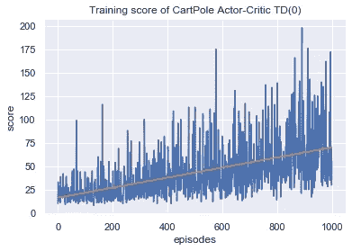

我们的代理在 5 次试玩中，50 次游戏的平均得分为 61.828。在训练历史中，我们可以看到，尽管方差很高，但分数仍有稳步上升的趋势。相比于人类基准(me)的 30.8 分和随机策略的 21.48 分，61.8 分肯定要好得多。

高差异的一个解释可能是因为回报。对于基线强化，我可以使用白化奖励来标准化奖励，以减少差异。这是因为该算法在应用更新之前对整个轨迹进行了采样，所以我能够应用归一化。差异的另一个原因是分数的突然下降。这是因为一种叫做灾难性遗忘的现象，在这种现象中，主体“忘记”过去的状态，并需要再次重新学习模式。

下面是使用 Adam 优化器时的训练结果:

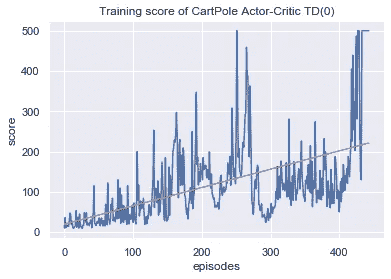

有了 Adam optimizer，该代理可以在 50 次播放中获得平均 500 分。代理也在仅仅 443 集的训练中达到了我们解决的条件。

# **前视 TD(λ)实现**

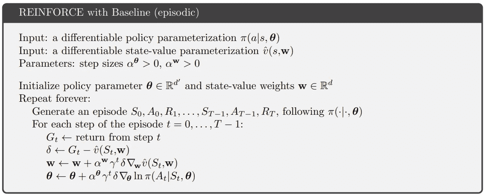

Taken from Sutton&Barto 2017

对于前视 TD(λ) AC，没有任何伪代码，但这个概念类似于萨顿和巴尔托在上面描述的用基线加固。我们不计算来自步骤 t 的 Gₜ回报，而是计算来自步骤 t 的 gₜλ-回报，它对所有 ns 的 n 步回报进行平均，并为每个 n 步回报分配衰减权重。我用随机梯度下降(SGD)作为我的优化器，用 MSE 作为我的损失函数来学习价值函数。我还用了白化奖励来对抗渐变爆炸，减少方差。

让我们看看我的结果的训练历史:

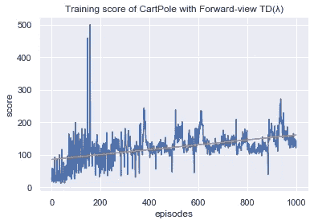

我们的代理人在 3 次试玩的 50 次游戏中取得了 146.27 的平均分数。由于算法运行时间较长，我只进行了 3 次试验，这足以确保我没有异常值。与 TD(0)相比，我们的代理能够取得 146.27 的更好成绩，而不是 61.83。我们还可以看到，由于组合了来自所有 Ns 的不同 N 步目标值的更稳健的目标值，因此没有太多的差异。还有一个灾难性遗忘的例子发生在第 160 集左右，在代理人达到 500 的高分之后。

当我计算 N 步回报时，我的解决方案的运行时间是 O(n ),我可能会将其减少到 O(n ),因此它的运行时间比 TD(0)的 2 分钟长得多，约为 16 分钟。这是前视 TD(λ)的缺点，前视 TD(λ)需要更高的时间复杂度来计算每个时间步长上所有 ns 的 N 步回报，并且还需要更高的空间复杂度来存储轨迹。这也是为什么大多数算法选择使用后视 TD(λ)而不是前视的原因，因为这不是合格跟踪的问题。

下面是使用 Adam 优化器时的训练结果:

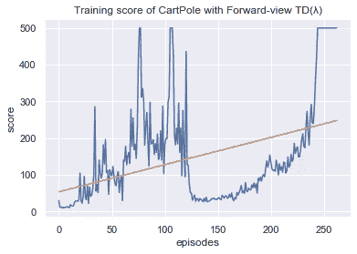

有了 Adam optimizer，该代理可以在 50 次播放中获得平均 500 分。在仅仅 262 集的训练中，代理也达到了我们解决的条件。

# **后视 TD(λ)实现**


对于后视 TD(λ) AC，我遵循上面萨顿&巴尔托给出的伪代码。在我的实现中，我没有使用优化器，而是对网络参数进行手动更新，这样我就可以应用资格跟踪。这也是为什么我在其他实现中使用 SGD 来获得更公平的结果比较的原因。

让我们来看看我的成绩的训练历史:

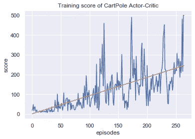

我们的代理在 5 次试玩中，50 次游戏的平均得分为 334.116。代理也达到了平均 266.2 集的解决条件。与 TD(0)相比，我们的代理能够取得更好的成绩。理论上，前视和后视 TD(λ)是等价的，但在强化学习中，由于高方差，总是存在复制结果的问题。后视 TD(λ)的训练时间与 TD(0)大致相同，因为两者都进行在线更新。与具有高时间和空间复杂度的前视 TD(λ)相比，后视 TD(λ)在每一步累积一个合格轨迹，这允许每次更新考虑所有过去的更新。有趣的是，轨迹的空间复杂度仅为 O(|θ| + |w|) = O(1)，这是演员和评论家网络参数的大小。计算目标值回报时，我们只需要计算 1 步 TD 误差，一集 O(n)。

由于我们必须手动执行更新，Adam 优化器在这种情况下无法工作。

# 摘要

以下是结果汇总，包括来自[的蒙特卡洛模拟，用基线](https://chengxi600.medium.com/policy-gradients-reinforce-with-baseline-6c871a3a068)进行强化:

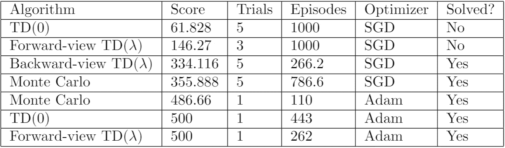

请注意，由于我只对亚当优化程序进行了一次试验，因此解决问题的次数可能会有所不同。值得注意的一点是，对于已解决的实现，使用 SGD 优化器的实现获得了大约 300 分，而使用 Adam 优化器的实现获得了大约 500 分。这可能是因为 Adam 优化器引入了更新动量和加速，使代理能够比使用 SGD 时更快地达到局部最大值。另一件要注意的事情是，CartPole 环境的选择对每个算法的有效性有巨大的影响。CartPole 在非终结状态下对每个时间步长只给出+1 的统一奖励，所以 TD(λ)算法并不是特别好。

# 最后的想法

这三个实现花费的时间比预期的要长，这主要是因为我误解了伪代码和 Pytorch 库。虽然 TD(0)和前视 TD(λ)对我来说相当简单，但我在后视 TD(λ)上停留了一段时间。我使用预建的优化器，不确定在哪里应用我的资格跟踪。在看了这个[视频](https://www.youtube.com/watch?v=mdKjMPmcWjY)之后，我意识到我应该执行手动更新，这个视频简要概述了不同的优化算法。

我学会使用的另一件事是在形成张量时将 required_grad 属性设置为 True，我需要对该张量执行反向传播，这将有助于跟踪张量操作。当在具有重叠叶张量的张量上多次调用 backward()时，我需要使用 backward(retain_graph=True ),这样在调用 backward()后，计算图形不会从内存中释放。

总的来说，这是一项具有挑战性的任务，但也是值得的，我学到了很多东西，并对更难的算法更有信心。由于没有太多关于资格追踪的资源，我最终在它们上面停留了一段时间。在以后的文章中，我想讨论连续动作空间、自然行动者-评价者、异步优势行动者-评价者(A3C)、确定性策略梯度和近似策略优化的行动者-评价者算法。

代码:

*   TD(0)演员-评论家:[https://github . com/cheng i600/rl stuff/blob/master/演员-评论家/演员-评论家 _TD_0.ipynb](https://github.com/chengxi600/RLStuff/blob/master/Actor-Critic/Actor-Critic_TD_0.ipynb)
*   前视 TD(λ)演员-评论家:[https://github . com/cheng i600/rl stuff/blob/master/Actor-Critic/Actor-Critic _ TD _ Lambda _ forward . ipynb](https://github.com/chengxi600/RLStuff/blob/master/Actor-Critic/Actor-Critic_TD_Lambda_Forward.ipynb)
*   后视 TD(λ)Actor-Critic:[https://github . com/cheng i600/rl stuff/blob/master/Actor-Critic/Actor-Critic _ TD _ Lambda _ backward . ipynb](https://github.com/chengxi600/RLStuff/blob/master/Actor-Critic/Actor-Critic_TD_Lambda_Backward.ipynb)

参考资料:

*   [政策梯度(大卫·西尔弗的 UCL 讲座 7)](https://www.davidsilver.uk/wp-content/uploads/2020/03/pg.pdf)
*   [强化学习:导论(萨顿&巴尔托 2017)](http://incompleteideas.net/book/bookdraft2017nov5.pdf)
*   [优化者解释(CodeEmporium)](https://www.youtube.com/watch?v=mdKjMPmcWjY)