# 演员-评论家:非策略演员-评论家算法

> 原文：<https://medium.com/geekculture/actor-critic-off-policy-actor-critic-algorithm-cca654845558?source=collection_archive---------20----------------------->

在这篇文章中，我将探索提交给 2012 年 ICML 的论文[背后的思想。本文提出了一种完全在线的行动者-批评家方法，使用行为策略来学习目标策略。这种偏离策略的学习方法利用了行动者-批评家方法中的行动选择，同时具有偏离策略的好处，以便更好地探索和使用经验重放。最后，我将尝试实现文中描述的算法。](https://arxiv.org/pdf/1205.4839.pdf)

# 评论家:政策评估

首先，本文描述了政策评估的方法。类似于基线行动者-批评家方法，我们可以使用一组权重来学习价值函数的线性近似。在实施过程中，我们可以仅使用神经网络来学习非线性近似。该论文使用[梯度-TD 方法](https://sites.ualberta.ca/~szepesva/papers/ICML10_controlGQ.pdf)来学习偏离策略设置中的价值函数的权重，并且还保证了与自举方法不同的收敛性。这些方法试图最小化λ加权投影贝尔曼方程的均方误差。本文中给出的最终算法使用了一种称为 GTD(λ)的变体，该变体由 [Maei (2011)](http://www.incompleteideas.net/papers/maei-thesis-2011.pdf) 引入。我不会详细介绍价值近似值方法，但它本质上是 TD(λ)在非策略设置中的一种变体。

# 政策外政策梯度定理

在我们看行动者如何学习策略函数之前，让我们看看策略梯度定理在非策略设置中是如何工作的。这里快速回顾一下政策梯度定理。首先，我们将策略定义为π **ᵤ** (a|s)，其中输出是给定状态 *s* 下动作 *a* 的概率。该策略有一个权重向量 **u** ，或者参数 **u** ，如果你使用神经网络来学习的话。目标是最大化性能测量函数 J 的 **u** :

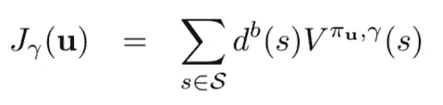

Taken from Off-Policy Actor-Critic (Degris et al. 2013)

这里 d **ᵇ** (s)是在 **b** 下的状态分布其中 P(sₜ = s | s₀，**b**∀t∈ℕ，状态遵循一个行为分布 **b** 。这与策略上的性能测量函数略有不同，因为我们是从单独的行为分布中取样的。回想一下我们是如何在加强中更新权重的:**u**ₜ₊₁=**u**ₜ+α∇j(**u**ₜ).我们可以通过计算∇J( **u** 的近似值来获得梯度∇J( **u** )。关于这个近似值的完整推导，请参考我在[政策梯度](https://chengxi600.medium.com/?p=aa2ff134c1b)上的帖子。

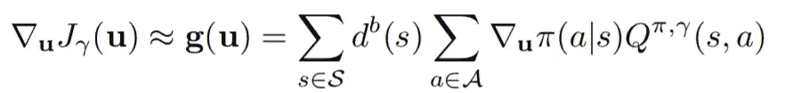

Taken from Off-Policy Actor-Critic (Degris et al. 2013)

这是一个从右到左的方程式的快速纲要。 *Q(s，a)* 是评估在状态 *s.* 中采取的动作 *a* 的值函数。我们将其乘以动作 *a* 给定状态 *s* 遵循策略π相对于权重 **u** 的概率梯度。然后，我们对动作空间中所有动作 *a* 的乘积求和，给出状态 *s* 的值的梯度的期望值。然后，我们将其乘以由状态 *s* 的行为分布 d **ᵇ** 给出的权重，并对我们的状态空间中所有状态 *s* 的加权值求和。最终值将是我们的权重 **u** 的性能测量的近似梯度。

本文提供了两个定理来证明这种近似:

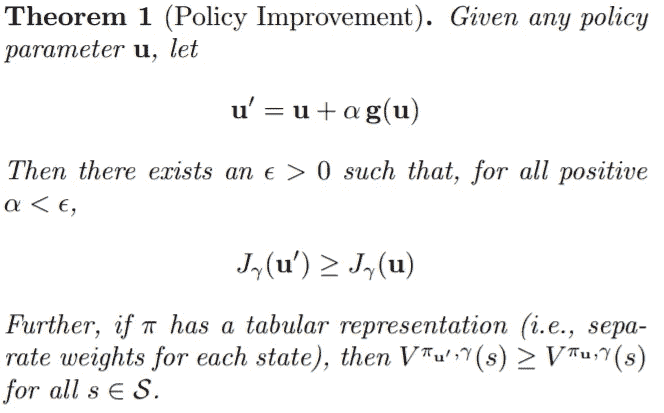

Taken from Off-Policy Actor-Critic (Degris et al. 2013)

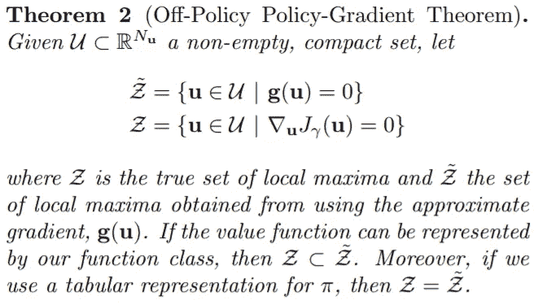

Taken from Off-Policy Actor-Critic (Degris et al. 2013)

定理 1 表明，在逼近方向上任何政策参数的更新给我们一个更好的政策。在符合策略的设置中，策略梯度定理表明我们的近似值 **g** ( **u** )等于性能测量函数 j 的梯度。虽然我们在不符合策略的设置中无法做到这一点，但定理 2 建立了使用近似值找到的解决方案与性能测量函数之间的关系。为了证明这两个定理，请查看[论文](https://arxiv.org/pdf/1205.4839.pdf)的附录。

# 参与者:带有资格跟踪的在线更新

现在我们已经建立了∇J 的近似值，我们可以得出演员的更新方程。就像增强的更新方程一样，我们希望找到近似值的期望值，而不是实际上对所有状态和动作求和。

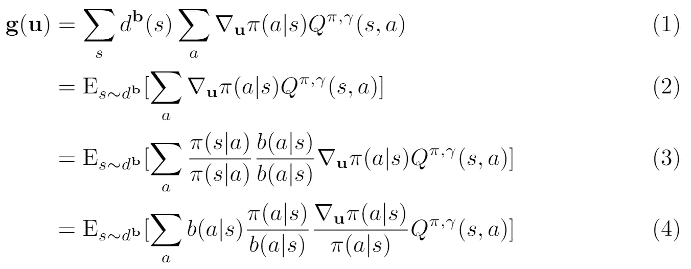

我们从(1)中的非策略策略梯度近似开始。然后在(2)中，我们可以通过从分布 *d* ***ᵇ*** 中采样一个状态，将所有状态的求和写成一个期望值，从而消除求和。在(3)中，我们将期望值乘以两个等于 1 的常数，然后重新排列一些项。常数ρ就是[重要性权重](http://timvieira.github.io/blog/post/2014/12/21/importance-sampling/)。这里， *b(a|s)* 是动作概率 *a* 给定状态 *s* 。

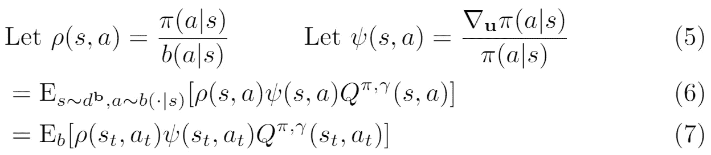

通过引入 b(a|s ),我们能够通过从行为分布 **b** 中采样一个动作来去除状态 *s* 中所有动作的总和。这篇论文用一种新的符号简化了预期:

> 我们引入了新的符号 Eb [ ]，以表示在行为策略下，所有随机变量(按时间步长索引)从它们的极限平稳分布中抽取的隐含条件期望。

现在，我们已经将近似值转换成了可用于计算更新方程的期望值。然后，论文从中减去一个基线，然后通过使用非政策λ-收益来近似 Q 函数，定义为:

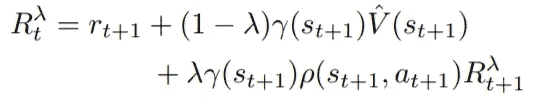

Taken from Off-Policy Actor-Critic (Degris et al. 2013)

我们可以从 Q 函数中减去基线，因为基线的梯度是 0。更详细的解释，请查看我的帖子[用基线](/nerd-for-tech/policy-gradients-reinforce-with-baseline-6c871a3a068)加固。这里我们有一个近似为 **g** ( **u** )的最终期望，因为λ收益与 Q 函数略有不同。

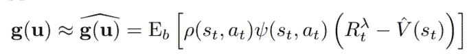

Taken from Off-Policy Actor-Critic (Degris et al. 2013)

然后，期望值用于前视更新等式:

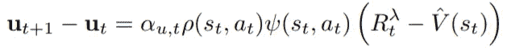

Taken from Off-Policy Actor-Critic (Degris et al. 2013)

根据这个等式，我们必须对整个轨迹进行采样，以计算λ收益。幸运的是，我们可以将这种前视更新转换为后视更新，以便算法完全在线工作。类似于后视 TD(λ)算法，我们可以使用合格轨迹来更新参数 **u** 来代替。对于这些痕迹的解释，你可以查看我在[价值函数近似](/geekculture/actor-critic-value-function-approximations-b8c118dbf723)上的帖子。这是写有资格跟踪的期望，

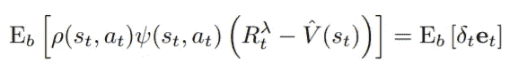

Taken from Off-Policy Actor-Critic (Degris et al. 2013)

其中，δ是 TD 误差:δₜ = Rₜ₊₁ + γV(sₜ₊₁) - V(sₜ)，并且资格轨迹用以下等式更新:

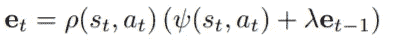

Taken from Off-Policy Actor-Critic (Degris et al. 2013)

然后，我们可以将此期望用于后视更新等式:

Taken from Off-Policy Actor-Critic (Degris et al. 2013)

这是论文中的 Off-PAC 算法的伪代码:

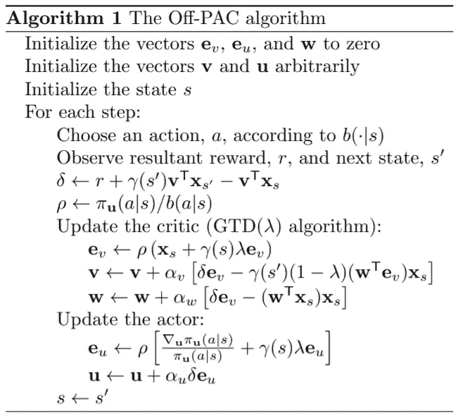

Taken from Off-Policy Actor-Critic (Degris et al. 2013)

向量 **e** ᵥ， **e** ᵤ分别是用于评论家和演员的轨迹， **w** 是用于 GTD(λ)算法更新评论家的轨迹。向量 **v** 和 **w** 是评论家和演员的权重向量。注意，我们可以在 Actor 更新的实现中简化ψ(s，a) = ∇ ln π(a | s)。该算法中使用的超参数是:

*   αʷαᵛ:批评家的步长
*   αᵘ:演员的步长
*   λ:轨迹的重量衰减
*   b(⋅|s):平稳行为策略分布

# 履行

对于这个算法的实现，我决定尝试按照本文中的方式来实现它。但首先，我想实现一个普通的非策略策略梯度方法，而不需要对价值函数进行λ回报和非策略学习的所有修改。

# 政策外政策梯度实施

回想一下我们导出的政策外政策梯度定理的期望:

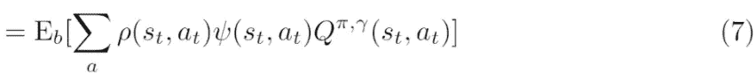

对于一个普通的保单外保单梯度，我们将使用贴现的累积报酬 Gₜ作为 q 值。这是我输入的伪代码:

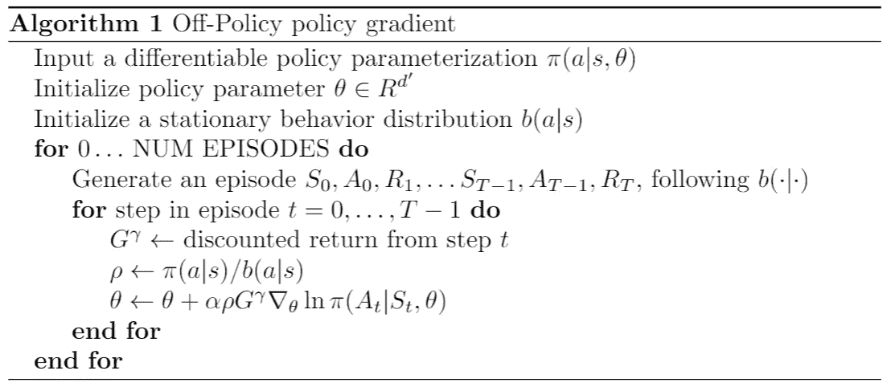

如您所见，它基本上与加强相同，只是我们从静态行为策略中采样轨迹，并在更新步骤中乘以重要性权重ρ。

下面是我在这个实现中使用的超参数:

*   α(学习率):0.01
*   γ(折扣系数):0.99
*   最大步数:5000
*   剧集数量:1000
*   行为策略:动作空间上的均匀分布

对于实验，我在每集生成两条轨迹:一条来自行为策略，用来训练我们的目标策略，另一条来自目标策略，这样我们就可以在那一集评估我们的目标策略。虽然这可能会使训练时间增加一倍，但每集的运行时间仍然是 2n = O(n)。

以下是我们的代理在 CartPole 环境下超过 1000 集的培训历史:

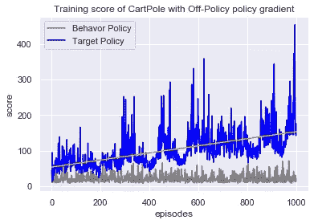

灰线是我们稳定行为政策的回报历史，蓝线是我们目标政策的回报历史。正如预期的那样，灰线没有改善，因为我们是从一个稳定的行为政策中取样的。蓝线显示了我们的代理在 1000 集里的进步。

我们的代理人在 3 次试玩的 50 次游戏中取得了 142.37 的平均分数。这比我们的普通保单保单梯度(得分为 79.6)要好得多。这里可以看到脱离政策的好处。由于我们从一个稳定的行为策略中采样我们的轨迹，我们的代理在整个试验中保持相同的探索水平，并且可以防止自己陷入次优的局部最大值。

# 政策外行动者-批评者实施

现在，让我们尝试实现本文中描述的 Off-PAC 算法。对于我的实现，我决定完全按照论文的实现，并对演员和评论家使用学习过的线性近似器。下面是我的代码片段的快速浏览:

这里，我们初始化演员和评论家权重向量 u 和 v，以及轨迹向量 ev、eu 和 w。这些向量的形状是(输入 x 输出)，其中输入是演员权重向量的状态空间，输出是动作空间，1 是评论家权重向量。然后我们有一些辅助函数:

由于该论文使用演员和评论家的线性近似器，而不是通过神经网络的前向传递，我们简单地将权重向量乘以特征向量来获得输出。剩下的就很简单了。我们计算我们需要的常数并更新所有的向量:

尝试在 MountainCar 环境中运行代理后，我没有得到我想要的结果。以下是遵循行为策略的奖励历史:

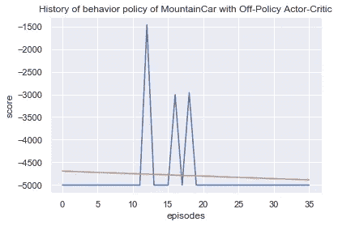

正如预期的那样，行为策略基本上与随机策略相同，一些幸运的运行得分在-5000 以上。然而，拥有 50 个 playthroughs 的代理的平均分数仍然是-5000。即使使用论文中描述的相同超参数，政策也没有改善。即使是在 CartPole 环境下，结果也和随机策略差不多。在研究学习的权重时，问题似乎来自梯度爆炸。然而，在降低了学习率之后，代理陷入了次优策略。

# 最后的想法

虽然我对不能在论文中复制结果感到有点失望，但了解政策梯度和价值函数近似在非政策设置中如何工作仍然很有趣。对于论文中描述的 Off-PAC 算法的实现，我决定尝试精确地复制该算法，并使用矩阵作为我的权重，而不是使用神经网络来参数化学习到的函数。我在使用 Pytorch 张量方面确实有所进步，因为我必须手动完成所有的计算。

我曾经遇到的一个问题是需要对目标策略的权重向量进行就地操作。首先，我需要为权重向量启用 requires_grad 标志，因为我需要计算目标策略概率相对于权重向量的梯度。为了能够获得权重向量的梯度，它需要是叶张量，因为 Pytorch autograd 从非叶张量到叶张量遍历 DAG 以执行链规则。注意，在 Pytorch 中，Autograd 跟踪一个 DAG，其中节点是张量，边是操作，箭头指向操作产生的张量。叶张量是没有对其执行操作的张量，因此就地操作也算。

解决方案是在权重向量上使用 detach()，以便将结果张量从 DAG 中分离出来。然后，我必须再次启用 requires_grad 标志，因为从技术上来说，我不是在做一个就地操作，而是在创建一个新的叶张量。

代码:

*   脱离策略策略梯度:[https://github . com/cheng i600/rl stuff/blob/master/Policy % 20 gradients/Off-Policy _ Policy _ gradient . ipynb](https://github.com/chengxi600/RLStuff/blob/master/Policy%20Gradients/Off-Policy_Policy_Gradient.ipynb)
*   场外政策演员-评论家:[https://github . com/cheng i600/rl stuff/blob/master/演员-评论家/场外政策 _ 演员 _ 评论家. ipynb](https://github.com/chengxi600/RLStuff/blob/master/Actor-Critic/Off-Policy_Actor_Critic.ipynb)

参考资料:

*   [非政策演员评论家(德格里斯等人，2013 年)](https://arxiv.org/pdf/1205.4839.pdf)
*   [政策梯度算法(Lilian Weng 的博客)](https://lilianweng.github.io/lil-log/2018/04/08/policy-gradient-algorithms.html#off-policy-policy-gradient)
*   [梯度时差学习算法(Maei 2011)](http://www.incompleteideas.net/papers/maei-thesis-2011.pdf)