# 演员-评论家:价值函数逼近

> 原文：<https://medium.com/geekculture/actor-critic-value-function-approximations-b8c118dbf723?source=collection_archive---------7----------------------->

在我的[上一篇](/nerd-for-tech/policy-gradients-reinforce-with-baseline-6c871a3a068)中，我讨论了一种通过使用广义政策更新方程来减少方差的方法，该方程来源于[政策梯度定理](/nerd-for-tech/reinforcement-learning-introduction-to-policy-gradients-aa2ff134c1b)，并添加了一个学习值函数作为基线。在这篇文章中，我想进一步阐述价值函数，评论家，以及我们如何使用不同种类的价值函数近似值来更新价值函数的参数。

# 介绍

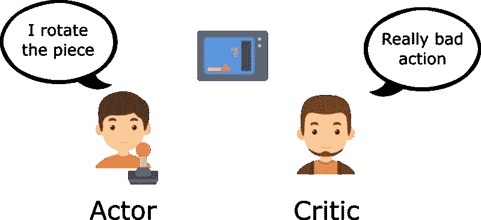

Taken from FreeCodeCamp

首先，什么是演员-评论家算法？根据 NIPS 的论文[演员-评论家算法(Konda et。al 1999)](https://papers.nips.cc/paper/1999/file/6449f44a102fde848669bdd9eb6b76fa-Paper.pdf) ，当时绝大多数的强化学习算法都属于两类:只有行动者的方法或者只有批评家的方法。

只有参与者的方法是一种使用参数化策略的方法。通过模拟策略和在改进的方向上更新参数来直接估计性能的梯度。这样做的一个缺点是可能会有很大的差异。

仅批评方法是一种依赖于逼近价值函数的方法，旨在逼近贝尔曼方程的解(见下文)，然后我们可以使用学习到的价值函数来构建最优策略。我们可以将这些方法视为非策略方法，因为它们通过学习最优值函数来间接学习最优策略。这样做的一个缺点是，虽然我们得到了价值函数的一个很好的近似值，但这并不意味着政策也将是最优的。

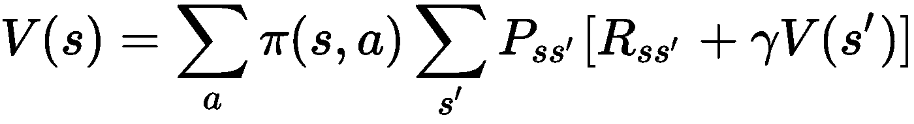

Bellman equation for estimating the value function in a non-deterministic environment

然后，本文提出了一种新的方法，演员-评论家算法，它结合了演员-评论家方法的优点。批评家将使用相同的近似结构来学习用于更新行动者的政策参数的价值函数。

现在，让我们首先以“用基线加固”算法为例来看看。虽然萨顿和巴尔托不认为这是一种演员批评家，因为价值函数被用作基线，而不是批评家，但其他来源，如大卫·西尔弗的讲座和关于 A3C 的论文[确实认为这是一种演员批评家。尽管如此，我们还是会把它作为一个例子，因为在我之前的文章中我们已经看到了这个算法。](https://arxiv.org/pdf/1602.01783.pdf)

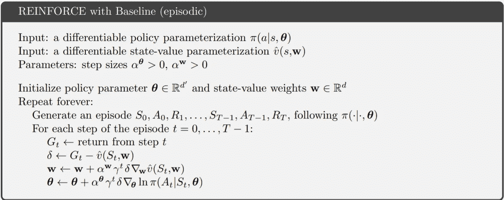

Taken from Sutton&Barto 2017

在这个伪代码中，我们可以看到学习 Actor 参数θ(策略)和 Critic 参数 w(状态值函数)的更新方程。在之前，我已经从政策梯度定理[中推导出行动者更新方程，所以在这篇文章中，我将把重点放在批评家身上。](/nerd-for-tech/reinforcement-learning-introduction-to-policy-gradients-aa2ff134c1b)

# 评论家

批评家是一个价值函数，用作更新演员参数的基线。更新的工作方式是通过使用损失函数来计算目标值和近似值之间的差异。目标是最小化该损失，使得近似值接近目标值，这是最佳值。

在示例中，此处的值函数是一个状态值函数，它通过使用 Gₜ和 v(Sₜ之间的差值来计算损失，并更新其参数。我们可以将损耗方程δ推广到 J(w ),如下所示:

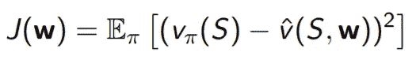

Taken from David Silver’s UCL lecture 6 (COMPM050)

然后，当我们对梯度进行采样时，我们可以去掉期望值。这里，我们应用链式法则一次来去掉指数。乘数被学习率吸收。

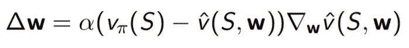

Taken from David Silver’s UCL lecture 6 (COMPM050)

现在我们有了一个类似于萨顿和巴尔托的“用基线加固”所使用的更新方程！注意，当实现 Critic 的更新时，我们可以使用网络直接反向传播 MSE 损失函数，因此不需要手动执行链规则。

# 逼近价值函数

那么我们实际上如何实现这一点呢？对于近似值，它只是使用当前参数的值函数的输出。对于目标值，这将是我们的价值函数应该输出的内容。在强化学习中，这些就是回报。用奖励计算目标值有几种方法。让我们看看可以用来更新价值函数的不同算法。

我们可以这样做的一个方法是蒙特卡罗方法，这是什么加强与基线使用。我们对整个轨迹进行采样，累积每一步的损失，然后更新参数。目标值将是 Gₜ，这是在时间步长 t 的累积折扣奖励。我们可以使用确切的累积奖励，这是从时间步长 t 到结束的所有奖励，因为我们事先对整个轨迹进行了采样。

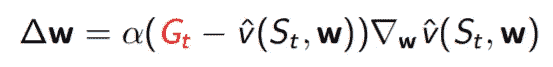

Taken from David Silver’s UCL lecture 6 (COMPM050)

另一种方法是通过 TD(0)，一种时间差异的形式，这是 DQN 使用的。你可以在另一篇文章中看到我在雅达利游戏上实现 DQN。当采样轨迹时，我们在每个时间步应用更新，也称为在线学习，其中参数在播放剧集时更新。在这里，目标值将是 Rₜ₊₁ + γ v(Sₜ₊₁，w)，我们通过使用另一个估计 v(Sₜ₊₁，w)来估计目标值，这种做法称为自举。与 MC 不同，我们使用一个估计目标，因为我们只是向前看了一步，所以我们不知道确切的未来回报。

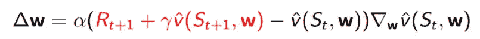

Taken from David Silver’s UCL lecture 6 (COMPM050)

# 前视 TD(λ)

最后我们可以用的方法是 TD(λ)，这是一个介于 MC 和 TD(0)之间的媒介。在 MC 中，我们可以在时间步长 t 获得精确的目标值，因为我们可以从时间步长 t“看”到剧集的结尾。在 TD(0)中，我们估计目标值，因为我们只能从时间步长 t“看”到时间步长 t+1。在 TD(λ)中，我们可以通过向前看 N 步来概括这一点。目标值是:

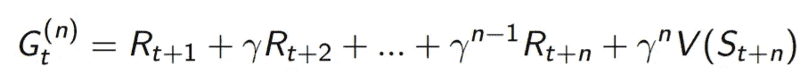

Taken from David Silver’s UCL lecture 4 (COMPM050)

更新等式将如下所示:

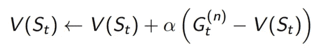

Taken from David Silver’s UCL lecture 4 (COMPM050)

展望未来，我们有几种方法可以利用。我们可以组合不同的 Ns，比如取 1 步超前和 2 步超前的平均值。所以问题是，我们应该向前看多少步？答案不仅限于一个 N，我们可以对所有 N 的 N 步回报进行平均，以得出一个更稳健的目标值。我们没有对 N 步回报率进行正常平均，而是为每个 N 步回报率分配一个权重，并将所有加权的 N 步回报率相加。现在我们如何分配权重？

我们可以分配权重的一种方式是通过将较大的权重分配给较小的 Ns，其中我们立即向前看，而将较小的权重分配给较大的 Ns，其将看向剧集的结尾。我们通过遵循权重的几何衰减而不是线性衰减来选择不同的权重，因为计算几何序列更有效。下图是这种情况的视觉效果。

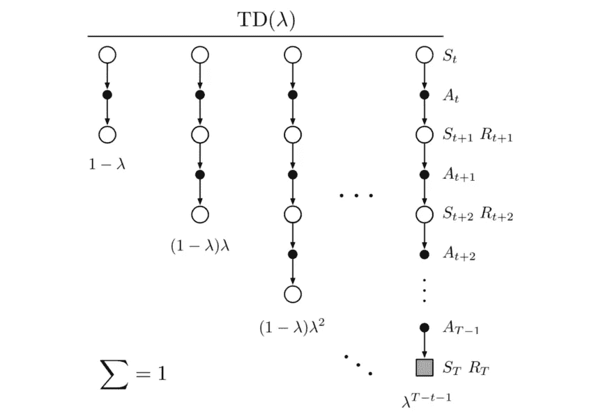

Taken from David Silver’s UCL lecture 4 (COMPM050)

权重由(1 - λ)λ^(n-1)计算，其中 n 是我们向前看的步数，λ是从[0，1]开始的常数。每个权重乘以一个λ^(n-1)，使得权重总和为 1。我们可以观察到，改变λ决定了权重衰减的速度以及我们有多少不同的 Ns。目标值是:

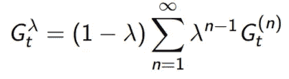

Taken from David Silver’s UCL lecture 4 (COMPM050)

这种向前看 N 步并取平均 N 步回报的方式被称为前视 TD(λ)。我们可以通过对整个轨迹进行采样来更新价值函数参数，然后不定期地应用离线更新，类似于蒙特卡罗方法。

你可能会注意到总和趋于无穷大。这是假设我们有一个持续的任务，可以超越终端状态。然而，大多数时候这是不正确的。我们可以用这个等式来计算目标重量:

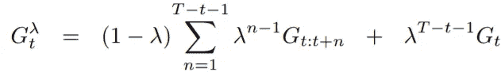

Taken from Sutton&Barto 2017

这里，我们从时间步长 T 到时间步长 T - 1 使用相同的衰减。然后，我们用一个不同的项来表示终端状态，它考虑了从 T-1 到无穷大的权重。这将确保我们的权重总和为 1。下图说明了这个等式的两个部分:

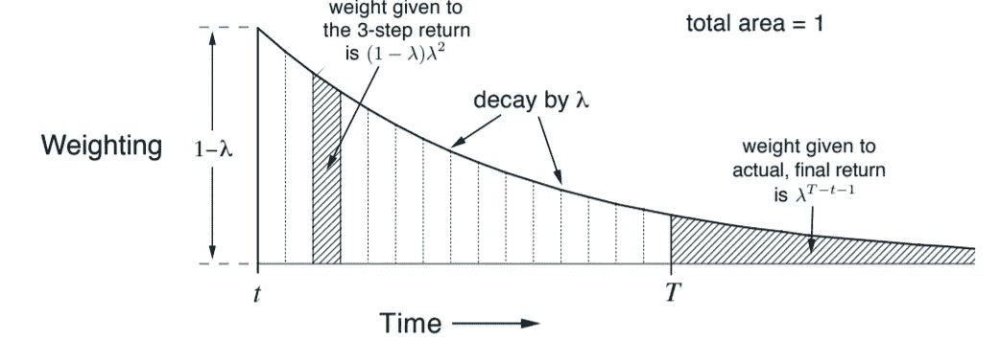

Taken from Sutton&Barto 2017

我们可以看到，每个权重对应于曲线下的一部分区域，最终状态的最终权重占曲线的其余部分。以下是前视 TD(λ)的更新公式:

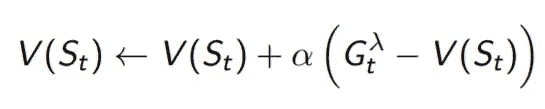

Taken from David Silver’s UCL lecture 4 (COMPM050)

我们也可以看到 MC 和 TD(0)是如何从前视 TD(λ)来的。当λ = 1 时，除了最后一个 N 步是剧集长度之外，每个 N 步权重都变成 0。当λ = 0 时，第一个权重为 1，所有其他权重变为 0，因此我们只向前看一步。

# 后视 TD(λ)

另一种分配权重的方法是使用资格跟踪，称为后视 TD(λ)。资格跟踪的概念很简单。我将给出一个在大卫·西尔弗的 UCL 第四讲中描述的场景。假设你是一只老鼠。铃声响了三次，灯泡亮了，然后你被电击了。

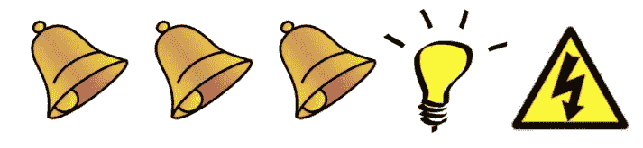

Taken from David Silver’s UCL lecture 4 (COMPM050)

现在，你被电击的原因是因为铃声还是灯光？大多数人会说是因为光，因为那是在你被电击之前发生的。有人可能会认为这是因为铃声，因为铃声响了三次，而灯熄灭了一次。我们可以把这两种推理看作是频率启发法，我们把责任归咎于铃，因为它发生得更频繁；以及新近启发法，我们把责任归咎于灯，因为它发生得更近。资格跟踪结合了两种试探法，为每个 N 步分配一个权重。

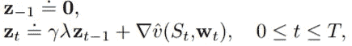

Taken from Sutton&Barto 2017

我们可以将合格轨迹定义为向量 z，并将轨迹初始化为 0。我们通过添加最近的梯度来更新合格轨迹，并通过自然时间步长折扣因子γ和常数λ来折扣当前轨迹。λ ∈ [0，1]常数决定了你对频率和新近度的重视程度。较高的λ意味着合格轨迹衰减得不那么快，所以我们更重视频率，因为如果相同的状态再次出现，那么轨迹将再次在∇v(Sₜ方向上被调整。较低的λ将意味着我们更重视新近性，因为大多数合格轨迹将由更近的∇(Sₜ来确定。该合格轨迹 z 将作为每个 N 步的权重。

那么我们如何用这个 z 来执行 TD(λ)呢？这是来自萨顿&巴尔托的伪代码，关于我们如何使用这个资格追踪来更新我们的价值函数。

Taken from Sutton&Barto 2017

与前视 TD(λ)不同，我们可以使用资格跟踪来执行在线更新，其中我们在每个时间步更新价值函数。首先，我们初始化当前剧集的资格跟踪 z。然后，我们使用前面提到的更新等式来更新资格跟踪。与 TD(0)类似，我们通过使用向前看一步的目标值来计算损失。然后，我们通过与合格轨迹成比例地更新参数 w 来更新价值函数。

我们可以观察到一些与前视 TD(λ)的相似之处。在前视 TD(λ)中，我们通过为每个 N 步分配一个衰减权重来平均所有 N 步。我们只能在剧集结束时更新，因为我们需要从每个时间步长“向前看”来计算 N 步目标值。在后视 TD(λ)中，我们似乎只向前看了一步就能得到目标值。然而，事实并非如此。资格跟踪是在每个时间步更新的累积权重，包含来自遇到的每个状态的信息。当我们更新与轨迹成比例的值函数时，我们实际上是从时间步长 t 向后看 N 步。

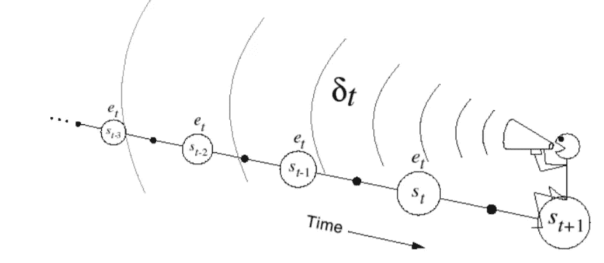

Taken from Sutton&Barto 2017

我们还可以看到 MC 和 TD(0)是如何从后视 TD(λ)来的。当λ = 1 时，合格迹线 z 只按时间步长贴现因子γ贴现，因此迹线从时间步长 t 向后看至剧集开始，与蒙特卡罗相同。当λ = 0 时，合格迹线 z 等于值函数的最近梯度，因此迹线仅向后看一步。如果我们对λ = 0 的一集内的所有更新求和，结果将等同于 TD(0)方法的所有更新。

# 摘要

在这篇文章中，我们已经详细介绍了更新价值函数的不同方法，价值函数是演员-评论家算法的评论家。更新价值函数的方法是通过更新参数来最小化真实目标值和近似值之间的损失。我们已经讨论了在实践中更新价值函数的三种方法，蒙特卡罗、TD(0)和 TD(λ),以及它们如何选择目标值。蒙特卡洛通过向前看一集的结尾来使用 Gₜ作为精确的目标值，TD(0)通过向前看一步来使用 rₜ+v(sₜ₊₁(w)作为估计的目标值，TD(λ)通过向前看 n 步来构造估计的目标值。我们还建立了两种更新机制，离线和在线更新。MC 和前视 TD(λ)在一集结束时更新，而 TD(0)和后视 TD(λ)在一集的每一步更新。

总的来说，对我来说，这是一次非常有价值的经历，可以让我更深入地了解价值函数的近似值。当我学习 Q 学习和实现 DQN 时，我并不真正理解逼近值函数背后的概念，只理解用于更新 Q 函数参数的贝尔曼方程。然后，我深入研究了策略梯度，并了解了如何为参与者更新策略参数。现在，随着对如何更新评论家的价值函数参数有了更深入的理解，我将在接下来的文章中探索和实现演员-评论家算法。

参考资料:

*   [无模型预测(大卫·西尔弗的 UCL 讲座 4)](https://www.davidsilver.uk/wp-content/uploads/2020/03/MC-TD.pdf)
*   [价值函数逼近(大卫·西尔弗的 UCL 讲座 6)](https://www.davidsilver.uk/wp-content/uploads/2020/03/FA.pdf)
*   [强化学习:导论(萨顿&巴尔托 2017)](http://incompleteideas.net/book/bookdraft2017nov5.pdf)
*   [演员-评论家算法(Konda et。](https://papers.nips.cc/paper/1999/file/6449f44a102fde848669bdd9eb6b76fa-Paper.pdf)艾尔 1999)