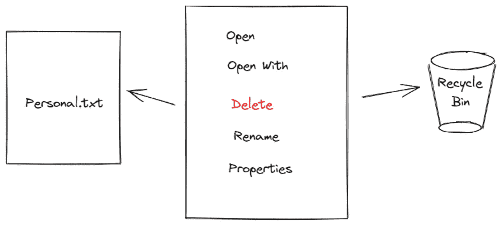

# 在 Windows 上实际删除文件

> 原文：<https://medium.com/geekculture/actually-deleting-files-on-windows-2069de31e87e?source=collection_archive---------25----------------------->

## 不，你还没有删除那个文件

你好，世界！在本文中，我将向您展示如何在 Windows 上删除一个文件。如果你是一个处理敏感/私人文件的人，你肯定想确保这些文件在你删除后不容易恢复。与 Linux 不同，Windows 操作系统有几种文件恢复机制。虽然这对…来说是个好消息