# 广告点击预测:什么，为什么，如何？

> 原文：<https://medium.com/geekculture/ad-click-prediction-what-why-and-how-bee259ddb05c?source=collection_archive---------11----------------------->

## 通过示例和代码解释概念

Source: [https://outsideroi.co/do-click-through-rates-matter/](https://outsideroi.co/do-click-through-rates-matter/)

在线广告行业已经成为一个数十亿美元的行业，预测广告点击率(点击率)现在是它的核心。如今，不同类型的广告商和搜索引擎依靠建模来准确预测广告点击率。

我们将使用机器学习方法来预测广告点击率。在此之前，让我们先了解一些重要的概念和搜索引擎决定显示哪些广告的一般方法。

**CTR:** 这是一个用来衡量导致点击的印象百分比的指标。

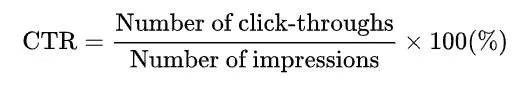

**搜索广告:**用户搜索某个关键词时显示的广告。付费搜索广告是一种流行的每次点击付费(PPC)广告形式，其中品牌或广告商支付(出价金额)以在用户搜索特定关键词时显示他们的广告。

## 通过真实例子预测 CTR 的相关性:

通常，像谷歌这样的搜索引擎的主要收入来源是通过广告。当用户搜索某个关键词时，有很多公司向这些搜索引擎付费来显示他们的广告。在这里，我们的重点是搜索广告和点击率，即只有当用户点击链接并重定向到品牌网站时才支付费用。

不同的广告商带着他们的广告和显示他们广告的竞价金额来接近这些搜索引擎。这些搜索引擎的主要目标是最大化他们的收入。所以问题是，当用户搜索某个关键词时，搜索引擎如何决定显示哪些广告？

首先，在给定特征(广告内容、用户和上下文)的情况下，它计算用户点击的概率。

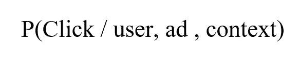

但是计算点击的概率是不够的，因为搜索引擎的目标是最大化他们的收入。为了实现这一点，他们需要乘以投标金额，然后看看哪个广告将使他们受益最大。

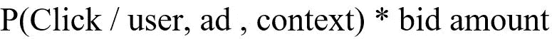

这就是我们如何获得

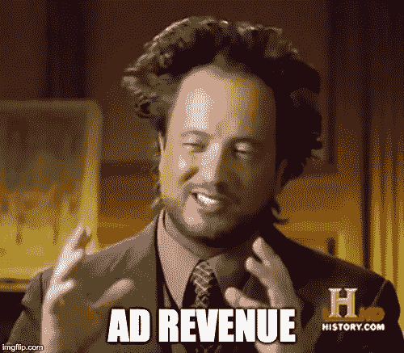

到目前为止，我们已经了解了什么是广告点击预测，以及它为什么重要。现在让我们探索如何通过在数据集上执行机器学习建模来计算广告点击预测。我们将建立一个逻辑回归模型，帮助我们根据用户的特征预测用户是否会点击广告。并且因此计算用户点击广告的概率。

使用这些概率，搜索引擎可以通过将概率乘以出价金额并进行排序来决定显示哪些广告。

## 步骤 1:数据集和导入库

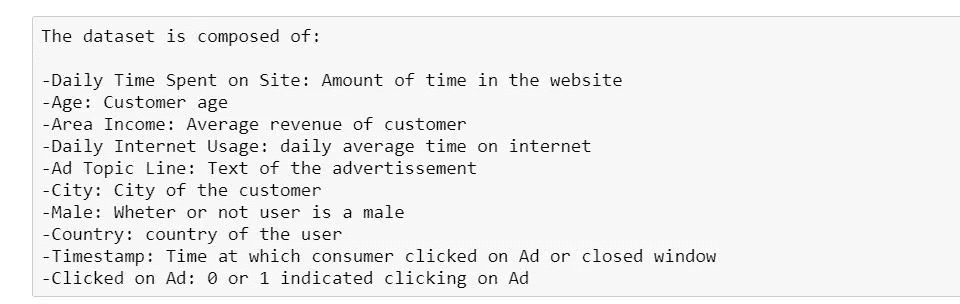

**Dataset Features**

你可以在这里找到数据集****。****

**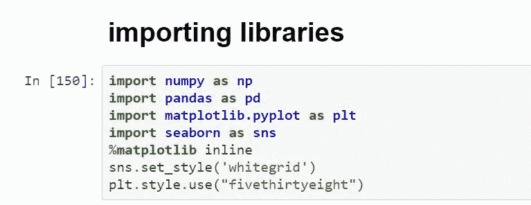**

****Importing Libraries****

## **步骤 2:加载数据集并打印前 5 个观察值**

**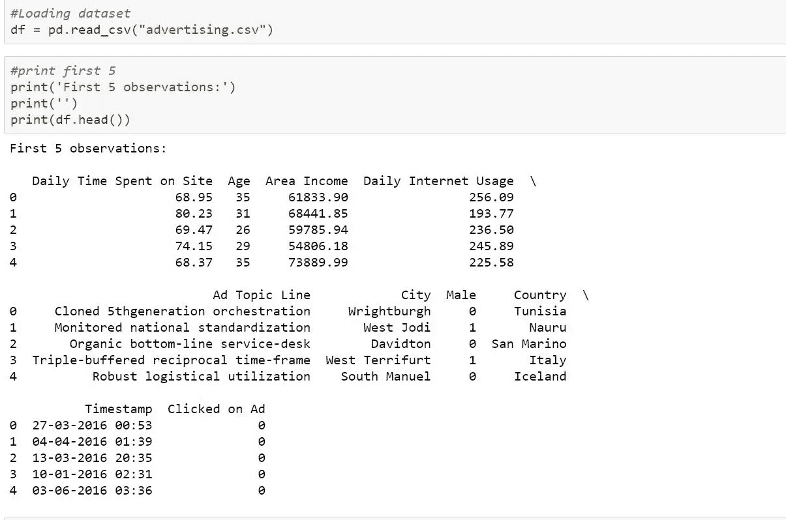**

## **第三步:EDA**

**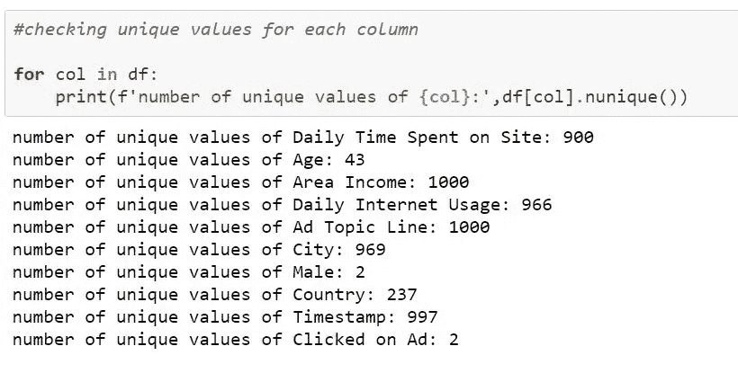**

****High cardinality in city, country, etc.****

**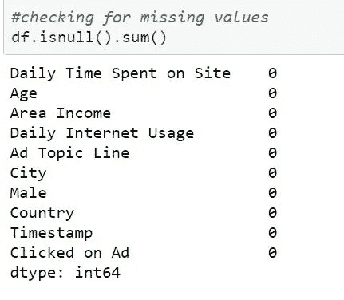**

****No missing values****

**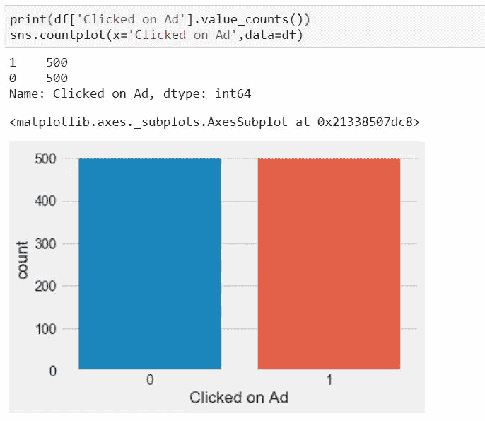**

****Target Variable is balanced****

**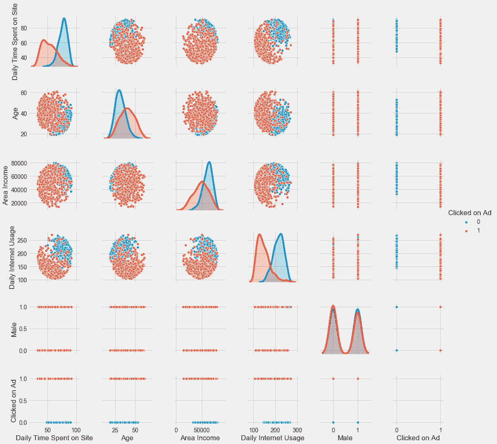**

****Multiple pairwise bivariate distributions****

****

****Correlation Table****

**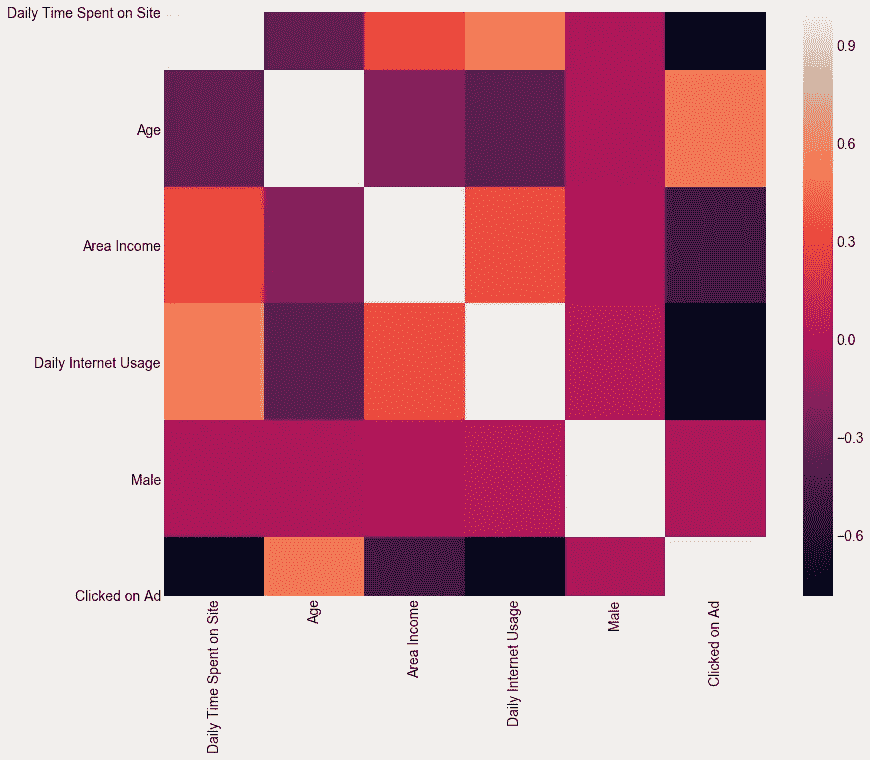**

****Heatmap for correlation****

## **步骤 4:训练-测试分割**

**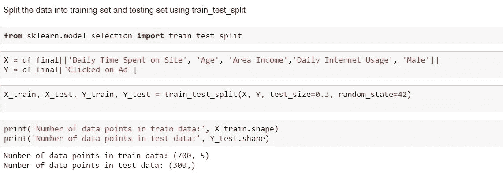**

## **第五步:训练逻辑回归模型**

**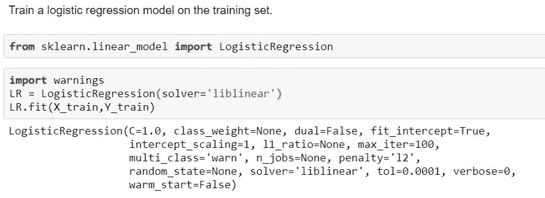**

## **步骤 6:检查模型准确性**

**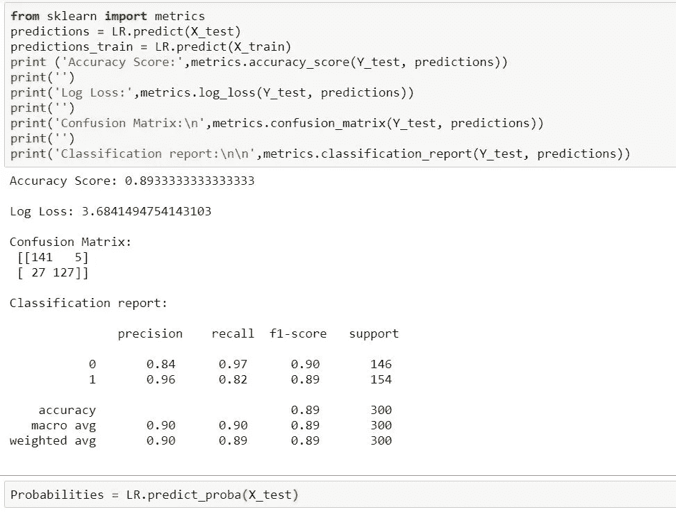**

****解释:**根据准确度分数，即大约 90%，混淆矩阵和分类报告支持的结果，模型做得不错。**

**在这里 可以找到代号 [**。**](https://github.com/shikhir27/Ad-Click-Prediction/blob/main/Ad%20Click%20Prediction.py)**

## **第七步:最后一步**

**最后，我们训练了一个逻辑回归模型，并计算了广告被点击的概率。实际上，我们将比较具有对数损失的模型，因为我们需要这种情况下的实际概率。**

**一旦我们得到了概率，我们将乘以每个广告代表给出的出价金额。最终的产品将按降序排列，前 3 名将被搜索引擎选为显示广告。**

**这是广告点击预测的概念，以及公司如何最大化其收入，同时提供足够的结果。**