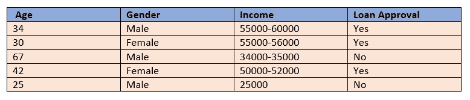
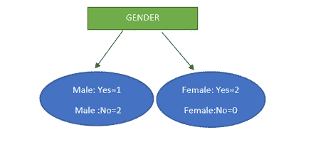
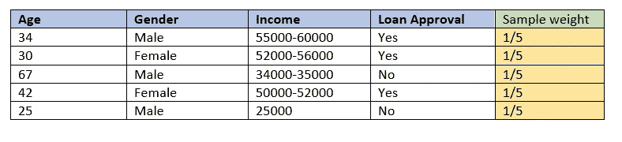
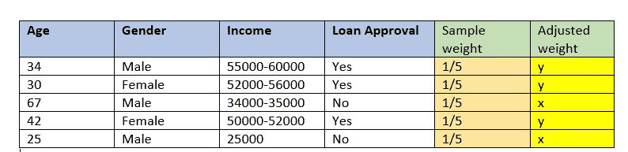

# 集成学习

> 原文：<https://medium.com/geekculture/adaboosting-640e8cc0c0a8?source=collection_archive---------54----------------------->

这只是我很久以前学到的另一个故事。

Adaboost(自适应增强)是集成机器学习的一个例子。简而言之，我们可以说集成学习是一种机器学习方法，它从不同算法或相同算法创建的各种学习器中学习，以构建一个可以在数据上表现良好的强学习器。通过使用该算法的学习过程，可以基于不同的选择变量(即，数据特征)、参数、数据集来构造这些学习器。Boosting 是一种集成算法，其中弱学习器按顺序创建，后继弱后继学习器从前任弱学习器所犯的错误中学习。

***工作在 AdaBoost(自适应 Boosting)后面:***

Adaboost 通常可以通过决策树算法来演示。该算法构造了许多称为 Stumps(具有一层节点的决策树)的弱学习器。树桩通常具有数据的一个特征及其叶节点。

Fig 1: Sample dataset

如果前一个树桩的性能会影响下一个树桩的施工，则按顺序设计树桩。所有的树桩都有助于建立一个更强大或更准确的学习者或模型。

让上表展示申请人的贷款批准数据，包括申请人的年龄、性别和收入范围(年龄是数字数据，性别和收入是分类数据)。这三个变量都有助于预测贷款批准状态的结果。

首先，各种薄弱的学习者(树桩)为每一个功能寻找根源。根的特征可以使用像基尼系数、熵、信息增益这样的标准来决定。在这种情况下，如果我们考虑基尼系数杂质，将考虑分配具有最低基尼系数杂质的贷款批准的特征。

Fig 2: A stump

node Male 的基尼杂质=(1-(1/3)*(1/3)-(2/3 * 2/3))= 0.444

节点 Female 的 Gini 杂质=(1-(1*1)-0)=0(该节点中没有杂质，因为所有女性都获得了贷款)

加权基尼杂质= (3/5)*0.44+(2/5)*0=0.266

为了简单起见，我们假设性别在所有特征中具有最低的基尼不纯指数。

该数据集被赋予一个样本权重，该权重在适当的时候随着模型的性能而变化。假设每个样品的初始重量为 1/5(1/存在的样品总数)。

Fig 3: Sample weights associated

使用弱学习器对数据集进行预测。如果存在不正确的预测，则不正确预测的样本权重将增加一个因子，该因子由其在最终分类中的发言权/显著性的量(对最终分类的影响程度)决定。同样，正确预测的权重应该使用相同的显著性来降低。弱学习器中的这种变化能够帮助纠正要创建的下一个弱学习器中的不正确预测/分类的错误。这就是为什么说在 boosting 算法中，新创建的弱学习者依赖于他们的前辈所犯的错误或者从他们的前辈所犯的错误中学习。

该公式证明了不正确预测的误差的显著性/重要性，

数量/重要性= 1/2 log((1-总误差)/总误差)

这里的总误差是被错误分类的样本重量的总和。

假设样本 3 和 5 在上述数据中被错误地分类，那么总误差将是(1/5+1/5)=2/5

因此，重要性/数量=1/2log(1.5)=0.17/2= 0.085

计算显著性值后，调整样本的权重。

***为不正确的分类新增权重***

=原始样品重量* e^significance

= 1/5*e^(0.085)=x(新重量)

***为正确分类新增权重***

=原始样品重量*e^(-significance)

= 1/5*e^(-0.085)=y(新重量)

Fig 4: Adjusted weights attached

新分配的权重被调整(归一化)为总和 1；现在，下一个 stump 将通过计算调整后的样本权重来知道哪些预测是不正确的，并在定义了一个 bootstrap 数据集(随机准备一个等长的数据集，从原始数据集中选择样本)后纠正错误。如此循环，直到学习者能够正确地对样本进行分类。

sklearn 库有一个包含 AdaBoostClassifier 和 AdaBoostRegressor 的集成包，用于分类和回归应用。

总的来说，AdaBoost 是遵循“从错误中学习”这句话的增强算法之一